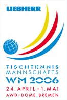

最讨厌的比赛是射击，除了飞碟比赛以外。
基本上是昏昏欲睡什么都看不见。除了看到最后的结果以外，根本看不出所谓优秀选手与一般选手的差别。
曾经并且一直认为应该把这个项目从奥运会踢出去。
很遗憾，这个项目是中国强项，奥运直播的时候经常转。
看不懂

其次讨厌的是高尔夫球。
人家有钱人去享受**G**rass**O**xygen**L**ight**F**oot，在电视前面看实在是体会不出抓鸟或者抓鹰的快感。
好在这个不是中国强项。

第三是举重。虽然这个可以看出点水平高下了，但总觉得看运动员狰狞的面孔很不舒服。
这个也是中国强项，郁闷，总转。

再接下来就是乒乓了。
虽本就不是个很喜欢运动的人，但貌似一般的大众体育活动都有所涉及。
唯独乒乓，除了小学跟着吾友3P摸过几次球拍以外，就根本没在台子上打过（跟3P是在水泥地上打，而且从来没赢过）。
也很不喜欢这种对反应要求很高，变化很快的球类项目。
每每蔡猛先生或者杨影小姐讲起什么上旋侧旋之类的名词，就会因为猜测为什么他们会在球落台之前就看出旋转而绞尽脑汁。
所以看乒乓比赛，除了关注一下比分以外，很少有投入的时候
偏偏乒乓在中国的王牌强项，不仅大大小小的比赛都要转，而且还动不动颠峰时刻一下。
实在是苦啊~

在汤尤杯开始之前，有得忍受了～
