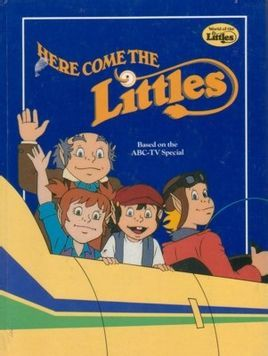
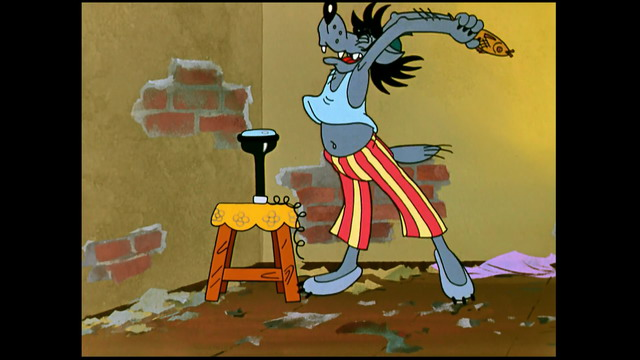
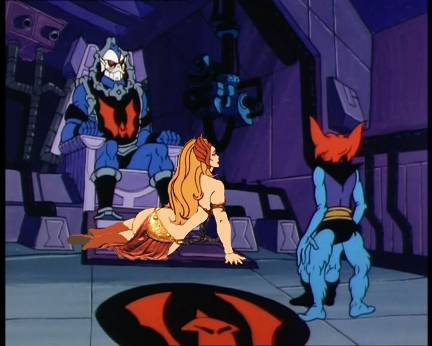

正愁标题咋起呢，老友gelemon自投罗网。

这次说说另一个印象深刻的时间——18:30，这个时间属于《米老鼠和唐老鸭》。
每个礼拜天，一集。这版是央视正式引进的，放映时间大约是1986年。
老爹其实从小就很迁就我，看电视也不怎么管，这是俺娘唯二认可的让我观看的动画片之一。

年代过于久远，其实现在能记起的也就剩下个感觉了，什么剧情都想不起来了。只是依稀记得非常喜欢看两只花栗鼠和唐纳的三个侄子出场，对于米奇唐纳米妮普鲁托高飞几个主角却不怎么感冒。
也不是对剧情完全没印象。有点儿感觉的是两个大长篇——一个是唐老鸭回到古代学数学，一个是米奇扮演会下金蛋的鸡的故事的主角——巨人喊的是“feifei-fofo”！
犹记那年冬天，老娘带着俺去长春路的老姑姥家串亲戚。到饭点儿了，老妈就想离开。找的理由就是“得赶紧走，大致要回家看动画片。”结果人家热情地给我搬过来小板凳，让我坐那儿看《米唐》。
那不是记忆里第一次看彩电，却是唯一一次在彩电上看米老鼠。很过瘾。

每一个看过的人都对李扬和董浩印象深刻。本篇的标题其实是米老鼠董浩的开场白：“啊哦，演出开始了！”。
gelemon在21世纪初的猫扑论坛上发起过一个《召唤听错的歌词》的强帖，里面的一个亮回复就是有人听成了“野猪拉屎了”。我可从来没听成过那样，也许那厮自己耳朵里有屎吧……

董浩叔叔也算一夜成名，后来从一个配音演员转职成了《天地之间》栏目的主持人。天地之间是面向小学高年级的少儿节目，播出时间是每周五的六点半。
大多数时间是一个老头变魔术或者做小制作，我小时候看不懂，长大一点儿不爱看。
偶尔会放动画片，有个叫《小不点》的美国动画就是在天地之间里放的。印象最深的一集是所有的小不点被下了什么咒，迎着月光被恶人集中带到一起。最后阴谋当然是被主人公和它的人类朋友一起粉碎了。
诡谲的是，《小不点》重播了很多次，每次我都会遇到这一集。

当时觉得那主题歌特傻逼：“从地到天，从天到地……谁能解开这些奥秘，谁就变得聪明无比～”
这不因果倒置了吗？明明应该是先变聪明后解开奥秘好吧……
虽然我那时并不知道什么叫因果倒置。
十几年前，在一个论坛上，我发现《天地之间》这四个字又被打上了书名号，可惜被玩坏了。

周四的六点半就是鞠萍姐姐的天下了。说起来鞠萍姐姐资格可比董浩叔叔老得多，《七巧板》也比《天地之间》好看得多。
并不是因为鞠萍姐姐主持的那腻歪要死的小孩跳舞节目有多好（这风格被牛群冯巩吐槽过），而是《七巧板》放低龄动画片。
《巴巴爸爸》首播就是在七巧板上。
还有《旗旗号巡洋舰》。20集的长度跟每周一集的播放频率一叠加，很难每集都追上。后来虽然有过重播，但也总是缺少关键剧情。最遗憾的事情发生在1991年，[老王婆](https://pewae.com/2010/12/witch-wang.html)强留我中午不让回家，以至于错过了最后一集。那年之后，直到今日，该片也未曾重播过。
曾经有很多小时候错过的东西，进入网络时代以后都给找了回来。唯独《旗旗号》未完成是我在观看电视电影方面，最大的遗憾所在。

当然，黑白电视的年代并不止这两个时间放动画片。
关于动画片最早的记忆是在奶奶家看的《铁臂阿童木》，1983年，那也是我有记忆的最早的时间。
讲的什么？别扯了，我真不是妖孽。

另外一部很喜欢看的是《蓝精灵》。可是我实在想不起来第一次看是什么时间了，依稀是中午。可彼时理论上中午没有播动画片的档期啊～
我的恶趣味在很小的时候就体现出来了——最喜欢的蓝精灵是闹闹，最喜欢看格格巫抓蓝精灵，以及研究他那些邪恶的碎碎念配方——多少猫爪子几只蜘蛛一根烂香蕉什么的……

还有一部印象深刻的动画，是AV1放的，《兔子，等着瞧》。这部片子后来我下到了俄文原版，却并没有中文配音版的感觉了。其实故事跟《猫和老鼠》有点儿类似，都是兔子玩狼。

黑白电视的年代，大连台对我来说，存在感很弱，《花仙子》和《聪明的一休》都不是我的菜。这个时候的辽台是在七点半以后放动画片。更早的没印象了，88年是《星球大战（麦克伦一号）》，89年是《希瑞》。中间还放过一阵《巴巴爸爸》。
黑白电视时代不怎么看辽台是有原因的——之前路易还说穷人家都没有电视，其实我们家的电视也不是自己家的，而是二姑的。
这里面有个交易，1982年，二姑准备结婚，而俺爹厂子里也吵吵要分房子，俺娘觉得要是跟奶奶住在一起，不仅可能跟二姑产生矛盾，而且奶奶家房子太大，会导致要不到房子，于是毅然决定去租了厂里高叔叔家的偏厦子。后来老爹如愿分到了房子，二姑为了平衡利益就提出把自己结婚的电视借给我们家用。
这台星海牌电视对辽宁台（10频道）的支持简直烂到家了，图像跟声音不可得兼，所以我们在家的时候都不怎么看辽宁台。
所以1989年辽宁台首播的《希瑞》对我来说就是个稀罕玩意儿，难得看上一集，而那年春天开始，《新闻联播》常常延时，10分钟到一个半小时不等，《希瑞》说不演就不演了。我可以不看，但你不能不演，这道理都能懂吧？

老陈对于我对那个夏天的耿耿于怀感到不理解，他觉得我那时才8周岁，不应该对政治事件有如此的敏感度。
他哪里知道，这里满满的都是看不成动画片的怨念啊！！