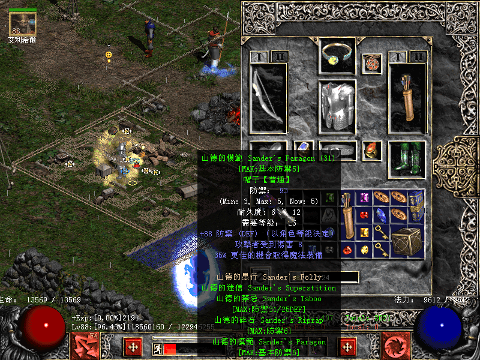

2001年暑假去宝宝家找他，约着一起去电子市场买盘。当时他对我爱搭不理的，一个人闷头打游戏，那游戏便是《暗黑的破坏神2》。我进门的时候宝宝刚好开始打第二幕的召唤者，当天他非酋，把迷宫的4个方向跑遍了才找到BOSS。BOSS掉了一件绿色的护身符，宝宝如获至宝，鉴定之后，那是一枚“天使之翼”。宝宝跟我吹逼，说这玩意儿多么多么少见，集齐一套千分之一之类……

于是同年10月，攒钱买了一套普通版正版资料片《毁灭之王》送宝宝当生日礼物（周边好像是给配了块牌子？）。[[1]](https://pewae.com/2022/04/e59b9e-e8a781-e4ba86-efbc8c-e5a4a7-e88fa0-e8909d-e38082.html#inner_anchor_1)
本人对这种剧情简陋的美式RPG兴趣不大，但是对于收藏要素却毫无抵抗力。又过了两个月，寒假回到家后，我也开始了自己的暗黑之旅。
用现在的话说，被种草。

送给宝宝那套游戏很快被他鄙视了：因为正版游戏一直要插着盘玩，废光驱，盗版就没这个问题。他便自己另找了盗版来玩，并且肉眼比较出了两个版本的差别，把动画文件拷进游戏目录里，还得意洋洋地跟我炫耀。
为了把他自己攒的“好版本”拷回家，我拆了自己的刻录机带到宝宝家。拔他家排线的时候还意外把排线拔断了，跑电子市场现买了一根。

我玩这个游戏的目的始终只有一个：凑齐所有的绿色套装。
所以我从来都不好意思说自己喜欢暗黑，我只是喜欢收藏且喜欢游戏修改。

辛苦是一点也不辛苦，只是太枯燥。
什么输出变量属性加点之类的，我都不怎么在意。能轻松把恶魔三兄弟打死并且容易掉东西是唯一的目标，差什么属性技能，改就行了，但绿色套装我就是要一件一件打出来。
导入工具和套装武器库现成的都有，我却坚持只要自己打。执念吧。

32套绿色套装，120多件装备。2004年就仅差7件。2010年陆续打出了圣骑士和野蛮人套装里最罕见的几件后，仅余两件。
玩得最凶的时候是在05、06年，几乎每个没有相亲和约会晚上都要把三大BOSS刷5遍。
可20年过去了，PC换了4台，操作系统从盗版Win98一直用到正版Win10，版本从1.07升到1.13，大箱子补丁可以避免人物倒来倒去了，甚至符文之语“死亡呼吸”都被我在2014年做出来了，最后的两件却一直石沉大海。
我甚至一度怀疑是不是因为自己把MF改得太高，溢出成负值了。可这又解释不了我都打到好几把祖父风之力了。

期间低潮了两次。
一次是2008年，一剑能砍出6个魔法的野蛮人在前往大菠萝房间的路上忘记换弓箭，直接被弹死了。虽然很快就找到工具给救了回来，却忽然心灰意冷。直到2011年的某天后知后觉地得知1.13版本铁处女已经被取消了……
另一次是2016年换了现在的PC之后遇到兼容问题，总往外跳。解决之后刷的频率再次降了下来，一周也就只玩那么一两次。

到了今年年初的时候，来了个曾经迷恋战网的新同事。摸鱼闲聊的时候他告诉我，一直以来我刷错地方了，从概率的角度来说，低级的绿色套装最好去普通难度牛场。
于是差不多从今年过年开始，每周大约10次普通牛场，清明节那天，打到了倒数第二件“坦克雷的平头钉”，胜利在望。

2022年4月22日下午两点多，它终于不期而至——“山德的模范”。
绿光一闪的瞬间，感觉人生的一段旅程告一段落，立刻失去了再碰这个游戏的动力。

那位新同事只待了不到一个月就离开了，我连他的微信都没加，我很感谢他。
跟宝宝失联已经12年了，我很想念他。

---

- [(1)](https://pewae.com/2022/04/e59b9e-e8a781-e4ba86-efbc8c-e5a4a7-e88fa0-e8909d-e38082.html#inner_ref_1)：那年后面到我过生日，他送我一套正版《樱大战2》，那游戏我至今没玩过。