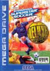

[国际超级明星足球豪华版](https://pewae.com/gaan/aHR0cHM6Ly93d3cuZG91YmFuLmNvbS9nYW1lLzI2OTQ1MDk4)

原名：International Superstar Soccer Deluxe别名：Jikkyou World Soccer 2: Fighting Eleven机种：MD厂商：科乐美类别：SPG发行年月：1995-09耗时：6

这是MD上最好玩的足球游戏。这个游戏我找了20多年，近日终于被我淘出来了。
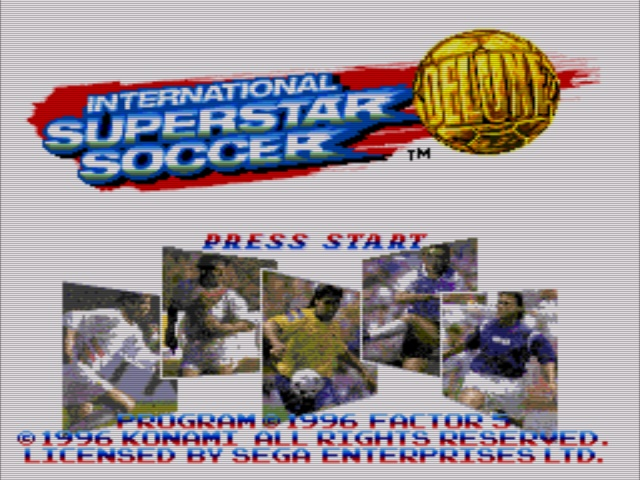
与其说它躲得好，不如说我太蠢了。游戏rom浩如烟海，我在维基上的美版游戏列表里，拿足球、football和soccer作关键字过一圈，没有；日版游戏列表再过一圈，也没有。不死心，又把rom里所有带soccer和football的美版和日版游戏再过一遍，还是没找到。其实是思维走进了误区，想当然地以为欧版游戏会换个名字以美版或日版出现。
本作偏偏是个例外，它是个只有欧版的游戏[[1]](https://pewae.com/2023/07/international-superstar-soccer-deluxe.html#inner_anchor_1)。
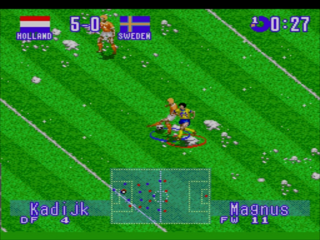

想想倒也能说得通。这部作品是1995年先有的SFC版，96年才移植到了MD上。1995年土星和PS都已经相继问世了，MD在日本本土根本干不过SFC，在北美虽卖得好，但人家又对足球游戏缺乏兴趣。所以看后面的职员表，应该是KONAMI大阪分部找了个德国的team做了MD版的移植，且只发行了欧版。
只有欧版这件事导致本作的资料非常少。SFC版是可以通过秘技选世界明星队、南美明星队、欧洲明星队和非洲明星队的，MD版就完全没这方面的情报。
SFC原版的江湖地位就高很多了，当然人家也不叫这个土了吧唧的名字，SFC日版的名字叫《实况世界足球2：战斗十一人》。大名鼎鼎的实况啊！鉴于实况系列的系谱过于庞大，起名规则里出外进的，咱也没有更深的研究，就不展开了。反正这部作品可以算作是实况最初系列（不用Winner Eleven/Pro Evolution Soccer命名）的第二作，能不好玩嘛？
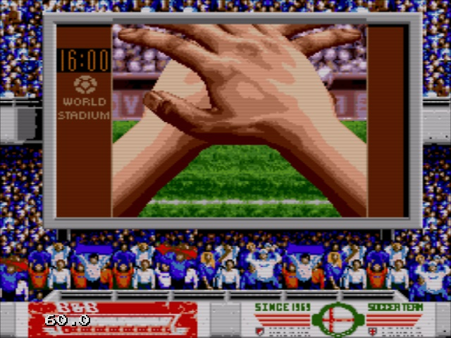

1998年9月末，高二运动会前一天，学校放半天假。刚好小学同学曲大酒的高中也放半天，头一天晚上他主动找我借《大航海2》，约好他家楼下不见不散。
孰料这个没信用的家伙放我鸽子，我在他家楼下从12点半一直等到3点半。我就坐那儿玩口袋蓝，从新开档一直干到通关了都。这可是高三的宝贵的半天假啊，他家楼下的3小时我真是怒槽全满的状态。

他见了我之后倒是很不好意思，解释说，他去同学家借六键小手柄去了。作为MD末期游戏，本作有4个有效按键[[2]](https://pewae.com/2023/07/international-superstar-soccer-deluxe.html#inner_anchor_2)，确实是只有6键手柄才能正常玩下去。

我要见识见识什么游戏非得六键才能玩，就在他家直接切磋了几局。生手对熟手之下，我输的很惨。其实玩了没多久我就觉得自己手上的那盘FIFA97就该扔了，能玩个好游戏还挺值的，但表面上还要绷着很生气。我连输了一个小时，改打点球模式，才变得互有输赢。
为了平息我的怒火，大酒除了按照约定，用索尼克3D换了我的大航海2，还把这盘“世界杯”一并借给我一个十一假期。但实际上十一假期我只捞到不到半天玩游戏的时间，这盘卡没玩几把就还回去了，还把我的六键手柄借给他好久。
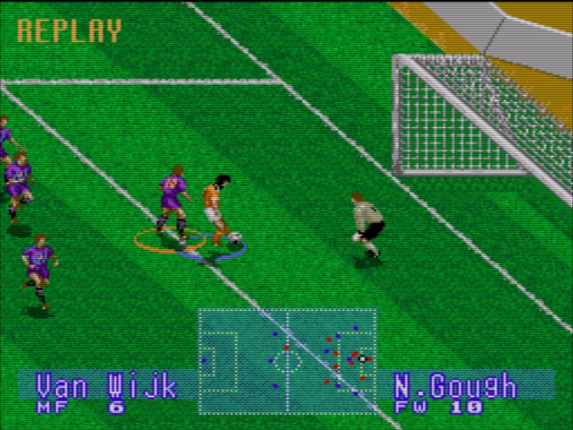

这游戏的手感非常好。传球流畅又不是完全没失误那种，射门有力又不是永远不进那种，假动作有又不是完全无敌那种。比MD上的一众同侪真实N倍。上手之后玩法也不像FIFA那么单调，除了小角度打门命中率很高这个BUG以外，传中头球，传中倒钩，拉空一边横穿，角球，战术角球，远射，过守门员，勺子等等进球的办法还是很多的。我最喜欢的进球方式是边锋切入后，在小禁区角上拉后射弧线，仿佛真的能用脚拉小提琴一样。
跟同期的足球游戏相比，本作的另一个优点是有语音。射门、长传、抢断、红黄牌的时候解说给上那么一嗓子，非常带劲。还有在16位机时代算比较牛叉的特写画面，分别在“首开纪录”、“帽子戏法”、“乌龙球”的时候会出现。
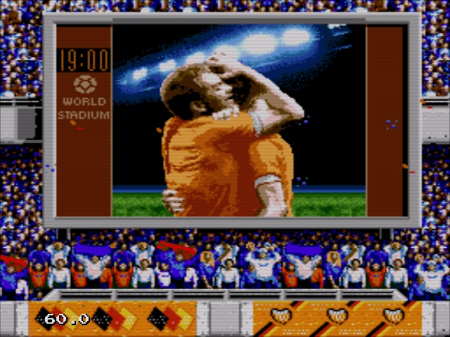
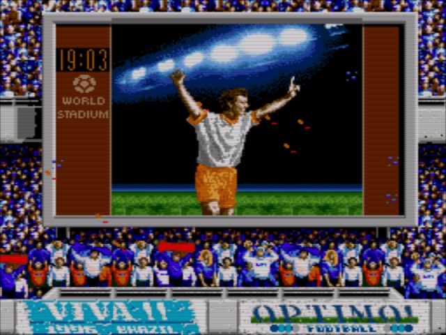
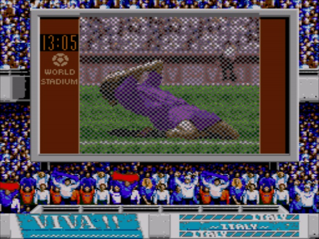

游戏的故事比赛模式可以打世界杯和世界循环赛。可选的队伍包括94世界杯的24只参赛队以及增补的12只球队，共36只。世界循环赛也不知是单循环还是双循环，这最少35场打下来已经不是我这个年纪能承受的了，何况我本就因为累手而不太喜欢玩SPG。打个世界杯得了。
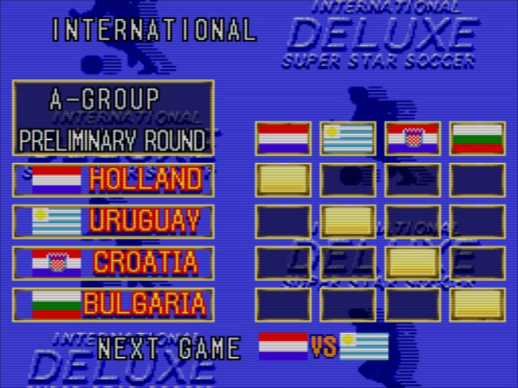
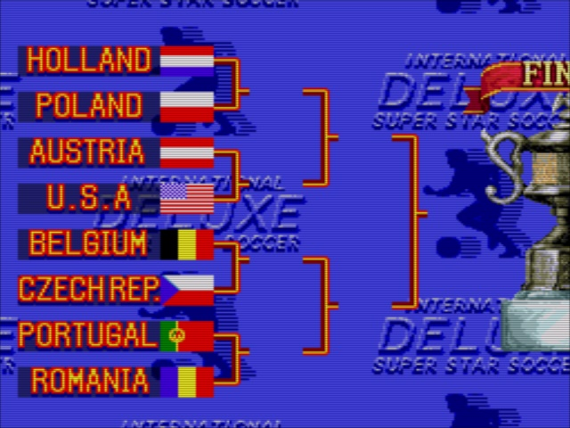

有荷选荷。荷兰是典型的攻强守弱的球队，荷兰默认锋线是博格坎普、奥维马斯和范沃森的三叉戟，中场是维茨格、里杰卡尔德、古力特和罗纳德德波尔的豪华配置，后场和守门员除了科曼都是狗屎，哪怕其中一坨狗屎名叫范德萨。本作中综合最厉害的应该是意大利，其次德国巴西，再次阿根廷。单看数值，就连保加利亚、罗马尼亚和瑞典也要比荷兰高一点点，但球星没荷兰厉害。这次淘汰赛运气极好，一个顶级球队都没遇上。一个比较不爽的设置是没有射手榜，也就失去了狂刷进球的动力。
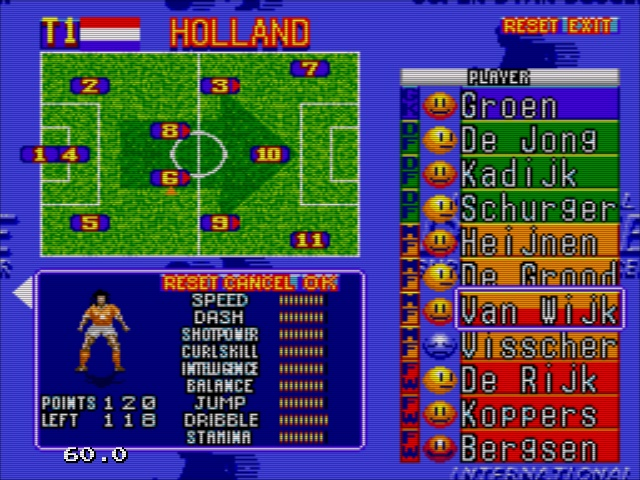

早期实况的缺点就是没版权了。
游戏中个人能力最高的是巴西的Allejo（贝贝托），然后就是古力特了。但事实上众所周知，古力特根本没参加94世界杯。说起古力特，那时候哪怕是像素游戏，哪怕是假名字，也希望玩家能根据形象猜出真正的球员身份来。比如这个金毛。
睹物思人，特意搜了一下巴尔德拉马的近况，找到2019年的照片，竟然把爆炸头拉直了，神似钻山豹版丁春秋。
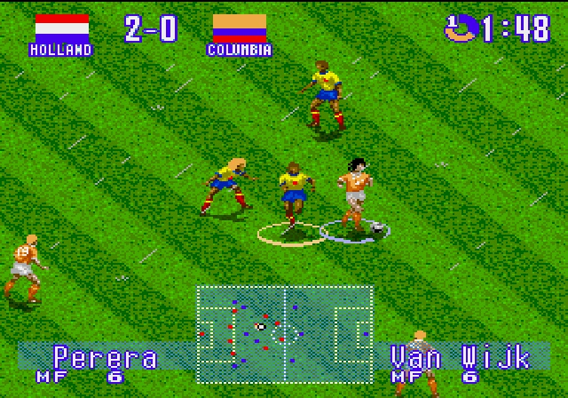

再比如保加利亚的这个地中海。
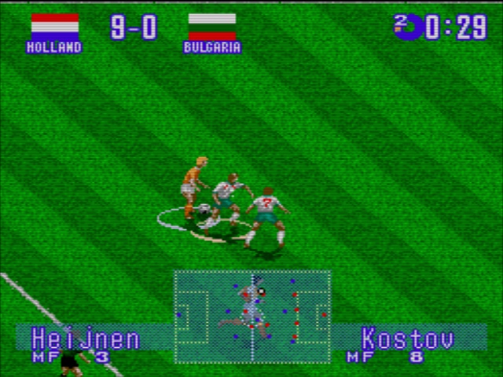

通关画面就有点敷衍了，国家队比赛，怎么也不应该是大耳朵杯吧。
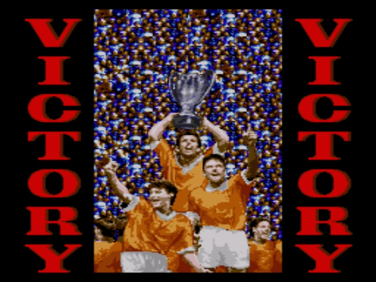
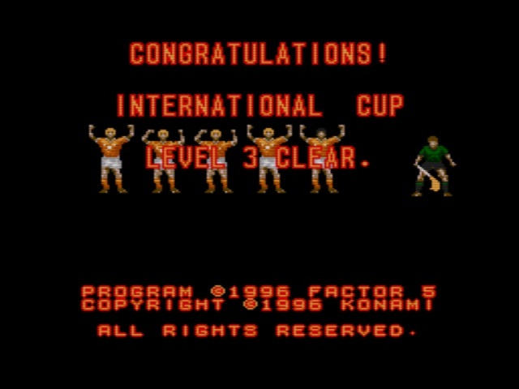

---

- [(1)](https://pewae.com/2023/07/international-superstar-soccer-deluxe.html#inner_ref_1)：其实还有忽略不计的巴西版
- [(2)](https://pewae.com/2023/07/international-superstar-soccer-deluxe.html#inner_ref_2)：典型SFC设定