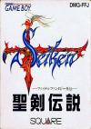

[圣剑传说：最终幻想外传](https://pewae.com/gaan/aHR0cHM6Ly93d3cuZG91YmFuLmNvbS9nYW1lLzI2MzY2MzcxLw==)

原名：聖剣伝説 〜ファイナルファンタジー外伝〜机种：GB厂商：SQUARE类别：A-RPG发行年月：1991-06耗时：22

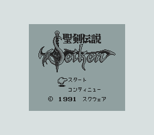
ARPG其实是很适合掌机的一类游戏，但是GB上其实出色的ARPG并不太多。最有名的名作会放到最后，这作《圣剑传说》算是第二有名的吧。
出品方是大名鼎鼎的史克威尔，至于ARPG这个类型，当时的所有作品就没有不抄塞尔达的。当然，史氏一向是家有想法的公司，把作品搞得跟塞尔达在大方向上完全不同。塞尔达是万年不变的剑和盾，而圣剑则是多种武器并存：剑、锁链、镰刀、斧、矛、流星锤齐上，每种武器有自己的特殊技和使用场景，配合多种魔法，使得战术特别丰富。尤其是攒力必杀系统，其出招的爽感不亚于一些一般的动作游戏，令作品上手更加平易近人。
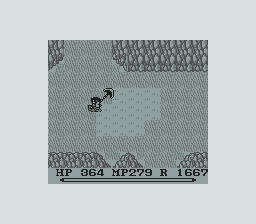

大地图的方面，没什么创新，还是去不同的城，跟不同的NPC对话的传统模式，女主也是被抓了又放又抓又逃的烂剧情。
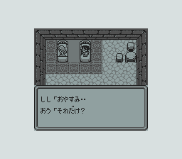
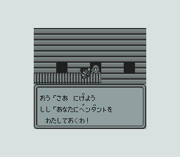
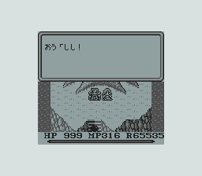

迷宫里的解谜却要简单多了，可以说跟塞尔达完全不同，完全没想着在这方面为难人。下面那种要把两个敌人冻成雪人压机关已经算很复杂的操作了。
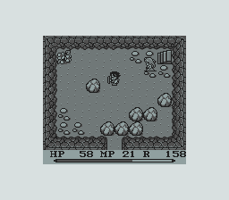
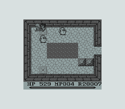

可能受限于GB的机能，本作难度是非常简单的。屏幕上最多显示5只怪，而且也没什么移动特别快的，只要注意好一些特殊状态，把精力放在找路上就好。
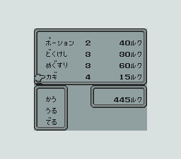
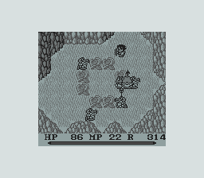
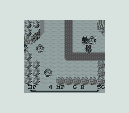

本作发行时间处在FF2跟FF3之间。这个时期的史克威尔刚刚从低谷中走出来，FF2在1988年的各项评选中获得了不低的评价，正式炒热这个IP的时候，于是本作采用了很多FF2的设置。包括魔法的名称，怪物的种类，甚至伙伴们一个一个送死的剧情，简直是2代的动作化版。估计当时的制作组也是准备把这个系列做成FF的动作类外传的，不然游戏的美版名也不会是Final Fantasy Adventure。可惜逆袭到超~~仁~~任之后，回归成了传统的多线RPG，跟FF系列的关联也消失殆尽。
下图的陆行鸟和莫古利，就是典型的FF特征。
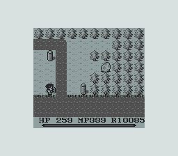
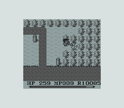
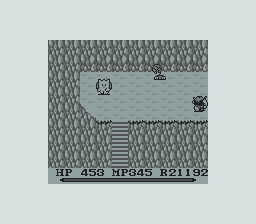

说到这里必须吐槽一下电软97.01期的攻略，现在网上最流行的那个版本的攻略，就是照着抄的。其对路线的描述简直令人发指，什么“往西北方找一条大河”，要不是本作的地图是地球仪性质的，当初我就放弃了。犹记当年有一句话“在回来的路上，我又顺便去了一座孤岛……”妈的这座孤岛我整整找了6小时，花掉整整一板南孚！
以及把陆行鸟叫成小鸭子，也是够了，感情是看图写话，剧情全是编的！
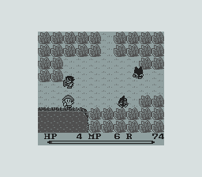
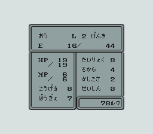

照例是各路小BOSS欣赏时间
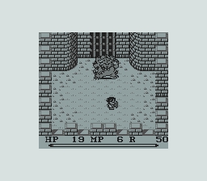
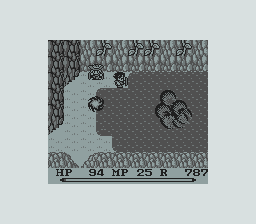
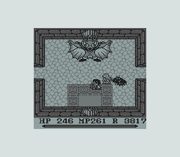
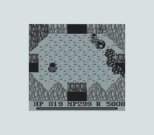
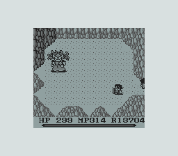
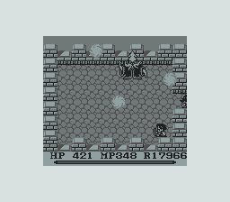
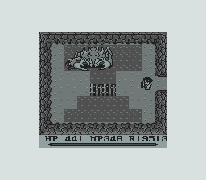
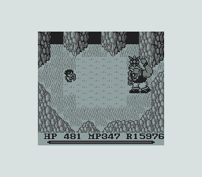
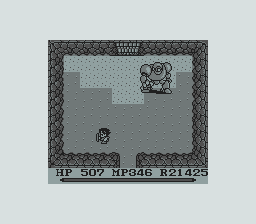
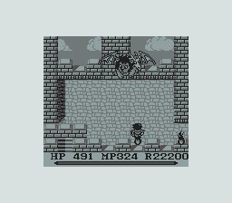
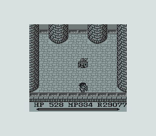
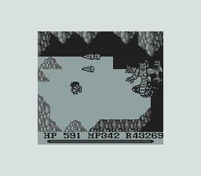
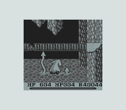
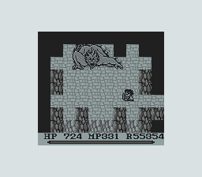
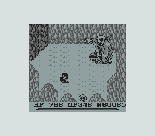
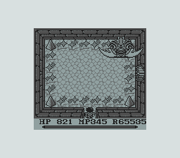
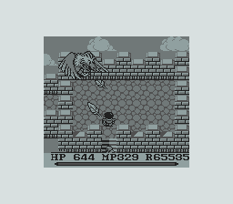
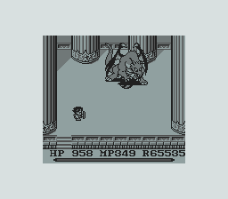
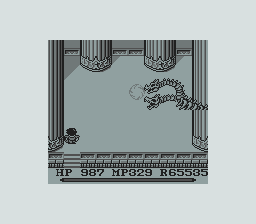

全时间紧盯主人公的大反派其实只在最后交手一次，会分身……随后变成大怪物也算是常规操作了。
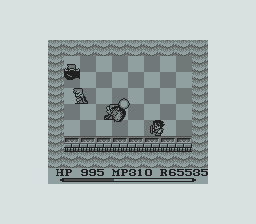
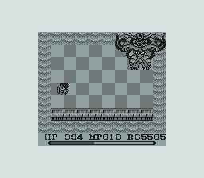
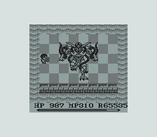

最终BOSS是被感染了的世界树。妈的世界树这个物种实在太金贵了，病虫害忒严重啊！三不动就会被野心家利用一回。
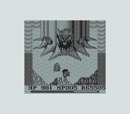

通关！
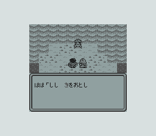
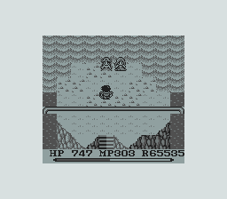
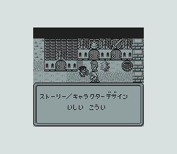
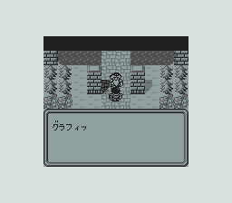
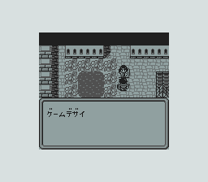
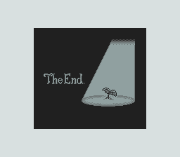