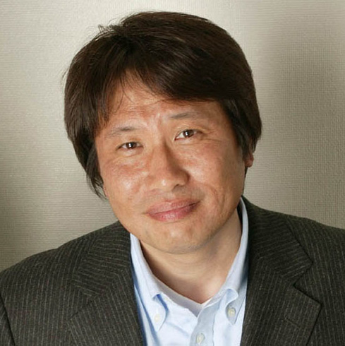

星矢们20岁了。
之前一直没有时间上动漫的论坛，前天才忽然发现圣斗士冥王篇（http://www.toei-anim.co.jp/sp/seiya/）又出续集了。正式的名字是The Hades-Chapter Inferno～前章。有前章就意味着还不是终结？
现在的好处就是，只要日本那边出了，国内就可以看到。这两集下了半个月了，昨天终于有时间看了一下。
这部又重新回到日本人手中（[东映](https://pewae.com/gaan/aHR0cDovL3d3dy50b2VpLmNvLmpwLw==)）制作的动画，跟之前法国人所做的相比，画风更日式一些，人物柔和得多。圣衣和冥衣也没有前部作品那样的发亮，难道是为了配合20周年这个主题？
看了两集之后，第一感觉就是很亲切，毕竟这是本人看的第一部漫画作品。看着画面，就想到了十多年前的玩伴们。

90-91年，变形金刚热潮刚过的时候是迷圣斗士最疯的时候。那是一个秋风起的星期三的下午，由于刚子跑路，大酒，3p和我面临打棒三缺一的窘境，正坐在3P家楼梯间里无聊的玩着“十四点”，或是“吹牛”之类的对扑克和人员要求并不是很高的游戏，金子忽然过来找我们。

如果说我们几个那个时候是下中农的话，金子起码也是个富农。他家离我们经常活动的区域比较远，也不是很常过来玩。从89年的某天开始起，我们在玩圆牌方牌玻璃球或者上山抓螳螂豆虫的时候，只要这家伙出现，就一定在泡圣斗士的事。这小子很有去说书的天分，区区6本（他当时只有6本）漫画，他竟然可以口头为我们连载半年。一时之间，紫龙成了万众瞩目的明星，一辉也成了坏蛋的代名词。**车田正美**这个名字绝对是可以记住的真实的日本人的第一人，什么丰臣秀吉、山本56，都差得远了，虽然我们在相当长的一段时间里认为她是个女人，但这并不影响少年们对偶像的崇拜。

金子是个守信的人，他来找我们是遵照约定，把前5本书（那个时候圣斗士还没分卷）偷出来给我们看。每本价值￥1.90的漫画书在金子父母的眼里想必是奢侈的玩具，所以禁止被带出来。而当天，据金子说，他是先采取陪他老妈打坦克大战，逗老妈开心，然后故意死掉，然后趁老妈兴致高的当口把书顺出来的。虽然我们很感激他，但是口头上的打击还是必要的，我们批评他不应该把第二集《白鸟，冰原战士》藏得连自己都找不着。

四个人就靠这几本书过了一个下午，回味悠长啊！最终决定每人挑一个角色来扮演。我向毛主席保证，那个时候我不知道什么叫RPG。首先是把星矢的角色被金子抢走了，但当时我们固执的认为紫龙才是主角，把个绿叶分给劳苦功高的盗火者没有引起丝毫的争议。接着，四个人又一致把一辉的角色分给了当天跑路的刚子。剩下的三个角色就没那么好定了，人人抢着当紫龙。后来我们决定用运动家的精神来决定。我们打七王五二三，一局胜负，3P分最多，抢走了紫龙；大酒分比我多，当上了冰河；而某个倒霉蛋只好去扮戏份少而且娘娘腔的瞬。两年前的某天，3P喝高了透露出他家的扑克上有暗记。

意犹未尽之下，第二天又联系了女生老裴、妖精和老牛，分别要他们扮魔铃、雅典娜和辰巳。后来的事实证明，这绝对是个错误的决定！！在学校我们要陪着魔铃跳皮筋，回家后又得跟雅典娜和辰巳一起玩过家家！！天知道为什么那时一句“不陪你们玩了”怎么那么有威慑力！当年她们还不是美女呢！

随着剧情的深入，扮演也越发的投入。当天及以后都没分到赃的涛涛和老姜等人就倒了大霉，今天扮自恋狂被捶一顿，明天又会被当成美杜莎被一顿海扁。老姜某天扮修罗，被3P夹着，围着周长不到一千米的小区转了两圈，以示“飞升”；而涛涛这个倒霉鬼扮金牛的时候最惨，保持着两手抱在胸前的姿势挨打。
后来有点入魔了。大酒经常弄杯水摸一下，然后问别人冰不冰；3p跟人打架的时候总是把左手挡在胸前；刚子有事没事就拿手指头戳别人脑袋；某人的钥匙链长达3米，重约一斤半，他还得叫某个小他半岁的男人叫哥。大家需要清楚，随口叫姐姐跟随口叫哥哥是两个完全不同的概念。

后来，92年春天转了学，虽然没搬家，但一起玩的机会毕竟是少了。再后来海南出版的书出得越来越慢，热度也就慢慢下去了。以至于到现在我都还记不住冥界三巨头的名字……

金子在那天以后不久就病了。白血病。我们上初中的时候，他死了。

@klan: 2006-11-15 10:00 pm
鄙视

本人: 2006-11-14 9:55 pm
摊手 有艺术加工不行啊

@klan: 2006-11-14 8:09 pm
鄙视 颠倒黑白…………
另:文中的金子是2000年走的….从换完骨髓后身体连发育都停滞了..
某人的记忆出了点差错..我就不纠正了….原因难以启齿..
另:鄙视 :em66: 颠倒黑白…………
另:鄙视ANTI-SPAM WORD

@kyoku: 2006-02-10 10:32 am
写得不错啊。都快遗忘了的记忆。

dagang: 2006-01-17 3:50 pm
原来3p是这么得到紫龙这个角色的啊。3p着家伙从小就使诈，真不是什么好鸟。

==== Update 14.09.24 ====
3P说的没错.里面好多事情都是发挥的.但金子普及圣斗士,金子得白血病,打扑克选角色这三件事都是真的.其余是演绎.