这次接茬说电视剧。
我自己也意识到用家里的黑白/彩色时代做分割非常之不科学，上次好多朋友说的我没写到的片子，其实都是要在这篇里写。
我能猜出来朋友们会提出“怎么没有XXX”这样的问题。先统一回答了：如果是89年以前的电视剧，我在[《完整的歌与零碎的画面》](https://pewae.com/2015/08/fragmented-memories-and-complete-songs.html)篇里回顾过了；如果是喜欢在假期里播放的电视剧，在[《没有燕子没有蛇》](https://pewae.com/2016/02/no_swallow_no_snake.html)篇里也回顾了；剩下的，**没·提·到·的·我·是·真·的·没·看·过**。

吸取了上次的教训，这次会把剩余的电视剧来个一气贯通，所以这会是一篇超级超级长的大长篇。
从小就嘴叼，从89年家里买电视算起，除了武侠片、犯罪片和喜剧片以外我很少追剧，看其余类型的剧都是被我妈和新闻联播逼的。到96年秋天上高中以后就告别了八点档，99年上大学之后更是基本告别电视剧,那之后看的（国产）电视剧不超过10部。所以也就是7年时间加一点点零头而已。但架不住咱记性好啊，林林总总加起来应该也不少。
总之，考验你们耐性和视力的时候到了，请备好眼药水。

话说老师教的，写文章要承前启后，这个重担自然要落在黑白和彩电时代都非常活跃的琼瑶奶奶身上。我真是服了我们大连电视台的编辑们的品味了，基本上琼瑶奶奶那边出一部，大连台就播一部。梅花三弄之《水云间》《鬼丈夫》《梅花烙》，六个梦之**《哑妻》《婉君》《雪珂》《三朵花》《青青河边草》**，这差不多就是93年之前的童年日常。
刘雪华是我最讨厌的女演员没有之一。
马景涛是我最讨厌的男演员没有之一。
李翊君是我最不喜欢的华语女歌手没有之一。
关于李翊君，再说两句。只凭一首臭大街的《雨蝶》，是无法达到排行第一这种高度的。她还另有臭大街的《婉君》和《雪珂》。尤其《婉君》主题歌堪称一代穿脑魔音，词曲都简单粗暴，是一旦被想起就会在脑子里单曲循环一下午的存在。
这个时期哭哭啼啼的刘雪华阿姨有了新帮手——同样哭哭啼啼的金铭和嗷嗷八三的马景涛先生。金铭其实跟我同岁，但小时候总以为她会比我大个三四岁的样子，90年代初的时候她真是红到不行。琼瑶老师与其说是个作家，不如说是个出色的编剧和电视制作人。《婉君》火了之后，立刻在《雪珂》和《青青河边草》里给金铭加戏，霸屏刷存在感。可印象里金铭并没有接什么像样的广告代言，专辑倒是发了两张，遍地盗版的情况估计也挣不了多少钱，可谓生不逢时。
琼瑶之名，能使小儿夜啼。
那时候我妈威胁我有一绝招：“你再不听话妈妈今天晚上就要看电视剧了。”我就只能乖乖就范。所以即使98年《还珠格格》火遍全国，我的内心仍旧是拒绝的。倒是我妈又拿出了当年的精神头，两集的剧辽台插广告能播到3小时，她也“只要你无怨我也无悔”。其实小燕子和紫薇并不是带火“格格”的始作俑者，起码雪珂就是个格格，雪珂播出之后女生们的角色扮演已经开始有格格的定位了。

台湾电视剧在我看来最大的毛病，就是那种糟糕的对话里带回音的直接收音的音效，声音忽大忽小，感觉就像电视机的喇叭虚焊了一样。从最早的《星星知我心》、《昨夜星辰》到后来的《戏说乾隆》《家有仙妻》，及至我看台剧的终点《粉红女郎》，20年都没什么变化，给人一种粗制滥造的感觉，这跟台剧优质主题歌比起来反差极大。

由于琼瑶大魔王的存在，对电视剧的感觉一向不太好，幸而大连台还没固执到天天放琼瑶的地步，她老人家产量也没那么高，引进老少咸宜的武侠剧才是收视率的保证。而且那个时候无论是香港无线有线二人转，还是台湾中视台视华视三国演义，都特别喜欢拍武侠片或者有打斗场面的古装泛武侠片。

比如，1992年年底播出的**《戏说乾隆》**。在我们这边这是部未映先红的剧。第一是因为郑少秋主演的楚留香系列在录像带群众中有巨大的影响力，而上海滩里赵雅芝拉拢的脑残粉也不少；第二是几个巨有钱的大型国企在内部的闭路电视上放过了一遍，早有口碑流传在外。所以播出的时候万人空巷也差不多——因为是冬天，本来街上也没几个人。剧情挺弱的，几部下来都差不多，都是郑少秋出宫微服私访，然后遇到有冤情的美女赵雅芝，揭黑泡妞两不误，然后遇险，最后亮明身份把坏人抓住，赵雅芝就跑了。这剧简直是为秋官和赵雅芝量身定做的装逼剧，郑少秋就负责拿把扇子帅啊帅啊，赵雅芝就负责换发型和衣服以及昵称马甲美啊美啊。为了突出乾隆的牛逼，隔十几分钟就会跟坏人比划几招。
这个世界上扇子玩得最好的人有三个：楚留香、乾隆、郑少秋。
然后我就郁闷了：你丫旁边那个叫小柱子还是什么的带刀侍卫吃干饭的吗？早该砍头百八十遍了吧！江淑娜演的春喜第一部的时候很抢戏，活泼可爱，其实其身份大有问题。因为她是个“答应”。答应身份虽低，但也是万岁爷的女人，无论如何也是出不了宫的。当年没觉得江淑娜怎么丑，后来知道了她是江蕙的妹妹，觉得江蕙很丑，连带江淑娜看着也丑了。《戏说》的两首主题歌水准都不错。片头是蔡幸娟的《问情》，挺有古风的一首歌，王自健曾经在相声里调侃“90后的就没看过《戏说乾隆》”，就是把《问情》改成了太平歌词。片尾《来生再续缘》是王杰唱的，他那时候的嗓子可真是好。

现在说起戏说乾隆，往往会把续集也一并算上，其实是不对的。两部之间隔了一年多的时间。虽然是原班人马少了赵雅芝，可剧组的构成有很大的问题，江淑娜这个时候很红，惠英红和另外一个女主角根本压不住她抢戏，加上边际效应，续集的收视率拍马不及前作。江淑娜包办了片头和片尾的主题曲。片尾曲《呛姑娘》挺躁的，一般；片头曲《谈笑一生》很好听，而且MV有彩蛋，推荐KTV点一次欣赏一下，蛤蛤。

武侠剧对我这个年龄的小屁孩来说，84射雕过于遥远，漫长的空窗期之后第一个出现的是**《雪山飞狐》**。这部剧有着台剧的老毛病，拍得太闷，大段的对话，几个穿貂的男人整天在讨论找宝藏的事，打斗场面不多。而且很不理解袁紫衣戏份少于程灵素这事儿，后来看了两部原著才知道，人家金大大对程灵素才是真爱，编剧改得没毛病。女生们讨论最多的是大反派田归农，说如何如何帅，难怪，汤镇宗演的嘛！男生cosplay的时候却很不喜欢这个角色，因其名字里又带“龟”又带“农”的，实在太锉了。这个版本里胡斐最后选了苗若兰，王璐瑶演的。若干年后再见王璐瑶已然是《天龙》里拼命挤乳沟的王夫人了，令人唏嘘。
演袁紫衣的伍宇娟是巩俐的同班同学，当年名头很响，后来销声匿迹了。这片子因为有她的参与还吃了场官司。
《雪山飞狐》整体水准不算很高，但两首主题歌《雪中情》、《追梦人》可算不朽名作。尤其是《追梦人》，本来是罗大佑为纪念三毛所做的，其情怀放在这部剧上，大材小用了。

这之后是家喻户晓的**《包青天》**。最早是在93年寒假的下午时段播出的。因为主题歌存在感太强，所以换台的时候想错过是很难的，更何况那时下午有节目的只有两个频道。所以几乎所有的小伙伴都在第一时间收看了第一部《铡美案》。
那时候我们都喜欢唱：“昨天你家发大水，锅碗瓢盆满天飞，你妈会游泳，你不会。”彼时虽然认识叶子楣，但并没有听过黄安自己的魔改版。（黄安自己的版本：昨天晚上不肯睡，睡着梦见叶子楣）
93年到94年之间，大连2台开播了。这个频道最大的优点就是在晚上7点准时播电视剧。一般以群众喜闻乐见的港台新加坡剧为主，其实它不管播什么群众都喜闻乐见，独享时段嘛！所以这篇里的大部分电视剧也是在这个频道的这个时间段上看的。（另一个不播新闻联播的教育台这个时间播名师课程。）
94年断断续续放了好几个月的《包青天》，那边拍一部，这边就放一部。听《新鸳鸯蝴蝶梦》都听吐了。
情节什么的基本都记不住了，电视剧留的印象就是不如评书的深。
何家劲一时风头无二，台湾当时大大小小的女演员好像也都在不同的剧集中客串过。

**《碧海情天》**和**《英雄少年》**播出大概差了一年，放一起讲。
它们都是由杨佩佩担当制作人，台湾中视出品的武侠剧。主创人员也差不多，加起来四首主题歌《凡人歌》、《碧海情天》、《得意的笑》、《快乐似神仙》，都由滚石的大腕演绎，脍炙人口。
两部剧的男猪，一个叫水生，一个叫天养，妈的编剧要不要这么敷衍啊！
《碧海情天》里叶童小姐第一次女装出现，片头里还挺惊艳的，但在正片里一点儿也不出色。在这部片里第一次认识了李立群，演技碾压了其余所有人。
《英雄少年》要欢快不少，47集里大概前40集都在插科打诨搞东搞西，最后几集玩够了才去打大BOSS。这部剧印象深刻的是另一位老戏骨顾宝明先生。另外，潘仪君还真是漂亮啊！刘瑾和魏忠贤可能是中国电影电视历史上死法最多的反派，这部的大BOSS正是刘瑾，被围攻死的。

中间有一部**《刺马》**。印象里是一代天皇巨星姜大卫最后一次演主角。本身故事不长，台湾编剧硬给拖成40集，非常墨迹，不好看。
罗文留下的两首主题歌印象很深，至今还会唱，其中《黄昏》是黑哥在KTV的保留曲目。94也不是95年，大连服装节请了罗文来，罗老先生一身blingbling的皮衣皮裤围着立式麦克风又唱又跳，完全对两首慢歌的节奏完全不搭这事儿置若罔闻。

1995年是个不寻常的年份。那个暑假里好剧令人应接不暇。
应该算好剧三连放。两部时装的稍后再说，古装的是**《倚天屠龙记》**。这是我心目中最好的金庸剧。
孙兴扮演的杨逍，潘仪君的纪晓芙，张冰玉的灭绝，顾宝明的范遥以及周海媚的周芷若，至今无人能出其右；殷天正殷野王韦一笑谢迅成昆殷梨亭周颠宋青书等一干配角也可圈可点；哪怕陈孝萱，也是一只很养眼的花瓶啊。
本片最大的亮点，是给杨逍和纪晓芙加戏，这一改编后来得到了金庸本人的好评。杨逍一出场，闪瞎了一群情窦初开的初中女孩的狗眼，两周时间内学校里讨论的唯一话题，就是“没看出来沈公子竟然这么帅。”遗憾的是因为前面太受观众欢迎，为了多挣钱，后面的剧情注水，给朱元璋加了很多戏，最后十集拖沓。
然而，张无忌跟赵敏的演员实在太渣了。张无忌确实是个软弱的人，可马景涛也太娘了，再加上咆哮时满脖子的青筋，一点高手风范都没有。赵敏演的是没大毛病，最大的罪过就是丑，而且很可能得罪了造型师，跟许仙长得太像了。
配乐就更出彩了，华健的《刀剑若梦》几乎成了武侠音乐的代名词；《爱江山更爱美人》是我们初中的班歌；霑叔《随遇而安》霸气十足；辛晓琪《两两相望》行云流水；只有成龙的《给我一片天》弱了一点。
很多年轻的朋友更推崇苏有朋版倚天，出的时候已经是网络时代了，开始也下了几集。但皇阿玛一出场我就弃坑了，所以无法深入评价，只能说苏有朋比马景涛强，高圆圆远不如周海媚。
有人说，金庸剧最好的那一版，就是你中二时候的那一版。95年我正好初中二年级，所以不接受任何反对意见。

黄海冰版的**《书剑恩仇录》**差不多也是那时播的。播的时候我还没看过原著，只觉得剧情非常无聊。
后来看原著和骆冰的同人（你们懂的），发现自己完全记不起来剧里的骆冰是什么样子了，只好用毛阿敏阿姨代替……嗯，毛演唱的主题歌作词切题，曲调流畅，是难得的好歌。

还有一部剧，魔改古龙的新加坡剧**《莲花争霸》**。
严格来说这部不是古龙剧，用现在的词来说，编剧在“洗稿”。古龙作品里被洗稿最多的就是《流星蝴蝶剑》，因为结构经典嘛！还有人说这本书本身是洗稿教父的呢。
刚播的时候恰好赶上我读《流星蝴蝶剑》，读完之后瞬间觉得整部片拍得都是狗屎。倒是有几个片段印象深刻：女扮男装的大反派律香川非常帅；片头大爆炸；以及罗文先生的主题歌“无怨无悔我走我路，走不尽天涯路呜～”

《仙鹤神针》可能是卧龙生被改编成电视剧最多的一部作品。我小时候看的是亚视版。
印象最深的是“银笛书生”非常帅。而翁虹就很做作。这剧的特效也不行，一动内功就是一包烟，像蒸包子似的。

时间太过久远，已经记不起吕颂贤版的**《笑傲》**跟白古天乐版的**《神雕》**的播放顺序了，索性放一起说。
TVB自己单搞的金庸武侠剧，一向有两个大问题。其一是场景太穷，场面不够大气，其二是女演员选择范围太窄。
吕颂贤演技了得，剧本也没有进行魔改，可一出场小师妹陈少霞的那张大饼子脸就让人硬不起来，好不容易盼到任盈盈出场，化妆师也不知怎么想的，竟然把好好的梁艺玲画出70年代的感觉。也就何美钿的仪琳还算在水准以上。这版的配角都是TVB老人，岳不群左冷禅宁中则余沧海都非常到位。

白古天乐出演神雕的时候，演技还很稚嫩，所以导致整部剧都挺一般的。李若彤漂亮是漂亮，可惜是个面瘫，并不符合啊心目中小龙女的形象。这部神雕里出彩的是雪梨演的李莫愁，在她面前，小龙女和黄蓉都是战五渣。另一个亮点是李绮红演的郭襄，明眸善睐，光彩照人，可这人后来消失了。中老年妇女版的黄蓉，哎呀我去，我看同人小说的时候，一想到这版黄蓉的造型，就看不下去了。说起丑，这版的裘千尺那叫一个标新立异，前不见古人，后不见来者。“一见杨过误终生”系列里最有味道的是张可颐演的程瑛，后来她也果然熬成了TVB第一序列的当家花旦。

差不多在1996年的年初，金庸的15部原著被我打通关了，所以这跟时间往后，看武侠的感受发生了很大的变化。
我看金庸的顺序是射笑鹿雪飞天连神倚侠碧鸳白越书。

说下一部TVB金庸剧之前，先插播一部合拍剧，吴京先生的处女作**《太极宗师》**。
这片跟香港台湾的武侠剧风格迥异，就是一个字——打。本片打斗场面非常过瘾。有吴京、周比利这种真正的练家子出手，有袁八爷坐镇担任武指，真有拳拳到肉的感觉。最爽的一段剧情是吴京推塔，从第一层一路打到第七层，每层动作戏都不带重样的。
遗憾的是女二什么郡主的，又是个来自台湾的大饼子脸。要不是陈妍希比我还年轻，不然遭遇到中学时期的我也一定会吐槽他演的小龙女，倒不像包子，像菜饼子。
卞留念的片头曲非常有气势，其中有一句是“热血尽，化尘与土”。某地华姓青年人牢牢记住了这首歌，贱名好养活嘛，他后来就把自己的孩子起名“华晨语”。
片尾曲是朱桦唱的，好听但很长长长长长。
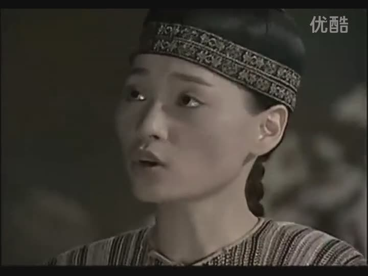

张智霖朱茵版的《射雕》，当年没播过，播的时候已经是2000年左右了，基本没看过，不予评价。

接下来的是黄日华演乔峰的**《天龙八部》**。其实TVB这几部大家都很熟悉，我应该少讲点。
黄日华樊少皇陈浩民都无可指谪，缺点的话真就只有布景不够大气，场面太小了。
这一版的钟灵、游坦之、全冠清、段延庆都塑造得不错。刘玉翠的阿紫演得很到位，就是丑了点儿。

台湾版的《神雕侠侣》，看了两集就弃了。
一是因为讨厌任贤齐，二是魔改得太厉害。

97年左右，大连2套播了**《新龙门客栈》**的电视剧版。
主演又是我非常讨厌的马景涛先生。
因为已经是高中，平日的7点档差不多已经告别了，只有周六周日能凑合看两集。这部剧也拍得特别墨迹，只记得陈红和常言笑的颜值了。
有一次，老婆大人在KTV点了一首关礼杰的歌。
我问：“关礼杰是谁？我不认识。”
老婆说：“不可能。常言笑你不认识？”
遂恍然。
主题歌是林忆莲的《野风》，非常好听。
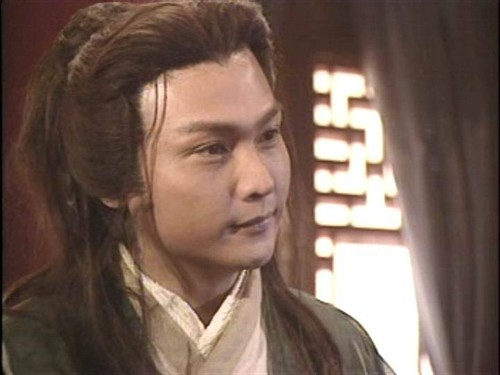

陈小春版的**《鹿鼎记》**大家都熟，首播的时候已经临近高考，基本没赶上，看的都是后来假期的重播。
倒没觉得主角如何好，毕竟陈小春太老而一众女主太丑。但这版的张康年索额图胖头陀陆高轩实在太出色了，完全盖住了小宝和康熙的光芒。
遗憾的是苏荃太老，双儿脸圆，方怡太黑，阿珂没范儿，建宁演得活龙活现，却丑。

大陆的**《燕子李三》**拍得相当可以的。
内个反派师弟把汉奸演得有血有肉，挺好的。断断续续，没看全。可惜师兄师姐演得有些太脸谱化了。师姐是林芳兵演的，当年名气很大。

李亚鹏版的《射雕》、《笑傲》都没看过，时间不合适。
有一次换台看到《笑傲》，看见余沧海的绝招是变脸，吓尿了。

高中到大学阶段，流行过一阵张卫健的片子。什么《少年英雄方世玉》啊，《棋武士》啊，《欢喜游龙》啊，《机灵小不懂》啊。
本来也没看过几集，而且这些剧看着看着就变成一个味儿的了，好无聊。
唯一的念想就是：“何美钿怎么还不红。”
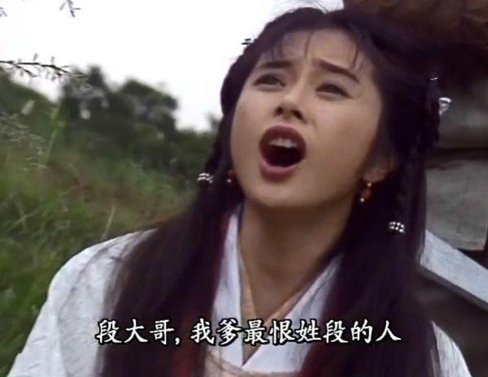

倒是跟张卫健时间差不多，有一部关咏荷主演的《苗翠花》非常不错，虽然同样没看几集，但真蛮搞笑的。
苗翠花乔装之后勾引李小环，哈哈。
陈少霞那大饼子脸只能演一辈子女配啊……

看的最后的杨佩佩武侠是**《花木兰》**。剧还不错，找袁咏仪来演花木兰真是太适合了，毕竟木兰无长兄，靓靓无长胸嘛！
其实没看几集。
苏慧伦的《天下大乱》很好，滚石出品，必数精品。

大学期间流行的看片方式是去网吧或者买盘。我觉得去网吧成本太高，所以一般都是在宿舍里看盗版盘。
算得上武侠的是张卫健的《小宝与康熙》和黑古天乐的《寻秦记》。
《小宝与康熙》毫无亮点。张卫健式的台词听多了巨累。

**《寻秦记》**对TVB来说已是难得的大制作，主要演员都演技在线，宣萱滕丽明雪梨李子雄演得都挺好，还有一些老戏骨搭戏。遗憾的是又双叒叕经费不足，只能搞40集的超级缩水版，剧情进行了大幅度删减，把琴清跟纪嫣然给合并了。而且新出炉的港姐郭羡妮小姐根本撑不起来这个角色，只能当一只傻呆呆的花瓶。
前20集还好，买合集光盘一口气看下来的，后20集算同步追的了，今天出四集粤语版，明天出两集国语版的，看了个七零八落。所以也说不清后面是没拍好还是自己没好好看了。

**《风云》**对我来说是个很奇怪的系列作品。漫画没看完，小说没看完，电影没看完，电视剧也只看了三五集。
港漫这种处处龙傲天的东西，看一部就够了。这是我看了20多本《超霸世纪》、一部《天子传奇》和两本《风云》之后总结出来的。
何润东的造型很傻逼。使用艺名“水灵”的蒋勤勤非常惊艳。

**《少年包青天》**是在大学期间的一个假期的上午放的，播出时间很占便宜。
有一说一，我挺喜欢李冰冰的，对周杰无感，巨讨厌任泉。
柯南动画版前150集我没看过。漫画的话只看过几本，原因是高中附近的租书摊有个读者不讲究，看柯南不洗手，大约看到后面真相大白的时候就往回翻人物出场，在凶手脸上戳戳戳，每个凶手的脸都跟打了网点似的，跟直接在脑袋上画圈也差不多。但这人没去祸祸金田一，所以我把金田一看全了。所以看到隐逸村那块我惊呆了，竟然敢抄袭金田一抄得这么具体！
孙楠唱得那首主题歌简直能逼死强迫症——前两句“头上一片青天，心中一个信念”对仗，第三句“”转折，第四句“我又何乐不为”竟然不！押！韵！而且到了副歌，竟然任性到没有一句押韵！
续集没看过。

03版的**《天龙八部》**对我来说是最后的武侠片。
那时已经有了宽带，这部剧完全是通过BT下载后在电脑上一口气看下来的。阿朱阿紫都很漂亮，但就是少了点儿什么。
慕容复段誉演得简直就是车祸现场。唯一出彩的是蒋欣的木婉清。
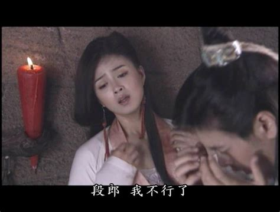

武侠剧的最后说一部我弃坑的，05年的**《仙剑奇侠传》**。
其实《仙剑》游戏我并没有独自打通关过，只是寝室老大打的时候我在边上看，提供一些场外指导。这游戏给我的总体感觉太平平。倒是后来的骗钱重制版打了通关。
所以，到了出电视剧的时候也没有太过用心关注。刘品言的阿奴扮相还不错。等到那个叫“唐钰小宝”的原创角色出来3集之后，我实在忍不了这种改编，弃了。

武侠剧以外，感兴趣的题材就不多了，大多都是跟着老妈被动的看。
在那些无聊的夜晚，我又不能造人，只有跟着看电视了。
能留下深刻印象的就是难能可贵的精品了。

先说说霸屏一时的新加坡剧吧。新加坡剧当时的一姐是陈丽萍女士。
陈姐姐眼睛很大，带一些baby fat，不像现在的锥子脸，很有亲和力。

那时陈姐姐主演的片子好多，能记得的差不多有**《法网情天》《生活歌手》《爱在女儿乡》《烈焰焚情》《霹雳红唇》**等几部。
最火的时候还出过一首单曲，那大粗嗓子，跟周公子有得一拼。
陈丽萍最后一次出现是《爱在女儿乡》，感觉像是一部收了地方政府的钱而拍的风光宣传片。
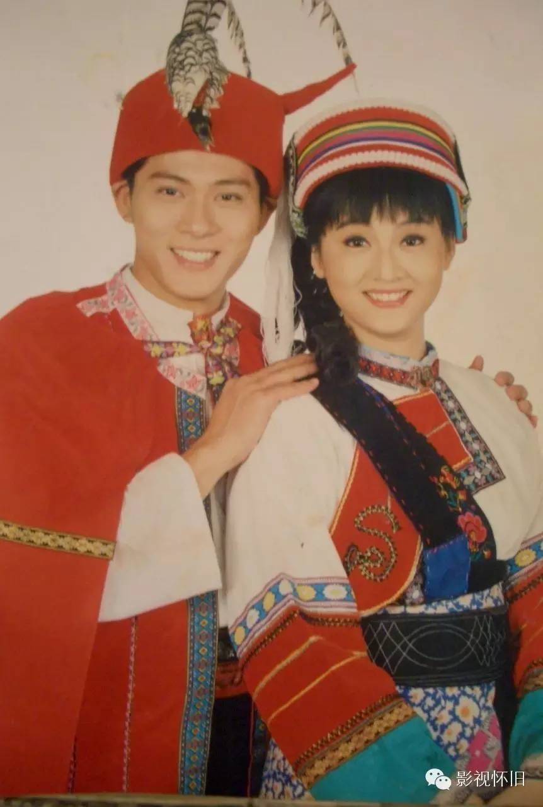

除了陈丽萍，常出现的新加坡美女还有郑惠玉、汤妙玲。她俩一起演过一部《三面夏娃》，剧情完全记不住了。
新加坡的男演员不怎么能分得清。陈之财看着挺帅略娘，而另一个常出现的沈金兴看着就不像好人。

新加坡剧大多是套路，失忆车祸亲兄妹，韩剧后来玩的都是新加坡人玩剩下的，非常无聊。
最后出现在记忆里的新加坡剧是**《勇者无惧》**，里面有大名鼎鼎的范文芳。再往后倒不是不播了，而是我不怎么看了。
我心目中最好的新剧是《法网情天》。
《烈焰焚情》的主题歌颇有几分魔性。

台剧除了琼瑶和杨佩佩、包青天以外，剩下能说的不多。
大火的《家有仙妻》大家都知道。我其实一点儿也不喜欢大眼睛大鼻子大嘴巴的女主角，反而是演孙兴老婆的戈伟如是我的菜。这位美女非常抗老，00年代看台湾综艺节目的时候仍旧显得年轻。
《追妻三人行》首播的时候好像跟《戏说乾隆》撞车了，除了个名字我什么都记不住。

97还是98年，大连2台放了一部台剧**《爱在他乡》**。主演有寇世勋、郑裕玲和坣娜。剧讲什么完全没印象了，主题歌是范晓萱的《深呼吸》。
中间有一集用的不是平常的版本，范晓萱在第二次唱“心碎，在扰嚷的街”的时候，“扰嚷”二字升了一个八度，听得人汗毛都竖起来了。
几年前我曾经在盒子上找过这部剧，跳着浏览了一下，试图再体会一下这个调调，没找到。难不成是某一集的片尾出现的？（盒子的版本不带片尾）哎，有生之年了。

03年从4月中旬到10月中旬，我都宅在家里混吃等死。学校封了回不去，毕业论文老师已经暗示到写几个字就给过的地步了；因为非典，懒得出去找工作，招聘会也少。7月领到毕业证之后更是无所事事。这时BT盛行，下了好多电视剧电影打发时间。其中就包括一部《粉红女郎》。这时候合拍已经成了大方向，台湾方面出了原著、奶茶和情怀，大陆负责拍片。我一点儿也不喜欢刘若英，明明是翻唱成名的非要卖才女的人设。我也不喜欢陈好，漂亮是漂亮，却毫无亲切感。张延不错，但注定不会太红。
这部剧对于我的贡献，是让我重新去认识了齐豫和潘越云。

哦，对，**《流星花园》**也是台剧来着。
宿舍老大大钢哥比较喜欢看剧。01年年底，该剧开始在校园内流行。大钢跑去买了1-20集的压缩盘。那天不是12月30号就是12月31号，班级晚上出去聚餐。下午我们寝跟隔壁寝的一帮大老爷们儿聚在显示器边上一块看这片。第二集还是第三集来着，F4在酒吧里打架。我们都很兴奋，以为是动作片。
谁知道后面那么墨迹，简直是浪费时间。除了老大和隔壁寝老大邢土鳖同学，再没有人把这部剧追全了。
邢土鳖疯狂迷恋杨丞琳，估计如果显示器是他自己的他就会上去舔了。
该片在男生群体里毫无影响力，女生确实有很多在网吧一坐一下午，非要把剧追全了的。因为主演们的年龄跟我们差不多，所以出现了好多女生要求自己的BF照着周渝民和言承旭的发型整的。

港剧方面，差不多见证了从无线亚视争霸到亚视式微的过程。
1995年夏天，大连台8点档先后播放了《胜者为王》、《胜者为王II之天下无敌》和《大时代》。后两者堪称亚视和无线的最高水平。
**《胜者为王II之天下无敌》**名字很中二，剧情也确实挺二的。反正主要角色不管是正派还是反派一碰面，就要像游戏里设定的一样，总要用麻将扑克牌九先分个高下。制作组对于赌术的刻画非常细致。对我来说牌九和梭哈的规则都是在这部片里学会的。另外，本片是香港电视剧难得的大制作。什么爆炸场景啊，什么直升机啊，说来就来，非常过瘾。
片子差不多集中了当时亚视的所有力量。影子女主角是万绮雯（她是第一部的女主，第二部出来不久就挂了，然后一直以回忆的形式存在），真正女主角是曾华倩和雪梨。男二号吴毅将，主要配角包括秦沛老先生、高雄老先生、吕颂贤和幼生期的渣渣辉、伍咏薇等人。上述人等，后来都跳槽到了TVB……这亚视混到这地步，不关门天理不容啊！
除了男主角陈庭威。陈庭威这人代表作品不多，这部剧就算是职业生涯最巅峰，再后来就销声匿迹了。此人一张大长脸，表情是相当的木讷，在演对手戏的时候被一个又一个的配角碾压。
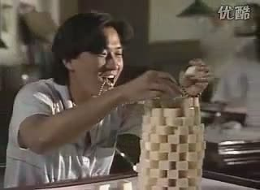

**《大时代》**至今仍被很多小伙伴们追捧。它同样拍摄于1992年，是无线25周年的台庆剧。男一刘青云，反一郑少秋，女一女二女三分别是周慧敏郭霭明和蓝洁瑛。除了那些金牌龙套之外，之前当家的刘松仁，后来当家的林保怡陶大宇，希望之星李丽珍都有出演。秋官和刘青云充分诠释了什么叫一个演员的自我修养，一个演疯子一个演傻子，都特别到位。尤其是郑少秋对着镜子练习自我辩护那段，堪称华语影视界首屈一指的独角戏。
而金融股票的题材，放在今天也不过时。至今港股一发生动荡，还有人怪郑少秋不是？我这点可怜的股票知识，约有50%来自这部剧（另50%来自大富翁游戏），直到2016年我才弄明白刘青云拿周慧敏的钱去买跌是怎么回事。没错，一个买空困扰了我20年。
大结局，满天纸屑里，刘青云对着全家人的遗照看丁蟹一家跳楼，太tm有画面感了！
主题歌《岁月无情》是一首非常大气的歌。前奏一响就有一种气势磅礴的感觉。而中段的时候，周慧敏唱过一版清唱的“红河谷”，那是我第一次听这首歌，当时觉得好听极了。

再后来的台庆剧**《创世纪》**。又是大钢哥买的压缩盘，我跟着蹭着看的。大哥看得劲儿劲儿的。
没看全，但也没少看。没看明白。
罗嘉良的梦想似乎就是盖一个什么什么大楼？
跟《大时代》相比，冲突太不明显了，唠嗑含量高的剧在我这儿可是得不到太高评价的。

无线的剧大概可以分成古装和时装两类。翻来覆去就那么几个人。
梗都很老，无非三角恋二女争夫欢喜冤家之类，“消消气给你煲汤”这种台词一部剧能出来十几次。
正好差不多是高中时期，要是播出时间赶上为数不多的假期和星期天，就顺便搂两眼；没追上也没什么念想。
《状王宋世杰》、《金装四大才子》、《林世荣》、《醉打金枝》、《天降财神》、《一号皇廷》、《O记实录》、《烈火雄心》之类的，除了名字已经不记得什么了。
唯三印象深刻的是三个刑侦剧系列：《刑事侦缉档案》、《鉴证实录》和《陀枪师姐》
**《刑事侦缉档案》**里陶大宇还是有些放不开，郭可盈非常漂亮，可后来郭可盈瘦得跟芦柴棒似的，也不知经历了什么。
**《鉴证实录》**林保怡和陈慧珊都是很有味道的演员。刚出道的李珊珊是英国治下香港的最后一位港姐，眼神有些呆，身材很好，后来绯闻越来越多，作品越来越少，消失了。
**《陀枪师姐》**的关咏荷可谓是90年代末至新千年初无线的当家一姐，被称为几十年才能出一个的人才，跟欧阳震华搭档的多档电视剧都非常有人气。
滕丽明也是在这部剧里成的名。三元四喜五福这些名字起得又好玩又接地气。
但是可以说港剧没有美剧的命，却得了美剧的病。往往是开头不错，十几集之后水准就断崖式下跌，或者前作大火，续集就一塌糊涂。这三部剧的续集都难以为继，《陀枪师姐》到蔡少芬出来的那一部，已经谈不上什么质量了。
另一个问题是配音演员。无论女主角是关咏荷、宣萱、张可颐、郭羡妮、佘诗曼还是蔡少芬，只要一张嘴，就像变成了同一个人，或者同两个，说话的口气都差不多。
还有一部《洗冤录》，也可以归为刑侦类，04年出差的时候断断续续看的，但是用的都是老段子，没什么意思。

有个不太出名的剧集**《老师早上好》**，青春校园风，黎明主演的。宣萱和李绮红二女争夫的老段子，故事本身没什么意思。但是配角的卡斯很强大，黎明一家兄妹三人，叫大保中平小安，黄霑老爷子演他们的爹，罗家英演舅舅，夏萍演奶奶。秦煌演校长，黄一飞演同事，雷宇扬、罗文也有客串。罗文的出场还比较有趣，罗家英成天咿咿呀呀唱戏，黎明就拿汪明荃来调侃他，罗家英反驳说罗文以前也是唱戏的，结果有一集罗文真就出来了。男猪妹妹的男朋友是白脸古天乐演的，成天坐在沙发上混吃等死，这是我第一次看到古天乐，比神雕要早。

还有早一点儿的，比如**《我本善良》**。温兆伦当时可是红得发紫。这种剧主要是我妈在追，除了个片名我啥也记不住。因为这片名太好用了，经常被报纸杂志引用。
说个可怕的事儿，温兆伦跟张涵予同岁。张涵予出名的时候，温兆伦差不多淡出一线了。

对了，**《妙手仁心》**我们这边电视台没放过，压缩盘流行的年代我看不上演三级片出身的吴启华，所以一点儿也没看过。

亚视似乎一直活在无线的阴影之中，其实它给我留下过印象的剧集还不少。
彩电时代第一部印象深的亚视剧是**《司机大佬》**。
吴耀汉塑造了一个要带弟弟妹妹的大哥形象，女主角伍咏薇，刚出道的万绮雯演吴耀汉的妹妹。很轻松的都市轻喜剧的题材，具体的情节不记得了，反正是欢喜冤家见面就吵那种。

亚视接下来的名剧是**《我和春天有个约会》**，讲一班舞女的故事。
班上的女生当时特别迷这部剧，男生则大多无感，最多感叹一下江华好运气，跟大神一郎似的有一帮女手下。
四个女主分别姓白洪金蓝，上台时衣服也这样穿，实在太刻意了。
这部剧最出名的是其中的插曲。“你你你为了爱情今宵不冷静”

后来有线电视时代，各地方台播过一部黄日华主演的**《银狐》**，商战+演艺圈，复仇的故事。片子的亮点是伍咏薇，把一个人的感情变化演绎得淋漓尽致。方刚、刘锦铃演的坏人也非常到位。
总演坏人的方刚堪称亚视的台柱子，金牌编剧。
可能是因为结局比较黑暗向的原因吧，好像过了那几年就没再重放了。

李小龙传记性质的剧**《龙在江湖》**播出的时间很有意思，是每个周六周日的中午。我爸特别喜欢。
吴大维演李小龙，里面有句著名的台词：“我书读得少，你可不要骗我啊！”

《肥猫正传》是一部少有的情怀作品，郑则仕跟肥猫几乎融为一体。

05年出差，GBA没电的时候，发现一部**《我和僵尸有个约会3》**。
一看那大长腿，这不万绮雯嘛！看了两集，剧情也太扯了，哄小孩吗？这种东西也能出三部？
写这篇东西查资料的时候才发现，原来男主角就是当年的“银笛书生”，原来我早在13年前就已经老眼昏花了啊。

我小的时候，老人、长者都是很有自信的领导人，广电总局没那么多歪歪经能念，有很多国外剧可以在电视上直接看。
彩电时期第一部印象深刻的美剧是**《CI5行动》**，我们这儿首播在辽台。
辽台的报幕员挺傻的，有时报C爱5行动，有时又成了C夭5行动。这是部非常精彩的警匪/侦破题材的电视剧，一个老头加俩帅哥的配置，几乎没有重要的女角色，荷尔蒙含量十足。
具体情节记不太清楚了，反正那个叫birdy的主角比较冲动，三集里总有两集脸上得挂彩。
也不知道当时引进了几季，反正我看的不是首播，是后来中午的重播。

那时侦探片盛行，大连台放的两部我印象比较深。
一个是英剧，译名**《三个侦探》**，据说是几部片子混剪的。一个老头，一男一女的搭配。印象比较深的一集故事发生在一个种花或者蔬菜的大棚里，植物发生了变异；另一集有个爬墙的吸血鬼或者什么诡异的生物，害我好长时间害怕睡觉时窗里蹦进来奇怪的东西。
另一个是日剧**《秘密部队》**。也挺血腥暴力的。记得有一集女尸大白腿给了好几秒的超级特写。这部剧的片头曲非常帅，只是歌词听着像“驴拉驴拉”。可能是因为主演里有三浦友和才被引进的吧。

90年代中期播出的**《霹雳游侠》**勉强也算侦探片吧。那片主演真没什么，吸引人全仗着车。
还有配乐。

大连有线台还放过**《超人》**的电视剧版。
乍一看挺新鲜，几集之后就没意思了，全是套路。路易斯你是不是瞎，成天在一起看不出来克拉克就是超人？

要说真正让我意识到美剧是个无底洞的，是97-98年，AV8每周六10点放的**《伪装者》**。
男主角每一集或两集换一个身份，调查自己身份的真相。有一个胸大屁股大的帕克小姐跟他亦敌亦友地搞暧昧。
单独看每一集都很吸引人，连起来看就发现根本连不起来，主线剧情毫无进展。
上高三就没再追了，也不知这部剧究竟完结了没有。
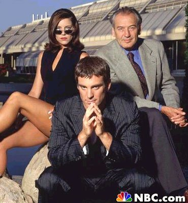

大学暑假的时候已经不怎么看电视了，各卫视都喜欢在上午放一部**《辛巴达航海》**。
剧情很单调，特效很枯燥。
最奇怪的是不管主角的团队手持的是弯刀、大刀、锤子、弓箭还是飞刀，最后一下肯定是用拳头把人干倒，绝对不见血，好无聊的设定。

日剧的话，电视台播的、印象深的有三部。
首先是大名鼎鼎的**《东爱》**，不说了。

紧接着东爱，辽台播了一部**《回首又见他》**，各地有线台也有播。讲医生的，是我看的最早的医疗剧。片头一黑一白两个男主角在海边奔跑，配合恰克与飞鸟的主题歌，当时人就燃了。
印象最深的镜头是司马给病人取子弹，什么非常危险这不能动那不能动的，然后主角非常酷地把镊子先冷冻，然后利用热胀冷缩把子弹跟头骨间制造出缝隙，把子弹取了出来。
里面还有医药代表主动献身的剧情哦。
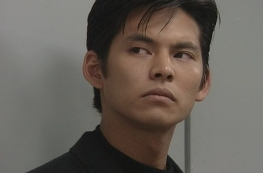

再就是屌丝逆袭的代表作**《101次求婚》**。主演那个猥琐大叔可是日剧里少有的丑男当第一主角的。
当然也不是冲他看的剧。浅野温子和江口洋介才是女的靓男的帅啊。
江口简直是艳绝奥多摩好吧！

还有一部日剧本来不应该出现在这一篇里，而应该在上一篇，它的名字是《阿信》。
同样墨西哥裹脚布还剩一部叫《卞卡》，大连台不知出于什么心理，90年代把它们弄出来又放了一次。
我妈看得如痴如醉，我和我爹昏昏欲睡。
我宁可回屋听广播写作业也不要看这些。

让我们将目光转回国内。
国产剧跟港台新剧比起来，题材就要丰富得多了。八九十年代还真是文化创作的好日子。

先从大连台制作的**《篱笆·女人和狗》、《辘轳·女人和井》、《古船·女人和网》**这三部曲说起吧。
这三部曲一直是上世纪大连台的骄傲，重播了无数遍。第一部首播是89年的寒假春节期间。
农村题材并不生僻，大连台投资拍这片的时候，应该也没太多的成本投入，除了演老汉的田成仁，剩下的一帮儿子媳妇好多都是当时还不红的同班同学。依着原著的长度，现在的制作方法，30集不在话下。
第一部很接地气。什么风筝掉房上不吉利啊，出殡不能让鬼进门啊，剁鸡的时候得摘鸡素子啊之类的小细节都很生动，而且整体的冲突也明显，所以当然就红了。
首播的时候我姥姥已经73岁，眼睛不太利索了，还是非要坚持每天守在电视机前面追剧。而且也得感谢主题歌，片头有毛阿敏和孙国庆两个版本，片尾是大连老乡范琳琳友情赞助的，明显利用当时流行的“西北风”进行的创作。
第二部就不行了。似乎是第一部把原作优秀的部分都抽走了，第二部是匆匆编了剧情来圈钱的。铜锁、小庚一个洗白一个黑化，充分体现了编剧的翻手为云覆手为雨。故事的焦点从村里转移到了镇上，印象真不深了。只是里面有个配角叫苏小个子，我们初中班有个同学就因为姓苏，就一直被这么叫。片头片尾的演唱者来头更大了，是韦唯和刘欢。这两首歌其实不如第一部的两首。
第三部单论剧情质量其实比第二部略好，但因为边际效应，早已风光不在了。片头片尾又换回了孙国庆毛阿敏，毛阿敏的《不白活一回》是首完成度不错的作品。
如今偶尔还能看到演二媳妇的金莉莉的身影，不过是专门演起婆婆或妈了，真是岁月不饶人啊。

在二和三中间，大连台还联合投资拍了一部**《山不转水转》**。好像是讲挖矿的，我没怎么看过。这部剧也是在大连台反复放，尤其是假期的时候。由那英演唱的同名主题歌前两年因为一部电影莫名又重新流行了起来，不知刘欢的片尾曲什么时候能再被发掘出来。
这四部剧的所有歌词都是大连人张藜老师包办的，他的土疙瘩味歌词差不多也在这四部剧中打光了子弹。
什么“昨天下了一夜雨，清早起来脚挂泥”，这不废话么！

第三部剧情就很无赖了，整了个什么二姨，把第一部的公式又套了一遍。
这部最大的问题是文不对题，原著和编剧是个吉林人，土味足够，海味一点儿没有。

说起农村剧，就不能不提赵本山。最早的时候有一部《一村之长》，豆瓣上有句短评深得吾心，我现在把它原封不动地抄过来：

> 某年暑假还是寒假，儿童节目没了，西游记演完了，连夕阳红都看完了的时间，只好看这个。从那个时候就不喜欢赵本山的电视剧。

这么说吧，除了08年被老丈人携裹看了半季“乡村·唠嗑也能算·爱情N”之外，赵本山担纲的所有辽北闹剧，我都是看到就换台。

真正完胜赵大白活的农村剧，是**《怪王外传》**和**《怪王别传》**。
主演长得稀奇古怪的，一看就不是好人。
什么智斗大仙、计划生育，给寡妇做思想工作，这才是真正的农村题材该讲的事儿好吧。
有个镜头印象特别深，怪王手里有个本，是村里的刺头名单，搞定一个划掉一个。

然后，按照江湖地位来吧，**《渴望》**。
现在还活跃在电视荧屏上骗吃骗喝的凯丽阿姨，就个靠一部戏吃一辈子的典型代表。
实在是因为刘慧芳的受气媳妇儿的形象实在太深入人心了。
同样还有李雪键的国民老实人形象、孙松的国民混蛋形象、黄梅莹的恶大姑姐形象都深入人心。后来李雪键老师演焦裕禄，演宋江，才逐渐摘掉了老实人的帽子。而另两位则没有扭转形象的机会了。
其实这片我能聊这么多都是从电视报和其它报纸上看来的，我本人一集完整的都没看过。“悠悠岁月”倒是听的耳朵都起茧子了。
中国第一部室内剧是不假，可室内剧的目的不是为了省钱的必然么？为了省钱而出现的第一有什么好夸的呢？！

《渴望》太过严肃，北京的一帮大爷文人们又搞出了**《编辑部的故事》**。
编导团队里有郑晓龙/赵宝刚/王朔/冯小刚/马未都。那几年的朔爷在影视圈可真是执牛耳者，冯小刚就是个跟班小弟。
赵宝刚也真是厉害，捧谁谁红。
葛优和吕丽萍在演编辑部前都不是无名之辈，但确实都是靠这部剧火遍全国。
真正靠这部剧一举成名的是侯耀华。在这部剧之前，根本没人认识他，成名之后也有相当多的人搞不清他究竟是侯耀文的哥哥还是弟弟。王自健不说过嘛：“我师父跟他们不一样，我师父是混电视圈儿的。”
另外这部剧厉害的地方是植入。有个叫百龙矿泉壶的东西，片头广告全是它。
“开水？养鱼、浇花都活不了……因为缺了我！”
片子里编辑部也是用的这东西喝水。
一个编辑部，去客串的要么是大腕明星，要么是客串后成了大腕明星。客串里最棒的表演来自张国立,演个同性恋，把葛优给腻歪的，眉头都快皱到屏幕外面了。
剧情在当时有很大争议，因为讽刺性太强了，虽然每集结尾都有导人向善的总结，但还是遭到了很多批评。其实好多集的讽刺放今天也照样适用。比如有一集一个领导照稿念都念不下来，真不是提前25年讽刺某领导人？
我最喜欢的是世界末日那一集，李东宝跟葛玲的相声式求婚，每个回合都透着一股贱气。
主题歌又双叒叕是毛阿敏唱的。
“冬宝，想什么呢？”“想葛玲呢。”——那是电视剧红了之后才有的广告，双汇请葛优和冯巩应该花费不菲。
题外话，春都在全国别的地方怎么输的不知道，在大连是死于人肉火腿肠的谣言，双汇算躺赢吧。

然而有一部剧是包括朔爷在内的众多大腕的滑铁卢。它就是91年的**《爱你没商量》**。
[前面的一篇](https://pewae.com/2016/02/no_swallow_no_snake.html)里曾经挖过一个坑，说《寻找回来的世界》里藏了个大咖，可惜没人接茬。这位大能就是宋丹丹。
宋丹丹85年处女作就拿了电视剧飞天奖的最佳女配，可以说前途一片光明，人老人家可是人艺的正式编制，演话剧出身的，根正苗红。可她可能一时没抹开面子演了“魏淑芬”，90年元旦晚会又演了“超生游击队”，身上被贴上了喜剧演员的标签，很多小朋友（比如我）当时都觉得宋丹丹就是个喜剧演员了。和平女侠不开心，出演了这部剧，希望把形象扭转回来。
这剧咋说呢，太超前了。台词透着一股浓浓的装逼风。女配盖丽丽、盖克、马羚一个两个三个都比宋丹丹漂亮，男主谢园又天生带一股老农气息，撑不起来。这剧刚开播，就被骂了个狗血淋头，换今天都要怀疑是不是在用自黑的方法营销。
收视率其实不低，起码我妈就一直追这剧。当时的大连电视报宣传力度也挺大的，角度很新奇——力挺盖丽丽（山东大连是一家？）。
宋丹丹终究没能摘掉喜剧演员的帽子，谢园栽了，王朔也栽了，甚至优客李林（林志炫）的那首主题歌也堪称职业生涯的污点。

在哪跌倒就在哪爬起来，英家人拉上不世鬼才梁左一家，搞出了**《我爱我家》**。这个大家都熟。
其实我并不是特别推崇这部剧。因为其水平良莠不齐，好的是真好，差的也真差，梁左虽然厉害，也不能保证每个包袱都出彩。司马南搞科普那一集就好无聊。当然剧集创作周期拖那么长，在所难免。
我最喜欢的是后面英若诚和文兴宇看世界杯决赛那一集。明显这是梁左蹭世界杯热度现写的，相声术语叫“现挂”，俩老头斗法的台词，非常有水平。
事实上我就没推崇过任何室内剧。

那边朔大爷也不甘心，搞了个**《海马歌舞厅》**。这片子现在总被翻出来跟《深夜食堂》比较。架构上确实有点像，说的是形形色色的人与歌舞厅的交集。
但是呢，歌舞厅这个东西跟饭馆比起来，有些高冷，90年代初好人是不会去那儿的。
加之这部剧的编剧们可是一帮玩文字的大爷：王朔，马未都，海岩，刘震云，莫言，梁左——他们总喜欢在剧里加料。尤其王朔刘震云这俩影视圈的老混子，轻度的含沙射影简直驾轻就熟。所以这片子刚一出来就为上方所不喜，后来甚至以童安格的主题歌太消极为理由禁了一阵。跟编辑部一样，好多人就不希望这剧红。
所以，要不是黄小厨，这剧我这年龄段的人也有好多想不起来的。
仨固定主角是只出精品的刘斌、红透全国的陈小艺和小混子梁天。现在看来，当时的刘斌就已经非常强大，陈小艺和梁天都有些招架不住。
童安格那首歌非常好听。
https://music.163.com/#/song?id=150753

94年有一部只有8集的剧**《过把瘾》**。
这种家庭剧，我当然是没看过的了，但那主题歌确实是抓人耳朵。
江珊可以说是一夜之间爆红。然后她迅速推出了个人专辑，并且人们第二次发现，王志文是会唱歌的。
有人在“跨界歌王”之后说江珊是当年演而优则唱的第一人，这就不公允了，起码金铭就比她早。
后来这剧的俩主演江珊史可闹出了罢演丑闻，被封杀了，不然江珊的地位绝对不会比她的同班同学徐帆差。

王志文有一阵子炙手可热，比如接下来的一个寒假，几乎所有的有线台下午时段都在放一部剧——《皇城根儿》。
我就没正眼看过。

**《武林外传》**是我主动追的最后一部剧。06年一个相亲对象给我推荐的，当时演到20多集，从网上下载补的前面部分，到74集的时候弃坑了。我03年以后唯二看过的电视剧之一。
时间很近，不用我多说。这部剧对我来说的爽点在于宁财神使的梗，我都知道它们的出处。
要是没有后面20集就完美了。

03年以后唯二看过的电视剧之二是**《爱情公寓》**。
大连这边播出的时间是2011年的春节，臭宝肠炎发烧，抱起来就睡，放下就哭，双手啥也干不了，只能看电视打发。
我挺喜欢陆展博的宅男人设的。
但是臭宝4天以后病好了就没再追，并不特别吸引人。

再来说说历史剧吧。窃以为内地拍历史剧的水平比港台新要高上好几个档次。

家里刚买彩电不久，可能是90年初吧，辽台就播了一部重量级的剧：**《封神榜》**。
第一天，小伙伴们没注意。
第二天，都瞅见了妲己的咪咪。
第三天，没了。
这剧一共5集就被腰斩了，辽台只放了四集。
这版的妲己是老戏骨梁丽。就是演孙二娘和喜来乐老婆的那个。
其实记忆已经很模糊了，能记得的就只有妲己的咪咪，那也是孙二娘的咪咪……
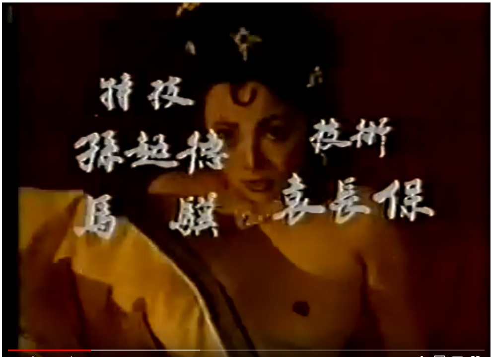

另一版**《封神榜》**就是傅艺伟封神的那部了。
这部剧大连台是在91年春节前后播的。这时我已经读过了封神演义的小说，所以看剧时的眼光就分外挑剔。
首先就是服装不行。按说商朝那么远古的时候，中国境内应该只有麻，浑身上下应该是批个破布片那种，结果贵族们的服装给设计成了罗马风，而神仙们的身上则花里胡哨的。老子原始和通天的衣服上都有一道奇怪的弯。
最大的问题是打戏不行。动作设计完全不像请了香港武指。特效更是感人，无论你是阴阳镜还是翻天印，也不管你是琵琶精还是通天教主，祭大着的时候一律是把法宝一举，然后放出一道用Windows附带绘图板里的喷桶工具喷出来的一根线。也不能说人家不用心，起码这条线有粗有细，有黄有绿呢。当时还号称采购了世界上最先进的特效机，玛德剧务肯定吃回扣了。
虽然妖精们穿得挺露骨，其实这片子拍得挺保守的，达奇蓝天野等老演员都很绷着，倒是费仲演得很生动。可能因为是上海拍的缘故，申公豹竟然是给擎天柱配音的雷长喜老师扮演的。
表妹一直不敢看炮烙梅伯和姜皇后挖眼睛那两集。
主题歌有两版，谭咏麟版毁在咬字发音上，而毛阿敏则用力过猛。
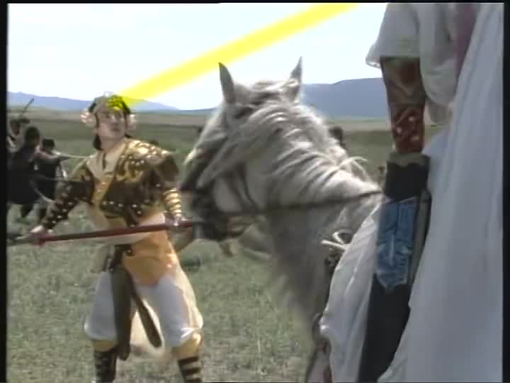

**《三国演义》**我一直看得断断续续的，主要原因就是我老妈不爱看。那时我还没接触《霸王的大陆》，也没读过原著，所以兴致也一般。
后来假期的重播，也从来没看全过。
本剧最牛的是其战争场面，动用了大量的人力物力，人是真人，马是真马，赤壁的火，一半是真烧。尤其是有很多部队官兵的参与，好像还死了不少人。南中那集有小战士牺牲色相，小弟弟都露出来了。
全真人而非的电脑特效的大场面古代战争镜头，怕是再也看不到了。
本剧的最大问题是因为分不同的地点拍摄，所以除了曹刘孙关张诸葛司马这几个核心人物，和吕布周瑜孟获这样剧情很集中的角色以外，其余演员大量换人。什么赵云马超鲁肃张辽，统统换得你根本接不上茬。
另外，那么多指导顾问竟然在盔甲和旗帜上出了大bug，蜀汉的旗子上写的都是“蜀”，实在太不应该了。
唐国强在演诸葛之前被诟病为奶油小生，靠这部剧翻了身，谁知转身又变成主席专业户了。

**《水浒传》**播出的时候，刚好是高二上半学期的期末，所以首播基本没赶上，后来的假期陆陆续续补的，也没看全。
宋江、武松、鲁智深演得都特别好。次要人物里阮小七和张顺都很出色。这版演扈三娘的叫郑爽，刀马旦出身，动作戏有种非常“飒”的感觉。
武指袁八爷不用多说了，武松飞云浦那场简直可以单独拎出来当动作电影看。
当时看的时候，觉得把108将以及一些剧情删减了很多感觉不好，但后来第三次读原著的时候幡然醒悟，编剧改得是相当有水平的，单廷圭鲍旭这种烂番茄臭鸟蛋带着除了增加成本别无他用。让林冲死在招安当天，更有戏剧性。
我们高中语文老师曾经点评过主题歌：“（跟其它三部比）大失水准，包括第二首在内。”

**《西游记续集》**，2000年了还在用80年代的理念拍片也就罢了，章老师蹦不起来了也就罢了，就那么几个故事也好意思拍成16集，老版最多用6集。

※[西游记和红楼梦的传送门](https://pewae.com/2016/02/no_swallow_no_snake.html)

**《唐明皇》**也是“国家队”拍的。当时获奖无数。
刘威功成名就之后终于开始显露自己相声演员的本色，开始变身为谐星。
林芳兵据说为演杨玉环增肥牺牲很大，也拿了巨多的奖。
这剧没看几集，印象流高力士演得不错。
主题歌是刘斌唱的，吵。

至于刘晓庆从少女演到80岁的《武则天》，看到就换台，无法评价。

**《杨乃武与小白菜》**可能是我被动跟老妈看的最早的辫子戏。主演非常漂亮，是演过林黛玉的陶慧敏。
整个剧就是个哭，从头哭到尾。我妈一边说这剧真丧门一边追……
其亮点是片尾曲“小白菜泪汪汪，从小没有爹和娘”。剩下就没啥了，不如去看王晶那部。

**《宰相刘罗锅》**首播没赶上，大概是在后来的暑假看的重播。
李保田、张国立、邓婕的演技是没得说，王刚从一个主持人变身成为专演和绅的特型演员也是从这部剧开始。
这部剧与其说是根据历史和民间传说改的，还不如说是根据刘宝瑞先生的相声改的。相声特有的一些表现手法使这部剧变得非常轻松有趣。
刚开头第一集还是第二集选秀女，就有露点镜头，我了个去！
主题歌是戴娆唱的，好听。戴娆歌甜人美，这么多年却一直不红，简直没天理。

97还是98年，**《寇老西儿》**隆重登场。基本上这部剧是照着评书《杨家将》拍的，但不知为何以寇准做第一主角。
葛优拍完这片被骂得很惨，后来再没拍过电视剧。
现在很多没看过剧的人为葛优叫屈，什么戛纳影帝演电视剧怎么可能差之类的。事实上，这剧真不太好。
我觉得最大的问题有三：葛优让戏，陈道明抢戏，瞿颖出戏。
葛大爷脾气太好了，或者是剪辑的问题，他这个主角一点儿也不突出，分支剧情太多太细碎；何赛飞、祝希娟这些老人家本身就带抢戏属性，何况陈道明这种超级戏霸，但凡葛陈二人同镜，焦点就必然跑到陈身上，这对于叙事是非常不利的；瞿颖当年刚转型当演员，属于重点培养对象，可天生的颜值在那儿，怎么也不像个烧火丫头，倒像国安部驻天波府特别联络官似的。所以这就是一部一手好牌打稀碎的片子。
亮点是演反派的王强。

《康熙微服私访记》1～N、《铁齿铜牙纪晓岚》1～N出的晚，基本上没看过，听完主题歌就换台。
《神医喜来乐》我特讨厌演喜来乐徒弟那个演员，所以也没怎么看过。

还有一种大陆特产，知青剧。这是我爸喜欢的类型，说的也是他那个年代的故事。

最好的应该是**《年轮》**，协弃台94年首播。
不管首播还是重播，我爸肯定不会放过。
不是那个年代的人，体会不到片子的妙处。

还有个**《孽债》**。
“美丽的西双版纳，留不住我的爸爸”——几个知青留下的种去上海找亲生父母的故事。
这部剧里大量使用了上海地方话，还引来了普及普通话那个部门的雷霆之怒，点名批评。后来好像不了了之了。
不知别的地方的人怎么看，反正我爸妈这种满嘴胶东方言的追剧追得劲儿劲儿的。
我觉得这标题本身就是很拉仇恨的，要是换现在的广电，非让制作方把名改了不可。
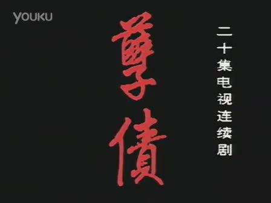

剩下就全是时装剧，没多少了，按年代来吧。

**《公关小姐》**当时就是个很有争议的词，后来，随着时代的发展，不仅没翻身，“公关”和“小姐”两个词又分别被玩坏了，真是令人唏嘘。
讲的什么完全没印象了，里面有个配角是西游记里小白龙的媳妇儿。

**《外来妹》**可能年轻的朋友都没听说过了，那你们听过禽流感的时候那首“我不想说，我是鸡”吗？那首歌就是根据杨钰莹的外来妹主题歌《我不想说》改的。
这片子讲述了当时第一波民工潮南下讨生活的故事，根正苗红，正能量+主旋律。
陈小艺一下子就红遍全国。说起来中戏87一个班里出了陈小艺江珊徐帆三个大青衣，在明星班里也算排得上号了。
巨讨厌汤镇宗，所以没怎么看。

**《北京人在纽约》**播之前我已经看过了原著小说，所以我觉得王姬的阿春演得不到位。
对，那时候没网络，凡是带字的我都看。
凭这片最终成就金身的竟然是孙楠。

**《红十字方队》**。
我们一家三口在看什么的问题上无法取得一致，但是在不看什么的问题上是统一的，那就是军旅剧。所以这部剧是这份名单上唯一一个反映部队生活的剧。
看的理由是我妈当时特别喜欢傅冲。
本剧特点又是歌好听。99年大学军训的时候，别的班仍旧唱那些老醋六样，我们班的班长特文艺，非要唱红十字方队的两首歌“你也不用讲我也不用说”和“相逢是首歌”，拉歌的时候显得特别没气势。

《将爱情进行到底》[基本没看过](https://pewae.com/2011/02/there-will-be-no-love-to-the-end.html)。谢雨欣的同名主题歌不错，当时还以为她是新人呢，这个大骗子！

**《心网》**是没被收购之前的人人网的广告剧，也算青春偶像剧吧，三个主演是常宽梅婷满江。
播出时间大约是2000年暑假？这广告打的是极好的，回学校之后还专门访问了一下人人网。那时候的人人应该是想走后来陌陌的路线，可惜剧播完没多久就被收购了。
《恋爱中的城市》是首好歌。
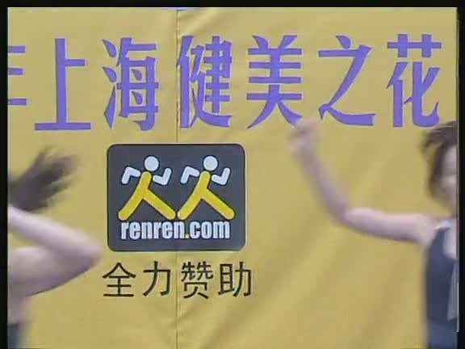

**《都是天使惹的祸》**播出时间也是2000年暑假，记得清楚是因为01年暑假我配了电脑之后即使在假期我也不追剧了。
剧情不记得了，偶像剧也不需要什么剧情。满脸胶原蛋白的李小璐演得挺活的，就是跟周迅太像了。剧里还有我喜欢的张延在。

01年暑假的**《黑白大搏斗》**是部非常特别的片子，以伪纪录片形式拍的刑侦片。后来这种类型应该是不让拍了。
第一集就很惊悚，某市发生了碎尸案，然后公安就开始查，一路逮了一窝吸毒、偷窃、杀人、抢劫的，最后才抓到正主。
这剧之所以感觉真实，是因为里面的破案过程显得很原始，找到蛛丝马迹之后靠的是走访群众、问口供来确定嫌疑人，而不是美式的高科技加证据。有一集演宾馆排查，抓了个嫖客，周围的围观群众吓得都站不住了，其中一个演员小声跟群众说了句话，看口型是“没事儿，拍戏呢。”
主题歌值得一听，一个不一样的韩磊。

**《黑洞》**是在宿舍里，跟着老大看的压缩盘。陈道明、刘斌演的坏人都非常生动。尤其是刘斌。
最遗憾的是这样的电视剧跟一个黑暗的结局才是最配的，要么陈道明逍遥法外，要么陶泽如黑化才是最过瘾的。但这里是大陆，正义不能战胜邪恶是不存在的。

**《爸爸叫红旗》**是04年出差在天津的时候，半夜里GBA没电了。
换台随便按的时候，哎？这不是婷美MM嘛？？
动作戏大佬于荣光的文戏不错。这部剧讲的是一事无成的中年人买保险的事，挺接地气的。
片尾曲是个名不见经传的女歌手唱的，挺有特色的。

最后再说一句，不是我忘了，而是所有古龙原著改编的电视剧都是垃圾。