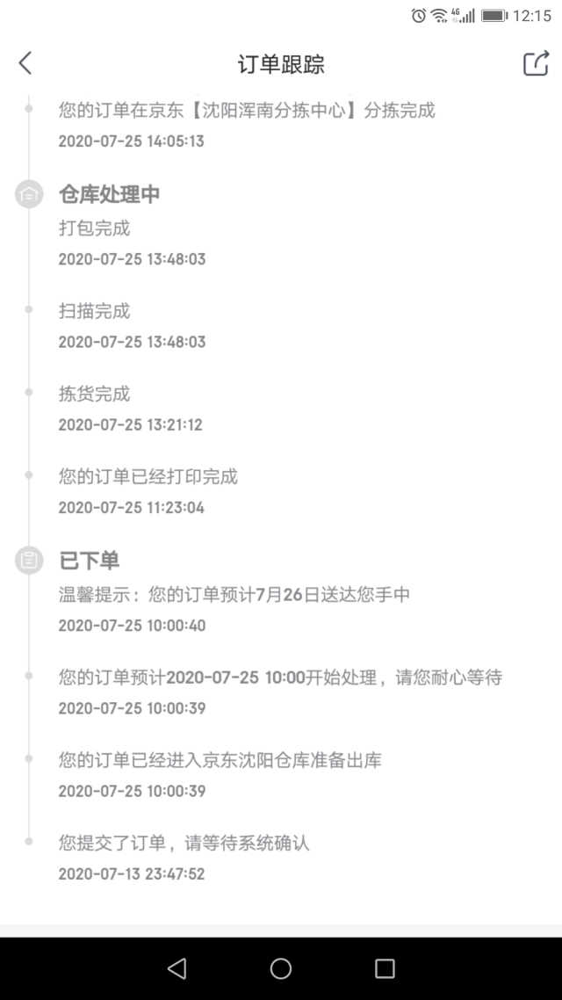
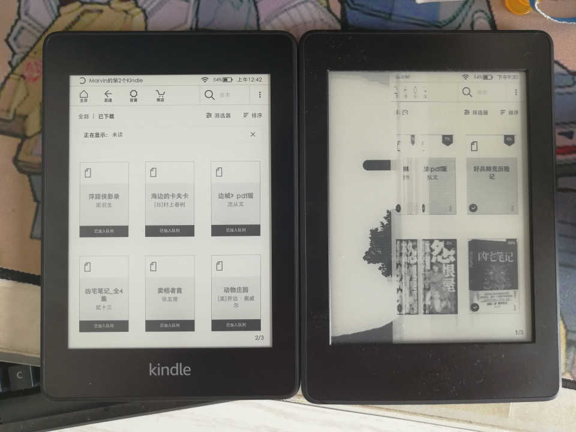

苟延残喘近半年的kindle终于再也亮不起来了，享年2年零6个月。
最后停尸在半屏启动半屏花版的奇怪状态下。死因不明。
大约有两个可能，第一是使用两个月的时候左上角仿佛渗近了一点水，之后就有越来越严重的无法开机的问题。第二是我经常把kindle揣在屁股兜里，把屏给撅出弧度了。

虽不是什么重度用户，但终归是老婆大人送的生日礼物，有被问起来的风险。
还是悄悄补一只回来吧。

我一直比较喜欢在某东买东西。主要因为其网站相对隔壁来说要清爽一些。以及习惯使然。当年在他们家下的第一单是有速度需求的，当然送得也确实快。以至于后来即使不要求速度了，却已形成习惯。
7月13号半夜下单，商品介绍里说次日送达。

等了两天没到货。问商家客服，商家客服给转到京东客服。京东客服说在备货，只要再等三到五天。
虽说不着急用，但看着订单毫无进度是挺闹心的。从这一刻起，就憋着准备给差评了。
一直拖到了24号，因为照看孩子临时请假在家没事做，中午吃完饭就把京东客服叫出来一顿臭骂。
客服一看已经十天了，表示非常重视。“今天之内一定给您短信答复”。

“今天之内”，那就等到12点好了。
啥～也～没～收～到～
后半夜又尝试call客服。竟然有人在。
这次的客服表示把这个case优先级提升了，报给了什么主管，（25号）11点之前一定跟我联系。

主管倒是很守时，来电话一通道歉，态度很低。并且表示已经发货了。
26号果然就到了。

签收之后主管又打来回访电话，表示赔偿1000个京豆，问满不满意。
还能怎样？我只是对中间两个不负责任的客服非常不满。早告诉我缺货我退单不就完了么！
京豆这种骗人花更多钱的东东对我来说屁用没有，给1个还是给1000000个都一样。

这次买了防水版，正面屏跟边框是一体的，不像之前有明显的缝。
老婆大人应该看不出区别。吧。

收到货意味着我可以给差评了！
把几个客服的聊天记录截图和物流截图上传，发完差评，立刻就念头通达了。
未几，收到店铺反馈，只是不疼不痒地表示歉意。没了。
点进详情，惊诧地发现，该商品的所有评价都被清空了。
我了个大艹，等了十几天就为这一刻，就好像一拳打进了面口袋里，不仅不过瘾，还反沾了一身。

只有用脚投票了呗。不过某宝家也确实恶心。刚装上还没打开呢，就咣咣弹消息通知。示威呢吧。

有种自行喂粪的感觉。