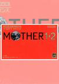

[地球冒险1+2](https://pewae.com/gaan/aHR0cHM6Ly93d3cuZG91YmFuLmNvbS9nYW1lLzM1NjUzMjcx)

原名：Mother 1+2机种：GBA厂商：HAL / 任天堂类别：RPG发行年月：2003-06耗时：17

[一代攻略](http://wiki.pewae.com/doku.php?id=wiki:fc:%E5%9C%B0%E7%90%83%E5%86%92%E9%99%A9#%E6%B5%81%E7%A8%8B%E6%94%BB%E7%95%A5)
[二代攻略](http://wiki.pewae.com/doku.php?id=wiki:sfc:%E5%9C%B0%E7%90%83%E5%86%92%E9%99%A92#%E6%94%BB%E7%95%A5)

这次是大名作。
这两部作品是那个时代特有的日本与美版不同步的典型事例：一代本来没发行过美版。所以日版叫做Mother和Mother2，美版叫做Earthbound Beginnnings和Earthbound。
本来是只想玩2代的，毕竟自古2代出神作嘛！但是下载之后才发现，GBA上是没有单独的2代复刻的，而是复刻了1+2的合集。那就不管我赶不赶时间，一起来呗！谁知道汉化组知难而退，并没有汉化小字体满是蝌蚪文的一代！而且本作的汉化好像也是在英化版的基础上搞的，所有道具都是英文名，以至于我打游戏的时候还要去参照英文的道具列表。
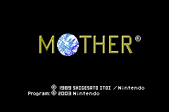

复刻版分良心复刻和没良心复刻。在我看来这GBA的1代复刻版就是没良心的那种。仅仅在原版的基础上加了个跑动键，修复了几个良性BUG，就拿出来卖了。宣称声音画面都有所提升，至少我在打最终BOSS之前是没看出来。
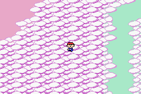

无数欧美玩家对本作推崇备至，但在我看来只是对勇者斗恶龙的简单扒皮：国王变成女王；教会存档变成打电话存档；魔法变成超能力；怪物变成外星人；马车换成铁路，仅此而已，连队列方式和视角都跟DQ差不多，真不比FF把战斗视角改成横板更具突破性。可能也是因为《阿猫阿狗》“借鉴”得太好，珠玉在后吧。
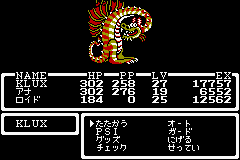
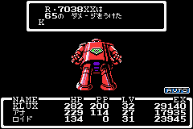
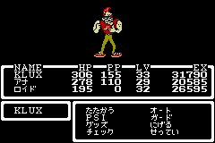

音乐确实可圈可点，不同场景的不同背景音乐，在那个年代的RPG里算难得的了。
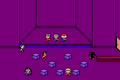

敌人略显变态，最后一个迷宫有能放即死魔法的，有物理攻击免疫魔法攻击只掉20滴血的，有超高攻击并且一回合打你两次的，强度拉满，弥补了最终BOSS不能打的不足。而且最后一个迷宫实在是太远了，需要无参照物绕一个大圈，累。
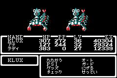
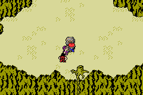
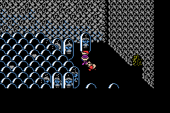

亏我还找了个带更强力队友打BOSS的方法，做好了打BOSS时忽然死机的心理建设。死机最终没有发生，但我带强力队友也没啥用。因为一代的最终BOSS根本就不吃任何攻击，要靠女主不停唱歌把它吓跑……
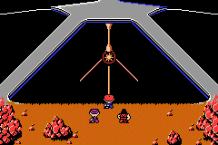
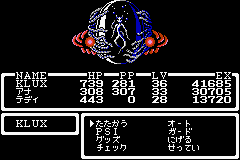

一代通关。
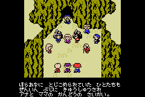
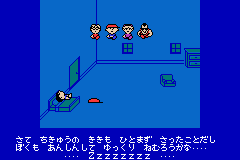
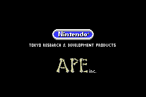

二代出品比一代晚了5年，平台也鸟枪换炮提升了一个等级，声音画面游戏容量提升天经地义。
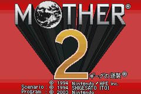

但是故事方面的提升却并不多。仍旧是与外星人斗。只不过一代的外星人只会魅惑动物，二代的外星人进化到了蛊惑人心。其实还是中二少年拯救地球的大框架。遇到BOSS前仍旧是需要学会8首曲子。8首曲子前面的铺垫很长，最后三首就很紧促，仿佛干着干着钱不够了的样子。当然在电子游戏界这也是一种常态。
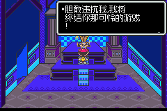
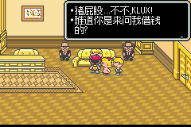

二代对战敌人时的背景很有设计感。
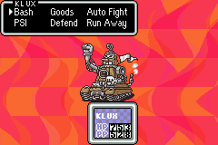
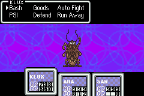
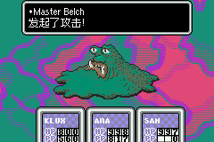
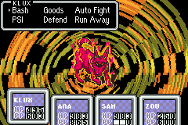

两部作品各卡关了一个地方。一代卡的地方简直可以算是一个小BUG：因为我少踩亮了一个村子，所以去打完下水道里的龙之后，没有出现通往下一个场景的路，只能钻山洞绕大远；而二代是因为因为没插耳机，所以从博物馆出来的时候，一楼的电话在嗷嗷叫唤，我愣是没发现提示。二代有个非常好的设定，就是城里会有个要饭的，在你不知道该干啥的时候给出关键提升。
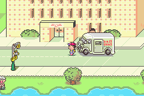
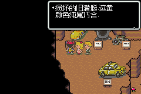

二代还有一个无奈的设定，打着打着，主角会莫名其妙的想妈妈而失去战斗力。做个游戏而已，也不用这么扣题吧。
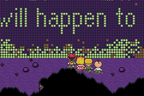

二代对战最终BOSS前增加了一个战胜自己内心的小插曲，好评。不过穿越回古代，以及灵魂出窍这样的剧情真心没什么意思。
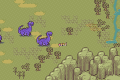
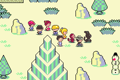
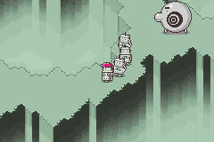

二代的最终BOSS是个类似于地球意志的东西，并没有实体。而且搞得玄而又玄的，四个主角需要魂穿到过去的时间线，消灭萌芽中的敌人。
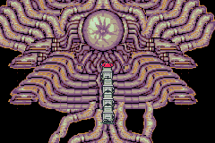
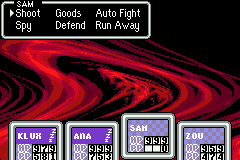

跟一代一样，二代的最终BOSS也还是打不死，而是要靠女主不间断地“祈祷”。很难说不是从《龙珠》那边借鉴了攒元气弹啊！
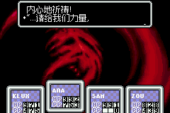

二代通关！
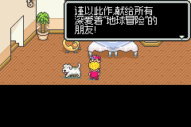
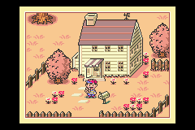
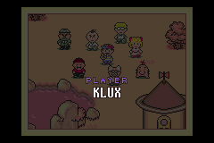