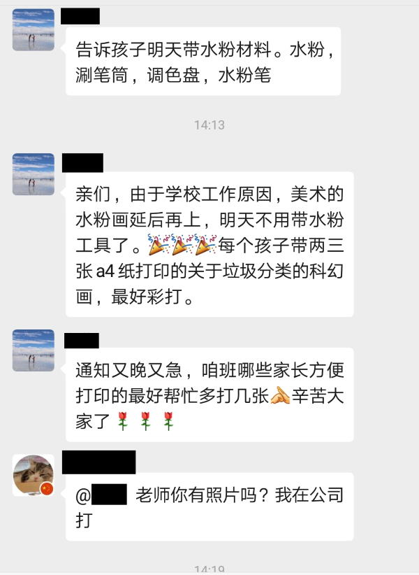
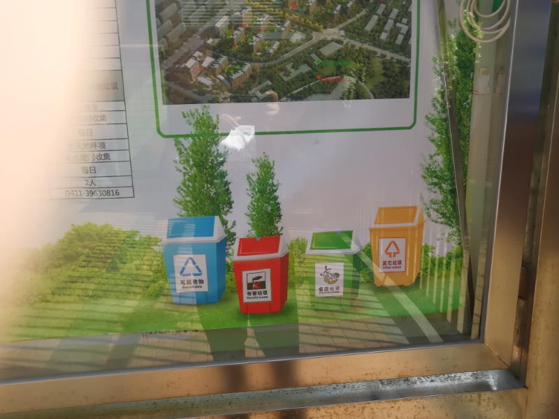
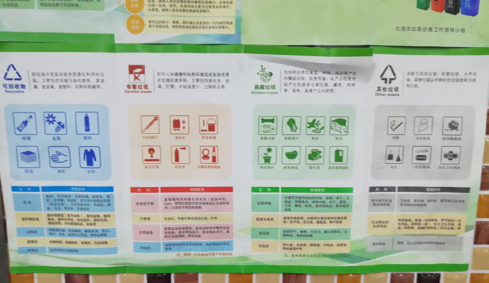
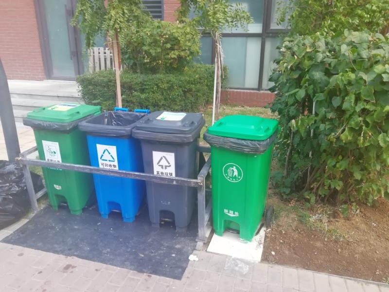

协弃市的垃圾分类，业已开展了20个月以上了。一直是一副原地踏步的死样子。[上次骂](https://pewae.com/2018/08/random_kuso_21.html)已经是一年多以前的事了。
如果就这样一直苟且下去，我也不会对它产生什么多余的恶感。无非是领导有人拍脑袋，下面人做样子呗。
可这周，它偏偏冒犯到了我头上。

那就别怪我发飙咯！

周三下午，臭宝班主任老师临时发通知，让准备两到三张垃圾分类的科幻画。最好彩打。

班里倒是有个好心的妈妈，能薅单位羊毛帮打。可等我下班看到通知的时候，雷锋妈妈早已经把单位打印机薅到没墨回家了。
赶忙在地铁上搜了几个图存下来，跑去家门口的复印社给打出来。跟老板加了微信，把照片传给他。他看来看之后啧啧一声：“你这两张不行啊，分辨率不够啊。不过不要紧，你看我这有给别的家长打的图，你挑两张我给你打，不能那么凑巧一个班吧……也不知道学校要干什么。”
“能干什么，赶着给你们送钱呗。”

这一波宣传猛烈，是因为又要创文明城市了——别管出了垃圾桶真分假分，进垃圾桶的时候分了，就是分了，就很文明了。

我非常反感这种以环保名之名行浪费之实的驴粪蛋行为。哪怕是一张不起眼的A4纸，一节课之后扔了难道就不是浪费？墨盒死贵死贵的，不管是正版的还是盗版的难道就不花钱？
真有心就采取点实际的，成天紧着给一帮没有行为能力的小屁孩宣传有毛用！
艹！

说到宣传。协弃市迄今为止展开的垃圾分类行动可谓是二分购买，一分行动，七分宣传。
车站广告，宣传标语，横幅什么的到处都是。垃圾桶也换了。可垃圾站垃圾车什么的就根本见不到变化，垃圾场我估计也是没有改的，改的话还不吹到天上去！
我所在的小区，小区门口、门洞走廊里，由街道挂上的宣传画也有将近一年了。可tm这玩意儿竟然是个错的！直到我在单位看到新挂上去的资料才知道——
分类标识里，“其他垃圾”一类，不是黄色的，而是黑的。（P.S:官方连其它和其他也都没搞清楚，这里哪个都行，但你好歹写一致了啊！）
想一下，都不是错的，只不过是第一版和第二版的区别。这算是软件升级了，说明文档没更新。

显然，这官方的宣传资料是够环保的，错了都不换，一挂挂一年。可电梯里的广告每个礼拜都风雨无阻的换两次。

我当然知道原因。电梯广告姓分众，一干人等靠着换广告吃饭嘛。
而街道呢，任务是任务，任务完成了就是完成了，下一个任务来临之前，对吃饭毫无影响嘛。

垃圾分类当然是好事。
但要知道分类是一系列的系统工程，从投放，到运输，到储存，到处理，都应该分类才是。而协弃目前为止显然是流于表面。垃圾桶是不同颜色的放了三四个，上面的分类标志也很明显。小区居民除了孩子们，投放就没几个用心的；分了也没用，最好区分的可回收类，早早就被保安收了钱放进来的捡破烂的捡走，剩下的就没有能回收的；收垃圾的大哥不管三七二十一，每个桶就是一个黑袋子装走，我估计收不完不能下班的前提之下，他是没空也没必要区分哪个是哪个的；所有的垃圾袋被运到200米外的垃圾房等待垃圾车；别说，垃圾车上确实也实践了分类——四个大字“其他垃圾”。

缺钱就说缺钱。不在垃圾桶边上雇佣老太太盯着，不把收垃圾大哥的待遇提上来，不把分类的垃圾房建好，不配套不同的垃圾车，不修建专门的垃圾处理厂，只是让小区和单位出钱换垃圾桶，让老百姓投放的时候把类分了，当谁傻呢？

穷其实有穷的办法。
昨天中午路过某饭店，看到收泔水的垃圾车上面写着“易腐”。虽然只是改了个名字，但确是微小的进步。值得褒扬。

为什么不先从把易腐跟有害单独收集做起，一步一步来呢？