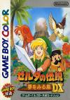

[塞尔达传说：梦见岛DX](https://pewae.com/gaan/aHR0cHM6Ly93d3cuZG91YmFuLmNvbS9nYW1lLzI1ODc0OTE3Lw==)

原名：ゼルダの伝説 夢をみる島机种：GBC厂商：任天堂类别：A-RPG发行年月：1998-12耗时：60

常规赛最后一场，我必须用一个有份量的游戏来攒底。
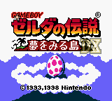

塞尔达系列的大名，无庸赘述。当然，因为红白机上的一代发售在磁碟机上，而二代又比较失败，所以塞尔达在中国没有获得应有的地位。
梦见岛一作是塞尔达系列的第四部作品，在整个系列中的作用算是承前启后，坚定了整个作品的发展方向。
纵观GB/GBC的约10年历史，梦见岛的地位坐三望一。《俄罗斯方块》和《口袋妖怪》都胜在流行性和普及性，单论趣味性，都比不上梦见岛。
至于为什么不推荐时空·大地？因为印象里那版的模拟有问题。
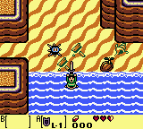
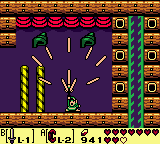

梦见岛这个译名并不准确。日文“夢をみる島”中，梦是见的宾语，然后组合起来修饰“岛”，而中文的“梦见”很容易被理解成同一个词。所以，也许翻译成“遇见梦的岛”更为贴切。当然，还是美版标题更一刀见血，根本不扯梦不梦的事，直接说林克醒了。其实不管是梦还是醒，都跟本作的背景有关。绿帽侠林克出海遭遇海难，被一位大叔给救到一个岛上，林克就在岛上各种冒险，最终打破了神兽的蛋，发现自己醒了过来，仍旧在海上飘着，岛上的一切不过是一个梦。所以日版标题说的是过程，美版标题说的是结果。
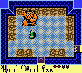
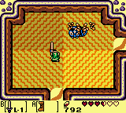

在系统上，梦见岛承袭了SFC上的三角力量，以2D俯视动作为架构加大量的隐藏要素作为灵魂。在全系列中，梦见岛有两个突破性的创新：第一是林克学会了“跳”，第二是某些场景增加了2D纵版画面作为调剂。j据说老任的开发组最早只是想做个缩水版的三角力量骗钱，但开发过程中发现了新灵感，于是整个大改，才有了这部脑洞深邃的作品。地图的区域范围其实并不大，只有16*16，但隐藏要素多得令人叹为观止。整个系列搞脑洞的传统差不多就是从本作和前作建立起来的。
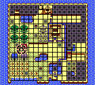

另外纵版的小过场也是创新，但没什么实际意义。找来了马里奥里的小怪客串。
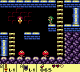

作为ARPG的标杆，塞尔达的谜题做到了恰到好处，迷宫里总有那种让你解完之后大呼：“我艹，竟然是这样的爽点。”这种爽点，就是前些年流行的“密室逃脱”类游戏的主要卖点。我觉得任天堂是有资格跟他们收创意费的。动作方面，有些难又不太难的度把握得也很好，多练习总会过去的。不过，第八关推压路机的地方还是难到了我，最后利用模拟器的降帧功能作弊才过去。相比较之下，第八关的正宗BOSS只是小儿科。
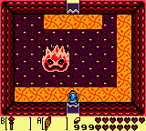

当年这个游戏我没打通，只玩到第四个迷宫就卡住了。后来在一次回沈阳的火车上，3P哥拿到我的砖头机玩这个游戏，欲罢不能，给他攻略他都不看，硬是用两天时间把英文版生啃了下来。
从那以后，3P哥就到处给人推荐塞尔达。
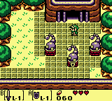
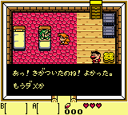

弱点的话要算是音乐了。受限于八位机的机能，整体音乐并没什么特色，只有吹笛子时的音效还算动听。最枯燥的是大地图音乐，用的是万年不变的“绿帽子之歌”。本作的主题就是音乐，每通关一个迷宫就能获得一个乐器，集齐8个乐器才能通关。注意其中一个竟然是三角铁，让我想起当年“中央爱乐乐团首席三角铁演奏家”的段子。
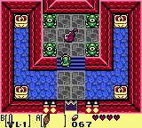
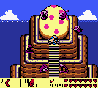

塞尔达的一大特色是处处有隐藏要素。本作有好几个有意思的设定：
村里的村民和动物都可以砍。狗会咬回来，你打不过它；鸡不会还手，但要是对着一只鸡连砍30下以上，就会满屏飞鸡，不及时跑几秒就能弄死主角。
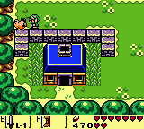
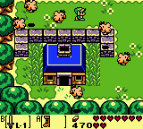

商店里的东西可以趁店主转头的时候不给钱直接顺出来。但是再进店的话店主会招来一道雷，直接劈死主角，有复活药都没用。第三次以后进店，店主会直接称呼主角：小偷。
最有趣的分支任务是找各个坐标的人换各种各样的东西。最后换到一个能显示隐藏人物的照妖镜，找到隐形人，换出非常强力的回旋镖来。其中的明信片，是碧奇公主的照片。
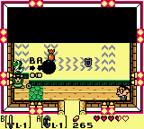
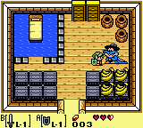
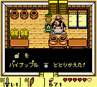
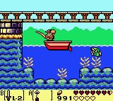
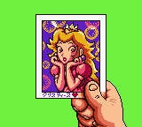

塞尔达的DX是个真DX。为了支持新生的GBC，角色的渲染非常的仔细，而且很良心地追加了两个要素。
第一是有个老鼠照相馆，在特定的时间地点完成特定的动作，会得到照片，一共16张。但其中一张照片需要偷窃成功复活才能触发，而复活的话就没法达成完美结局了，所以这个附加要素挺鸡肋的。
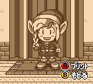
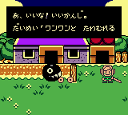

另一个要素是追加了一个迷宫，在迷宫的深处有个仙女，可以给林克换衣服的颜色。红色是攻击力加倍，蓝色是防御力加倍。不过我觉得那都不重要，林克摆脱绿帽子的身份才是最重要的。
这个迷宫的进入条件非常有趣：两个看门的骷髅，问“我的衣服是红的还是蓝的？”如果用黑白机玩的话，两个骷髅的颜色是一样的，根本就进不了门。即使能进去，迷宫里的谜题也是以红色绿色蓝色为解密条件的，黑白机的根本玩不下去。
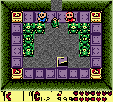

开篇小动画，林克流落荒岛，被MM捡尸。
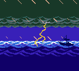
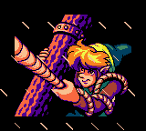
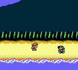

中期小动画，MM到手。
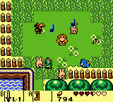
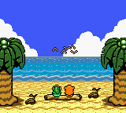

最终迷宫的解法也挺有特点，先要到图书馆查询迷宫走法，每个人得到的都不一样，搞得跟公钥密钥似的。
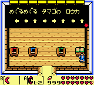

BOSS大多数比较简单，找到弱点就是三五下的事儿，关键是要找到弱点。
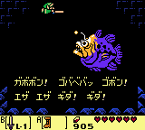
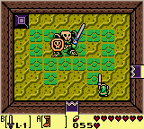
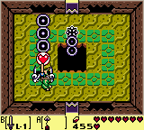
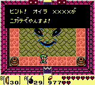
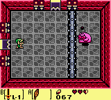

最终BOSS有点锉，虽然有六种变身，但找对武器都是三两下就死，其中第五种连完全形态都没露出来就直接被我秒了。
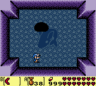
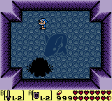
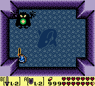
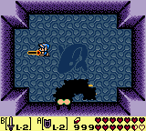
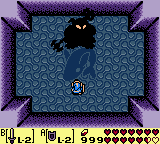
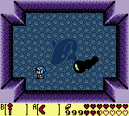
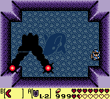

结局有点儿长。先是演奏八种乐器，唤醒岛上那个巨大的蛋。蛋里面是这个玩意儿，好像叫天空鱼。
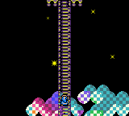
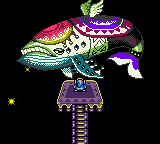
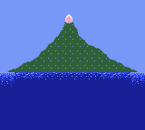
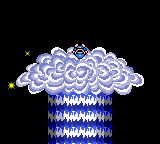

然后鱼一声长鸣，岛逐渐消失了，林克发现自己还是漂在海上的木头上。
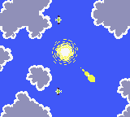
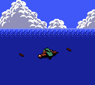
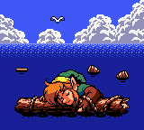
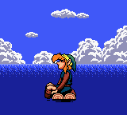
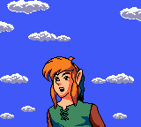

最后，如果一次没死过的话，结局画面中会出现天空鱼的影子，MM的头像也会显示出来。所以，林克这家伙都漂在海上了，还不忘做春梦啊！

