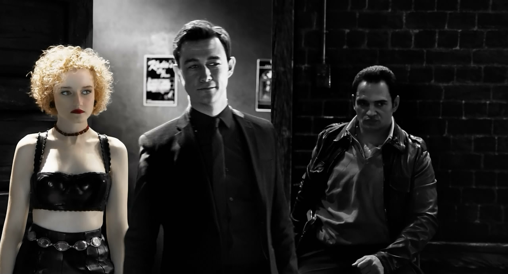
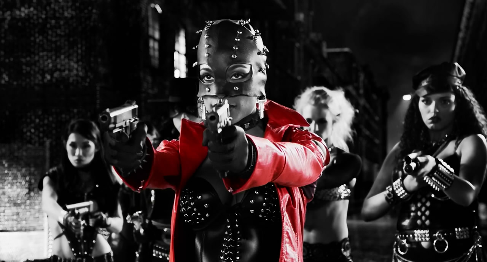

[罪恶之城2](https://pewae.com/gaan/aHR0cHM6Ly9tb3ZpZS5kb3ViYW4uY29tL3N1YmplY3QvMTQyODA1NS8=)

原名：Sin City: A Dame to Kill For导演：弗兰克·米勒 / 罗伯特·罗德里格兹主演：Lady Gaga / 乔什·布洛林 / 伊娃·格林 / 克里斯托弗·洛伊德 / 克里斯托弗·米洛尼 / 布鲁斯·威利斯 / 朱诺·坦普尔 / 杰米·金 / 杰西卡·阿尔芭 / 杰里米·皮文类型：动作 / 惊悚 / 犯罪地区：美国首映时间：2014

那个墨西哥裔的导演和台湾作家一样，都是浪漫主义裝逼犯。标题是互文的修辞手法。

9年的期盼中，《罪恶之城2》果然没有带来什么惊喜。总的说来，这片儿不能算烂片。继承上一部的强对比黑白漫画风格，血腥的场面，基本可以做到一个半小时毫无尿点。
但是吧，一来同样的视觉风格第二次出现有些审美疲劳，二来据说第一部是把原著漫画中比较好的几段拿出来拍而第二部只有一个是原漫画故事剩下两个是漫画作者临时原创的。整体上总觉得故事没那么紧凑。也许是这次是罗德里格兹单独上阵，没有好基友昆汀助拳的原因吧——虽然昆汀跟罗伯特两个相比，本人喜欢罗伯特更多一些，总觉得昆汀的风格有些絮絮叨叨，不如罗伯特来得干脆。从俩人07年合作的《刑房》就可见一斑：罗伯特的故事从第3分钟就开始飙血浆，30分钟不到的时候就断肢与肠子齐飞，血浆共脑浆一色了；而昆汀的那一半，前一个小时都是在絮絮叨叨的对话铺垫，最后高潮的追击戏只有短短20分钟而已。没有昆汀的续集，罗伯特没有像第一部那样分成三个故事来讲述，但三个穿插进行的故事由于自己控制得不好，非常凌乱。再加上故事本身也没什么特点，所以只能得到一个just so so的评价。

唯一的亮点是爱娃。在这部电影里，爱娃演的角色恰好也叫爱娃。一个蛇蝎美人利用男人的故事。片中爱娃不穿衣服的时间，比穿衣服的时间长得多。眼神和肢体语言的使用，穿上衣服就不认人的作风，让人感觉，所谓的婊子应该就是这样的。从而忽略掉爱娃的胸究竟是不是原装的这样的重要问题。看着爱娃的表演，我有一个想法:“她把林仙儿演活了。”

作为罗伯特的御用，第一主角阿尔芭老了。舞技的日臻成熟也难掩眼角的鱼尾纹。毕竟9年过去，已经是两个孩儿的妈了。但是，演技仍旧是毫无进步好么。

另外一个充满古龙风格的故事就是囧瑟夫主演的那个——议员跟舞女的私生子去找自己的老爹要个说法，虽然明知自己必死，但“俺就是要让人知道你输过。”尤其是中间出现的那个穿格子睡衣给囧瑟夫治疗手指的古怪大夫，活脱古龙故事里甘于在都市里隐姓埋名的江湖怪客的风范。

为了抓图，又看了第二遍。发现剧情还是薄弱的很。旁白不知是因为少了昆汀的润色还是多了米勒的参与而显得絮叨很多——跟古龙后期作品一样。米奇洛克成了一个纯打手，“说吧，你想让哥去打谁……”；顶替戴文青木的韩国人长相上就先天不足，不具备那张娃娃脸所特有的杀气；浑身枪眼阿尔芭从地上爬起来干掉嘚啵嘚啵没完的大boss，太俗烂了，港片都不这么拍了好么？

罗伯特罗德里格兹这个墨西哥裝逼犯，简直是古龙这个台湾裝逼犯一个模子出来的。当年的《墨西哥往事》就让我觉得古龙的故事就应该让他来拍。看了《罪恶之城2》之后，这种想法愈加强烈。素来知道昆汀是邵氏武侠片的忠实拥趸。看来罗伯特也没少看古龙。只是希望小罗在装逼的道路上不要一意孤行，要多反省多创新，早日从“匠”提升到“师”的境界。

装逼这种事，装得好了就叫做酷。所以我一直觉得古龙很酷。
是时候重温一遍古龙了。