## 摘要

年度佳作：《省港旗兵》、《小猫的故事》、《蝙蝠侠：黑暗骑士》、《投奔怒海》、《恐怖分子》、《当你熟睡》、《低俗小说》、《蓝风筝》、《洗澡》、《克里斯托弗·罗宾》
年度抵制：《色欲之死5》、《红楼梦》、《钢铁少女：决战》
年度惊喜：《爱情神话》、《香火》、《一场很（没）有必要的春晚》
年度失望：《凛冬烈火：乌克兰为自由而战》、《黑色美杜莎》、《虎影》、《西藏七年》、《同学麦娜丝》、《阿拉克涅的虫笼》、《昂山素季》
年度特别推荐：《一场很（没）有必要的春晚》

年度最佳导演：《恐怖分子》杨德昌
年度最佳剧本：《当你熟睡》阿尔贝托·马里尼
年度最佳男主角：《当你熟睡》路易斯·托萨尔（饰塞萨尔）
年度最佳女主角：《蓝风筝》吕丽萍（饰陈树娟）
年度最佳男配角：《爱情神话》周野芒（饰老乌）
年度最佳女配角：《奇迹·笨小孩》齐溪（饰汪春梅）
年度最佳音乐：《调音师》
年度最佳画面：《阿凡达：水之道》
年度最佳续集或翻拍：《蝙蝠侠：黑暗骑士》

年度最差导演：《猎屠》郭晓峰
年度最差剧本：《非人类》马库斯·邓斯坦
年度最差男主角：《排爆手》刘烨（饰陆阳）
年度最差女主角：《灭门》廖碧儿（饰骆丽萍）
年度最差男配角：《断·桥》王俊凯（饰孟超）
年度最差女配角：《猎屠》关晓彤（饰籽琪）
年度最差续集或翻拍：《色欲之死5》

## 总结

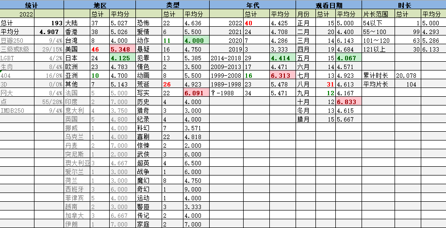
壬寅年是平年，全年354天。
共观影193部，比去年减少28部，减少12.7%。神奇地完成了去年制定的观影数降到200以下的目标。
目标的达成有多方面的因素：农历八月，因为疫情而产生了长达三周的居家办公。以我一向摸鱼的作风，几乎每个上午都会刷上一两部电影。所以八月刷了31部电影，评分却只有可怜的4.61，就觉得很没意思。接下来的十一假期，突然重拾起了对游戏的热情，看片的时间自然被挤占了。另一方面，本来上半年是攒了一些无脑片，准备在世界杯场间休息的一个小时里刷的。但是，本届世界杯我就只有两个比赛日是连续看了两场，那些血呼刺啦的存货根本就没用上。

结果就是，八月观影数量最多，有31部。后四个月观影数都比较少，腊月稍多一点因为多了一个周末。

平均分4.90，比去年降了0.41，是开始记录以来的最低值。刷的烂片确实有点多。

今年有1部满分作品——《蓝风筝》这部老禁片终于被我想起并找到了资源。确实很好，令人浮想联翩。
今年有7部9分作品。其中6部都是名声在外，不需多提。单独表扬一下《克里斯托弗·罗宾》这部迪士尼动画加真人电影。虽然我并不感冒真人加动画的型式，但维尼和孩子的眼神真的戳中了中年人的内心。
今年有2部0分作品。其中南桐版《红楼梦》实在是引起了浑身上下的不适。另一部《钢铁少女：决战》则是利用明日花的名气骗钱。

在电影院看了两部电影。分别是五一期间孩子点名要看的《这个杀手不太冷静》和元旦老婆孩子杨康以后看的《阿凡达2》。都是挺俗套的片子，不过阿凡达2画面华丽，还是值回票价的。

从年代分布来看，最多的是当年产的2022新片。疫情三年的片子占了37%，但这三年的好片真是太太太有限了。
另外一个大头是上世纪的老片子，占了30%。这部分以国产片为主，因为摸鱼时间还是用听的比重大一些。
1999-2008年段的评分最高，得益于刷的名作大多处于这个期间段。
而2014-2018年段的评分最低，有很多是无脑看名字搞下来的片。

在秋天结束的时候，看了一眼统计数据，平均分只有4.2不到。所以冬天开始特意刷了一些名声在外的作品对冲，刷了9部豆瓣250和9部IMDB250。皆是有统计以来的最高纪录。
两榜都有的作品有4部。包括两部诺兰版《蝙蝠侠》、《低俗小说》和《卢旺达饭店》。都是好片，但除了《低俗小说》外也没那么对胃口。

豆瓣没有记录的作品16部，只是去年的一半。这玩意儿的存货确实不太多了。
R级作品只有29部，差不多是去年的一半。可露点作品的数量差距并没有R级差得那么多，这说明啥？我看了很多未分级作品呗。

150分钟以上的作品看了6部。大多是刷名作的产物。似乎大导演都缺少对时长的把握能力。最长的片子不是电影院里看得膀胱肿胀的《阿凡达2》，而是《泰坦尼克号》出世前好莱坞最出名的特效大片《宾虚》，长达222分钟。但这部片子一点也不憋的原因是转场字幕时间太长像卡碟了一样，不光有充足的时间嘘嘘，甚至还能抖上好几抖。
片长最短的是法国电影《马肉》。并没有传说中那么偏门，猎奇性非常一般。

地区分布上看，美国电影数量时隔3年后重回榜首，其次是大陆片和港片。从港片萎靡的状况看，以后产量必将越来越少。
本年度日本片得分最低，因为实在是出于猎奇心理下了好几部平平无奇的片，以及几部非常失败的漫改。

电影地区版图，拓展了乌克兰、突尼斯、菲律宾和名声在外的伊朗。乌克兰的记录片不如说是宣传片；突尼斯片就是白开水；而伊朗电影反映女性生存状况，跟国内的禁片异曲同工。
重点说一下菲律宾。今年看了5部菲律宾大电影。其风格有点像九十年代的王晶出品的三级片，而尺度更大。总体评分虽然不高，但看的时候可一点儿不觉得闷。感兴趣的可以搜一下VIVA这家菲律宾电影公司的所有作品。

从类型分布来看，今年度各种类型分布非常平均。动作片又一次荣膺评分最低类型。我是真挑，它也是真渣。

本年度的特别推荐是名字非常古怪的《一场很（没）有必要的春晚》。本片用伪纪录片的形式，嘲讽了春晚这个怪物的方方面面。满口辽北口音的胡逼咧咧教授直接把效果拉满。剩下各种混乱和应付以及形式主义和无奈，都成功地反衬出春晚的无用。另外它更是一部很好的职场反面指南——最大问题就是团队的领导。把不适合的人安排在重要的位置（肖典滴管灯光）、工作能力强的人得不到提拔（赵补拙和实习生）、提出的目标没有考评也没有落实到人（钱木柚的海报设计、魔术道具桌子）、以及不负责任（请来的导演丢了抱怨两句就完全不管了，纪录片跟拍团队却始终在跟他打交道。）。还有低效的会议、被赞助商拿捏、没有预案等等，绝对接地气。完全不是那些庙堂之上的编导能搞出来的本子。
当然本片离完美还相去甚远——用梗太老（比如埃菲尔铁塔看春晚、藏头诗、鲁迅）、穷（布景尤其是外景太粗糙）、剪辑轻重不分（海选部分尤其拖沓）都影响了它更进一步。

明年没什么目标。

## 详情

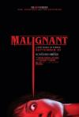

[致命感应](https://pewae.com/gaan/aHR0cHM6Ly9tb3ZpZS5kb3ViYW4uY29tL3N1YmplY3QvMjU5MDkyMzYv)

原名：Malignant导演：温子仁主演：克里斯蒂安·克莱门松 / 吴宇卫 / 安娜贝拉·沃丽丝 / 杰克·阿贝尔 / 杰奎琳·麦根斯 / 珍·路易莎·凯利 / 米歇尔·沃特 / 苏珊娜·汤姆森 / 麦肯娜·格瑞丝 / 麦蒂·哈森类型：恐怖 / 悬疑地区：美国首映时间：2021

脑袋后面长脑袋，反关节动作戏非常酷。
但是最后的good ending实在太主旋律了。

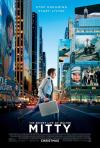

[白日梦想家](https://pewae.com/gaan/aHR0cHM6Ly9tb3ZpZS5kb3ViYW4uY29tL3N1YmplY3QvMjEzMzMyMy8=)

原名：The Secret Life of Walter Mitty导演：本·斯蒂勒主演：乔伊·斯洛特尼克 / 乔恩·戴利 / 亚当·斯科特 / 保罗·菲兹杰拉德 / 克里斯汀·韦格 / 凯瑟琳·哈恩 / 本·斯蒂勒 / 格蕾丝·雷克斯 / 泰伦斯·伯尼·海恩斯 / 西恩·潘类型：冒险 / 剧情 / 喜剧地区：美国首映时间：2013

鸡汤味儿太浓。
爱做白日梦这个设定，感觉对剧情毫无帮助，徒增电影的无效时长。
冰岛和格陵兰，不愧是起错名字的两个岛。

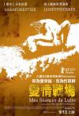

[爱情战争](https://pewae.com/gaan/aHR0cHM6Ly9tb3ZpZS5kb3ViYW4uY29tL3N1YmplY3QvMjA2NDQ5MjMv)

原名：Mes séances de lutte导演：雅克·杜瓦隆主演：莎拉·弗里斯蒂 / 詹姆斯·提瑞类型：剧情地区：法国首映时间：2013

女主角难道是练体操出身？这柔韧度绝了。
一场泥水中的激战，看得人浑身难受性趣全无。
看得似懂非懂。

[调音师](https://pewae.com/gaan/aHR0cHM6Ly9tb3ZpZS5kb3ViYW4uY29tL3N1YmplY3QvMzAzMzQwNzMv)

原名：Andhadhun导演：斯里兰姆·拉格万主演：塔布 / 安尔·德霍万 / 拉什米·阿格德卡 / 拉迪卡·艾普特 / 查亚·卡达姆 / 莫希尼·凯瓦拉曼 / 萨基尔·侯赛因 / 阿什维尼·卡尔塞卡 / 阿尤斯曼·库拉纳 / 马纳夫·维吉类型：喜剧 / 悬疑 / 惊悚 / 犯罪地区：印度首映时间：2019

悬疑程度刚刚好，让观众获得智商上的满足感。
音乐出色，不止是钢琴曲，还包括里面的印度歌。
没有好人的设定还是讨喜的。

[爱情神话](https://pewae.com/gaan/aHR0cHM6Ly9tb3ZpZS5kb3ViYW4uY29tL3N1YmplY3QvMzUzNzY0NTcv)

导演：邵艺辉主演：倪虹洁 / 吴冕 / 吴越 / 周野芒 / 宁理 / 张芝华 / 徐峥 / 王影璐 / 马伊琍 / 黄明昊类型：剧情 / 喜剧 / 爱情地区：大陆首映时间：2021

别有风情的中年人的故事，上海话非常出彩。
倪虹洁和周野芒两位配角非常棒。
看好这位女导演，接地气。

[误杀2](https://pewae.com/gaan/aHR0cHM6Ly9tb3ZpZS5kb3ViYW4uY29tL3N1YmplY3QvMzUwNjg2NTMv)

导演：戴墨主演：任达华 / 姜皓文 / 宋洋 / 尹子维 / 张世 / 文咏珊 / 李治廷 / 肖央 / 陈昊 / 陈雨锶类型：剧情 / 犯罪地区：大陆首映时间：2021

最大的感受是啰嗦，明明88分钟能搞定的故事非要拖到118分钟。
肖央你就不能换个国家祸祸，每次坏事都赖在泰国头上……
基本谈不上悬疑可言，误杀二字有强行蹭前作热度的嫌疑。

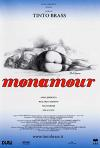

[奸情](https://pewae.com/gaan/aHR0cHM6Ly93d3cuaW1kYi5jb20vdGl0bGUvdHQwNDgwOTE5Lw==)

原名：Monamour导演：丁度·班德拉斯主演：anna jimskaia / max parodi / riccardo marino类型：剧情地区：意大利首映时间：2005

丁度是世界上最会拍屁股的导演。
女主角是个毛妹，身材好到爆炸。
剧情比较拉垮，就是一般套路小黄文。

[倚天屠龙记之九阳神功](https://pewae.com/gaan/aHR0cHM6Ly9tb3ZpZS5kb3ViYW4uY29tL3N1YmplY3QvMjcxNzMyMjcv)

导演：姜国民 / 王晶主演：云千千 / 古天乐 / 徐锦江 / 文咏珊 / 方中信 / 林峯 / 梁琤 / 甄子丹 / 邱意浓 / 黄浩然类型：动作 / 古装 / 武侠地区：香港首映时间：2022

论不要脸，王晶是独一档的。
云千千妆一化上，真有点破产版关之琳的味道。
香港艺术家们为了养家糊口实在是一言难尽。

[变种动物园](https://pewae.com/gaan/aHR0cHM6Ly9tb3ZpZS5kb3ViYW4uY29tL3N1YmplY3QvMzUyMDY0MTgv)

原名：Cryptozoo导演：达什·肖主演：Irene Muscara / 亚历克斯·卡普夫斯基 / 佐伊·卡赞 / 彼得·斯特曼 / 昂格利基·帕普利亚 / 格蕾丝·扎布里斯基 / 汤姆斯·杰·瑞恩 / 蕾克·贝尔 / 路易莎·克劳瑟 / 迈克尔·塞拉类型：动画地区：美国首映时间：2021

画风比较上头，但镜头牛逼，调教得很棒的成人动画片。
巧取和豪夺殊途同归，但并未深入，只是用嬉皮士的风格表现了出来。
怪物们的战斗力被严重削弱了。

[倚天屠龙记之圣火雄风](https://pewae.com/gaan/aHR0cHM6Ly9tb3ZpZS5kb3ViYW4uY29tL3N1YmplY3QvMzU3MjU4MjUv)

导演：姜国民 / 王晶主演：云千千 / 徐锦江 / 文咏珊 / 方中信 / 林子聪 / 林峯 / 梁琤 / 邱意浓 / 骆应钧 / 黄浩然类型：动作 / 古装 / 武侠地区：大陆首映时间：2022

这部下集比上集更磕碜，场景缩减到只有五六处，并且剪了个稀碎。
大段的特技打斗简直是在浪费时间。
邱意浓这种无法有效管理表情的人是怎么勾搭上王晶的？

[平安夜](https://pewae.com/gaan/aHR0cHM6Ly9tb3ZpZS5kb3ViYW4uY29tL3N1YmplY3QvMzQ5NTE2MTcv)

原名：Silent Night导演：卡米尔·格里芬主演：凯拉·奈特莉 / 安娜贝拉·沃丽丝 / 柯尔比·豪威尔-巴普蒂斯特 / 楚蒂·斯泰勒 / 索佩·迪瑞苏 / 罗曼·格里芬·戴维斯 / 莉莉-罗丝·德普 / 霍莉·艾尔德 / 露茜·彭奇 / 马修·古迪类型：剧情 / 喜剧 / 恐怖地区：英国首映时间：2021

创意尚可，拍得稀烂，无聊的镜头太多。
一开始血滴胡萝卜的含义究竟是啥啊？
黑人女同没得什么好，也没看出来是为了政治正确还是反讽。

[猎魔人：狼之噩梦](https://pewae.com/gaan/aHR0cHM6Ly9tb3ZpZS5kb3ViYW4uY29tL3N1YmplY3QvMzQ5NTU5MDkv)

原名：The Witcher: Nightmare of the Wolf导演：Kwang Il Han主演：劳拉·普沃 / 格拉汉姆·麦克泰维什 / 玛丽·麦克唐纳 / 西奥·詹姆斯类型：动作 / 动画 / 奇幻地区：美国首映时间：2021

平淡如白开水。

[盲视](https://pewae.com/gaan/aHR0cHM6Ly9tb3ZpZS5kb3ViYW4uY29tL3N1YmplY3QvMjU3ODUxMjQv)

原名：Blind导演：埃斯基尔·沃格特主演：isak nikolai møller / jacob young / Marius Kolbenstvedt / nikki butenschøn / stella kvam young / 亨瑞克·拉斐尔森 / 艾伦·多丽特·彼得森 / 薇拉·维塔利类型：剧情地区：挪威首映时间：2014

一切都是基于想象，那电影还拍个什么劲儿啊。
镜头切换很有味道，配乐也相当不错。

[它在身后](https://pewae.com/gaan/aHR0cHM6Ly9tb3ZpZS5kb3ViYW4uY29tL3N1YmplY3QvMjU4NzA0ODMv)

原名：It Follows导演：大卫·罗伯特·米切尔主演：丹尼尔·祖瓦图 / 凯尔·吉克瑞斯特 / 奥莉维亚·卢卡尔迪 / 杰克·威利 / 莉莉·塞佩 / 麦卡·梦露类型：恐怖 / 悬疑地区：美国首映时间：2015

氛围还行。
演员和拍摄技术非常一般。
正常人被诅咒的反应应该是赶紧来一发吧。

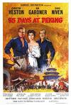

[北京55日](https://pewae.com/gaan/aHR0cHM6Ly93d3cuaW1kYi5jb20vdGl0bGUvdHQwMDU2ODAwLw==)

原名：55 Days at Peking导演：安德鲁·马顿 / 尼古拉斯·雷 / 盖伊·格林主演：大卫·尼文 / 查尔登·海斯顿 / 艾娃·加德纳类型：冒险 / 剧情 / 动作地区：美国首映时间：1963

角度非常诡异，讲的是一帮人在东郊民巷苦苦抵抗义和团暴民，终于等到八国援军的故事。
1700万美元的投资在当年可谓鸿篇巨制，起码搭的那个前门楼子足以乱真，但是所有主演都不是中国人，甚至不是亚裔，以至于观感非常隔应。
女主角竟然是个沙俄女伯爵，这就很恶心了，专挑跟代清仇最大的来是吧。

[色欲之死4](https://pewae.com/gaan/aHR0cHM6Ly9tb3ZpZS5kb3ViYW4uY29tL3N1YmplY3QvMjU5ODYxNjcv)

原名：Rape Zombie: Lust of the Dead 4导演：友松直之主演：亚纱美 / 桃葉 / 相川优衣 / 藤浦惠类型：奇幻 / 恐怖 / 惊悚地区：日本首映时间：2014

开场亚纱美的分身光膀子杀还比较有趣。
嗓子眼儿接录音机也可谓是好创意。
但是整体上就很散。

[色欲之死5](https://pewae.com/gaan/aHR0cHM6Ly9tb3ZpZS5kb3ViYW4uY29tL3N1YmplY3QvMjU5MzQwODQv)

原名：Rape Zombie: Lust of the Dead 5导演：友松直之主演：めぐり / ももは / 中沢健 / 亚纱美 / 小司あん / 希咲あや / 文月 / 相川优衣 / 若林美保 / 衣緒菜类型：奇幻 / 恐怖 / 惊悚地区：日本首映时间：2014

前面几部的重剪和补拍，完全失去了存在的意义。

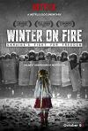

[凛冬烈火：乌克兰为自由而战](https://pewae.com/gaan/aHR0cHM6Ly93d3cuaW1kYi5jb20vdGl0bGUvdHQ0OTA4NjQ0)

原名：Winter on Fire: Ukraine's Fight for Freedom导演：evgeny afineevsky主演：bishop agapit / catherine ashton / serhii averchenko类型：纪录地区：乌克兰首映时间：2015

讲的是乌克兰人民抵制前政府的故事，被禁可以算是躺枪。
片子本身不算好，深度不行，10分钟以后就只是一遍一遍重复开头那一点点玩意儿。
倒是能理解为什么乌克兰人后来选了一个喜剧演员当总统。

[恶胎](https://pewae.com/gaan/aHR0cHM6Ly9tb3ZpZS5kb3ViYW4uY29tL3N1YmplY3QvNTE1NTMyNS8=)

导演：罗守耀主演：区轩玮 / 卢颂之 / 吕慧仪 / 周秀娜 / 林雪 / 谷祖琳 / 邵美琪 / 黎诺懿类型：恐怖地区：香港首映时间：2010

整体调度稍乱，但以近些年港片的标准要求还算及格。
林雪和那个妇产科医生的死法设计得都挺好。
结局比较烂。

[女佣机器人VS男招待机器人军团](https://pewae.com/gaan/aHR0cHM6Ly9tb3ZpZS5kb3ViYW4uY29tL3N1YmplY3QvMjU3NjY3Mzgv)

原名：Maidroid 2: Maidroid vs. Hostroids导演：友松直之主演：亚纱美 / 吉泽明步类型：剧情地区：日本首映时间：2010

吉泽明步拍这片图啥啊，低劣的化妆令自己显得又老又黑。

[超级无敌追女仔II之狗仔雄心](https://pewae.com/gaan/aHR0cHM6Ly9tb3ZpZS5kb3ViYW4uY29tL3N1YmplY3QvMzIxMTAxOC8=)

导演：曹建南主演：关秀媚 / 吴家乐 / 吴辰君 / 张慧仪 / 张文慈 / 张锦程 / 杨恭如 / 谷德昭 / 陈百祥 / 雷宇扬类型：喜剧 / 爱情地区：香港首映时间：1997

烂梗太多，但是一些政治笑话还挺出位的，可惜现在是看不到了。
肆意调侃黎胖子、郑伊健和梁咏琪。
捧不红的杨恭如。

[狗镇](https://pewae.com/gaan/aHR0cHM6Ly9tb3ZpZS5kb3ViYW4uY29tL3N1YmplY3QvMTI5ODc1OS8=)

原名：Dogville导演：拉斯·冯·提尔主演：保罗·贝坦尼 / 劳伦·白考尔 / 哈里特·安德森 / 妮可·基德曼 / 希博汗·法隆 / 杰瑞米·戴维斯 / 汤姆·霍夫曼 / 派翠西娅·克拉克森 / 菲利普·贝克·霍尔 / 詹姆斯·肯恩类型：剧情 / 悬疑 / 惊悚地区：丹麦首映时间：2003

集体意志的邪恶。
妮可基德曼的颜值巅峰，长在我的审美上。
旁白有些煞风景。

[死亡性服务](https://pewae.com/gaan/aHR0cHM6Ly9tb3ZpZS5kb3ViYW4uY29tL3N1YmplY3QvMjY2MTc0MTYv)

原名：Death-Scort Service导演：Sean Donohue主演：amethist young / ashley lynn caputo / bailey paige / cayt feinics / geneva whitmore / krystal pixie adams / racheal shaw / sean donohue类型：恐怖地区：美国首映时间：2015

没必要找那么多女演员，死法过于雷同，缺乏刺激点。
即使在B级片里也算非常简陋。
往一起拼器官那块儿还挺有趣的。

[爱的成人式](https://pewae.com/gaan/aHR0cHM6Ly9tb3ZpZS5kb3ViYW4uY29tL3N1YmplY3QvMjYxNDA0MDUv)

原名：イニシエーション・ラブ导演：堤幸彦主演：三浦贵大 / 前田敦子 / 前野朋哉 / 吉谷彩子 / 大西礼芳 / 木村文乃 / 松浦雅 / 松田翔太 / 森冈龙 / 矢野圣人类型：剧情 / 悬疑 / 爱情地区：日本首映时间：2015

故事的前半部分非常平庸，结局的反转也不意外。
出片尾时的80年代老照片非常棒。
也不能算爱情片，生活常态吧。

[华丽的色情一族](https://pewae.com/gaan/aHR0cHM6Ly93d3cuaW1kYi5jb20vdGl0bGUvdHQxOTQ4NTgxLw==)

原名：Erotibot导演：友松直之主演：亚纱美 / 小泽玛利亚 / 爱音真寻 / 田中靖教 / 福天类型：科幻地区：日本首映时间：2011

万宜天合以外，头回见如此草率的特效。
这个导演太喜欢用片长不够文字来凑这招了。
片中的小泽老师显得特别壮硕。

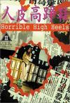

[人皮高跟鞋](https://pewae.com/gaan/aHR0cHM6Ly93d3cuaW1kYi5jb20vdGl0bGUvdHQwMTE3NDY0Lw==)

导演：毛强邦 / 陈威安主演：周玉玲 / 宣彤 / 成奎安 / 林小楼 / 狄威类型：犯罪地区：香港首映时间：1996

胡编乱造但演得还行。
最后忽然强行转场变成枪战片是最大败笔。

[奇爱博士](https://pewae.com/gaan/aHR0cHM6Ly9tb3ZpZS5kb3ViYW4uY29tL3N1YmplY3QvMTMyMjg0OC8=)

原名：Dr. Strangelove or: How I Learned to Stop Worrying and Love the Bomb导演：斯坦利·库布里克主演：乔治·c·斯科特 / 彼得·塞勒斯 / 斯特林·海登 / 格伦·贝克 / 詹姆斯·厄尔·琼斯类型：剧情 / 喜剧 / 战争地区：美国首映时间：1964

只要有决心，世界核平的美好愿望就一定能实现。
利用台词营造出了癫狂的氛围，尤其是美国总统关于“sorry”的那一大段，实在过瘾。
把各种政治势力黑个遍。

[日本之耻](https://pewae.com/gaan/aHR0cHM6Ly9tb3ZpZS5kb3ViYW4uY29tL3N1YmplY3QvMzAyNjM5NDMv)

原名：Japan's Secret Shame导演：埃里卡·詹金主演：伊藤诗织类型：纪录地区：英国首映时间：2018

跟狗东的案子有些神似，东亚国家真是差不多。
纪录片对于很多问题没有深究，就这点儿东西就能够让英国人友邦惊诧了？
女主化妆之后蛮漂亮的，英语也没什么口音。

[潮性办公室](https://pewae.com/gaan/aHR0cHM6Ly9tb3ZpZS5kb3ViYW4uY29tL3N1YmplY3QvNjUxOTUxNC8=)

导演：李公乐 / 詹瑞文主演：吕慧仪 / 杨诗敏 / 沈志明 / 翟凯泰 / 詹瑞文 / 赵彤 / 陈静类型：剧情 / 喜剧地区：香港首映时间：2011

要是一路咸湿到底，虽然无聊倒也有骨气，后半段反转出了个什么鬼东西。
露又不露，脱又不脱，恶心。
什么港味不港味的，还得靠演员啊。

[省港旗兵](https://pewae.com/gaan/aHR0cHM6Ly9tb3ZpZS5kb3ViYW4uY29tL3N1YmplY3QvMTI5Mjg0Ni8=)

导演：麦当雄主演：方烈 / 林国斌 / 林威 / 江龙 / 沈威 / 蓝湘森 / 陈敬 / 黄光亮类型：动作 / 犯罪地区：香港首映时间：1984

难得的好片，匪气和义气交织在一起，正邪难辨。
最后场景落在传说中的九龙城寨，难得。
沈威演的小人物很棒。

[太空异旅](https://pewae.com/gaan/aHR0cHM6Ly9tb3ZpZS5kb3ViYW4uY29tL3N1YmplY3QvMzM0MjYyMTEv)

原名：Voyagers导演：尼尔·博格主演：伊萨克·亨普斯特德-怀特 / 昆泰莎·斯文戴尔 / 泰伊·谢里丹 / 科林·法瑞尔 / 维威克·卡拉 / 胡紫蕊 / 莉莉-罗丝·德普 / 菲恩·怀特海德 / 阿奇·雷诺 / 香缇·亚当斯类型：冒险 / 惊悚 / 科幻地区：美国首映时间：2021

太“硬”且不科幻，就是部政治隐喻片。
德普女儿脸发僵.

[近亲交配](https://pewae.com/gaan/aHR0cHM6Ly9tb3ZpZS5kb3ViYW4uY29tL3N1YmplY3QvNTM4MDkzMC8=)

原名：Inbred导演：Alex Chandon主演：chris waller / james doherty / nadine mulkerrin / terry haywood / 乔·哈特利 / 多米尼克·布伦特 / 尼尔·雷珀 / 西姆斯·奥尼尔 / 詹姆斯·伯罗斯 / 马特·弗雷泽类型：恐怖地区：英国首映时间：2012

普通量产B级片，剧情交不交待都一样。
标题党。

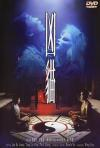

[凶猫](https://pewae.com/gaan/aHR0cHM6Ly9tb3ZpZS5kb3ViYW4uY29tL3N1YmplY3QvMTMwMjY0OC8=)

导演：余允抗主演：刘家良 / 王晶 / 翁世杰 / 邓丽盈 / 郑浩南类型：喜剧 / 奇幻 / 恐怖地区：香港首映时间：1987

翁世杰吃鱼一场戏相当带感。
王晶居然也演得很到位。
缺乏整体性。

[卫斯理之老猫](https://pewae.com/gaan/aHR0cHM6Ly9tb3ZpZS5kb3ViYW4uY29tL3N1YmplY3QvMTQ4NDEzOC8=)

导演：蓝乃才主演：伍咏薇 / 刘兆铭 / 刘锡贤 / 叶蕴仪 / 李子雄类型：恐怖 / 悬疑 / 惊悚 / 科幻地区：香港首映时间：1992

严重的虎头蛇尾，又夹杂了乱七八糟的外星人之类，典型的倪匡风格。
倪匡还亲自下场跑了回龙套。
年轻的伍咏薇。

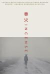

[香火](https://pewae.com/gaan/aHR0cHM6Ly9tb3ZpZS5kb3ViYW4uY29tL3N1YmplY3QvMTc1NDYyOA==)

导演：宁浩主演：李强类型：剧情地区：大陆首映时间：2003

荒诞而又真实的故事，白描了这个礼崩乐坏的时代。
没有体味到多少批判，反倒是一种认命的味道。
求变这不正是时代所鼓励的吗？所以后来的宁浩才能混那么好。

[马肉](https://pewae.com/gaan/aHR0cHM6Ly9tb3ZpZS5kb3ViYW4uY29tL3N1YmplY3QvMzA5NzM3NS8=)

原名：Carne导演：加斯帕·诺主演：blandine lenoir / frankie pain / hélène testud / 菲利普·纳翁 / 露西尔·哈兹哈利洛维奇类型：剧情 / 惊悚地区：法国首映时间：1991

片头字幕过于唬人，并没有多么不适。
比起广为流传的杀马，还是生孩子的镜头更震撼一些。
男主角演技一流。

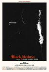

[黑色美杜莎](https://pewae.com/gaan/aHR0cHM6Ly9tb3ZpZS5kb3ViYW4uY29tL3N1YmplY3QvMzUyOTk4MzQv)

原名：Black Medusa导演：尤塞夫·切比类型：剧情 / 惊悚 / 犯罪地区：突尼斯首映时间：2021

难得一部阿拉伯片，但是题材和手法都土得掉渣。

[嘿咻卡](https://pewae.com/gaan/aHR0cHM6Ly9tb3ZpZS5kb3ViYW4uY29tL3N1YmplY3QvMzQwMTc1MS8=)

原名：Hall Pass导演：博比·法雷里 / 彼得·法雷里主演：克里斯蒂娜·艾伯盖特 / 妮基·韦兰 / 布鲁斯·托马斯 / 拉里·乔·坎贝尔 / 斯戴芬·莫昌特 / 杰森·苏戴奇斯 / 欧文·威尔逊 / 泰勒·霍奇林 / 珍娜·费舍 / 理查德·詹金斯类型：喜剧地区：美国首映时间：2011

传统的男女关系擦边球喜剧，不出色。
女的比男的先搞上了多少带点讽刺。
结局无聊，但片尾眼镜兄的彩蛋挺有意思的。

[鬼书](https://pewae.com/gaan/aHR0cHM6Ly9tb3ZpZS5kb3ViYW4uY29tL3N1YmplY3QvMjU3ODU4MTIv)

原名：The Babadook导演：詹妮弗·肯特主演：benjamin winspear / bridget walters / carmel johnson / tiffany lyndall-knight / tony mack / 丹尼尔·亨绍尔 / 克雷格·贝恩娜 / 埃茜·戴维斯 / 海莉·麦克尔希尼 / 诺亚·怀斯曼类型：恐怖 / 惊悚地区：澳大利亚首映时间：2014

题材很好，说的是人和内心的斗争，但拍得比较差。
虽然没有明说，但这本鬼里鬼气的书应该就是孩子妈妈画的。
不用配乐的电影还是比较少见的。

[绣春刀](https://pewae.com/gaan/aHR0cHM6Ly9tb3ZpZS5kb3ViYW4uY29tL3N1YmplY3QvMjQ3NDU1MDAv)

导演：路阳主演：刘诗诗 / 叶青 / 周一围 / 张震 / 朱丹 / 李东学 / 王千源 / 聂远 / 赵立新 / 金士杰类型：剧情 / 动作 / 古装 / 武侠地区：大陆首映时间：2014

动作凌厉，服装也漂亮。
没有什么侠之大者类的屁话，小人物的挣扎表现得很到位。
可惜刘诗诗一张木头脸，扫兴。

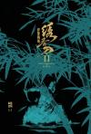

[绣春刀II：修罗战场](https://pewae.com/gaan/aHR0cHM6Ly9tb3ZpZS5kb3ViYW4uY29tL3N1YmplY3QvMjYyNzA1MDIv)

导演：路阳主演：刘端端 / 张译 / 张震 / 李媛 / 杨幂 / 杨轶 / 武强 / 辛芷蕾 / 金士杰 / 雷佳音类型：剧情 / 动作 / 古装 / 武侠地区：大陆首映时间：2017

杨幂的感情线那个分支剧情本来就不讨喜，杨幂演绎得更是堪称灾难，失败他妈给失败开门，失败到家了。
金士杰老师虽然戏不多，但给人印象非常深刻。
高级版的飞鱼服好帅啊。

[蝙蝠侠：侠影之谜](https://pewae.com/gaan/aHR0cHM6Ly9tb3ZpZS5kb3ViYW4uY29tL3N1YmplY3QvMTMwOTA2OS8=)

原名：Batman Begins导演：克里斯托弗·诺兰主演：克里斯蒂安·贝尔 / 凯蒂·霍尔姆斯 / 加里·奥德曼 / 基里安·墨菲 / 小马克·布恩 / 汤姆·威尔金森 / 渡边谦 / 迈克尔·凯恩 / 连姆·尼森 / 鲁特格尔·哈尔类型：剧情 / 动作 / 惊悚 / 犯罪 / 科幻地区：美国首映时间：2005

探讨了人与人的内心、情绪之间的关系，但作为一部商业动作片来说，用得着搞那么多吗？
蝙蝠车帅就完了。

[蝙蝠侠：黑暗骑士](https://pewae.com/gaan/aHR0cHM6Ly9tb3ZpZS5kb3ViYW4uY29tL3N1YmplY3QvMTg1MTg1Ny8=)

原名：The Dark Knight导演：克里斯托弗·诺兰主演：克里斯蒂安·贝尔 / 加里·奥德曼 / 基里安·墨菲 / 希斯·莱杰 / 摩根·弗里曼 / 玛吉·吉伦哈尔 / 罗恩·迪恩 / 艾伦·艾克哈特 / 莫尼克·加布里埃拉·库尔内 / 迈克尔·凯恩类型：剧情 / 动作 / 惊悚 / 犯罪 / 科幻地区：美国首映时间：2008

小丑这个邪恶混乱阵营的家伙总是容易出彩，与蝙蝠侠互相成就。
小丑出场的那段抢银行戏真是太棒了。
但我更喜欢哈维。

[蝙蝠侠：黑暗骑士崛起](https://pewae.com/gaan/aHR0cHM6Ly9tb3ZpZS5kb3ViYW4uY29tL3N1YmplY3QvMzM5NTM3My8=)

原名：The Dark Knight Rises导演：克里斯托弗·诺兰主演：乔什·平茨 / 克里斯蒂安·贝尔 / 加里·奥德曼 / 安妮·海瑟薇 / 摩根·弗里曼 / 朱诺·坦普尔 / 汤姆·哈迪 / 玛丽昂·歌迪亚 / 约瑟夫·高登-莱维特 / 迈克尔·凯恩类型：剧情 / 动作 / 惊悚 / 犯罪 / 科幻地区：美国首映时间：2012

猫女那条线可惜了。
如果到蘑菇云那里戛然而止，就不失为一部好片，可惜，再后面都是废剧情。
革命的真相很残酷。

[2001个疯子](https://pewae.com/gaan/aHR0cHM6Ly9tb3ZpZS5kb3ViYW4uY29tL3N1YmplY3QvMTc1Njc0MC8=)

原名：2001 Maniacs导演：蒂姆·沙利文主演：杰赛普·安德鲁斯 / 林·沙烨 / 罗伯特·英格兰德类型：喜剧 / 恐怖地区：美国首映时间：2005

类型片中算很好的，血肉到位，节奏明快。
钢牙女在日本片里出现过，记不得哪个更早了，不知是否有互相“借鉴”。
一部影片同时得罪了南方人、黑人、中国人、男同、女同，堪称作大死。

[继续跳舞](https://pewae.com/gaan/aHR0cHM6Ly9tb3ZpZS5kb3ViYW4uY29tL3N1YmplY3QvMTMwMTMwMy8=)

导演：梁普智 / 甘国亮主演：周文健 / 孟海 / 林建明 / 繆騫人 / 黄霑类型：喜剧地区：香港首映时间：1988

文艺女神演喜剧有些紧绷，全片缺乏整体性，想到哪拍到哪。
最后扣题扣得莫名其妙。

[这个杀手不太冷静](https://pewae.com/gaan/aHR0cHM6Ly9tb3ZpZS5kb3ViYW4uY29tL3N1YmplY3QvMzU1MDUxMDAv)

导演：邢文雄主演：周大勇 / 孙贵权 / 艾伦 / 许猛 / 陈明昊 / 韩笑 / 马丽 / 高海宝 / 魏翔 / 黄才伦类型：喜剧地区：大陆首映时间：2022

开心麻花近年来难得的诚意作品，总体中规中矩。
开头挺好，中间小胡子上位后开始跑偏，好在最后又给拉了回来。
魏翔放不开，马丽老了。

[色情男女](https://pewae.com/gaan/aHR0cHM6Ly93d3cuaW1kYi5jb20vdGl0bGUvdHQwMTE3NTc1Lw==)

导演：尔冬升 / 罗志良主演：丁子峻 / 刘青云 / 张国荣 / 敖志君 / 秦沛 / 罗家英 / 舒淇 / 莫文蔚 / 黄秋生类型：剧情 / 喜剧地区：香港首映时间：1996

关于理想与现实冲突的小故事，真没必要拍得这么咸湿。
舒淇确实是天才演员，无论穿不穿衣服表现都那么洒脱，当然她的胸形更洒脱。
莫文蔚的白色内裤配长腿也非常养眼。

[台风俱乐部](https://pewae.com/gaan/aHR0cHM6Ly9tb3ZpZS5kb3ViYW4uY29tL3N1YmplY3QvMTI5Njc5OC8=)

原名：Typhoon Club导演：相米慎二主演：三上祐一 / 三浦友和 / 伊达三郎 / 佐藤允 / 大西结花 / 寺田农 / 尾美利德 / 工藤夕贵 / 松永敏行 / 红林茂类型：剧情 / 爱情地区：日本首映时间：1985

老话题，关于青春期的躁动，年轻演员过于夸张。
中日电影里表现少女总喜欢用白色内衣。
不停踹门那场戏不错。

[#PTGF出租女友](https://pewae.com/gaan/aHR0cHM6Ly9tb3ZpZS5kb3ViYW4uY29tL3N1YmplY3QvMzAyMTc0NTAv)

导演：鄭峰嵐主演：岑珈其 / 张沛乐 / 赵善恒 / 邓月平 / 郭奕芯类型：剧情地区：香港首映时间：2021

香港这些年轻女演员怎么看起来都差不多。
后半部分凌乱。
女主空姐装还不错。

[非洲和尚](https://pewae.com/gaan/aHR0cHM6Ly9tb3ZpZS5kb3ViYW4uY29tL3N1YmplY3QvMTMwMzQwNy8=)

导演：陈会毅主演：历苏 / 吴孟达 / 周星驰 / 林正英 / 陈山河 / 陈龙 / 鲍德熹类型：喜剧 / 奇幻地区：香港首映时间：1991

蹭《上帝也疯狂》热度，全片没一个原创笑点。
周星驰和吴孟达的旁白过多且出戏。

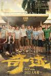

[奇迹·笨小孩](https://pewae.com/gaan/aHR0cHM6Ly9tb3ZpZS5kb3ViYW4uY29tL3N1YmplY3QvMzUzMTI0Mzcv)

导演：文牧野主演：公磊 / 巩金国 / 易烊千玺 / 王宁 / 田壮壮 / 田雨 / 许君聪 / 陈哈琳 / 黄尧 / 齐溪类型：剧情地区：大陆首映时间：2022

传统的卖惨电影，演员被剧本拖累了。
四字只能说不出戏，但是几个配角演得太好了。
结尾完美诠释画蛇添足。

[长津湖之水门桥](https://pewae.com/gaan/aHR0cHM6Ly9tb3ZpZS5kb3ViYW4uY29tL3N1YmplY3QvMzU2MTM4NTMv)

导演：徐克主演：吴京 / 张涵予 / 易烊千玺 / 朱亚文 / 李晨 / 杜淳 / 段奕宏 / 耿乐 / 胡军 / 韩东君类型：剧情 / 历史 / 战争地区：大陆首映时间：2022

从四字弟弟一出场就料定最后他会活着，猜中，失望。
血肉横飞的战场挺带感的。
徐克终究还是把战争片拍成了武侠片。

[蛇蝎夜合花](https://pewae.com/gaan/aHR0cHM6Ly9tb3ZpZS5kb3ViYW4uY29tL3N1YmplY3QvNDk0Mjc1Ni8=)

导演：陈建德主演：伍卫国 / 宫雪花 / 洪欣 / 陈锦鸿 / 黄华和类型：喜剧 / 犯罪地区：香港首映时间：1996

调侃王家卫的片段令人印象深刻。
宫雪花当时就已经很显老了。
洪欣漂亮。

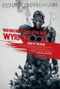

[僵尸来袭](https://pewae.com/gaan/aHR0cHM6Ly9tb3ZpZS5kb3ViYW4uY29tL3N1YmplY3QvMjQ3NDY5NzQv)

原名：Wyrmwood: Road of the Dead导演：凯亚·罗奇-特纳主演：berynn schwerdt / beth aubrey / cain thompson / damian dyke / jay gallagher / leon burchill / luke mckenzie / sheridan harbridge / 基思·阿吉厄斯 / 碧安卡·布雷迪类型：动作 / 恐怖地区：澳大利亚首映时间：2015

僵尸血当燃料是加分项。
女主角有点老。

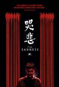

[哭悲](https://pewae.com/gaan/aHR0cHM6Ly93d3cuaW1kYi5jb20vdGl0bGUvdHQxMzg3MjI0OC8=)

导演：贾宥廷主演：朱轩洋 / 王自强 / 蓝苇华 / 蔡昌宪 / 邱彦翔 / 雷嘉纳类型：恐怖地区：台湾首映时间：2021

缺少节奏变化，一种方式拍到死。
类型独特值得鼓励。
男女主角都是生瓜蛋子，唯有变态大叔不错。

[娇妻四艳鬼](https://pewae.com/gaan/aHR0cHM6Ly93d3cuaW1kYi5jb20vdGl0bGUvdHQwMzQ1NTc0Lw==)

导演：方野主演：周弘 / 徐曼华 / 方野 / 曹查理 / 杨泽霖 / 翁世杰 / 钟艳红 / 麦家媚类型：魔幻地区：台湾首映时间：1994

除了肉多再无看点。
曹查理真是敬业。

[假冒女团](https://pewae.com/gaan/aHR0cHM6Ly9tb3ZpZS5kb3ViYW4uY29tL3N1YmplY3QvMzU0OTc4MzYv)

导演：徐梓耀主演：卢瀚霆 / 李静仪 / 林敏骢 / 苏皓儿 / 苏致豪 / 谭耀文 / 陳紫萱类型：喜剧地区：香港首映时间：2021

演员很努力但很丑，尤其是女装的男主。
导演能力太糟糕。

[一个星期四](https://pewae.com/gaan/aHR0cHM6Ly9tb3ZpZS5kb3ViYW4uY29tL3N1YmplY3QvMzU3NzQ3MTkv)

原名：A Thursday导演：毕查德·汉巴塔主演：adi irani / boloram das / kalyanee mulay / maya sarao / sukesh anand / 亚米·高塔姆 / 内哈·迪胡皮阿 / 卡兰维尔·沙尔马 / 迪宝·卡帕蒂娅 / 阿图尔·库尔卡尼类型：剧情 / 惊悚地区：印度首映时间：2022

悬疑的部分很好，但整体有点拖，女警察支线莫名其妙。
印度的漂亮女演员实在太多了。

[大闹广昌隆](https://pewae.com/gaan/aHR0cHM6Ly9tb3ZpZS5kb3ViYW4uY29tL3N1YmplY3QvMTMwNTA1OS8=)

导演：陈果主演：吴大维 / 郑丹瑞 / 陶君薇 / 青山知可子类型：剧情 / 恐怖 / 爱情地区：香港首映时间：1993

青山知可子太顶了，可惜作品太少。
除了一枪爆三头，可以说是很平庸的作品。

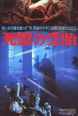

[淫种](https://pewae.com/gaan/aHR0cHM6Ly9tb3ZpZS5kb3ViYW4uY29tL3N1YmplY3QvMzU5NzE5MC8=)

导演：刘满棠主演：夏萍 / 曾庆瑜 / 秦蔚文 / 黄一飞 / 黄锦燊类型：恐怖地区：香港首映时间：1984

某几个镜头还是非常有感觉的，比如鬼胎在肚子里吃人。
剧情过于没有条理。

[恐怖地窖](https://pewae.com/gaan/aHR0cHM6Ly9tb3ZpZS5kb3ViYW4uY29tL3N1YmplY3QvMzUyNTEwNTUv)

原名：The Cellar导演：Brendan Muldowney主演：aaron monaghan / abby fitz / andrew bennett / dylan fitzmaurice brady / marie mullen / michael-david mckernan / tara lee / 伊丽莎·库斯伯特 / 欧文·马肯 / 肖恩·多耶尔类型：恐怖地区：爱尔兰首映时间：2022

实在是太简陋了，而且一大堆数学公式整完就是数数，太失望了。
恐怖氛围不足。

[恶魔录音棚](https://pewae.com/gaan/aHR0cHM6Ly9tb3ZpZS5kb3ViYW4uY29tL3N1YmplY3QvMzU2NTcwNTYv)

原名：Studio 666导演：比利·约翰·麦克唐纳主演：克里斯·夏夫利特 / 内特·孟德尔 / 帕特·斯密尔 / 惠特妮·卡明 / 戴夫·格罗 / 拉米·杰菲 / 杰夫·格尔林 / 泰勒·霍金斯 / 珍娜·奥尔特加 / 莱斯利·格罗斯曼类型：恐怖地区：美国首映时间：2022

魔鬼附体的老套路，毫无新意。

[古董局中局](https://pewae.com/gaan/aHR0cHM6Ly9tb3ZpZS5kb3ViYW4uY29tL3N1YmplY3QvMjY5OTY2MTkv)

导演：郭子健主演：咏梅 / 李现 / 杨新鸣 / 王庆祥 / 葛优 / 赵燕国彰 / 辛芷蕾 / 郭涛 / 阿如那 / 雷佳音类型：冒险 / 剧情 / 悬疑地区：大陆首映时间：2021

剧情乱七八糟，不知是编剧的锅还是剪辑的。
这个李现会演戏吗？
辛芷蕾大气有范儿。

[小猫的故事](https://pewae.com/gaan/aHR0cHM6Ly9tb3ZpZS5kb3ViYW4uY29tL3N1YmplY3QvMTI5NTQwMS8=)

原名：The Adventures of Milo and Otis导演：畑正宪类型：冒险 / 剧情地区：日本首映时间：1986

橘猫的可爱溢出屏幕，虽然摆拍严重却也诚意十足。
75分钟英文版，画外音清晰有趣用词简洁，可以练听力用。
据传拍这个片子死了20多只小猫。

[虎影](https://pewae.com/gaan/aHR0cHM6Ly9tb3ZpZS5kb3ViYW4uY29tL3N1YmplY3QvMjYwMjE5MjIv)

原名：The Ninja War of Torakage导演：西村喜广主演：しいなえいひ / 三元雅芸 / 島津健太郎 / 斋藤工 / 水井真希 / 津田宽治 / 清野菜名 / 石川树 / 芳贺优里亚 / 鸟居美雪类型：动作地区：日本首映时间：2015

故事太平淡。
离开血浆的支持，西村喜广的神奇道具没起到应有的效果。
英姿飒爽的椎名英姬怎么搞成这个样子。

[省港旗兵2：兵分两路](https://pewae.com/gaan/aHR0cHM6Ly9tb3ZpZS5kb3ViYW4uY29tL3N1YmplY3QvMTc4MDQyOC8=)

导演：麦当杰主演：万梓良 / 徐锦江 / 成奎安 / 林国斌 / 王小凤 / 袁日初 / 陈敬类型：动作 / 犯罪地区：香港首映时间：1987

万梓良的卧底演得非常令人心酸。
初出茅庐的徐锦江老师有些公式化，袁日初和林国斌也比较生硬，不如第一部自然。
再见，“啪”。

[尚气与十环传奇](https://pewae.com/gaan/aHR0cHM6Ly9tb3ZpZS5kb3ViYW4uY29tL3N1YmplY3QvMzAzOTQ3OTcv)

原名：Shang-Chi and the Legend of the Ten Rings导演：德斯汀·克里顿主演：元华 / 刘思慕 / 奥卡菲娜 / 安迪·黎 / 弗罗里安·穆特鲁 / 张梦儿 / 本尼迪克特·王 / 杨紫琼 / 梁朝伟 / 陈法拉类型：冒险 / 动作 / 奇幻地区：美国首映时间：2021

刻板生硬，完全不像2021年应该有的作品。

[明智小五郎美女系列：冰柱的美女](https://pewae.com/gaan/aHR0cHM6Ly9tb3ZpZS5kb3ViYW4uY29tL3N1YmplY3QvNDA5OTYxOC8=)

导演：井上梅次主演：三矢歌子 / 五十岚惠 / 天知茂 / 荒井注类型：悬疑地区：日本首映时间：1977

看开头就知道结尾，对于悬疑片来说太致命了。
美女还凑合。

[诡扯](https://pewae.com/gaan/aHR0cHM6Ly9tb3ZpZS5kb3ViYW4uY29tL3N1YmplY3QvMzUyMDYxODYv)

导演：许富翔主演：侯彦西 / 刘冠廷 / 林鹤轩 / 洛可杉 / 白静宜 / 邱彦翔 / 陈以文 / 陈意涵 / 陈柏霖 / 黄尚禾类型：喜剧 / 恐怖地区：台湾首映时间：2021

剧情有些跳，虽然有鬼但完全不恐怖。
穷凶极恶的乡民感觉很棒。

[我唾弃你的坟墓](https://pewae.com/gaan/aHR0cHM6Ly9tb3ZpZS5kb3ViYW4uY29tL3N1YmplY3QvMTI5OTI2NS8=)

原名：I Spit on Your Grave导演：梅尔·扎奇主演：anthony nichols / eron tabor / gunter kleemann / 卡米尔·基顿 / 理查德·佩斯类型：恐怖 / 惊悚地区：美国首映时间：1978

奸杀奸杀，先奸后杀，奸而不杀，必被反杀。

[明智小五郎美女系列3：死刑台的美女](https://pewae.com/gaan/aHR0cHM6Ly9tb3ZpZS5kb3ViYW4uY29tL3N1YmplY3QvMjYzNzMwMTYv)

导演：井上梅次主演：五十岚惠 / 天知茂 / 松原智惠子 / 稲垣美穂子类型：悬疑地区：日本首映时间：1978

对于看过一千多集柯南的我来说，1978年的这个系列实在毫无悬念可言。
女反派颜值很高。

[X](https://pewae.com/gaan/aHR0cHM6Ly9tb3ZpZS5kb3ViYW4uY29tL3N1YmplY3QvMzUyNDA5MjAv)

导演：缇·威斯特主演：卡迪小子 / 史蒂芬·乌瑞 / 吉奥夫·多兰 / 布兰特妮·斯诺 / 欧文·坎贝尔 / 珍娜·奥尔特加 / 米娅·高斯 / 西蒙·普拉斯特 / 詹姆斯·盖林 / 马丁·亨德森类型：恐怖地区：美国首映时间：2022

从拍A片这个角度开始实在不新鲜，前面铺垫也忒长了些。
猎杀者是耄耋老头老太确实有特色。
鳄鱼第一次出场落空，好评。

[山狗](https://pewae.com/gaan/aHR0cHM6Ly9tb3ZpZS5kb3ViYW4uY29tL3N1YmplY3QvMTk4MjA0MS8=)

导演：余允抗主演：庄静而 / 王青 / 艾迪 / 郑则仕 / 钟保罗 / 陈星类型：恐怖 / 惊悚地区：香港首映时间：1980

以当时的年代来讲非常的前卫，虽然剧情是不入流的被杀+复仇模式。
这种剧情搬到香港就是扯，香港屁大的地方，哪来这种无法无天的乡村。
陈星有些木讷。

[怪物先生](https://pewae.com/gaan/aHR0cHM6Ly9tb3ZpZS5kb3ViYW4uY29tL3N1YmplY3QvMzAxNTA3Mjcv)

导演：黄智亨主演：乔杉 / 余文乐 / 惠英红 / 春夏 / 杨迪 / 涂们 / 王真儿 / 王雨甜类型：冒险 / 动作 / 奇幻地区：香港首映时间：2020

剧情空洞乏味，导演没有调动情绪的能力。
除了春夏的俩大眼珠子一无所获。
标题字体好评。

[生人勿近之问米](https://pewae.com/gaan/aHR0cHM6Ly9tb3ZpZS5kb3ViYW4uY29tL3N1YmplY3QvMTQ3OTkzNC8=)

导演：郑伟文主演：尹天照 / 张文慈 / 朱茵 / 罗兰 / 苑琼丹 / 钱嘉乐 / 雷宇扬类型：恐怖地区：香港首映时间：1999

剧情俗套，罗兰撑场。

[沙子怪物](https://pewae.com/gaan/aHR0cHM6Ly9tb3ZpZS5kb3ViYW4uY29tL3N1YmplY3QvMjY2NDM2MjMv)

原名：The Sand导演：isaac gabaeff主演：brooke butler / bryan billy boone / hector david jr· / meagan holder / 克利奥·贝里 / 妮琪·李 / 杰米·肯尼迪 / 米切尔·莫索 / 辛西娅·莫瑞尔 / 迪恩·盖耶类型：恐怖 / 科幻地区：美国首映时间：2015

开始想法还不错，想表现所有人智商在线但没表现出来。
起码有胸还不赖。

[高校教师·成熟](https://pewae.com/gaan/aHR0cHM6Ly93d3cuaW1kYi5jb20vdGl0bGUvdHQwMjg2NzYz)

原名：High School Teacher: Maturing导演：shôgorô nishimura主演：jôji nakata / rei akasaka / ryoko watanabe类型：剧情地区：日本首映时间：1985

女艺术家身材尚可。
全片缺少逻辑。

[少女日记](https://pewae.com/gaan/aHR0cHM6Ly9tb3ZpZS5kb3ViYW4uY29tL3N1YmplY3QvMjU3NTcwNjEv)

原名：The Diary of a Teenage Girl导演：玛丽埃尔·海勒主演：亚历山大·斯卡斯加德 / 克里斯托弗·米洛尼 / 克里斯汀·韦格 / 奎因·纳格 / 奥斯汀·利昂 / 玛德琳·沃特斯 / 玛格丽塔·列维耶娃 / 约翰·帕森斯 / 艾比·韦特 / 蓓尔·波利类型：剧情地区：美国首映时间：2015

女主角太丑了。
乏善可陈。

[东北告别天团](https://pewae.com/gaan/aHR0cHM6Ly9tb3ZpZS5kb3ViYW4uY29tL3N1YmplY3QvMzU4NzE3Njcv)

导演：崔志佳主演：于洋 / 刁彪 / 孙越 / 宋晓峰 / 崔志佳 / 张琪 / 李昆鹰 / 梁龙 / 老四 / 赵海燕类型：喜剧地区：大陆首映时间：2022

佳佳把新导演的典型错误都犯了一遍，最大的问题是不懂做减法。
剪辑没轻没重的，极差。
宋晓峰大长脸等本山门下弟子身上匪气太重了。

[飞跃羚羊](https://pewae.com/gaan/aHR0cHM6Ly9tb3ZpZS5kb3ViYW4uY29tL3N1YmplY3QvMTI5OTEzNy8=)

导演：郑则仕主演：罗明珠 / 袁洁莹 / 郑则仕 / 郑文雅 / 黎姿类型：动作地区：香港首映时间：1986

体育题材中的田径题材，罕见中的罕见。
十来岁黑黢黢的黎姿虽然是每人胚子，但明显不如袁洁莹。
表现力太普通，掺杂了好多废剧情。

[破处](https://pewae.com/gaan/aHR0cHM6Ly9tb3ZpZS5kb3ViYW4uY29tL3N1YmplY3QvMzUwMjg5MDMv)

导演：林立书主演：吴肇轩 / 庄承梅 / 曾珮瑜 / 李千那 / 杨懿轩 / 纳豆 / 郭文颐 / 陈冠廷 / 马念先类型：喜剧地区：台湾首映时间：2020

本子还算有想法，演员和导演都很烂。

[打工狂想曲](https://pewae.com/gaan/aHR0cHM6Ly9tb3ZpZS5kb3ViYW4uY29tL3N1YmplY3QvMzIxMTMyMy8=)

导演：钱永强主演：刘以达 / 尔冬升 / 杜德伟 / 林保怡 / 林忆莲 / 王祖贤 / 郑浩南 / 郑裕玲类型：喜剧地区：香港首映时间：1989

扒皮许氏兄弟喜剧，一般，主要是郑裕玲和王祖贤的性格塑造有些麻烦。
林忆莲毕竟不是专业的，有些带不动。
王祖贤的口音有点儿意思。

[阿拉克涅的虫笼](https://pewae.com/gaan/aHR0cHM6Ly9tb3ZpZS5kb3ViYW4uY29tL3N1YmplY3QvMjcwNzI3Mjgv)

原名：Aragne: Sign of Vermillion导演：坂本サク主演：伊藤陽佑 / 巴多利胜悟 / 片山福十郎 / 白本彩奈 / 福井裕佳梨 / 花泽香菜类型：剧情 / 动画 / 恐怖 / 惊悚地区：日本首映时间：2018

无聊。

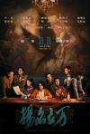

[扬名立万](https://pewae.com/gaan/aHR0cHM6Ly9tb3ZpZS5kb3ViYW4uY29tL3N1YmplY3QvMzU0MjI4MDcv)

导演：刘循子墨主演：余皑磊 / 喻恩泰 / 尹正 / 张本煜 / 杨皓宇 / 柯达 / 秦霄贤 / 邓家佳 / 邓恩熙 / 陈明昊类型：剧情 / 喜剧 / 悬疑地区：大陆首映时间：2021

舞台感过于强烈，悬念不太足，演员整体在线。
大量对过去名片致敬的私货台词。
秦霄贤太差了，德云社里郭德纲的徒子徒孙就没一个会演戏的。

[智齿](https://pewae.com/gaan/aHR0cHM6Ly9tb3ZpZS5kb3ViYW4uY29tL3N1YmplY3QvMjcxMjQ2OTUv)

导演：郑保瑞主演：刘雅瑟 / 吴岱融 / 廖子妤 / 李淳 / 林家栋 / 林晓彤 / 池内博之 / 沈震轩 / 苏宸褕 / 陈汉娜类型：悬疑 / 犯罪地区：香港首映时间：2021

演员出色，导演调度也好，只是故事太过于平淡了。
片名太肤浅。
女主角刘雅瑟的眼神戏很出色。

[肉罢不能](https://pewae.com/gaan/aHR0cHM6Ly9tb3ZpZS5kb3ViYW4uY29tL3N1YmplY3QvMzUzODQyODkv)

原名：Some Like It Rare导演：法布里斯·厄布埃主演：alexia chardard / franck migeon / lisa do couto texeira / nicolas lumbreras / stéphane soo mongo / 法布里斯·厄布埃 / 玛琳娜·佛伊丝 / 维克多·梅特莱特 / 维尔日妮·奥克 / 让-弗朗索瓦·凯雷类型：喜剧 / 恐怖地区：法国首映时间：2021

调侃各种政治正确，血腥而又快乐。
主角女儿的素食者男朋友真的好欠揍啊。
砍黑人把刀砍断了，这编剧也太欠揍了，最后甚至把战火烧到中国人身上。

[少女情怀总是诗](https://pewae.com/gaan/aHR0cHM6Ly9tb3ZpZS5kb3ViYW4uY29tL3N1YmplY3QvMTMwMTM3NC8=)

原名：Bilitis导演：大卫·汉密尔顿主演：irka bochenko / 帕蒂·达班维尔 / 贝纳·纪欧多类型：剧情 / 情色 / 爱情地区：法国首映时间：1977

画面每一帧构图都很精美，音乐也非常动听。
只是完全无法理解所谓的少女心。
抢男朋友的部分倒挺有意思的。

[午夜少女大战](https://pewae.com/gaan/aHR0cHM6Ly9tb3ZpZS5kb3ViYW4uY29tL3N1YmplY3QvMzU0MDAwMzcv)

原名：Mayonaka otome sensô导演：二宫健主演：柄本佑 / 永濑廉 / 池田依来沙 / 渡边真起子类型：剧情地区：日本首映时间：2022

无聊到连池田依来沙都面目可憎起来。

[红色角落](https://pewae.com/gaan/aHR0cHM6Ly93d3cuaW1kYi5jb20vdGl0bGUvdHQwMTE5OTk0Lw==)

原名：Red Corner导演：乔恩·阿维奈主演：50分 / 周采芹 / 孟广美 / 布莱德利·惠特福德 / 文峰 / 理查·基尔 / 白灵类型：剧情 / 惊悚 / 犯罪地区：美国首映时间：1997

99年去校外录像厅看丰田杯，垫场片放的是理查基尔和大嘴演的《诺丁山》，后排一位高年级大姐当时就说，理查基尔不是被封了吗？感情出处在这儿。
该说不说，理查基尔、白灵和孟广美后来谁也没被封杀，长者还是有长者风范的。
为艺术献身的女艺术家之孟广美。

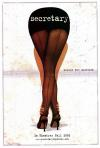

[秘书](https://pewae.com/gaan/aHR0cHM6Ly9tb3ZpZS5kb3ViYW4uY29tL3N1YmplY3QvMTMwNzQ5MC8=)

原名：Secretary导演：史蒂芬·西恩博格主演：lacey kohl / michael mantell / sabrina grdevich / 史蒂芬·麦克哈蒂 / 帕特里克·波查 / 杰瑞米·戴维斯 / 杰西卡·塔克 / 玛吉·吉伦哈尔 / 莱斯莉·安·华伦 / 詹姆斯·斯派德类型：剧情 / 情色 / 爱情地区：美国首映时间：2002

M才是占据主动的一方哦？
整个就是两个变态的爱情故事，没更多看点。
为艺术献身的女艺术家之玛吉·吉伦哈尔。

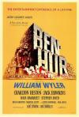

[宾虚](https://pewae.com/gaan/aHR0cHM6Ly9tb3ZpZS5kb3ViYW4uY29tL3N1YmplY3QvMTI5MzE1MC8=)

原名：Ben-Hur导演：威廉·惠勒主演：休·格里夫斯 / 凯茜·奥唐内 / 史蒂芬·博伊德 / 哈雅·哈拉里特 / 安德鲁·莫瑞尔 / 山姆·谢斐 / 杰克·霍金斯 / 查尔顿·赫斯顿 / 玛莎·斯考特 / 芬利·柯里类型：冒险 / 剧情 / 动作 / 历史 / 战争地区：美国首映时间：1959

令人叹为观止的1959年的技术细节，尤其是赛马一场，充满了实景与胶片的魅力。
片长实在是太不友好了，场景切换的时候长时间停留在标题上，还以为定版了。
一明一暗两条线，暗线说的是耶稣，对于非犹太人非基督徒来说不知所谓。

[四海](https://pewae.com/gaan/aHR0cHM6Ly9tb3ZpZS5kb3ViYW4uY29tL3N1YmplY3QvMzUzMzc1MTcv)

导演：韩寒主演：乔杉 / 冯绍峰 / 刘昊然 / 刘浩存 / 周奇 / 尹正 / 张宥浩 / 沈腾 / 王彦霖 / 黄晓明类型：动作 / 喜剧 / 爱情地区：大陆首映时间：2022

节奏很好。
爱情线有些生涩，总拍刘浩存的鞋是什么意思。
广州老居民区与远景高楼大厦的那个长镜头好评。

[穿过寒冬拥抱你](https://pewae.com/gaan/aHR0cHM6Ly9tb3ZpZS5kb3ViYW4uY29tL3N1YmplY3QvMzUzMDc0NTYv)

导演：薛晓路主演：刘昊然 / 吴彦姝 / 周冬雨 / 徐帆 / 朱一龙 / 王骁 / 许绍雄 / 贾玲 / 高亚麟 / 黄渤类型：剧情 / 爱情地区：大陆首映时间：2021

整个剧本是飘着的，不接地气，演员演得越好就越觉得假惺惺。
不知不觉，许绍雄先生已经这么老了。
无处不在的鼓励生孩子已经到恶心的程度了。

[凡人英雄](https://pewae.com/gaan/aHR0cHM6Ly9tb3ZpZS5kb3ViYW4uY29tL3N1YmplY3QvMzU2NTE3NTkv)

导演：姚文逸主演：吴优 / 喻恩泰 / 小爱 / 杜奕衡 / 白客 / 白泽泽 / 罗辑 / 衣云鹤 / 陈昊 / 陈芋米类型：剧情 / 喜剧地区：大陆首映时间：2021

强行给志愿者开光环等同于抹黑。
编剧对于芯片的作用简直一无所知，还tm一直给华为舔屁沟呢。
真实世界的警察要是像片子里这么温和，中国的犯罪率能上升一个数量级。

[西藏七年](https://pewae.com/gaan/aHR0cHM6Ly93d3cuaW1kYi5jb20vdGl0bGUvdHQwMTIwMTAyLw==)

原名：Seven Years in Tibet导演：让-雅克·阿诺主演：bd wong / 勒哈帕·察姆雀 / 大卫·休里斯 / 布拉德·皮特类型：传记 / 冒险 / 剧情地区：美国首映时间：1997

布拉德皮特没被中国龙组干掉要感谢长者宅心仁厚。
第三帝国正水深火热呢，原著作者竟然只想着爬喜马拉雅山……
不打仗哪来的和平……

[想被女子高中生杀掉](https://pewae.com/gaan/aHR0cHM6Ly9tb3ZpZS5kb3ViYW4uY29tL3N1YmplY3QvMzU3MTI2ODk=)

原名：女子高生に殺されたい导演：城定秀夫主演：キンタカオ / 久保乃々花 / 加藤菜津 / 南沙良 / 大岛优子 / 河合优实 / 田中圭 / 细田佳央太 / 茅岛水树 / 莉子类型：剧情 / 惊悚 / 犯罪地区：日本首映时间：2022

一个还算有悬念的故事被拍得干巴巴的。
为啥是想被女高中生杀掉，而不是给抠脚大汉杀掉？

[怪医黑杰克](https://pewae.com/gaan/aHR0cHM6Ly9tb3ZpZS5kb3ViYW4uY29tL3N1YmplY3QvMTgwNzk5MA==)

原名：ブラック・ジャック导演：出崎统主演：井上喜久子 / 坂东尚树 / 大塚明夫 / 安西正弘 / 折笠爱 / 星野充昭 / 水谷优子 / 清川元梦 / 若本规夫 / 青森伸类型：剧情 / 动画 / 惊悚地区：日本首映时间：1996

科幻小说里被写烂的题材，节奏也慢。
女反派塑造得比较完整。

[T省的84·85年](https://pewae.com/gaan/aHR0cHM6Ly9tb3ZpZS5kb3ViYW4uY29tL3N1YmplY3QvMzM2OTQyNg==)

导演：杨延晋主演：严永瑄 / 刘宗辉 / 叶志康 / 张晓敏 / 王伟平 / 翟乃社 / 谈鹏飞 / 达式常 / 郭允泰 / 鲁非类型：剧情地区：大陆首映时间：1986

剧本非常棒，拍得非常狗屎。
几个老官僚很传神，具有年代特色。
旁白出戏.

[开棺](https://pewae.com/gaan/aHR0cHM6Ly9tb3ZpZS5kb3ViYW4uY29tL3N1YmplY3QvMzU4MTQ1MjY=)

导演：成思毅主演：何中华 / 佟磊 / 周晓鸥 / 姜超 / 王禛 / 韩栋类型：悬疑 / 惊悚地区：大陆首映时间：2022

盗墓开头侦破结尾，以网大的标准来看还凑合。
影片中都是200X年了，公务员还有用棺材装了土葬的？

[独行月球](https://pewae.com/gaan/aHR0cHM6Ly9tb3ZpZS5kb3ViYW4uY29tL3N1YmplY3QvMzUxODMwNDI=)

导演：张吃鱼主演：常远 / 李诚儒 / 沈腾 / 王成思 / 辣目洋子 / 郝瀚 / 马丽 / 高海宝 / 黄子韬 / 黄才伦类型：喜剧 / 科幻地区：大陆首映时间：2022

科幻部分虽然俗烂但比较硬核，喜剧部分一般，爱情部分太尴尬。
疫情电影的通病：过长，本片的煽情部分实在离谱。
沈腾太过用力，马丽后来演啥都那样，毫无突破。

[心灵奇旅](https://pewae.com/gaan/aHR0cHM6Ly9tb3ZpZS5kb3ViYW4uY29tL3N1YmplY3QvMjQ3MzM0Mjg=)

原名：Soul导演：凯普·鲍尔斯 / 彼特·道格特主演：唐尼尔·罗林斯 / 戴维德·迪格斯 / 杰米·福克斯 / 格拉汉姆·诺顿 / 理查德·艾欧阿德 / 瑞切尔·豪斯 / 艾莉丝·布拉加 / 菲利西亚·拉斯海德 / 蒂娜·菲 / 阿米尔-卡利布·汤普森类型：动画 / 奇幻 / 音乐地区：美国首映时间：2020

没什么新点子。
转变太生硬，就像掐住脖子往里灌鸡汤。
人物设定过于政治正确了。

[十三陵水库畅想曲](https://pewae.com/gaan/aHR0cHM6Ly9tb3ZpZS5kb3ViYW4uY29tL3N1YmplY3QvMTk0OTYyMQ==)

导演：金山主演：吴雪 / 姜祖麟 / 邓止怡类型：剧情地区：大陆首映时间：1958

缺少故事，以至于所有表演都显得尴尬。
把这部片子奉为科幻片或者穿越剧实在太抬举它了，明明是从人类会编故事的那一天就有的玩法。

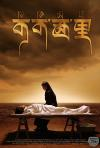

[可可西里](https://pewae.com/gaan/aHR0cHM6Ly9tb3ZpZS5kb3ViYW4uY29tL3N1YmplY3QvMTMwODg1Nw==)

导演：陆川主演：多布杰 / 奇道 / 张垒 / 赵一穗 / 赵雪莹 / 马占林类型：剧情 / 犯罪地区：大陆首映时间：2004

其实两伙人差别不大，羊只是一个中介物……

[管道工艳遇记](https://pewae.com/gaan/aHR0cHM6Ly9tb3ZpZS5kb3ViYW4uY29tL3N1YmplY3QvNDcwNTE0MA==)

原名：Adventures of a Plumber's Mate导演：Stanley A· Long主演：Anna Quayle / Arthur Mullard / Stephen Lewis / 克里斯托弗·尼尔类型：喜剧 / 犯罪地区：英国首映时间：1978

管道工这行业走进小黄文的开端，露点镜头过于刻意。
片子里的坏人也太规矩了些，死板。

[太阳照常升起](https://pewae.com/gaan/aHR0cHM6Ly9tb3ZpZS5kb3ViYW4uY29tL3N1YmplY3QvMTc2NjA4Ng==)

导演：姜文主演：周韵 / 姜文 / 孔维 / 崔健 / 房祖名 / 李加民 / 陈冲 / 黄秋生类型：剧情 / 奇幻地区：大陆首映时间：2007

本片的最大问题在于杨老板带来的香港演员——黄秋生和房祖名，跟姜文的风格格格不入。
周韵本来看着不错，但跟孔维陈冲一比还是差了好多。
最喜欢一诺千金，说了你见过天鹅绒就打死，那就一定打死。

[火烧红莲寺](https://pewae.com/gaan/aHR0cHM6Ly9tb3ZpZS5kb3ViYW4uY29tL3N1YmplY3QvMTI5NzI1OA==)

导演：林岭东主演：季天笙 / 扬升 / 李若彤 / 林泉 / 程东 / 黄锦江类型：冒险 / 动作 / 古装 / 武侠地区：香港首映时间：1994

林岭东风味的武侠，斩马头令人印象深刻。
李若彤演绎生涯最佳表现，可能演妓女确实容易发挥。
动作设计一般。

[她在梦中跳舞](https://pewae.com/gaan/aHR0cHM6Ly9tb3ZpZS5kb3ViYW4uY29tL3N1YmplY3QvMzI1Njk1NzI=)

原名：Dancing in her Dreams导演：時川英之主演：加藤雅也 / 岡村いずみ / 横山雄二 / 犬饲贵丈 / 矢泽洋子类型：剧情地区：日本首映时间：2020

江河日下产业的颓废感不错。
女演员实在有些丑。
日式以小见大的矫情。

[去他的爱：再次中招](https://pewae.com/gaan/aHR0cHM6Ly9tb3ZpZS5kb3ViYW4uY29tL3N1YmplY3QvMzU4ODMzMjA=)

原名：F*ck Love Too导演：Appie Boudellah / Aram van de Rest主演：Anouk Maas / Bettina Holwerda / Défano Holwijn / Dorian Bindels / Edwin Jonker / Kraantje Pappie / Maurits Delchot / 波·梅尔滕 / 约兰特·卡鲍乌 / 维多利亚·科布林科类型：喜剧地区：荷兰首映时间：2022

几位女演员盘子都挺不错的，剧情太俗。
这年头不加黑人不让拍电影吗？

[春之森林](https://pewae.com/gaan/aHR0cHM6Ly9tb3ZpZS5kb3ViYW4uY29tL3N1YmplY3QvMTQzNzYyMw==)

原名：Maladolescenza导演：皮耶尔·朱塞佩·穆尔吉亚主演：伊娃·爱洛尼斯科 / 拉腊·文德尔 / 马丁·劳博类型：剧情 / 情色 / 爱情地区：德国 / 意大利首映时间：1977

主演明显未成年。
男主角又坏又贱，可惜欧洲人不吃狗肉。

[残酷](https://pewae.com/gaan/aHR0cHM6Ly9tb3ZpZS5kb3ViYW4uY29tL3N1YmplY3QvMzAzMjkxMjY=)

原名：Brutal导演：广濑贵士主演：Butch / Katrina Grey / Naho Nakashima / Nanako Ohata / 亚矢乃 / 仁科贵类型：恐怖地区：日本首映时间：2018

点子非常不错，没有JJ的男变态杀人狂遇上没有MM的女变态杀人狂。
点都被切了，所以也不知道算不算露点。
可惜所有的血腥暴力镜头都是错位，这是肉眼可见的制作水平有限。

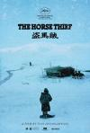

[盗马贼](https://pewae.com/gaan/aHR0cHM6Ly9tb3ZpZS5kb3ViYW4uY29tL3N1YmplY3QvMTMwNTA4NQ==)

导演：田壮壮主演：加洋加木错 / 才项仁增 / 扎西 / 旦枝姬 / 蒂巴 / 高哇类型：剧情地区：大陆首映时间：1986

难能可贵的西藏八十年代风光。
故事讲得太晦涩。
长镜头用得太多，搞得人心里空唠唠的。

[鼠胆英雄](https://pewae.com/gaan/aHR0cHM6Ly9tb3ZpZS5kb3ViYW4uY29tL3N1YmplY3QvMjcwNzMwNTc=)

导演：束焕 / 邵丹主演：于谦 / 佟丽娅 / 刘威 / 大鹏 / 岳云鹏 / 田雨 / 蔡明 / 袁弘 / 雷佳音 / 韩童生类型：喜剧地区：大陆首映时间：2019

虽然很烂，但已经是岳云鹏主演的电影中最好的存在。
丫丫被占了便宜。
田雨演得过于套路化，打卡下班。

[默片解说员](https://pewae.com/gaan/aHR0cHM6Ly9tb3ZpZS5kb3ViYW4uY29tL3N1YmplY3QvMzAxMzU5NDI=)

原名：Talking the Pictures导演：周防正行主演：井上真央 / 小日向文世 / 成田凌 / 永濑正敏 / 渡边绘里 / 竹中直人 / 竹野内丰 / 音尾琢真 / 高良健吾 / 黑岛结菜类型：喜剧地区：日本首映时间：2019

没见过默片解说员，没经历过默片时代，甚至不怎么爱进电影院，所以真心没感觉。
片中涉及到的片中片，没一部喜欢的，包括《飘》。

[女清洁工](https://pewae.com/gaan/aHR0cHM6Ly9tb3ZpZS5kb3ViYW4uY29tL3N1YmplY3QvMjcxNzkyMDU=)

原名：The Cleaning Lady导演：乔恩·克劳兹主演：Carla Wynn / JoAnne McGrath / Keri Marrone / Kim Marie Cooper / Mykayla Sohn / Robert Hugh Starr / 亚历克西斯·肯德拉 / 伊莉莎白·桑迪 / 斯特里奥·萨万特 / 瑞秋·艾里格类型：恐怖 / 惊悚地区：美国首映时间：2018

气氛的营造毁于不合时宜的插叙。
血飙的不够多。

[非人类](https://pewae.com/gaan/aHR0cHM6Ly9tb3ZpZS5kb3ViYW4uY29tL3N1YmplY3QvMzU4OTU5NzI=)

原名：Unhuman导演：马库斯·邓斯坦主演：C·J·勒布朗 / 尤赖亚·谢尔顿 / 布芮妮·邱 / 布莱克·伯特 / 德鲁·谢伊德 / 本杰明·沃兹沃斯 / 洛·格拉汉姆 / 皮特·吉勒斯 / 约书亚·米克尔 / 阿里·加洛类型：喜剧 / 恐怖 / 惊悚地区：美国首映时间：2022

雷。
政治正确到了恶心的程度。

[灭门](https://pewae.com/gaan/aHR0cHM6Ly9tb3ZpZS5kb3ViYW4uY29tL3N1YmplY3QvMzgyOTUxMg==)

导演：罗守耀主演：任达华 / 卢惠光 / 安志杰 / 廖碧儿 / 张兆辉 / 张文慈 / 熊欣欣 / 蒋璐霞 / 陈惠敏类型：动作 / 惊悚地区：香港首映时间：2010

打戏不像近些年的动作戏那么飘，但也没太过瘾，剧情一团糟。
第一次看廖碧儿的表演，完全没有任何感觉。
最后的爆炸实在是剧情杀，看得脑仁都要爆炸了。

[私人会所](https://pewae.com/gaan/aHR0cHM6Ly9tb3ZpZS5kb3ViYW4uY29tL3N1YmplY3QvMjY5OTY3NTM=)

导演：颜米羔主演：冯海锐 / 李任燊 / 李凯贤 / 汤加文 / 钟卓菲 / 陈咏谦 / 陈洁玲 / 陈美伊 / 麦子乐类型：剧情地区：香港首映时间：2017

这种题材竟然都不露点，香港电影没救了。
一个二个的舞女炒股都这么厉害，叫什么私人会所，叫股神会所算了。

[当你熟睡](https://pewae.com/gaan/aHR0cHM6Ly9tb3ZpZS5kb3ViYW4uY29tL3N1YmplY3QvMzczMTYyNg==)

原名：Mientras duermes导演：豪梅·巴拉格罗主演：伊丽丝·阿尔梅达 / 佩普·托萨 / 佩特拉·马丁内斯 / 卡洛斯·拉萨尔特 / 托尼·科尔维略 / 玛尔塔·埃图拉 / 路易斯·托萨尔 / 阿尔维托·圣胡安类型：悬疑 / 惊悚地区：西班牙首映时间：2011

你快乐我就不快乐，这种角度非常独特。
人物行为大体符合逻辑，情节上基本没有废话，难得。
6分56秒，稍纵即逝。

[短柄斧](https://pewae.com/gaan/aHR0cHM6Ly93d3cuaW1kYi5jb20vdGl0bGUvdHQwNDIyNDAx)

原名：Hatchet导演：adam green主演：deon richmond / joel david moore / Kane Hodder类型：喜剧 / 恐怖 / 惊悚地区：美国首映时间：2006

一般，全是套路。
奶兹戏加得太牵强。
死法还算有新意，但是被过暗的画面抵消了。

[七人乐队](https://pewae.com/gaan/aHR0cHM6Ly9tb3ZpZS5kb3ViYW4uY29tL3N1YmplY3QvMjYzMjExODQ=)

导演：徐克 / 杜琪峰 / 林岭东 / 洪金宝 / 袁和平 / 许鞍华 / 谭家明主演：伍咏诗 / 余香凝 / 元华 / 吴澋滔 / 吴镇宇 / 林恺铃 / 洪天明 / 洪金宝 / 胡子彤 / 马菀迎类型：剧情 / 历史地区：香港首映时间：2020

我和我的家乡香港篇。
洪金宝2许鞍华3谭佳明5袁和平4杜琪峰7林岭东4徐克8，其余全是加给林岭东的感情分。
没有任何一位导演有表达香港明天会更好的意愿。

[哆啦A梦：大雄的平行西游记](https://pewae.com/gaan/aHR0cHM6Ly9tb3ZpZS5kb3ViYW4uY29tL3N1YmplY3QvMTQ1ODg5Ng==)

原名：ドラえもん のび太のパラレル西遊記导演：芝山努主演：加藤正之 / 千千松幸子 / 大山信代 / 小原乃梨子 / 横泽启子 / 田中亮一 / 白川澄子 / 立壁和也 / 肝付兼太 / 野村道子类型：冒险 / 动画 / 科幻地区：日本首映时间：1988

缺少戏剧冲突，过于低龄化。
真实历史玄奘的部分还不如不加，太生硬。
在日本金角银角红孩儿真的是西游记的标志性妖怪。

[卢旺达饭店](https://pewae.com/gaan/aHR0cHM6Ly9tb3ZpZS5kb3ViYW4uY29tL3N1YmplY3QvMTI5MTgyMg==)

原名：Hotel Rwanda导演：特瑞·乔治主演：华金·菲尼克斯 / 哈基姆·凯-卡西姆 / 唐·钱德尔 / 大卫·奥哈拉 / 尼克·诺特 / 托尼·戈罗奇 / 法纳·莫科纳 / 苏菲·奥康内多 / 莫苏西·麦格诺 / 西莫·莫加瓦扎类型：传记 / 剧情 / 历史 / 战争地区：英国首映时间：2004

白人视角的忏悔式悲天悯人。
别国内政，霸权主义，大国责任，民族自决，这几个东西都是口号，混在一起五味杂陈。
模糊了胡图族和图西族仇恨的由来，是为了摘出比利时？

[新生化危机](https://pewae.com/gaan/aHR0cHM6Ly9tb3ZpZS5kb3ViYW4uY29tL3N1YmplY3QvMjYxNDAyNjU=)

原名：Resident Evil: Welcome to Raccoon City导演：约翰内斯·罗伯茨主演：内森·达莱斯 / 卡雅·斯考达里奥 / 唐纳尔·罗格 / 尼尔·麦克唐纳 / 斯蒂芬妮·霍金斯 / 汉娜·乔恩-卡门 / 汤姆·霍珀 / 罗比·阿梅尔 / 阿万·乔贾 / 高莉莉类型：动作 / 恐怖 / 科幻地区：德国首映时间：2021

剧情组织混乱，但对游戏的还原度确实高于米拉版。
不能接受阿三里昂和卷毛吉尔。
舔食者还原度不错，可惜没有阿追。

[追鬼七雄](https://pewae.com/gaan/aHR0cHM6Ly9tb3ZpZS5kb3ViYW4uY29tL3N1YmplY3QvMjA2MzAzNA==)

导演：于仁泰主演：徐小玲 / 恬妮 / 曹达华 / 许冠英 / 郑则仕 / 钟发 / 陈友类型：喜剧 / 恐怖地区：香港首映时间：1983

乱炖大杂烩，无论是灵幻方向、喜剧方向、情色方向还是悬疑方向都没搞好。
恬妮的屁股。

[俏探女娇娃](https://pewae.com/gaan/aHR0cHM6Ly9tb3ZpZS5kb3ViYW4uY29tL3N1YmplY3QvMzA0MTY1Ng==)

导演：鲍学礼主演：丹娜 / 伊芙莲嘉 / 刘永 / 南宫勋 / 史仲田 / 思维 / 燕南希 / 袁祥仁 / 邵音音 / 金正兰类型：剧情 / 动作地区：香港首映时间：1977

老版查理的天使的跟风片，情色镜头加得叫一个顺畅。
倪匡的剧本从来都是毫无亮点。
武术指导袁大眼。

[鬼同你住](https://pewae.com/gaan/aHR0cHM6Ly9tb3ZpZS5kb3ViYW4uY29tL3N1YmplY3QvMzUxOTM1MTA=)

导演：陈果主演：太保 / 张达明 / 文雪儿 / 李丽珍 / 车保罗 / 邵音音 / 陈湛文 / 魏秋燁 / 麦家琪 / 黄又南类型：喜剧 / 恐怖地区：香港首映时间：2021

非常喜欢这癫狂的氛围。
香港法律最伟大的地方，就是可以随时改来改去。
可惜讽刺得过于浅白。

[猩红山峰](https://pewae.com/gaan/aHR0cHM6Ly9tb3ZpZS5kb3ViYW4uY29tL3N1YmplY3QvMjM0MjQ1ODY=)

原名：Crimson Peak导演：吉尔莫·德尔·托罗主演：乔纳森·海德 / 伯恩·戈曼 / 吉姆·比弗 / 布鲁斯·加里 / 杰西卡·查斯坦 / 查理·汉纳姆 / 汤姆·希德勒斯顿 / 米娅·华希科沃斯卡 / 莱斯利·霍普 / 道格·琼斯类型：剧情 / 悬疑 / 惊悚地区：加拿大首映时间：2015

美轮美奂的维多利亚时代英伦风鬼片。
构图极美，剧情流俗。
两个宫妆美妇举着铁锨和片刀互抡，也太恶趣味了。

[投奔怒海](https://pewae.com/gaan/aHR0cHM6Ly9tb3ZpZS5kb3ViYW4uY29tL3N1YmplY3QvMTI5NjU1Nw==)

导演：许鞍华主演：刘德华 / 奇梦石 / 林子祥 / 缪骞人 / 郝嘉陵 / 马斯晨类型：剧情地区：香港首映时间：1982

越共的事，说是就是不是也是。
初出茅庐的许鞍华有一股狠劲儿，可惜后来越来越淡。
片头有个一闪而过的三线旗的镜头，查一下之后，奇怪的知识又增加了。

[净化](https://pewae.com/gaan/aHR0cHM6Ly9tb3ZpZS5kb3ViYW4uY29tL3N1YmplY3QvMzYwMTE5NzI=)

原名：Purificacion导演：gb sampedro主演：julia bersana / quinn carrillo / sab aggabao类型：剧情 / 情色地区：菲律宾首映时间：2022

不知道菲律宾电影总体水平如何，反正这部剧情就是弱智。
女主身材尚可，只是演得像个傻子。
菲律宾是个基督教国家？

[天蝎座之夜3](https://pewae.com/gaan/aHR0cHM6Ly9tb3ZpZS5kb3ViYW4uY29tL3N1YmplY3QvMzYwMTE5NzQ=)

原名：Scorpio Nights 3导演：Lawrence Fajardo主演：Christine Bermas类型：剧情 / 情色地区：菲律宾首映时间：2022

不论影片质量如何，能把隔着楼板踩着小板凳BJ拍出来就很有想象力了。
射在墙上令人相当失望。
女主角相当不错。

[恐怖分子](https://pewae.com/gaan/aHR0cHM6Ly9tb3ZpZS5kb3ViYW4uY29tL3N1YmplY3QvMTMwNTI2MQ==)

导演：杨德昌主演：刘明 / 吕德明 / 李立群 / 游安顺 / 王安 / 缪骞人 / 金士杰 / 顾宝明 / 马邵君 / 黄嘉晴类型：剧情 / 犯罪地区：台湾首映时间：1986

凶猛的作品，李立群生动演绎什么叫沉默的爆发。
人生就是一团欲望，得不到满足就会痛苦，得到满足就会无聊，人生就是在痛苦和无聊之间徘徊。————叔本华。

[蒲塔河](https://pewae.com/gaan/aHR0cHM6Ly9tb3ZpZS5kb3ViYW4uY29tL3N1YmplY3QvMzU5MTQzMjQ=)

原名：Putahe导演：Roman Perez Jr·主演：Ayanna Misola / Janelle Lazo Tee / Mon Confiado / Nathan Cajucom类型：剧情地区：菲律宾首映时间：2022

中国人把岛占了……
肉戏加得勉强，女主的性格转变也略显突兀。
菲律宾真的这么夜不闭户吗？

[猎屠](https://pewae.com/gaan/aHR0cHM6Ly9tb3ZpZS5kb3ViYW4uY29tL3N1YmplY3QvMzUwODMzMTk=)

导演：郭晓峰主演：倪大红 / 关晓彤 / 匡牧野 / 张兆辉 / 王千源 / 王迅 / 许龄月 / 郭晓东 / 郭晓峰 / 马渝捷类型：犯罪地区：大陆首映时间：2022

编导烂到王干源王讯倪大红郭晓东加一块儿也救不回来的程度，好好一个电信诈骗题材拍成了劣质黑帮片。
女主许龄月长了张标准的记不住脸，反倒是高颧骨的马渝捷还挺有特点的。
关晓彤演个啥，siri吗？

[排爆手](https://pewae.com/gaan/aHR0cHM6Ly9tb3ZpZS5kb3ViYW4uY29tL3N1YmplY3QvMzUzNjk1NzI=)

导演：阚家伟主演：于荣光 / 余男 / 刘烨 / 杜志国 / 林迪安 / 洪浚嘉 / 王韬 / 艾东类型：动作 / 战争地区：大陆首映时间：2022

无厘头主旋律军旅片。
刘烨完全无法把握刚毅与呆滞两种特质之间的区别。
手枪排雷那段太扯了，且不说手枪能不能排雷，为什么追着追着就剩刘烨和余男了，队友呢？墨迹半天都没上来支援，武警就这专业素质？

[阳光灿烂的日子](https://pewae.com/gaan/aHR0cHM6Ly9tb3ZpZS5kb3ViYW4uY29tL3N1YmplY3QvMTI5MTg3NQ==)

导演：姜文主演：冯小刚 / 刘小宁 / 夏雨 / 姜文 / 宁静 / 斯琴高娃 / 王学圻 / 王朔 / 耿乐 / 陶虹类型：剧情 / 爱情地区：大陆首映时间：1995

青春期的阳光灿烂与荷尔蒙泛滥。
一定要看140分钟的原版。
为艺术献身的女艺术家之宁静，真是又白又大。

[动物僵尸](https://pewae.com/gaan/aHR0cHM6Ly9tb3ZpZS5kb3ViYW4uY29tL3N1YmplY3QvMjY3Mzg4NDY=)

原名：Zoombies导演：Glenn Miller主演：Brianna Joy Chomer / Ione Butler / Ivan Djurovic / Kaiwi Lyman / Kim Nielsen / La La Nestor / Marcus Anderson / William McMichael / 亚伦·格罗本 / 安德鲁·阿斯珀类型：动作 / 恐怖 / 科幻地区：美国首映时间：2016

黑女人、女人和小孩活到了最后，这片子看着还有什么意思？
特效过于五毛。
美国片里的小孩不会死，跟国产片里不会有鬼一样，太扫兴。

[剩女大作战](https://pewae.com/gaan/aHR0cHM6Ly9tb3ZpZS5kb3ViYW4uY29tL3N1YmplY3QvMjY3NzkyNjQ=)

原名：The Last Egg导演：Bao Nhan / Namcito主演：妙妮 / 平明 / 武范艳咪 / 越香 / 黄立类型：喜剧 / 爱情地区：越南首映时间：2016

俗而又俗的剧情，都2016年了还玩土电话，有意思嘛。
女主角是越南名模，可怎么品都是一张网红脸。
插曲挺好听的。

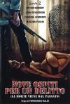

[一岛九命](https://pewae.com/gaan/aHR0cHM6Ly9tb3ZpZS5kb3ViYW4uY29tL3N1YmplY3QvMzkxMDk5Nw==)

原名：Nove ospiti per un delitto导演：费迪南多·巴尔迪主演：索菲娅·迪奥尼西奥 / 约翰·理查森 / 达娜·吉亚 / 阿瑟·肯尼迪 / 韦朗第洛·维朗迪尼类型：惊悚地区：意大利首映时间：1977

雷雨跟无人生还结合的情色版，还行。
人物塑造有问题，几个男的分不清楚谁是谁。

[东京复仇者](https://pewae.com/gaan/aHR0cHM6Ly9tb3ZpZS5kb3ViYW4uY29tL3N1YmplY3QvMzQ5NzM1NTc=)

原名：Tokyo Revengers导演：英勉主演：今田美樱 / 北村匠海 / 吉泽亮 / 山田裕贵 / 杉野遥亮 / 真荣田乡敦 / 矶村勇斗 / 铃木伸之 / 间宫祥太朗类型：动作 / 奇幻地区：日本首映时间：2021

无聊。

[寂静之地2](https://pewae.com/gaan/aHR0cHM6Ly9tb3ZpZS5kb3ViYW4uY29tL3N1YmplY3QvMzAyMDYzMTE=)

原名：A Quiet Place Part II导演：约翰·卡拉辛斯基主演：基里安·墨菲 / 奥基里特·奥诺多瓦 / 布莱克·德隆 / 扎卡里·戈林格 / 斯科特·麦克纳里 / 杰曼·翰苏 / 米利森特·西蒙兹 / 约翰·卡拉辛斯基 / 艾米莉·布朗特 / 诺亚·尤佩类型：恐怖 / 惊悚 / 科幻地区：美国首映时间：2021

节奏不好，紧张感荡然无存。
就像自己这部不存在，给三做了个超长预告。
钉子令人很失望。

[一场很（没）有必要的春晚](https://pewae.com/gaan/aHR0cHM6Ly9tb3ZpZS5kb3ViYW4uY29tL3N1YmplY3QvMzU3NjUxNzI=)

原名：Yi Chang hen (Mei) You Bi Yao De Chun Wan导演：汪英伦主演：Antonia Ma / Rocky Sun / 冯奕萌 / 刘薇薇 / 孙雪峰 / 张一心 / 李灿 / 王赛丽 / 钱进 / 韩长福类型：喜剧地区：加拿大首映时间：2022

从头讽刺到尾，辛辣有味。
伪纪录片真是个绝妙的筐，所有表演上的生涩都可以变成镜头前的不自在，反而真实了起来。
最喜欢对京剧讽刺的一段：没人懂，没人听，没人在乎。

[一盘大棋](https://pewae.com/gaan/aHR0cHM6Ly9tb3ZpZS5kb3ViYW4uY29tL3N1YmplY3QvMzU2NzI1MjA=)

导演：江涛主演：修睿 / 喻恩泰 / 小沈阳 / 张艺上 / 范明 / 郭涛类型：剧情 / 喜剧地区：大陆首映时间：2022

开头还凑合，后面越来越差。
网红脸其实演得还行。
郭涛怎么没把自己尴尬死。

[致命24小时](https://pewae.com/gaan/aHR0cHM6Ly9tb3ZpZS5kb3ViYW4uY29tL3N1YmplY3QvMzQ5Mjc5MTE=)

导演：叶念琛主演：何珮瑜 / 吴卓羲 / 孙慧雪 / 张建声 / 林盛斌 / 汤怡 / 潘灿良类型：悬疑 / 惊悚地区：香港首映时间：2022

软绵绵的，毫无紧迫感。
不知不知港版88分钟是不是有猛料。
犯人演得好差。

[断·桥](https://pewae.com/gaan/aHR0cHM6Ly9tb3ZpZS5kb3ViYW4uY29tL3N1YmplY3QvMzUyMzUzNjU=)

导演：李玉主演：曾慕梅 / 曾美慧孜 / 李晓川 / 王俊凯 / 范伟 / 莫西子诗 / 赵润南 / 马思纯 / 黄璐 / 龚蓓苾类型：剧情 / 犯罪地区：大陆首映时间：2022

什么鬼剧情，马思纯是演傻子专业户吗？
李玉就这样，往后还能拉到投资就见鬼了。
王俊凯演得就跟不存在一样。

[小鱼吃大鱼](https://pewae.com/gaan/aHR0cHM6Ly9tb3ZpZS5kb3ViYW4uY29tL3N1YmplY3QvMjAyNzg4MDE=)

导演：查传谊主演：孔维 / 宋宁峰 / 王一 / 白凯南 / 郭京飞 / 齐溪类型：喜剧 / 爱情地区：大陆首映时间：2012

演的没问题，但是齐溪的大长腿配郭京飞的小眼睛实在没什么感觉。
孔维的角色莫名其妙，老江湖真被写成老梆子了，尤其结尾强行降智。
一块钱硬币出场次数太多，令人产生逆反心理。

[巨蟒与圣杯](https://pewae.com/gaan/aHR0cHM6Ly9tb3ZpZS5kb3ViYW4uY29tL3N1YmplY3QvMTI5NDkxNw==)

原名：Monty Python and the Holy Grail导演：特瑞·吉列姆 / 特瑞·琼斯主演：卡萝尔·克力夫兰 / 尼尔·尹艾斯 / 康妮·布斯 / 格雷厄姆·查普曼 / 比·达夫尔 / 特瑞·吉列姆 / 特瑞·琼斯 / 约翰·克里斯 / 艾瑞克·爱都 / 迈克尔·帕林类型：冒险 / 喜剧 / 奇幻地区：英国首映时间：1975

节奏很好，可惜段子并不是每段都能看懂，亚瑟王的故事还是不够了解啊。
片尾警察的出现不知是不是这种类型的肇始。
欧洲的城堡一下子变得毫无吸引力。

[暴君尼禄荒淫史2](https://pewae.com/gaan/aHR0cHM6Ly9tb3ZpZS5kb3ViYW4uY29tL3N1YmplY3QvMjI1MzUyNQ==)

原名：Porno Holocaust导演：乔·达马托主演：George Eastman类型：恐怖 / 情色地区：意大利首映时间：1981

没啥剧情，也没啥胸。

[踢到宝](https://pewae.com/gaan/aHR0cHM6Ly9tb3ZpZS5kb3ViYW4uY29tL3N1YmplY3QvMTQ1NjQ5Ng==)

导演：杜琪峰主演：岑建勋 / 张艾嘉 / 桑妮 / 梁朝伟 / 苑琼丹 / 郑则仕 / 郑柏林 / 黄一飞 / 黄新 / 黄秋生类型：喜剧 / 奇幻地区：香港首映时间：1992

空有一套强大的卡司，却只能算游戏之作。
女主蛮漂亮的,可惜只演了几部片子就退出演艺圈了。
片子快到结束才等来张艾嘉的客串。

[昂山素季](https://pewae.com/gaan/aHR0cHM6Ly93d3cuaW1kYi5jb20vdGl0bGUvdHQxODAyMTk3)

原名：The Lady导演：吕克·贝松主演：大卫·杜里斯 / 杨紫琼类型：传记 / 剧情 / 历史地区：法国首映时间：2011

温吞水，完全没表现出政治斗争的残酷以及军统的血腥。
杨紫琼演得非常一般。
这片子被禁的点究竟在哪儿?

[没有完成的喜剧](https://pewae.com/gaan/aHR0cHM6Ly9tb3ZpZS5kb3ViYW4uY29tL3N1YmplY3QvMjM4MjQzNA==)

导演：吕班主演：卢敏 / 杜凤侠 / 武豫梅 / 殷秀岑 / 蓝兰 / 阎杰 / 韩兰根类型：剧情 / 喜剧地区：大陆首映时间：1957

文革初期著名毒草之一，吕班导演义无反顾的勇气令人敬佩。
直言不讳地打脸审查制度。
前后两个小故事比较有趣，第二个段子确实不太行。

[低俗小说](https://pewae.com/gaan/aHR0cHM6Ly9tb3ZpZS5kb3ViYW4uY29tL3N1YmplY3QvMTI5MTgzMg==)

原名：Pulp Fiction导演：昆汀·塔伦蒂诺主演：乌玛·瑟曼 / 塞缪尔·杰克逊 / 布尔·斯蒂尔斯 / 布鲁斯·威利斯 / 弗兰克·威利 / 文·瑞姆斯 / 约翰·特拉沃尔塔 / 菲尔·拉马 / 蒂姆·罗斯 / 阿曼达·普拉莫类型：剧情 / 喜剧 / 犯罪地区：美国首映时间：1994

昆汀的废话文学，看多了真的会斯德哥尔摩。
唯一阻碍本片获得更高分数的，就是屈夫塔那张恶心的脸。
不要吸毒，不要长时间蹲坑。

[忠犬八公物语](https://pewae.com/gaan/aHR0cHM6Ly9tb3ZpZS5kb3ViYW4uY29tL3N1YmplY3QvMTk1OTE5NQ==)

原名：ハチ公物語导演：神山征二郎主演：井川比佐志 / 仲代达矢 / 八千草薰 / 加藤嘉 / 山本圭 / 春川真澄 / 殿山泰司 / 片桐入 / 石仓三郎 / 石野真子类型：剧情地区：日本首映时间：1987

一条丧家狗的故事。
这狗要是在中国，早就背负上“妨主”之名，被人道毁灭了吧。
难得有情人。

[岁月神偷](https://pewae.com/gaan/aHR0cHM6Ly9tb3ZpZS5kb3ViYW4uY29tL3N1YmplY3QvMzc5Mjc5OQ==)

导演：罗启锐主演：任达华 / 吴君如 / 夏萍 / 张同祖 / 李治廷 / 秦沛 / 蔡颖恩 / 许鞍华 / 谷德昭 / 钟绍图类型：剧情 / 家庭地区：香港首映时间：2010

总觉得过于煽情，毫无共情。
任达华、吴君如、秦沛当然是没什么问题，可是李治廷、蔡颖恩和那个小孩演的啥玩意儿啊，直接让片子掉了一个档次。
台风一场太假。

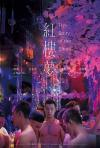

[红楼梦](https://pewae.com/gaan/aHR0cHM6Ly9tb3ZpZS5kb3ViYW4uY29tL3N1YmplY3QvMjY5NTE2NTQ=)

导演：吴星翔主演：刘雨凯 / 利晴天 / 吕金象 / 唐緰 / 林冠宇 / 纪言恺 / 荣忠豪 / 蔡力允 / 陈彦名 / 陈彦廷类型：同性 / 情色地区：台湾首映时间：2018

男同没什么，生套红楼梦也没什么，但真是没看懂到底要说啥啊。
好像全片只出现了一位女演员？

[洗澡](https://pewae.com/gaan/aHR0cHM6Ly9tb3ZpZS5kb3ViYW4uY29tL3N1YmplY3QvMTMwMzQ4NQ==)

导演：张杨主演：何冰 / 姜武 / 封顺 / 朱旭 / 李丁 / 杜彭 / 濮存昕 / 胡贝贝 / 金钊 / 隋永清类型：剧情 / 喜剧 / 家庭地区：大陆首映时间：1999

男人的情感世界刻画得真好。
朱旭老爷子死得莫名其妙，疑似遭遇剪刀手。
陕北那段节奏乱了，西藏剧情莫名其妙，对于全片来说可惜。

[夜行者](https://pewae.com/gaan/aHR0cHM6Ly9tb3ZpZS5kb3ViYW4uY29tL3N1YmplY3QvMjU3NTA5Njk=)

原名：Nightcrawler导演：丹·吉尔罗伊主演：帕特·哈维 / 杰克·吉伦哈尔 / 杰姆斯·黄 / 比尔·帕克斯顿 / 肯特·绍克内克 / 莎伦泰 / 蕾妮·罗素 / 迈克尔·帕帕约翰 / 里兹·阿迈德 / 马科斯·罗德里格斯类型：剧情 / 惊悚 / 犯罪地区：美国首映时间：2014

从吉伦哈尔出场的那一秒开始你就知道他会黑化，这种只需要一个眼神就能立人设的功力，就差小金人认证了。
故事细究起来漏洞很多，主角早就应该被警方控制起来了。
讽刺画饼剥削实习生的部分挺有意思的。

[棋王](https://pewae.com/gaan/aHR0cHM6Ly9tb3ZpZS5kb3ViYW4uY29tL3N1YmplY3QvMTMwNzE2Mw==)

导演：严浩 / 徐克主演：严浩 / 岑建勋 / 朱怀飞 / 杨林 / 柯星沛 / 梁家辉 / 王圣方 / 金士杰 / 陈冠中 / 高国光类型：剧情地区：香港首映时间：1991

看看梁家辉是怎么把吃大米饭演得出神入化的。
汹涌的人潮跟摇滚版的《爱人同志》简直绝配。
八十年代的台湾跟六十年代的内地，两个故事割裂感还是比较强，杨林根本不会演戏。

[同学麦娜丝](https://pewae.com/gaan/aHR0cHM6Ly9tb3ZpZS5kb3ViYW4uY29tL3N1YmplY3QvMzQ5MDI2Mzk=)

导演：黄信尧主演：刘冠廷 / 施名帅 / 朱芷莹 / 洪小铃 / 潘慧如 / 王彩桦 / 纳豆 / 郑人硕 / 郑宇彤 / 陈以文类型：剧情 / 喜剧地区：台湾首映时间：2020

开头冗长，要不是画外音扯了大佛普拉斯的虎皮早就放弃了。
男演员都挺好，但几位女演员完全在拖后腿。
中后段逐渐殷实，到结尾又完蛋了。

[蓝风筝](https://pewae.com/gaan/aHR0cHM6Ly93d3cuaW1kYi5jb20vdGl0bGUvdHQwMTA3MzU4)

原名：Lan feng zheng导演：田壮壮主演：50分 / 吕中 / 吕丽萍 / 宗平 / 张丰毅 / 张弘 / 易天 / 李雪健 / 濮存昕 / 郭宝昌类型：剧情地区：大陆首映时间：1993

冉匪说：“世界上没有任何东西有免受批评的权力。”——我说：“除非它不是东西。”
大哥跟朱瑛的支线剧情凄美动人。
吕丽萍饰演的女主角眼里逐渐失去了光。

[书记](https://pewae.com/gaan/aHR0cHM6Ly93d3cuaW1kYi5jb20vdGl0bGUvdHQxODU5NjE5)

原名：The Transition Period导演：周浩主演：郭永昌类型：历史 / 纪录地区：大陆首映时间：2010

最有趣的一幕是郭永昌离职前开的那个送别会，花式拍马屁现场。
看了本片会觉得基层领导的主要工作就是喝酒。
缺点就是喝酒的场面太多了。

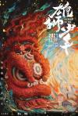

[雄狮少年](https://pewae.com/gaan/aHR0cHM6Ly9tb3ZpZS5kb3ViYW4uY29tL3N1YmplY3QvMzUxNDQzMTE=)

导演：孙海鹏主演：大昕 / 大澄子 / 大雄 / 巴赫 / 李佳思 / 李盟 / 熊陈捷 / 蔡壮壮 / 郭皓 / 马语非类型：剧情 / 动画 / 喜剧地区：大陆首映时间：2021

美工有多牛叉，配音就有多糟糕。
这眼睛有什么可攻击的？疯了简直。
超喜欢没用的事情折腾了整部电影，却还要背起行李去打工的结局。

[世界奇妙物语 2022夏季特别篇](https://pewae.com/gaan/aHR0cHM6Ly9tb3ZpZS5kb3ViYW4uY29tL3N1YmplY3QvMzU5MTQzMDE=)

导演：吉村慶介 / 城宝秀则 / 植田泰史 / 淵上正人主演：东根作寿英 / 山本美月 / 岩田琉聖 / 有田哲平 / 生田绘梨花 / 绀野真昼类型：剧情 / 恐怖 / 科幻地区：日本首映时间：2022

中规中矩，近几年的世奇中算好的。
最棒的故事是第三个Melody，前后呼应，无论剧中人如何挣扎，也敌不过的世奇自己的BGM，中间蜡笔小新的BGM也挺搞笑的。
另外三个故事都有些刻意。

[达荷美女战士](https://pewae.com/gaan/aHR0cHM6Ly9tb3ZpZS5kb3ViYW4uY29tL3N1YmplY3QvMzAxNTkyODg=)

原名：The Woman King导演：吉娜·普林斯-拜斯伍德主演：吉米·奥杜科亚 / 图索·姆贝杜 / 希拉·阿蒂姆 / 拉什纳·林奇 / 杰米·劳森 / 玛萨利·班度萨 / 约翰·博耶加 / 维奥拉·戴维斯 / 艾德丽安·沃伦 / 赫洛·费因斯-提芬类型：剧情 / 历史地区：美国首映时间：2022

如果事先知道标题断句不是达荷·美女战士，根本就不可能下载。
黑人、女权、百合什么的，要素满满，可就是不好看。

[克里斯托弗·罗宾](https://pewae.com/gaan/aHR0cHM6Ly9tb3ZpZS5kb3ViYW4uY29tL3N1YmplY3QvMjYzNTkyMzU=)

原名：Christopher Robin导演：马克·福斯特主演：伊万·麦克格雷格 / 凯蒂·卡迈克尔 / 勃朗特·卡迈克尔 / 奥利弗·福德·戴维斯 / 海莉·阿特维尔 / 特里斯坦·斯特罗克 / 罗杰·阿什顿-格里菲斯 / 阿德里安·斯卡伯勒 / 阿曼达·劳伦斯 / 马克·加蒂斯类型：冒险 / 动画 / 喜剧地区：美国首映时间：2018

直击中年社畜的内心。
可惜最后的结局还是童话的，也好，总不至于无法收拾。

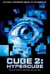

[心慌方2：超立方体](https://pewae.com/gaan/aHR0cHM6Ly9tb3ZpZS5kb3ViYW4uY29tL3N1YmplY3QvMTMwNTMwNg==)

原名：Cube²: Hypercube导演：安德列·塞库拉主演：Barbara Gordon / Greer Kent / Lindsey Connell / Matthew Ferguson / 卡瑞·玛切特 / 尼尔·克容 / 布鲁斯·加里 / 格兰特·维恩·戴维斯 / 格蕾丝·林恩·孔 / 菲利普·阿金类型：恐怖 / 悬疑 / 惊悚 / 科幻地区：加拿大首映时间：2002

特效更加华丽，不过血浆的使用适得其反。
红裙女莫名其妙。
结局好评。

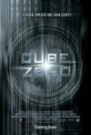

[心慌方·零](https://pewae.com/gaan/aHR0cHM6Ly9tb3ZpZS5kb3ViYW4uY29tL3N1YmplY3QvMTMxNjY5Mw==)

原名：Cube Zero导演：厄尼·巴巴拉什主演：David Huband / Martin Roach / 史蒂芬·穆尔 / 扎卡里·贝内特 / 特丽·霍克斯 / 迈克尔·莱利类型：剧情 / 恐怖 / 科幻地区：加拿大首映时间：2004

还是机械化的立方体比较带感。
关于思想控制的主题，看多了也腻。
在英雄主义的道路上跑偏。

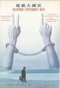

[超级大国民](https://pewae.com/gaan/aHR0cHM6Ly9tb3ZpZS5kb3ViYW4uY29tL3N1YmplY3QvMTMwNzQ1OQ==)

导演：万仁主演：林扬 / 柯一正 / 苏明明类型：剧情 / 历史地区：台湾首映时间：1996

沉闷且沉重。

[狼人游戏](https://pewae.com/gaan/aHR0cHM6Ly9tb3ZpZS5kb3ViYW4uY29tL3N1YmplY3QvMzQ5Njc4OTI=)

原名：Werewolves Within导演：乔什·鲁本主演：乔治·巴兹尔 / 凯瑟琳·科廷 / 哈维·吉兰 / 夏恩·杰克逊 / 山姆·理查森 / 瑞贝卡·亨德森 / 米拉娜·薇恩翠 / 莎拉·伯恩斯 / 迈克尔·切鲁斯 / 韦恩·杜瓦尔类型：喜剧 / 恐怖地区：美国首映时间：2021

节奏感太差了，完全不曾在合适的时机制造出悬念。
废话太太太太多。
女主角长相挺甜的。

[钢铁少女：决战](https://pewae.com/gaan/aHR0cHM6Ly9tb3ZpZS5kb3ViYW4uY29tL3N1YmplY3QvMzAzNDU0NjY=)

原名：Iron Girl: Final Wars导演：藤原健一主演：ハヤテ / 明日花绮罗 / 春田纯一 / 青柳尊哉 / 龍坐类型：动作 / 科幻地区：日本首映时间：2019

一坨屎。
2：22，没了。
非要找亮点的话，明日花小姐姐的片尾曲唱得平均水准吧。

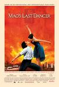

[末代舞者](https://pewae.com/gaan/aHR0cHM6Ly93d3cuaW1kYi5jb20vdGl0bGUvdHQxMDcxODEy)

原名：Mao's Last Dancer导演：bruce beresford主演：凯尔·麦克拉克伦 / 布鲁斯·格林伍德 / 曹驰 / 王双宝 / 阿曼达·舒尔 / 陈冲类型：传记 / 剧情地区：澳大利亚首映时间：2009

非常一般。
江青同志指导文艺创作的场景还原得不错。
最后的母子重逢，渲染非常不到位，硬。

[月光光心慌慌](https://pewae.com/gaan/aHR0cHM6Ly9tb3ZpZS5kb3ViYW4uY29tL3N1YmplY3QvMTI5OTU4Ng==)

原名：Halloween导演：约翰·卡朋特主演：Charles Cyphers / P·J·索尔丝 / 南希·凯斯 / 唐纳德·普利森斯 / 杰米·李·柯蒂斯类型：恐怖 / 惊悚地区：美国首映时间：1978

当年颇具开创性，现在看来除了音乐都一般。
钟楼里的紧张音乐竟然是致敬来的。
其实没搞懂戴个面具有啥用啊，还被后来者竞相借鉴。

[无瑕的房间](https://pewae.com/gaan/aHR0cHM6Ly9tb3ZpZS5kb3ViYW4uY29tL3N1YmplY3QvMzUyODk3ODM=)

原名：The Immaculate Room导演：Mukunda Michael Dewil主演：M·埃梅特·沃尔什 / 凯特·波茨沃斯 / 埃米尔·赫斯基 / 阿什丽·格林尼类型：惊悚地区：美国首映时间：2022

对白太多，故弄玄虚。
50′06″
也许一个人待着是更好的选择。

[尸体游戏](https://pewae.com/gaan/aHR0cHM6Ly9tb3ZpZS5kb3ViYW4uY29tL3N1YmplY3QvMzAxNjMwMTA=)

原名：Bodies Bodies Bodies导演：哈里纳·雷金主演：Chase Sui Wonders / 康纳·欧麦利 / 李·佩斯 / 玛丽亚·巴卡洛娃 / 瑞秋·塞诺特 / 皮特·戴维森 / 米哈拉·赫罗德 / 阿曼德拉·斯坦伯格类型：喜剧 / 恐怖 / 惊悚地区：美国首映时间：2022

无知青年作大死的老套剧情加有色人种女主角的政治正确等于索然无味。
看开头知道结尾。

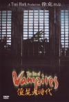

[僵尸大时代](https://pewae.com/gaan/aHR0cHM6Ly9tb3ZpZS5kb3ViYW4uY29tL3N1YmplY3QvMTMwNzg2NA==)

导演：钱升玮主演：于荣光 / 周文健 / 安雅 / 张智尧 / 文健 / 林雪 / 计春华 / 陈国坤类型：动作 / 恐怖地区：香港首映时间：2003

认真而又俗套。
安雅表现得真不错。

[交通费](https://pewae.com/gaan/aHR0cHM6Ly9tb3ZpZS5kb3ViYW4uY29tL3N1YmplY3QvMzYxNzU1NTA=)

原名：Pamasahe导演：Roman Perez Jr·主演：Azi Acosta类型：剧情地区：菲律宾首映时间：2022

虽然不甚严谨，但故事算相当不错了。
女主角相当不错，又纯又欲。
难道菲律宾真这么穷，普通老百姓遭灾以后连车票都买不起？

[家有喜事2020](https://pewae.com/gaan/aHR0cHM6Ly9tb3ZpZS5kb3ViYW4uY29tL3N1YmplY3QvMzQ3OTMwNjg=)

导演：黄百鸣主演：周秀娜 / 张智霖 / 张继聪 / 陈静 / 黄百鸣类型：喜剧地区：香港首映时间：2020

香港电影新类型——恰饭电影。
张智霖生就一张无法演喜剧的脸。
陈静好可惜，生错了时代。

[丛林噩梦](https://pewae.com/gaan/aHR0cHM6Ly9tb3ZpZS5kb3ViYW4uY29tL3N1YmplY3QvMTg2NDk5NQ==)

原名：Turistas导演：约翰·斯托克韦尔主演：乔什·杜哈明 / 奥利维亚·王尔德 / 德斯蒙德·奥斯基 / 梅利莎·乔治 / 碧儿·加勒特类型：恐怖 / 惊悚地区：美国首映时间：2006

普通，血量不够。
梅丽莎·乔治笑起来真好看。
全片反派忙活半天只嘎了一个腰子，不过瘾。

[粉笔地牢](https://pewae.com/gaan/aHR0cHM6Ly9tb3ZpZS5kb3ViYW4uY29tL3N1YmplY3QvMzYwNjA3ODY=)

原名：The Chalk Line导演：Ignacio Tatay主演：Eva Tennear / Jazmín Abuín / Rachel Lascar / Tara Marie Linke / 伊娃·略拉克 / 卡洛斯·桑托斯 / 埃丝特·阿塞博 / 埃伦娜·安纳亚 / 埃罗·阿索林 / 巴勃罗·莫利内罗类型：恐怖 / 悬疑 / 惊悚地区：西班牙首映时间：2022

故弄玄虚的意思很重，特别是小女孩。
反杀毫无意外，男反战斗力太渣。

[泡沫](https://pewae.com/gaan/aHR0cHM6Ly9tb3ZpZS5kb3ViYW4uY29tL3N1YmplY3QvMzYwNjU0Njg=)

原名：Bula导演：鲍比·博尼法西奥主演：Ayanna Misola / Gab Lagman / Rob Guinto / 蒙·康菲多类型：情色地区：菲律宾首映时间：2022

还行，最大的问题是女主有点萝卜腿。
女配有一丢丢神似柳岩。
菲律宾的警察真狗屎啊。

[男人与鸡](https://pewae.com/gaan/aHR0cHM6Ly9tb3ZpZS5kb3ViYW4uY29tL3N1YmplY3QvMjU4MDA5Mzg=)

原名：Men & Chicken导演：安诺斯·托马斯·延森主演：Ole Thestrup / 丽克·路易丝·安德森 / 利斯贝特·达尔 / 大卫·丹席克 / 尼古拉·雷·卡斯 / 尼可拉斯·布若 / 波笛·约根森 / 碧尔特·诺伊曼 / 索伦·莫灵 / 麦斯·米科尔森类型：剧情 / 喜剧地区：丹麦首映时间：2015

虽然猎奇，但这片子一股鸡粑粑味儿。
宗教梗太多。
资本主义的农村也没好到哪儿去。

[子弹列车](https://pewae.com/gaan/aHR0cHM6Ly9tb3ZpZS5kb3ViYW4uY29tL3N1YmplY3QvMzUxMTg5NTQ=)

原名：Bullet Train导演：大卫·雷奇主演：乔伊·金 / 亚伦·泰勒-约翰逊 / 坏痞兔 / 安德鲁·浩二 / 布拉德·皮特 / 布莱恩·泰里·亨利 / 桑德拉·布洛克 / 真田广之 / 罗根·勒曼 / 迈克尔·珊农类型：动作 / 喜剧 / 惊悚地区：美国首映时间：2022

爽感不错，情节很迷。
人物间的切换太硬了。
皮特主角光环过强。

[阿凡达：水之道](https://pewae.com/gaan/aHR0cHM6Ly9tb3ZpZS5kb3ViYW4uY29tL3N1YmplY3QvNDgxMTc3NA==)

原名：Avatar: The Way of Water导演：詹姆斯·卡梅隆主演：乔·大卫·摩尔 / 佐伊·索尔达娜 / 克利夫·柯蒂斯 / 史蒂芬·朗 / 吉奥瓦尼·瑞比西 / 埃迪·法可 / 希·庞德 / 杰米·福雷特斯 / 萨姆·沃辛顿 / 西格妮·韦弗类型：冒险 / 动作 / 科幻地区：美国首映时间：2022

用于炫技而追加的剧情过多，虽然好看但是太拖沓了。
家庭、成长、青春期的孩子果然是编不下去时最好的解决方案，只是这次告诉人要反抗，对普通中国人来说仍旧不那么正确啊。
捕鲸船剧情直接开嘲日本人。

[圣蛛](https://pewae.com/gaan/aHR0cHM6Ly9tb3ZpZS5kb3ViYW4uY29tL3N1YmplY3QvMzU3NTAyNjM=)

原名：Holy Spider导演：阿里·阿巴西主演：佛罗赞·詹姆希德内杰德 / 尼玛·阿克巴尔普尔 / 扎拉·阿米尔·阿布拉希米 / 梅斯巴·塔勒布 / 爱丽斯·拉希米 / 萨拉·法兹拉特 / 西纳·帕瓦内赫 / 费劳玆·阿吉利 / 迈赫迪·巴杰斯塔尼 / 阿拉什·阿什坦尼类型：剧情 / 惊悚 / 犯罪地区：伊朗首映时间：2022

这个国家对待女性冷漠的态度，包括女性自身，很难扭转。
最让人难受的是警察用一根烟钓鱼女主的一场戏，特别憋屈。
很遗憾伊朗也是有审查制度的国家，所以电影的出品方是丹麦。

[霹雳大喇叭](https://pewae.com/gaan/aHR0cHM6Ly9tb3ZpZS5kb3ViYW4uY29tL3N1YmplY3QvMTQ3NzI4OA==)

导演：刘观伟 / 陈欣健主演：元华 / 元奎 / 冯淬帆 / 姜大卫 / 张学友 / 林正英 / 洪金宝 / 王祖贤 / 秦沛 / 胡枫类型：喜剧 / 恐怖地区：香港首映时间：1986

平平无奇。
姜大卫很少演这样的角色，表现一般。

[焚情](https://pewae.com/gaan/aHR0cHM6Ly9tb3ZpZS5kb3ViYW4uY29tL3N1YmplY3QvMjY3NTIzMzk=)

导演：刘伟恒主演：张敬仁 / 朱晨丽 / 罗兰 / 苏志威 / 郑嘉颖 / 陈嘉倩 / 陈静 / 黄嗣舜类型：悬疑 / 惊悚地区：香港首映时间：2022

乱糟糟的，却不是最差那档。
这剧本是文章生成器写的吧。
罗兰出场还以为能反杀呢。

[冲撞](https://pewae.com/gaan/aHR0cHM6Ly9tb3ZpZS5kb3ViYW4uY29tL3N1YmplY3QvNDc2MzU4Mg==)

原名：Clash导演：黎青山主演：吴青芸 / 孝贤 / 阮煌福类型：动作地区：越南首映时间：2009

动作场面还不错，其余乏善可陈。
故事就80年代港片下上水平。
女主角仿佛使出过玛丽蜘蛛固，男主确定连过一个真吾Kick。

[0.5毫米](https://pewae.com/gaan/aHR0cHM6Ly9tb3ZpZS5kb3ViYW4uY29tL3N1YmplY3QvMjE3NjcxODM=)

原名：0.5 mm导演：安藤桃子主演：东出昌大 / 井上竜夫 / 土屋希望 / 坂田利夫 / 安藤樱 / 木内みどり / 柳原晴郎 / 浅田美代子 / 织本顺吉 / 角替和枝类型：剧情地区：日本首映时间：2014

安藤樱牛逼闪闪。
安藤家族牛逼闪闪闪。
织本顺吉就是我心目中色老头的标准形象。

[赤色黎明](https://pewae.com/gaan/aHR0cHM6Ly93d3cuaW1kYi5jb20vdGl0bGUvdHQxMjM0NzE5)

原名：Red Dawn导演：dan bradley主演：chris hemsworth / isabel lucas / josh hutcherson类型：剧情 / 动作地区：美国首映时间：2012

美利坚资本主义青年团的白孩子们抵抗朝鲜和俄罗斯入侵的游击战。
跟小时候看的“红孩子”感觉太像了，只不过把红缨枪大刀片子换成了M4A1和C4炸弹。
拍得非常老土，但题材太有意思了。

[青春变形记](https://pewae.com/gaan/aHR0cHM6Ly9tb3ZpZS5kb3ViYW4uY29tL3N1YmplY3QvMzUyODQyNTM=)

原名：Turning Red导演：石之予主演：何炜晴 / 吴汉章 / 吴珊卓 / 奥赖恩·李 / 姜晋安 / 朴惠仁 / 特里斯坦·艾瑞克·陈 / 艾娃·摩士 / 菲尼亚斯·奥康奈尔 / 麦特里伊·拉玛克里斯南类型：冒险 / 动画 / 喜剧 / 奇幻地区：美国首映时间：2022

若干年前梦工厂用大熊猫骗钱，现在轮到皮克斯用小熊猫了。
对于中国家庭的把握相当准确。
剧情走向太俗。