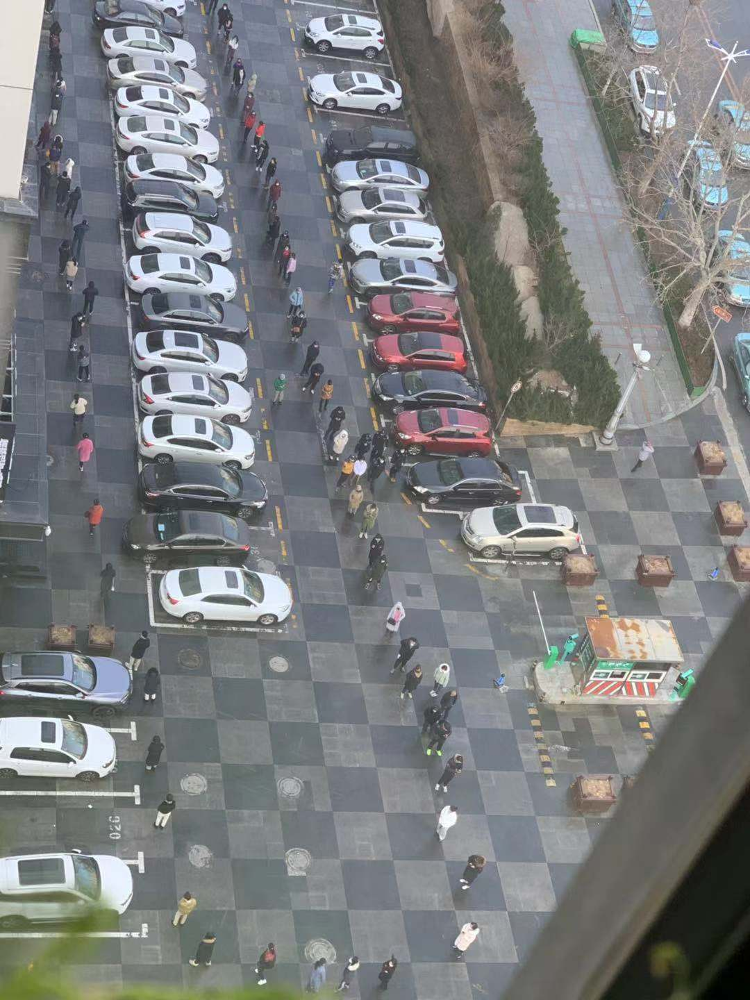

单位改成两个时间，错峰7：30或9：30上班。我选的9：30，这个时间点上，地铁中间站上车，有座。
某协弃最大的IT公司跟我们同一天复工，要求所有人不准坐公共交通工具，不准打车，只能自驾或者跟同事拼车或者步行。好在我司并未从恶如崩。

进地铁手腕测体温。很多人戴了护目镜，也有不少人戴了双层口罩。

单位大堂实名制测体温。具体来说，需要先刷一下卡，数据库检索有员工信息的，才测。
周一的时候是手持。周二增加了一个仪器，固定的像门一样，测脑门。但是均码的仪器对一米八以上和一米六以下都不怎么灵。

开工前统计过一次个人手里还有几只口罩，傻呵呵地回复了个15。结果这个数字是为部门发口罩准备的，还有存货的不准领。部门确实也没多少存货，只有几百个，还是在日本出差的部门长带着日本同事排队排回来的。
工作间内口罩不准摘。除跟客户电视会议外，所有三人以上会议取消。

空调跟窗户同时开。靠窗有点冷。
每两个小时，全身打农药装备的保安会进来喷一次84消毒液。周四以后变成了一天两次，估计是存货不太足。

保洁阿姨每天给发两只酒精棉棒，用来擦键盘。

多休的8天原则上不用补。但是客户要求进度必须在三月底以前补回来。各组自行周末加班，正常记串休。

午休时间改为弹性制，11：00～14：00之间任选一小时午休。一楼饭堂每张长桌只配一把椅子，一共只留下了15个座位。还是有不怕死的小年轻拽椅子坐一起吃饭，周二就被胆小的拍照举报了。邮件通报批评。
周围的小饭店只剩西北马记牛肉面一根独苗。过马路有麦叔叔和肯爷爷。
于是周一饼干，周二周四带饭，周三周五麦当劳。没带饭是因为忘记把饭盒带回家。
没办法，莫得习惯，从1993年以后就再没带过饭。

选9：30上班的，17点以后有些难熬——空调关了，窗还开着。
二次征集上班时间的时候，我们全组都要求换成7：30上班。

第一天，身上最先撑不住的器官是耳朵。KN94是标准的，可我的脑袋不标准啊！于是改为，上下班途中戴KF94，工作时戴一次性。并且由老婆大人动手，把KF94的口罩带改成了套头式。
回家后摘了口罩嘴的一圈都很难受，火烧火燎的，感觉有些像夏天的皮肤晒伤。

协弃市要求外地回来的人在家隔离14天。很多外地同事都是5号6号才回的协弃，所以人数是陆续增加的。开发间保持了松散的氛围。
主要是部门长A带孩子出去旅游，9号才回来，23号才能进大楼；部门长B在日本，基本没指望。于是没人管……

周二开始，楼下药店每天11点卖口罩，每天备货1000多个，凭本人身份证限购5个。这是周三10点的照片……

周四（2月13日），协弃政府5号令，所有餐饮售卖场所只准外带，不得堂食。于是西北马记也关门了。罗森的生意好了起来。饭堂的位置开始不够用了。

本来约好给客户装个样子，周末一起来加个班。
谁知下班的时候下起了雨夹雪，周六周日两天又预报大雪。

还是老实在家猫着吧。