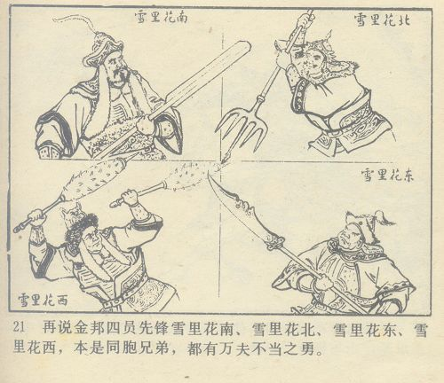
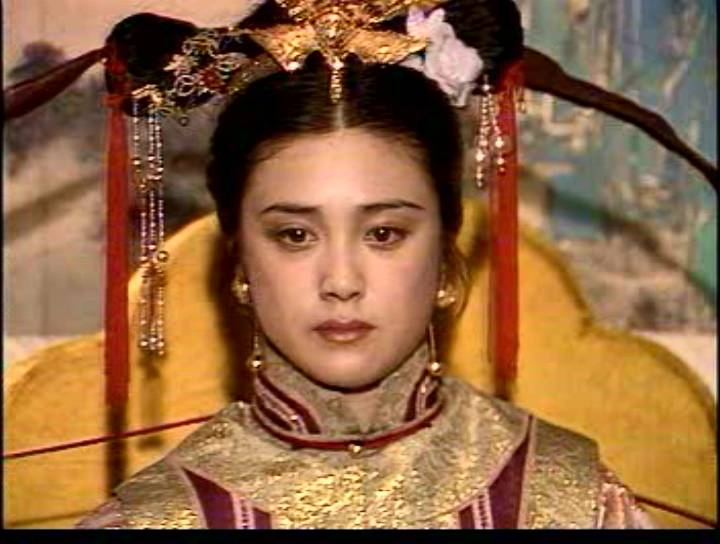

1987年很快就过去了，小学一年级的生活实在没什么好说的。
考完试之后，问题来了。
我不知道现在的小学是怎样的，反正我上学那会儿，小学考完试之后是不会直接放假的，总要拖上一周左右，这期间每天只去学校待到10点左右就放学了。
然而在过去的几个月，我都是由一个退休老师办的类似托管班的机构代管，每天跟小朋友们排着队放学的。进入一月份之后，可能怕费用方面产生计较，那个老太太根本就不来接了。

怎么办？
不得不夸赞一下我那长袖善舞的老妈，她平日里埋下的帮一个退休老工人领工资和厂里的各种补助的先手终于派上了用场：按照约定，放学之后，去她家。
门姥姥那时已经快70了，还身患癌症，根本没能力去学校门口接我。所以我需要自己走到学校对面的门姥姥家。
可是我还是忍不住吐槽一下老爹老妈，你们让刚满六周岁的我一个人去坐绿皮通勤火车的胆魄这会儿哪去了？过双排道的马路跟过六排道的马路有多大区别？

那时辽台上午9点半重播《西游记》。你没看错，在1988年1月，西游记就已经是假期保留节目了。所以放假前混日子的那几天都巴不得班主任越早放学越好。
放学之后冲到门姥姥家，运气好的话能看到前一集的尾巴。
门姥姥的儿子是跑远洋船的，她根本不差钱。她家里的电视是彩电。
非亲非故只是为了还人情才带我，所以她也不怎么管我，要看电视就看呗。
所以那是我第一次看彩色版的西游记。当然老太太也有炫耀的成份，犹记我在看的时候她在一边念叨：“看那些小猴，在电视里颜色多亮！”
在她家看的第一个半集是《大圣闹天宫》，当时觉得彩电这东西实在太好了。换现在，孙悟空打哪吒的特效连五毛钱的都算不上吧？
那几天里印象最深的一集则是《祸起观音院》。当时觉得黑熊精老牛叉了，带紧箍咒是跟悟空悟净红孩儿一般的待遇啊！对某某天王能防火的法宝表示非常感兴趣，还一度在《少年科学画报》上找到了其科学依据——我猜那个罩子是拿石棉网做的。现在看，五毛钱特效，again。
关于西游记的话题就此打住吧，以后也不再提了，反正大家都很熟。最后一句，《西游记精编版》是狗屎，《西游记续集》狗屎不如。

在一个老太太家能有什么娱乐……
她家里只有一副扑克两本小人书。一本是自己家里也有的《巴陵女侠》，另一本是岳飞传里的《小商河》。三天里《小商河》都快被我翻烂了。
所以小时候的印象就是杨再兴老牛叉了，第一次读《射雕》发现杨铁心那般窝囊，简直要骂娘了……

那咋办？陪老太太看电视呗。
AV1那个时候，下午会放一部戏曲电影。
三天里，看的分别是《女驸马》《徐九经升官记》《西厢记》。
《升官记》主角是丑角，所以倒没有大段的唱，能看懂，还觉得挺有意思的。朱世慧是不是当时的第一名丑不知道，反正是参与综艺节目、上镜率最高的京剧丑角演员。

《女驸马》就比较传统了，好在黄梅戏起码词能听懂；《西厢记》就要了命了，越剧这玩意儿它认识我我不认识它啊！
反正就觉得把一辈子的戏都看了（其实不是……）。

到了傍晚4点左右的时候，老太太有一部电视剧追——《努尔哈赤》。
打仗片，就跟着看呗。第一天记得有个女演员剧里演的是“啊吧该”，非常非常漂亮。刚才查了一下资料——原来是傅艺伟大妖。

第三天晚上老爹来接的时候，刚好演到努尔哈赤被大炮轰死。门姥姥在旁边还帮我科普：“大致啊，记住，满族人不打乌鸦，你要是长大以后遇到满族人，千万别在他们跟前挑齐乌鸦。”
近30年过去了。我跟很多满族人打过交道，却没见过一只活的乌鸦……

后面的一周，[老姑](https://pewae.com/2010/12/small-green.html)有空来接我放学，就再没去过她家。