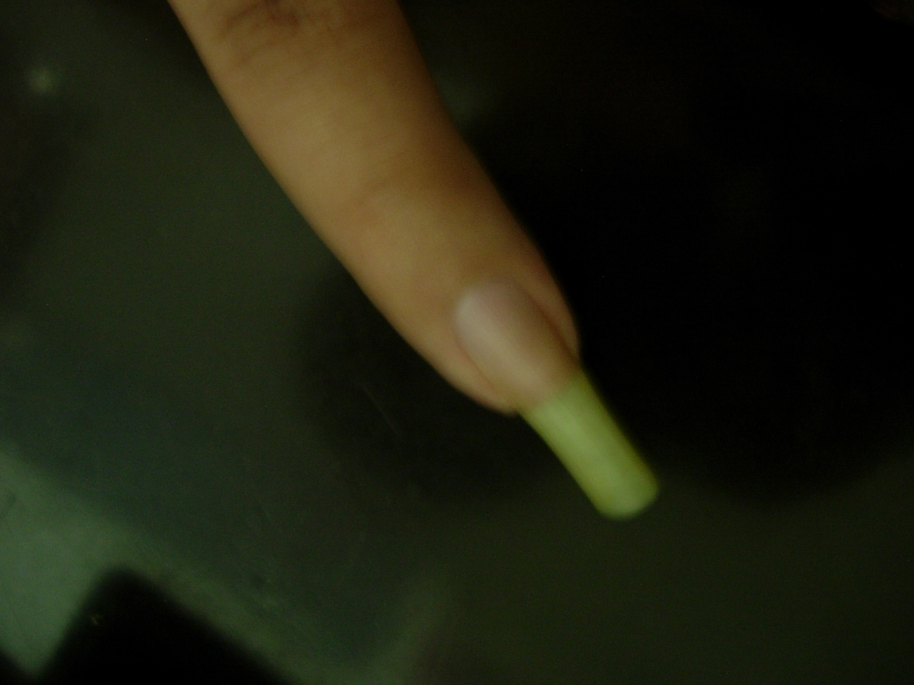

昨天大半夜的CSS修改+今天一整天的插件调试,终于俺blog的这次改造完成了.

其实新增的东西并不太多,新插件只启用了4个,还关停了好多插件.主要的经历都花在了这个theme的修改上.
这个theme的基准版本是Lemon的dark.奉GF之命俺不许用暗色调,就只好用半吊子的php加上没吊子的CSS,用从Intel偷回来的100人许可的UltraEdit慢慢做. 😥

图片修改.给自己的玉手拍了张照片,改了改,做成了title.侧边栏以及对应的分割线等图片也换成了死鸡崽黄,鸡粑粑黄和蛆壳黄,总之是一黄到底.也算是跟上个theme同一个系列的

侧边栏两个合并成了一个,并且稍微扩了一下内容区的大小.具体的在css里面,原作者Lemon老兄在sidebar里又分出来了sb1和sb2.俺统统把它们归并到了sb1上,并且把sb2的宽度设成了0.原来的Archives不要了,RecentPost稍微改了一下原Style里的fuction.选出的数量从5个改到10个,并且增加了输出的内容.具体的不说了,在更改记录里面写.
下方的bottom栏改成了三项,(自认为)经典帖子,随机帖子和最受欢迎帖子.臭美贴和受欢迎贴分别用了新插件.介绍看这里.

这次修改的重点实际上是新插件UTW和ELA,其中ELA基于UTW.因此,虽然之前花费了不少时间研究如何升级blog到2.1x,但是后来发现升级以后UTW会不好用就作罢了.所以在index.php,single.php和comment.php上也花费了不少心思.原来的风格,是自动带了本贴的tag了的,在single的时候,调用了UTW的一个功能,列出了相关帖子.comment的修改主要在头像上.原来的风格,带有的头像是gavatar的(效果见右侧边栏).奈何来这里留言的xdjm都很懒,只有有一个去注册的,俺只好动用了新插件 MonsterID,随机生成怪物头像.不想难看的哥们们,赶紧去注册吧.具体使用方法稍后奉上.

原有的Page也进行了大幅度调整,原Cosmos用新tag云替代(没办法,换插件了嘛!).Used Plugins和Construct合并,继续介绍使用的插件.Links和Archives单独成页.

存在的问题:
1.没能升级到2.13,好多基于ajax的插件不能用.没办法,谁叫你是psv球迷呢!
2.multi-topic-icon在FF下显示有问题
3.Sitemap显示不正常
4.Links页比较难看
5.Mybloglog联系的颜色没调整好.

google的广告现在没调整好颜色,以后再说吧.