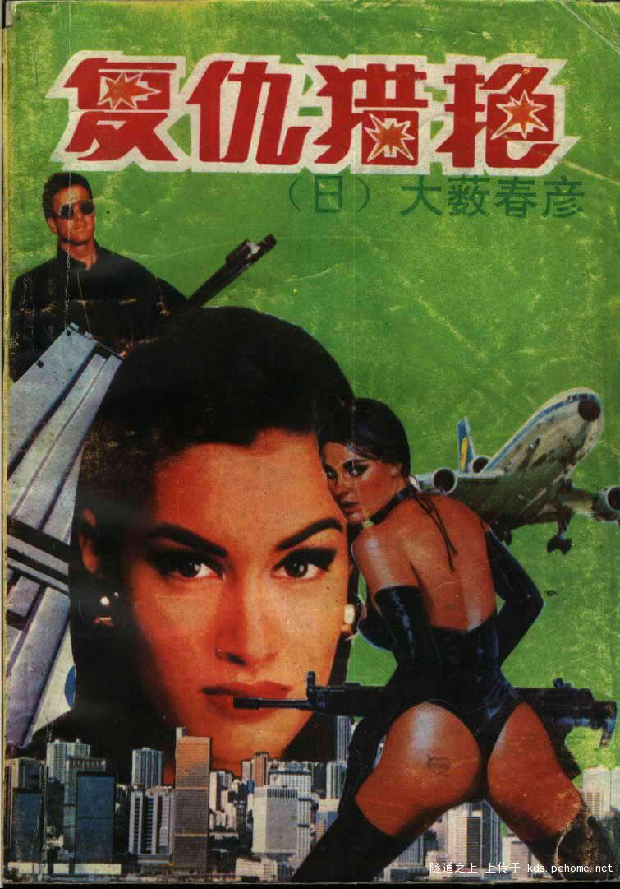

今天本来想写那个系列的第四部分。
就开始回忆，俺究竟是从什么时候开始看H文的呢？
固然，这回忆不比第一次看三级片那样印象深刻。
更多的是因为不好界定。
很难说那种大本黑皮印有大波妹的XXX扫黄纪实算不算H文；又或者万年历里治疗不举或脱肛的细致偏方和按摩手法算不算过度描写；又或者徐X瑄杨X敏的写真算不算最早的黄色图片……

于是思绪像风中飞舞的塑料袋一样东奔西走，一个响亮的名字被读到了大脑的二级缓存中：

大薮春彦！！

大概上初一的时候吧，偶然间在二表哥那里看到一本叫什么什么的复仇的书，作者就是这个家伙。那是俺第一次看内容很黄很暴力的小说——货真价实的黄（老婆被人轮，他又去XX仇人的情妇和女儿）、货真价实的暴力（XX之后全杀死，而且还是弄得满地血像武松干的那次一样的），就觉得很兴奋很过瘾。
而且还有人给加注释。书的不知道第几任主人在目录页画了一个大大的3.16，开篇就点出了本书的宗旨……
大数春彦这个名字也就这么记下了——一个写黄书的。
记得名字就不错了，谁还去计较名字怎么念？再说见字读一半儿，总有70%的概率念出来是对的吧？
这厮的书，风格跟现时的井口升差不多。充斥着犯罪、性、血、液体和脑浆。用子弹是最仁慈的方式了。什么绞肉啊X尸啊活体啊灌肠啊之类的屡见不鲜。俺一直深深地怀疑现在对cult片如此痴迷，是因为受到大薮的启蒙。

后来跟班里和学校里的几个书虫交流过经验之后，又认识了俩作者：西村~~兽兽~~寿行和西德尼谢尔顿。
西村跟大薮是一个路子的，但名气比大薮大得多。《追捕》没看过，总听过杨振华的相声吧？不认识中野良子，总认识高仓健吧？《追捕》就是这个人的成名作。
成名作不同于代表作，因为他的作品里，追捕这种模式是很多了，但写得如此干净的，绝无仅有。其余的大多会让男主人公和仇敌一号的老婆搞上那么一搞，或者让女主人公被人轮上那么一轮。甚至有一本书，就是讲群P的，先是和人，后是和狼。可能版署当年看追捕这片太红，就一时冲动允许引进了一批西村的书，后来想禁都禁不掉。甚至于有传闻，很多内容是国内书商在引进的时候，特意要求翻译往里面加的料……

西德尼谢尔顿爷爷就比较冤枉了。不过是在某几部作品里肉戏多了点，就被不法书商拿来挂名头卖A书。90年代初的书市上，但凡看到“西德尼谢尔顿最新力作”的，准定不是什么好货色。

这三个人比较起来，还是喜欢大薮的多些。首先排除的是谢尔顿。不知道为什么，看着渡边早田就是比丹尼斯约翰顺眼一点，也好记。再说西村寿行，他的书最大的问题就是警察出现得太多，还一个一个贼认真的那种，不像大薮，往往是一路大杀杀了好几个月也没人来管= =
当然大薮也有个毛病，跟古龙一样，好烂尾。

还有岑凯伦和雪米莉，俩写言情的。本来不屑一顾的，但有一次闹书荒从前排女生手里抢了本岑回来看。恍然大悟，原来“言情书”是这个调调儿啊！当然看的是伪作。实际上在那个资讯不发达的年代，你是无法分辨出谁是本尊谁是伪作的。岑凯伦尤甚，她根本也没写过那么几十上百本的书，而肉戏看多了，反而觉得那风花雪月的风格的是假的。何况很多伪作文笔要比本尊好得多。一如武侠界的卧龙生和李凉。真品卧龙生的文字那叫一枯燥无味啊……

越写越怀念被窝里蒙头打手电苦读的岁月了。

P.S：77-83这一代，跟后面的85后，差距不是一般的大啊！