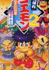

[大盗伍佑卫门2：奇天烈将军玛基尼斯](https://pewae.com/gaan/aHR0cHM6Ly93d3cuZG91YmFuLmNvbS9nYW1lLzM1NTY0NDYz)

原名：がんばれゴエモン2 奇天烈将军マッギネス机种：SFC厂商：科乐美类别：ACT发行年月：1993-12耗时：7

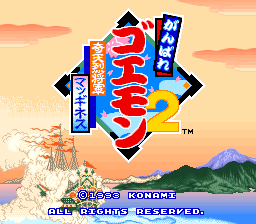

五右卫门是科纳米的又一个曾经辉煌过眼下却趋于沉寂的前著名IP。这个系列早期的制作人是科纳米元老、发明了“科纳米秘技”的桥本和久。在FC时代有三部正传和两部外传。其前两作可以说水平非常有限，也不知道科纳米从当中看到了什么，一直把该项目保留了下来。而且还是重点扶持项目。1988年的科纳米全家福游戏[《科纳米世界》](https://pewae.com/2007/04/konami-wai-wai-world.html)中，五右卫门就有很重的戏份。彼时五右卫门只在FC上出了一作，远远谈不上“系列”呢！
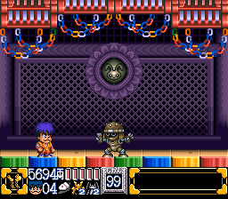

猜测一个可能的原因，五右卫门系列是科纳米所有角色中，日本历史要素最多的。出于弘扬日本文化的考虑难道也能骗政策？当然，正由于这个历史背景的因素，五右卫门系列的音乐一直是动听的日本风，加上科纳米矩形波俱乐部的一众鬼才编曲，游戏音乐现在拿来听也绝不过时。
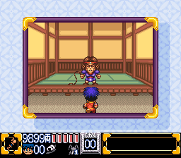

石川五右卫门在历史上确有其人，是与织田信长和丰臣秀吉同一时期的人物，著名的“侠盗”，类似英国的罗宾汉或者中国的燕子李三。其生平事迹经过小说和戏曲的大量渲染，大多已然真伪难分，仅出身就有五六种说法之多。唯一可以确定的是其死法：因为偷秀吉的东西被抓住，全家一起被油烹了。在歌舞伎作品中，五右卫门最突出的形象就是怪异的发型和手上的大烟斗。在游戏里，烟斗也就成了主角最具标志性的武器。当年玩科纳米世界的时候可认不出这是烟斗，而直接称其为“拿饭勺的”。
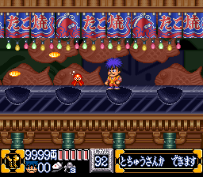

这次选了该系列最辉煌的SFC时期的作品来体验。SFC上的几款又名《加油！五右卫门》，充分利用了SFC的卷轴和缩放、旋转功能。之所以选择SFC上的2代，是因为据说这部的RPG要素最少而且难度最简单。
玩起来的感觉倒蛮奇特的。科纳米动作游戏的手感自然是没得说，基本颠覆了我SFC上动作游戏不如MD的粗鄙偏见。不过当年所吹捧的RPG要素却也没什么。虽然有三位人物可供选择，但区别不过是速度、跳跃、攻击方式这老几样，毫不新鲜。尤其没有女性角色，也就没什么可换的了。三个人最大的区别是在村里洗澡，进男女澡堂获得的奖励不同！想要获得额外的生命，五右卫门要进男澡堂，惠比寿丸要进女澡堂，佐助则男女通吃。所有的隐藏要素最终指向的只有加血加命加钱三个努力的方向。钱什么都能买。村里有赌场。要知道，靠钱支撑的游戏就怕同时存在赌场和存盘。不会发波动拳的玩家我见过，不会用谢夫罗德大法（而不是不屑于用）的可是闻所未闻。
村子里除了赌场和澡堂，还有商店，旅店和占卜房之类的。有意思的是村里的路人。偷武器的小偷，抢钱的老太太，碰一下追到死的野狗和官差。
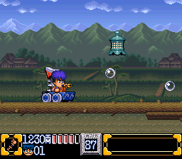

游戏的一个特色是中间有几场BOSS战，不是操作主角，而是驾驶巨大的机器人。有点儿玩TOP GUN的感觉。然而这种六键各有不同定义的操作系的玩法对我来说就不是那么友好就是。
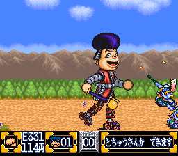
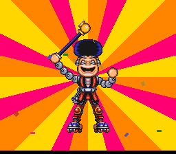
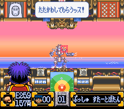

游戏进程中，能获得丰富的载具。但是因为带不到BOSS战，所以意义不大。只能说日本人对于机器人的热爱根深蒂固。
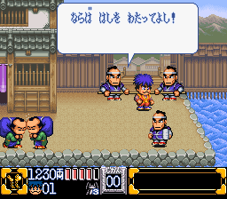
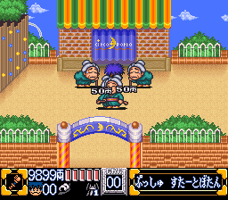

第二世界有个隐藏地图，里面可以玩四个隐藏游戏。将四个游戏都打通之后可以挑战隐藏BOSS。但是里面的擦地的游戏实在太不友好了，就放弃挑战了。值得一提的是其中的XEXEX的射击小游戏，有街机版和GBA版，有那么点R-TYPE的味道的说。
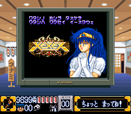
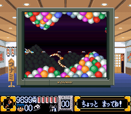

最终BOSS一点儿也不难打，倒是找BOSS的过程很有一些繁琐。跳来跳去卡时间什么的，怪不得动作游戏最终落伍了。
最后的结局有点儿意思，搞定“奇天烈将军”后，五右卫门的座驾被抢了。主角要挑战自己的座驾“冲击丸”。而且普通的攻击根本打不到，需要把对手发出来的子弹反弹回去才可以。考验
精准操作和背版面，也算是那时的时代特征吧。
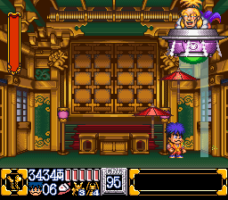

通关！
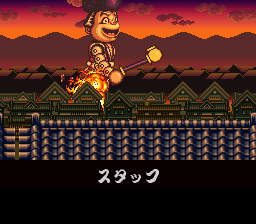
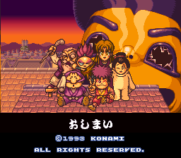