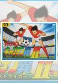
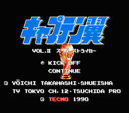
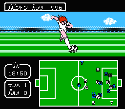
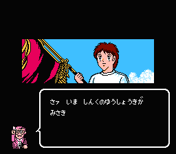
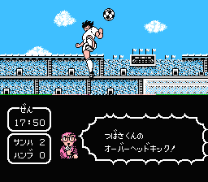
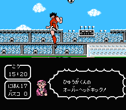
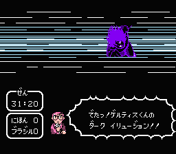
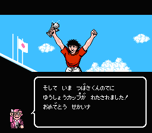
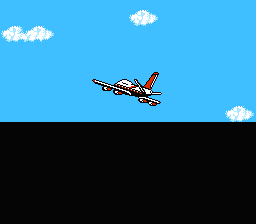

[天使之翼2：超级前锋](https://pewae.com/gaan/aHR0cHM6Ly93d3cuZG91YmFuLmNvbS9nYW1lLzEwODI4MDk0Lw==)

原名：キャプテン翼II スーパーストライカー别名：Captain Tsubasa Vol. II: Super Striker / 足球小将2机种：FC厂商：TECMO类别：SLG / SPG发行年月：1990-07耗时：48

那个时候,”脱库魔”还没有现在这么无耻,”天使之翼”还是大热漫画,同名的游戏当然也相当卖座.”队长翼”翻译成”天使之翼”算是相当精彩,但就是看不出波黑人萨利哈米季奇跟大空翼有什么共同点.
玩这个游戏的时候正是95年左右,37本的漫画已经差不多出全了.当时就对后来淘汰赛的任务不甚了解.直到大概3年之后我们上了高中,才买到世青篇,才知道最后一关的那个变态射手叫辛坦拿…
知道我们看的漫画跟日本有时差,没想到90年代的时差还那么大.

当时看来相当有魄力的画面

首先讲了漫画里略过的大空翼不再的时候南葛跟东邦争日本冠军

后面讲的都是世青赛

传说中的倒勾射门,能分清哪个是大空翼那个是日向小次郎么?

最后一关的变态守门员

VICTORY

LAST SIGHT

==== Update 14.9.27 ====
这一作竟然被评价为天使之翼系列的巅峰.我还是觉得剧情太冗长了.