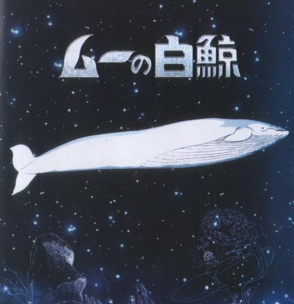
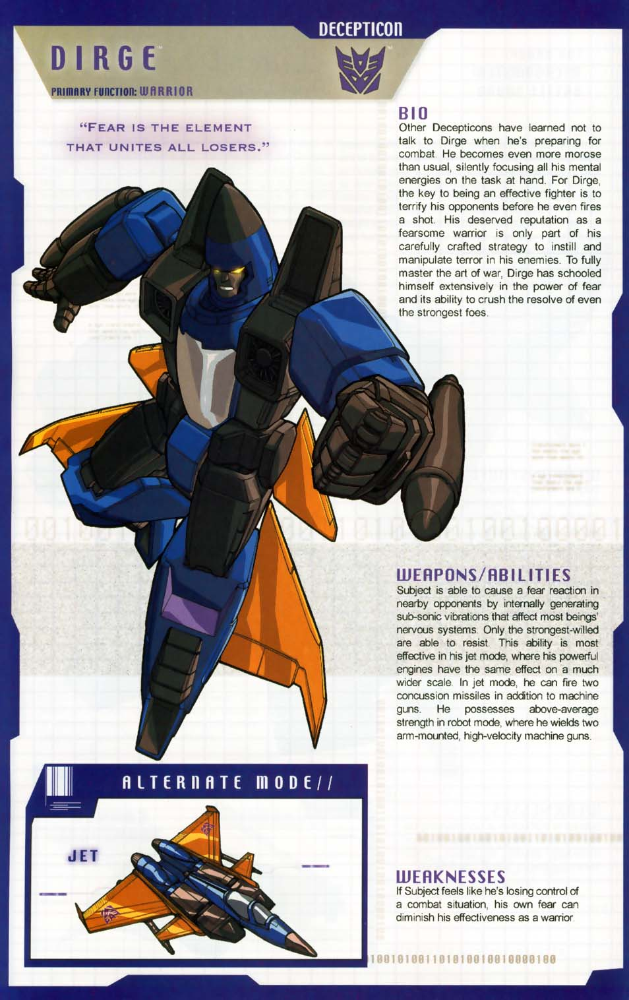
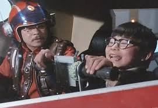
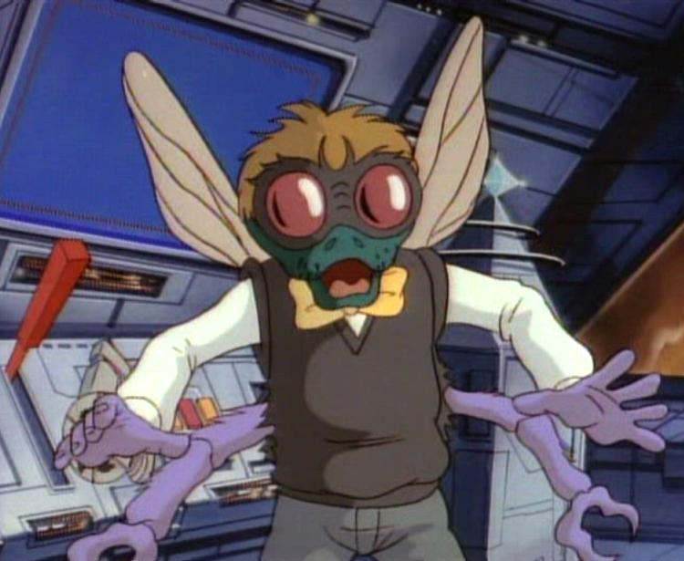
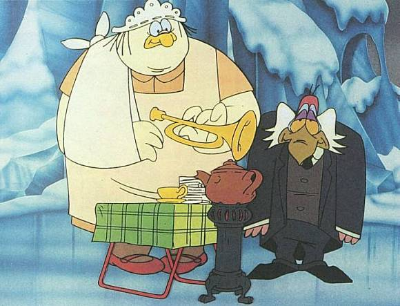
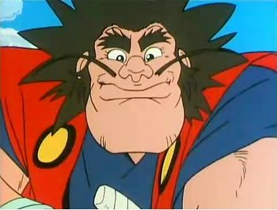
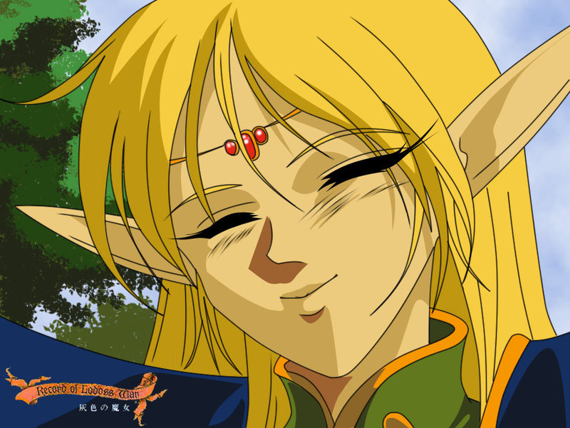
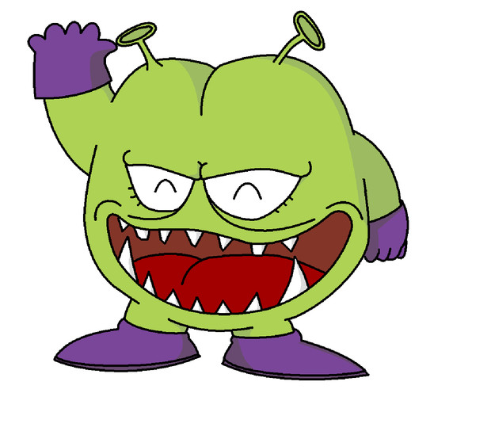
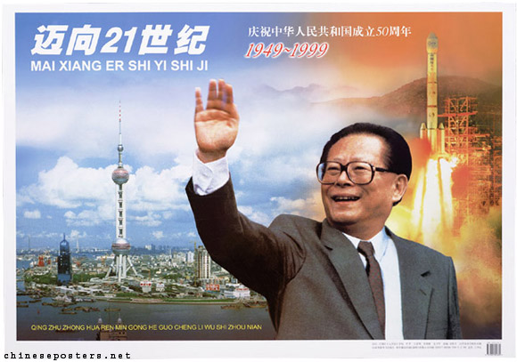

*按：思绪的流量一上来，360护舒宝花王海绵宝宝息壤叠加再叠加也拦不住。嘚啵完了才发现这是一篇炒鸡长的长篇。而我又非常憎恨把一篇文章分好几页的行为，这个自作主题里还特意废掉了分页功能。长就长吧，请忍受或~~换台~~离开本页面。*

1989年初秋，大表姐给俺娘打电话，说能弄到外贸的彩电名额。于是我们家的电视升级成了一台带遥控器带防爆玻璃的20寸康佳“佳丽彩”。也就是说，我们家其实跳过去了不带遥控器八个预选频道的第一代彩电。
电视本身的质量非常好，一直服役到2005年之后都没出什么毛病，只是后来显像管老化颜色实在是不行了才卖给收破烂的。
其实那个年代买彩电已经不需要配额了。但一来凭票的观念根深蒂固一时难以扭转，二来当时不论从观念上还是实际上出口的产品质量还是要好一些。第三嘛就是实际上中了彩电生产商或者经销商的饥饿营销的圈套，由于那年的特殊原因，这批彩电的出口订单实际上被取消了，着急的本应该是卖方才对。
这台彩电花了家里3000块，当时算是一笔非常大的开销。一直觉得“相当于现在多少多少钱”是非常不严谨的说法。举个实例供参照：1990年春游的时候，学校收3块钱玩了5种电动游乐设施；当天老娘给了我5块钱，我花掉1块钱跟大酒各打了1次（电子）靶，剩下4块钱留着回家打了电子游戏。

锦衣夜行不是老娘的风格。1990年的春节，十天的假期里老妈先后约了三波同事来家里，酒过三巡的时候就假装看一眼墙上的表，然后亲切地喊我过去：“大致，是不是到点演《一休》了？”然后就自说自话地把电视打开，把我摁那儿看电视。我tm不想看一休，我只想跑外面的雪地里撒点儿野！这就是我之前提到过对《一休》有抵触情绪的根本原因。
然而恶人有恶人磨。第三波客人里的肖叔叔借机会说，给一休配音的声优是他的远房外甥女，给他家送过挂历云云……搞得桌上气氛大变，纷纷恭维起名人的表舅来。老娘画风一变大手一挥：“好你赶紧出去玩吧～”

反正，我与电视为伴的生活从历史文本上不存在的那一年正式开始。

之前对电视谈不上多喜欢看，除了动画片，就只是跟着大人瞅那么一两眼。彩电则不同，有了彩电之后，每天晚上六点我都会准时坐在自己的塑料小凳子上，等大连台的节目开始。
我姑娘也喜欢看动画片，可现在打开盒子什么都有，都不晓得要怎样才能激发她学看表的动力。
等待的过程，就是对着特色图的这张“地球”。
那时大连台的开场动画还蛮有特色的——一只在海鸥在海浪里穿梭，越飞越近，最后两只翅膀变成圆圈，化成一个跟现在英菲尼迪/长城汽车的商标长得很像的台标。
然后是一女主播出来报节目单。这应该是跟CCAV有样学样来的。AV台的孙小梅女士凭借报节目单都能混到国家银话筒奖，在天涯八卦里看到AV台里四大啥啥的传闻，当时我就信了。

当时大连台的安排非常之蛋疼，6点开始不一定是直接放动画片，而常常会先放个啥啥专题节目。这也是每天要先守着听节目单的原因。6点不放动画的时候，就换到辽台，听评书。
好像把评书从广播搬到电视上是辽台首创的。田连元先生的《杨家将》、《瓦岗寨》，单田芳先生的《三侠五义》、《七侠小无义》、《童林传》，刘兰芳先生的《丑女无盐（绝对没写错，辽台当时片头字幕就是这个字）》都是大部头的长篇评书。袁阔成先生在辽台出场的次数不多，只有一部不太确定是不是他本人播讲的《烈火金刚》，反正听得不多。
虽然成就和地位什么的，可能是单田芳先生更高一些，但明显田先生热闹的风格更在小孩子中间更有市场。某个时间节点上广播里刘兰芳先生的《杨家将》与田连元先生的《杨家将》正面硬刚，报纸上还开过专栏拉开阵势让两方不同观点的听众讨论，好不热闹。田的版本节奏更快，语言的变化也多，用了很多流行的哏，这是老派的刘先生和单先生没法比的。田连元先生本身是有出过专辑的。一张磁带里录了4个评书小段儿。在沙豆子家听了几遍之后，我还学着说过《呼延庆打擂》，在社区的乘凉晚会上表演过。

呃，跑题了……
拉回来说大连台播的动画片。新电视进家的时候放的动画片是《大白鲸》。在许多同龄小伙伴的记忆里这并不是一部出彩的作品。我也只是因其恰好与彩电同时送付而有一些额外的印象。讲的是一帮前朝余孽躲在一条机械鲸鱼的肚子里到处煽风点火反抗殖民政府的故事。最后胜利靠的是美人计，策反了王子（？）这动画后来再没重播过，也不知是不是编辑结合当年的形势故意搞的。

紧接着大白鲸的是《小飞龙》。手冢大神的名作。这个印象就深刻得多了。可能是我接触的最早的血统论的动漫作品——海王子复仇记。主人公一头海带色的头发，武器是一把闪着红光的匕首，手下是三只海豚和一个粉色头发的美人鱼（吉祥物？）。七海的概念在这部动画里第一次接触到，海带头阿钟带着手下满海洋里乱窜，每一集的开头和结尾还有地图，说王子现在在某某海峡或者某某大洋，朝某莫地方进发。我深深地怀疑后来自己对大航海系列的热爱的缘起就是这部动画和圣斗士海皇篇。
这部作品的敌方角色比主人公方更丰富多彩：北冰洋的螃蟹脸将军会喷冰，有个什么虎鲨将军能指挥铺天盖地的魔鬼鱼，最有特点的是敌方的通信兵——粉色的大海蜇，长长的触须从海面一直伸到海底，触手在海底的礁石上像敲电报一样——再加上生动的国语版配音：“阿钟来了，阿钟来到海上了～”真是要多惊悚有多惊悚。那个国语版本应该是台湾配的音，现在网上找不到，真乃一大憾事。同样有特色的还有主题歌：“gogogogo go，海力童！（懂东懂东懂东东东东）”顺嘴说一句，那时引进的动画片不重配主题歌真是件有利于下一代成长的大好事。
有两集里出现过一个己方NPC，是一只海象还是海狮来的，名字叫“老杜”。后来为了掩护主人公一行人逃跑被那只会喷冰的螃蟹弄死了。恰好那时转学来了一位杜姓女同学，我就很不道德地把老杜这个外号挂到了她身上，弄得她好长一段时间都不跟我一起玩。
故事梗概？我不都说完了嘛，王子复仇记，海字都是多余的。

同年深秋，《变形金刚》登场了。大名作咱就好好唠唠。
大表姐一直以为我在她所有亲弟和表弟里是唯一一个能忍受她罗嗦的是因为我觉得她儿子待人亲，其实我不过是感激她鼓动我妈买电视让我童年中的变形金刚是全彩版的而已。
《变形金刚》绝对是未映先红。在新番放送前，已经有小伙伴跟父母去过外地或者有亲戚在大型国企的闭路电视上看过了。于是在放映前就建立了这部片不得不看的潜意识。到了开播的那一天，万人空巷，楼前楼后一个小孩儿都看不到。
作品本身质量也过关，G1故事的逻辑性是很强的，没用上10集就征服了所有的小屁孩儿——犹记《天火》播出的时候班级里角色扮演的分工早已明确了，而《天火》不过是第七集而已。关于角色扮演这回事，以前说过，我扮的是[闹翻天](https://pewae.com/2006/10/review-transformers-after-17-years.html)，为的是成全跟3P和大酒的兄弟之谊。说起来上海译的这一版在角色的起名上真是非常用心：一个简单的prime（老大）翻译成擎天柱可谓信达雅兼备，而把塔形电子管翻译成威震天简直是神来之笔，相较之下港译的直译版麦加登实在是弱爆了。同时G1里闹翻天惊天雷飞毛腿蓝霹雳飞过山挖地虎G2里大力金刚大无畏挽歌飞天虎混天豹都很有特色，尤其挽歌长得那个怂样子，都觉得这名白瞎了。唯一的败笔就是红蜘蛛了，人家明明叫星吼……

除了闹翻天，我喜欢的角色还有声波、反冲、诈骗、汽车大师以及后期的冲云霄、计算王、求雨鬼。呃，属实是[对博派不怎么感兴趣](https://pewae.com/2011/08/autobots-sucks.html)。班上的小伙伴们同样不喜欢扮博派，除了擎天柱探长千斤顶钢索等少数几个以外，大把大把的角色无人问津。尤其是大黄蜂，简直是废物的代名词，抓女生来演都没愿意演的。
孩之宝的玩具也就此大行其道，而且卖得嗷嗷贵。那时在国营的大型商场里，全套的擎天柱要120块钱。班上的一个小伙伴在新年晚会那天把另一个小伙伴的钢索弄坏了，赔了40块钱。那时邪恶的友谊商店里摆了个组合好的大力神，要150，只有羡慕的份儿。不过也就卖了那么两三年好价钱，后来就满大街盗版的了。1993年我自己买个两种变形的闪电就只要20块钱了。12年跟老婆逛街的时候，看到一家玩具店有卖复刻版的闹翻天，老板开价500大圆，觉得不值。当年晚些时候过生日老婆以为我好这个，去给我买了个电影版的铁皮回来，把我搞的哭笑不得。哥需要的是情怀啊！哥从来都不care博派啊！
对《变形金刚》电影版[除了失望还是失望](https://pewae.com/2007/07/review-the-transformer-movie.html)。3甚至无聊到在电影院里看睡着了。
变形金刚九十多集，而且播完之后不久就立即重播了一遍，是童年影响力最大的动画片。
至于后面的《头领战士》，除日式英雄六面兽外毫无亮点。

接档变形金刚的，没记错的话是《少年金米》。不能说差，但就怕货比货不是吗。《金米》讲的是三个小朋友上山学艺，分别学了鹤形拳、虎形拳、龙形拳。然后就跟人干干干，相互之间干干干之类的。主人公长得像乱马，龙形拳那个像紫龙，虎形拳的像元太。比较特别的是主人公学的是鹤形拳。从而被科普了形意拳里重要的一类。小时候的知识有很多是从这样杂七杂八的地方整来的。这部动画的主题歌被翻译成了中文：“中国拳法～举世闻名～最高荣誉～号称拳经～少年金米……终成拳经！”

期间还有一部不太起眼的作品，叫《忍者小英雄》。具体情节不大记得了，但它带来了两个重要动画概念：忍者和大胃王主角。

“克赛前来买菜，格德米斯不卖，阿尔塔夏耍赖，毛利在家肯咸菜。”
1990年的夏天属于《恐龙特急克塞号》。大连台特意在暑假开始的时候隆重推出了这部剧，每天六点准时开始。当时就发现剧情非常之不合理，男猪非得被干得不要不要的之后才能放大招“时间停止”。然后趁怪物无法反击一刀致胜。你丫一开始就不能直接放吗？难不成头五分钟都是在攒怒槽？
另一个谜团就是机器人基伊，究竟是真人、机器人还是木偶。几年前特意重温了一下，感觉应该是真人和模型混搭。
阿尔塔夏的演员还蛮清秀的，而我更喜欢的是一开始叫玛丽的那个女队员。可惜这人十几集后就消失了。
新世纪之前提起毛利，想到的就是这部特摄里的毛利大叔。演戏的感觉有点像吴孟达。

男猪倒是印象不深了，反正是个唐国强款的浓眉大眼小白脸，东亚区70年代男猪标配。
这部特摄在日本是真的不出名。我特意问过比我大一岁的客户五啊哥。五啊哥委婉地表示，他小时候生活在北海道，电视台比较少。可同样的他一跟人谈起奥特曼就两眼放光，跟见着肉的路飞似的。
最后的一集忘了什么原因没看到，后来特意在网上补上，感觉全无。

接下来，1991年，属于另一部大作：《忍者神龟》。故事大家都熟就不赘述了。最喜欢的角色是苍蝇人巴格斯特（又是反派！）。难道有六只手无数只眼睛并且会飞不是很酷吗？在小伙伴中间扮巴格斯特也并不丢人，好歹人家是科学家是有文化的，真正没人扮的是猪面。虽然跟牛头一样是万年死龙套，但可能是绿教的怨念太大吧。

跟变形金刚一样，主题曲大概可以归到摇滚类里。说起来咱也是听硬核长大的。
中后期有一集，主线是什么忘了，反正斯雷德被主角揍了个B样跑去找大BOSS朗格求安慰，朗格说我在看电视剧呢你别烦我！然后对着电视做着迷状来了一句：“哦，亲爱的玛莎！”据此，3P就跟我成立了一个“玛莎神教”。教义只有一条：“所有教众想干什么就干什么。”该教派目前成员二人，欢迎各位朝阳群众去揭发举报……
剧情到后来有些崩坏，各种人变动物动物变人。有一个小单元讲的是四只青蛙变成了人，斯雷德给他们拿破仑凯撒成吉思汗和阿提拉。好学的我还巴巴地跑到图书馆里去查阿提拉是谁。
还有一段故事是女主艾弗利尔变成了猫，猫女跟斯普林特大师还发生了一段不能不说的故事！

再后来是《太空堡垒》三部曲。看惯了米国的大开大阖，冷不丁换成日式的内敛风格稍微有些不适应，再加上是不那么大众的机甲题材，很多小伙伴就转投辽台听评书了。我倒是坚持着在看。其实后来才知道我们看到的引进版本仍旧是米国人剪的。那时候只觉得三种形态的机器人很酷，却不懂明美和瑞克为什么没能走到一起。莫名其妙地我非常不喜欢第二部。到了第三部的时候因为接续不上，看得也断断续续的。第三部里的变形摩托很酷。总之对于11岁的小屁孩来说，《太空堡垒》有些明珠暗投。至今在某些论坛上，MACROSS派跟ROBOTECH派还有打不完的官司，对我来说，那是哥哥姐姐们的事儿了。

《怪鸭历险记》是一部乍一看难以接受的动画。主要原因可能是因为刚开始受众没有吸血鬼文化的概念。这部动画里达Q拉被恶搞成了一只素食的鸭子，手下是一个总引诱达Q拉吸血的老鹰管家伊戈和力大无穷的鹅（？）保姆南妮。
当时班里有个微胖的女同学，脸型跟南妮特别像。3P就给她起外号南妮，全班叫开。想想还真没道德（虽然我也没少叫）。
记忆犹新的是里面有个钟表，duangduang响过之后两边各打开一个小门，左边一个小天使右边一个小恶魔，然后这俩开始PK……
一部动画看下来，达库拉的形象就固定成了逗比，看五七十遍《惊情四百年》都改不过来。直到世纪末玩恶魔城月下才有所好转。即使这样，第一次在街厅玩《恶魔战士》的时候，发现主人公叫迪米特里，还发了一通感慨：“这不是二货吸血鬼的二货吸血鬼表哥吗？”
这部动画的主题歌也是正宗的英式摇滚。

1992年，小学五到六年级的时候最无聊了。因为这个时候播的是《海底小精灵》。非常非常无聊的生活类的动画片。不仅男孩儿不爱看，女孩儿也同样不爱看。而评书那边是又臭又长的《童林传》，于是傍晚时段空出了好多时间去电游厅耍。
好在这时大连教育电视台横空出世，这事儿以后再说。

92-93年的《特种部队（G.I.GOE）》也许是童年时光里最后的大作。挺没特点的动画，反派里也找不出喜欢的人物。其历史地位从拍了电影又拍了续集就可见一斑，虽然电影质量是渣渣。
但这部动画里孩之宝的卖玩具电影不管人死活的弊端暴露无遗。特种部队的主要人物说没就没。头十来集什么公爵拦路虎之类的主要人物说没就没，翻译得也烂，什么红发女郎封面女郎傻傻分不清楚。这个时候也长大了不少，不再痴迷于真人角色扮演了。

特种部队前后放了好长一段时间的《大力水手》。乍一看挺有趣后来很无聊的动画。女主太丑也是一个槽点。不知大连台的编导怎么搞的，后期总是重复播以前放过的内容，差评！辽台那边依旧在播《童林传》……

中间穿插着放过两部幽默剧：《成长的烦恼》和《莎莉》。《莎莉》应该是部英剧，讲一个40岁左右的金发傻老娘们的故事。

93年暑假前半播了一部非常有特色的动画片《森林好小子》。这部动画是我心目中恶搞类动画的No.1，[前两年还重温了一下](https://pewae.com/2011/03/big-burning-chest.html)，依旧是满满的美好回忆。本博以前说过这片好几次了，跳过。

《神探加杰特》大约也是这个时候首播的。非常不错。坏蛋和主人公都笨得很有特点。最有趣的是时不时出现的“阅后即焚炸领导”。背景配乐非常有特色。最近一期的《奔跑吧兄弟》里邓超的背景音乐就是这个，当时就想，这是要跟友台的黄-柯南-磊打擂台吗？

1993年的后半段播出的是《魔神英雄坛》。嗯，其实坛是个错字，应该是日文汉字的「伝」，就是传的意思，在标题上出这种乌龙，翻译可以去死了。神龙斗士嘛，也算家喻户晓了。这部片播放的时候已经上初一了，而且大连台放动画片的时间也改成了5点半。想在半个小时内坐公交回到家是个不太可能完成的任务。尤其初一的那个班主任老太太酷爱推迟放学。所以看得有一搭没一搭的。这部动画最烂的地方是召唤机器人和放大招之前的套模板。一套做作的“神龙斗士——”或者“登龙剑”放下来，好几分钟都过去了，简直是想让人掀桌子。其实之前《恐龙特急克塞号》里的“人间大炮”也是这种骗时间的东西，但人家好歹每集场景都有变化的好吗？
这部动画最好的地方倒不是剧情，而是辽艺的配音。古拉玛、施巴拉古大师和西米高的配音，都非常有特色。配施巴拉古大师的陈大千老师已经去世了，在这儿用一句音容宛在，不过分吧？
后面的第二部和第三部也有播，但剧情更弱，我也失去了追番的条件了。

93年10月份左右，有一部《大笨狗》。因为本人对狗一向厌恶，没正眼看过。

再往后有一部《恐龙世纪》。在我看来粗制滥造，遇到就换台。

初中时错过的一部好作品是《忍者乱太郎》。首播时间大概是94年或者95年的暑假。剧集没有暑假长，开学后就再也看不到了。印象最深的是里面那条笑起来很贱的狗（好像叫himhim？）。

93年最后的记忆属于《大草原上的小老鼠》。大连台六点档唯一播过的国产片。制作不算太烂，故事一点儿新意没有。这部动画的制作方是大连的一个公司，可谓是上线骗补贴的鼻祖。

94年开始家里开通了有线电视，能收到的电视台一下从6个激增到30多个。各个卫视到了傍晚都会放动画片。什么《浣熊》《爱心熊》《叮当猫》之类，可这时放学时间已经远远跟“傍晚”扯不上什么关系了。偶尔周末或者放假看上一星半点，却完全无法投入。
不过有几个片还是值得念叨念叨。
首先是《战神金刚》一二部。这其实是很早的片子了，但国内引进的却晚。当年《变形金刚》大热，贴纸里会出现一些奇怪的机器人，来源其实就是这里。
其次是《六神合体》。本来好好的动画片，主题歌唱得人一点看片的欲望都没有。
其三是一部韩国片《新编西游记》。虽然不喜欢韩国货，但里面扛火箭筒的八戒和河童沙僧都是可圈可点的形象设计。主题歌也很有特色：chikichikichuakachuakachokochokocho!
还有提起来就恨得牙根痒痒的《小神龙俱乐部》。《神偷卡门》、《夜行神龙》以及我个人非常喜欢的《桑德坎》都是非常有趣的作品，可这破玩意儿就不说一下子播完，今天播这个明天播那个，连个囫囵的故事都记不住。
大连台的动画片质量从这时起江河日下。初中时期最大的遗憾来自《罗德岛战记(灰色魔女)》。OVA版是大连二套在95年的时候播的。那时已经不怎么追傍晚档的动画片了。偶然一次换台，发现我艹这不是迪度吗？赶紧停下来看。可惜已经是第九集。更可惜的是后面几天老师总拖堂，后面只看到了一集半。这部动画也不过13集而已。这也是辽艺配音天团给我留下的最后的印象。

前些日子陪臭宝看一部国产动画片，叫什么名记不住了，尚雯婕作曲并演唱的片尾曲差点把我吓死！脑海中一下就浮现出了罗德岛的主题歌《炎と永远》。不敢从小给小孩教点儿美的东西吗？

上了高中就更悲催了，高一高二分别是6点和7点放学，更不要提高三。几乎就跟傍晚档动画绝缘了。
即使是周末或者偶尔的假期，到了六点档也是死守着AV5的《体育新闻》，不仅是因为自己长大了，更是因为放的动画质量不高——尽管《七龙珠》、《足球小将(足球小子)》以及《TOUCH（棒球英豪）》都是这个时期播的。也许还要算上《篮球飞人（灌篮高手）》。
这四部名作放一起，不仅是因为他们播出时间接近，更是因为在我眼中这四部动画同一个毛病：拖。
前一个周日换台，第二次南葛与东邦之战，后一个周日一看，上半场还没打完；灌篮高手里打谁来着，一个三分球在空中飞了半集；龙珠98集的时候还在打天津饭，09版重新剪辑的龙珠改98集沙鲁都干死了；最过份的就是《棒球英豪》，好容易赏脸看它一集，竟然从头到尾都是男女主角在唠嗑，只换了三个场景……制作方这是在向十多年后的《乡村爱情》致敬吗？
这些都是大热漫画的改编作品，同步连载的带来的问题就是剧情拖。可问题是国内动画的引进有时差，《七龙珠》《足球小将》《篮球飞人》在之前我都快把漫画翻烂了。老牛破车般的动画进度当然无法吸引我的眼球。
不知道博友亲们有没有《灌篮高手》的忠实拥趸要蹦出来跟我拼命的。我知道这部作品在某些范围内的评价极高。在我这里，最好的动画主题歌不属于它（奇跡の海），制作最精良的动画不是它（EXILE），画功最好的动画不是它（剑风传奇），最早接触的长篇动画不是它（变形金刚），最早接触的日漫仍旧不是它（圣斗士），[我的篮球启蒙](https://pewae.com/2007/11/exciting-nba-finals-1994.html)也丝毫跟这部动画搭不上干系，所以在我这儿这部动画的评价真的一般。动画版《灌篮高手》与漫画版《篮球飞人》差距太大，您看完全套漫画再来跟我拼命不迟。

主题歌会引发人身体不适的《新世纪天鹰战士》也是高中时播的。本来也应该是未映先红的，毕竟凌波丽的手办和海报已经满大街都是了，谁知道主题歌恶心也就罢了，剧情也被改得面目全非。不对，不能罢了，好端端的ACG界里程碑式的《残酷天使的行动纲领》被唱成那个鬼样，高桥大姐会哭晕在厕所吧。还有，不能乱赖人，听声音演唱者绝对不是鞠萍。给大家推荐一个灰原哀(林原惠美)演唱的版本。

以上——————
还没完，以上只是大连台及其附庸的6点档部分。

跟上一台星海牌黑白电视机不同，康佳佳丽彩彩电配合老爹在路边5块钱买的处理品天线，收辽宁台的效果非常好。所以19：45档的辽台动画，只要没挡了老娘电视剧的道，也没少看。
《希曼》虽是希瑞的哥哥，播出却要比希瑞晚。希瑞骑顺风马，希曼骑什么什么虎；一帮酱油党队友眼睛都有毛病，主人公换身衣服就认不出来了；变身的时候都要大喊：“赐予我力量吧，我是希X！”。好像那个公司出的动画模式都差不多，一个模板最少套了三遍。上大学的时候，老六曾经跟我聊动画片的话题，问：“非凡的公主希瑞，顺风马，记得不？”“记得。”“宇宙的巨人希曼，骷髅王，记得不？”“记得。”“布雷斯塔警长，熊的力量，记得不？”“没看过。”“老五，鹰的眼睛，豹的速度，熊的力量，想不起来了？”“真没看过。”
辽台不播，我又没去过铁岭这种大城市，怎么可能看过《布雷斯塔警长》……前年在盒子上搜到看了几集，很失望。

《我的小怪物》题材非常棒，主人公是一只爱吃垃圾的外星怪物。另外一只外星大怪物要把这只吃垃圾的小怪物吃掉，然后就追追追跑跑跑。小时候我的一个外号就是爱吃垃圾的小怪物。

《机器娃娃与怪博士》初版阿拉蕾辽台根本没播完。只放了不到两个星期就戛然而止。当时有传闻是上头觉得影响不好不让放了。要真是被禁了也正常。无论偷看人洗澡的博士，随便脱衣服的三无少女，爱放屁的老师，抢小孩棒棒糖的话梅超人都会给小孩造成心理阴影。可惜的是那版的配音，阿拉蕾的声音又萌又脆，非常可爱，跟03日版的配音有一拼。
又回忆了一下，难道是因为屁股长在脑袋上的尼可加大王？

再后来，辽台7点后就不放动画片了。

相比之下，央视就弱爆了。可能是要考虑的因素太多，央视只能放《猫和老鼠》、《机器猫》这类根正苗红一点儿歪毛病没有的动画。
《猫和老鼠》是周日接档《米老鼠和唐老鸭》的，家喻户晓老少咸宜。
《机器猫》的播出时间是每个周日下午，意甲集锦之后，《正大综艺》重播之前。前期确实非常精彩，但到了后半就有乏力的感觉，道具和故事都很雷同。央视自己的什么节目里有捧机器猫而贬各个地方台引进动画水准不高的狗屁言论，加剧了抵触情绪的产生。后期总是播放已经放过的剧集，加之《正大综艺》也开始走下坡路，就不再有热切期盼的情绪，有机会就去玩红白机了。
现在对蓝胖子的态度仍有偏见，因为它太过主旋律了些。

后来少儿节目重组成《红黄蓝》，播的动画也印象不深。只有一个《地球超人》还凑合。仍旧是太过主旋律了些。

央视印象最深的是一套的16:45档。
这个时间相当讨厌。老师不拖堂且路上不打闹的情况下，才将将能进门赶上全部内容，否则就只会看得七零八碎的。小学四五年级的时候简直就没有不拖堂的时候。
《黑猫警长》是这个时间段印象最深的动画片，在这个时间上播过至少五遍。吊诡的事情在于几乎每次放，第二集《大战食猴鹰》我都能赶上，其次是第三集和第四集。然后，新世纪以前，我就没在电视上看到过第五集！

郑渊洁先生的三部童话改编的《魔方大厦》和《皮皮鲁和鲁西西（罐头小人）》、《舒克和贝塔》第一次看也是在这个时间点上。因为之前后两部作品的原著都看过，所以当时看的时候，心中无数草泥马游过。后来据说郑渊洁先生对《皮皮鲁和鲁西西》非常不满，这部动画也甚少重播。《舒克和贝塔》也只是截取了小说开头很小很小的一段。
《魔方大厦》被许多年纪稍小一点的小伙伴评为中国制作的最恐怖的动画片。我倒觉得它很cult很酷。唯一的遗憾是没拍完腰斩了。《怪老头》、《镜花缘》、《魔方大厦》这三大太监片好像都是这个时期的作品。

1990年的夏天，《葫芦兄弟》在这个时间上播出。之前跟小伙伴借来的小人书都翻烂了，终于可以看到动画版了。但悲催的是，跟CCAV2的世界杯录像时间冲突。那届并不是所有的场次都有直播，所以傍晚这场录像的唯一机会，老爹是不会把电视让给我的。所以没看过完整动画版的怨念又往后保持了好多年。

后面关于辽台和央视的部分本来打算以后再讲的，想着想着发现内容不多，就整一块儿了。
关于傍晚档动画的故事就到这里，缺少的《圣斗士》《铠传》和《华斯比历险记》，我是故意留给下回的。