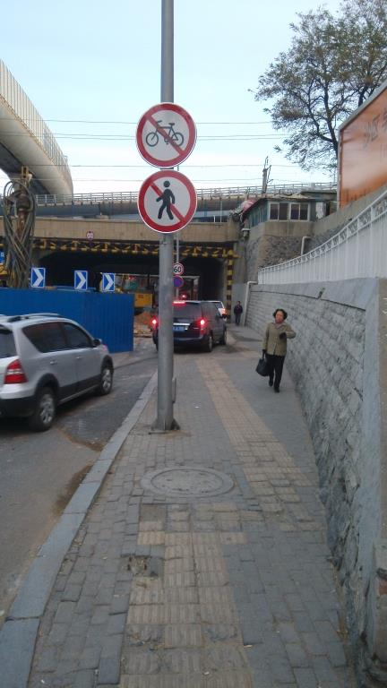
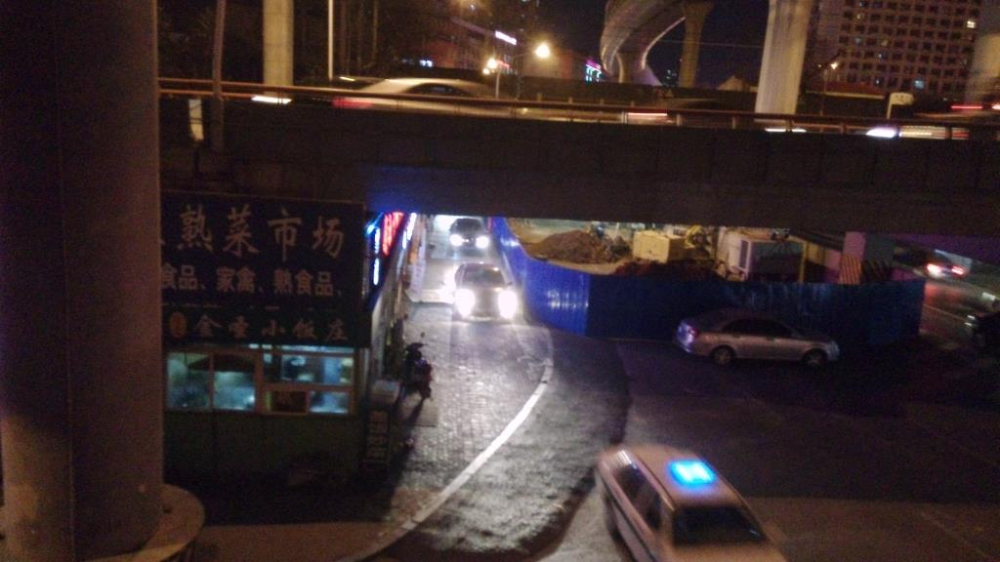
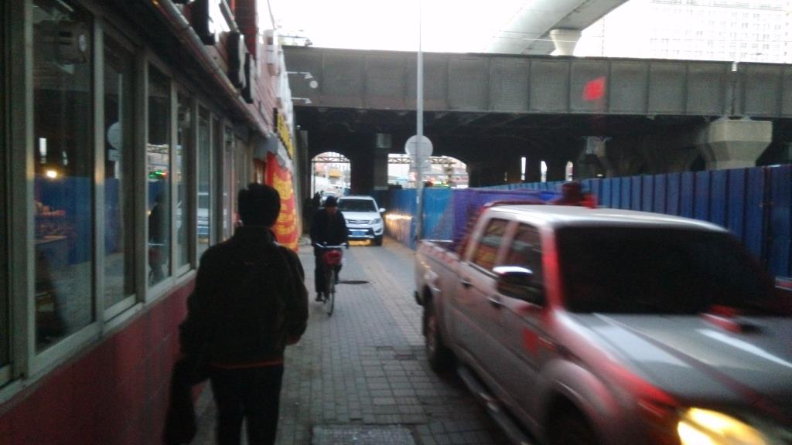

家门口的路忽然就不让走了。不是车行道，是人行道。

> 地铁1号线的香工街站—中长街站区间盾构施工下穿沙河口铁路桥桥梁基础，为确保铁路桥梁及铁路行车安全，需要对桥梁、铁路线路进行加固施工。施工期间，沙河口铁路桥洞内部分车道需进行封闭。计划从11月5日开始施工，工期预计85天。
> 　　沙河口铁路桥洞位于华北路和西安路的连线上，是市区南北向交通的主要干道，该桥洞施工将对市区交通产生重要影响，为保证工程的顺利进行，将根据工程的进展情况对现场周边道路交通进行管制。
> 交通管制
> 　　1）由于施工影响，沙河口铁路桥洞将由双向6排车道减少为双向4排车道，内侧车行道为公交专用道，专用时间段为6时30分至8时30分；16时30分至19时（现场设置交通违法监控抓拍系统），公交部门将对通过施工路段的公交线路增加班次。
> 　　2）施工期间桥洞**东侧人行道禁止行人通行**，人行通道改为机动车通道。
> 　　3）中长街西安路口，除公交车外禁止车辆由南向西、由西向北左转弯。
> 　　4）香海街华北路路口设置临时信号灯，允许华北路车辆左转进入香海街。

很多时候，你不得不佩服相关部门的智商。总这么拍脑门，不觉得头大么？
才4天而已，这条路上已经轧出了好几个大坑，人行道下方的不知什么管子（可能是污水）也开始漏水。因为是重点项目，所以应对也算及时——坑上盖板子，漏水的地方开动马达抽水……唯独不给行人解决方案。

虽然300米开外的十字路口上已经挂上了“前方地铁施工，只允许公交车通行，其余车辆请绕行”的牌子，虽然进桥洞的两条主道上一个挂了不准直行一个挂了不准左拐的牌子，但胆子大的司机们依旧我行我素，尤其在早晚的时候——因为他们知道不会为一个三个月的临时工程增加摄像头，甚至不会为这个修改已有摄像头的监控程序。只要不遇上警察，就万事大吉。
警察也不管。交警存在的意义是疏导交通。面对汹涌而来的违章大军，他们是不能让车掉头回转的——因为另一个方向也减少了一条车道，也堵得不像个样；同样他们也不能把车拦下来处罚——那样路也会被堵上。所以他们能做的只是俩眼一闭把大车往里面指小车往人行道上指，到点打卡下班万事儿。

但是行人只能把这禁止通行的牌子当狗屁。以我下班为例，如果绕道，意味着不到100米的直线距离要走过街天桥过到马路对面，走对面的人行道过了桥洞再走人行天桥过回来。我本人愿意我那脆弱的膝盖也不愿意啊！

唉唉？为啥光举下班的例子不说上班涅？
因为这帮逗比只在进车的那一侧立了牌子，另一侧啥都没有！！所谓的交通安全，只能靠行人和司机自觉了。

> 第四节 行人和乘车人通行规定
> 第六十一条 行人应当在人行道内行走，没有人行道的靠路边行走。
> 第六十二条 行人通过路口或者横过道路，应当走人行横道或者过街设施；通过有交通信号灯的人行横道，应当按照交通信号灯指示通行；通过没有交通信号灯、人行横道的路口，或者在没有过街设施的路段横过道路，应当在确认安全后通过。
> 第六十三条 行人不得跨越、倚坐道路隔离设施，不得扒车、强行拦车或者实施妨碍道路交通安全的其他行为。
> 第六十四条 学龄前儿童以及不能辨认或者不能控制自己行为的精神疾病患者、智力障碍者在道路上通行，应当由其监护人、监护人委托的人或者对其负有管理、保护职责的人带领。
> 盲人在道路上通行，应当使用盲杖或者采取其他导盲手段，车辆应当避让盲人。
> 第六十五条 行人通过铁路道口时，应当按照交通信号或者管理人员的指挥通行；没有交通信号和管理人员的，应当在确认无火车驶临后，迅速通过。
> 第六十六条 乘车人不得携带易燃易爆等危险物品，不得向车外抛洒物品，不得有影响驾驶人安全驾驶的行为。