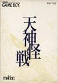

[天神怪战](https://pewae.com/gaan/aHR0cHM6Ly93d3cuZ2lhbnRib21iLmNvbS9tZXJjZW5hcnktZm9yY2UvMzAzMC0yODQwOC8=)

原名：天神怪戦机种：GB厂商：Meldac类别：STG发行年月：1990-04耗时：3

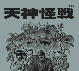
这是个合卡里经常出现的游戏，在米国的评价挺高。
当年被大量的日文假名唬住了，没深入玩几次。当然也跟自己射击游戏苦手有很大关系。
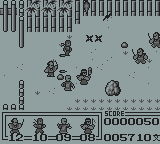

其实这个游戏非常有趣——虽然是射击类，却有很多的策略要素。如果把ARPG当作一个独立的类型的话，这个游戏应该算作S（LG）STG。
游戏的一开始给你一笔钱，你需要用这笔钱雇佣五种角色里的若干个组成一个队伍，每种角色的攻击手段、血量都不同，如何搭配要费一番功夫：
最便宜的是用长枪的足轻，射程最远，射速最慢，血量最少，而且不能放大招。
武士各个方面都很平庸。
忍者射速很快，攻击力强，射程最近。
巫女变身很厉害，可子弹却是打上下两个方向的。
和尚整体实力最强，45度射击，却也最贵，初始资金最多买两个。
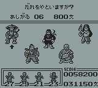
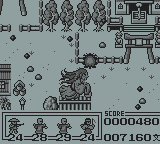
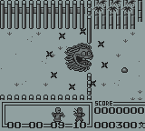

游戏的过程也要讲究策略，按B键可以切换队形，按SELECT能切换打头的队员。有的时候对方打过来的子弹是万万躲不过去的，这时就要分配血量，看看用谁挡枪合适……
并且，每关的进行途中，有商店出现，可以跟老板买血或者买保护。
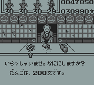
其中如来佛的帮助最狗屎了，收大笔银子，变出一条一碰就死的狗来……
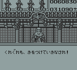

难能可贵的是，作为一款GB游戏，竟然还有“放保险”的设定：AB同时按下，除足轻以外的队员都能呈现出不同的无敌状态，代价就是无敌时间一过，这队员也就消失了。
和尚的大招是有大用的：在BOSS没出现前，警告音乐响起的时候放大着，和尚的无敌时间刚好撑过BOSS出场POS摆完，也就是说根本不用打BOSS。
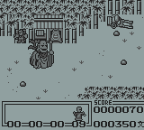

本作的出品方叫Meldac，并不是什么出名的游戏公司。甚至连“游戏”公司都不敢当，只出过6款游戏就销声匿迹了——他们本来是家唱片公司。不能不让人喟叹日本黄金年代的强大。
但是这家公司的技术能力就很不怎么样了，活动块多的时候，缺帧的现象非常严重，想截一张完整的图都需要碰运气。
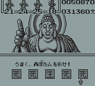

照例是BOSS亮相时间。
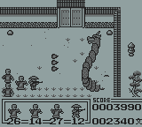
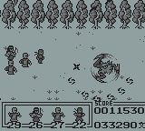
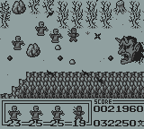
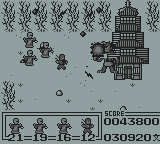
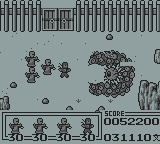
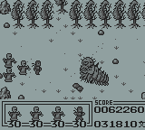
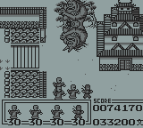

最后的通关画面，可以说是相当敷衍的了。
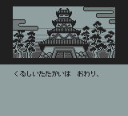
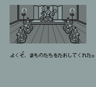