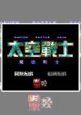

[太空战士：魔法战士](https://pewae.com/gaan/aHR0cHM6Ly93d3cuZG91YmFuLmNvbS9nYW1lLzI2MzcyOTY1)

原名：太空战士-魔法战士机种：MD厂商：川普科技类别：SLG发行年月：1996-01耗时：30

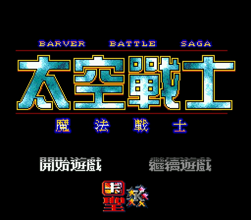

自从《电软》推荐上的《赌神》打开了我玩“文字卡”的大门之后，我就到处寻摸文字类游戏来玩。大约在1997年，这款标题明显蹭热度的山寨游戏试玩的时候感觉还不错，就直接买了回家。其实“还不错”的标准是非常简单的，那就是在房间里能轻松地翻箱倒柜，并且能找到物品。
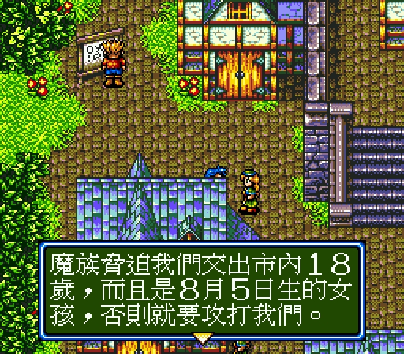
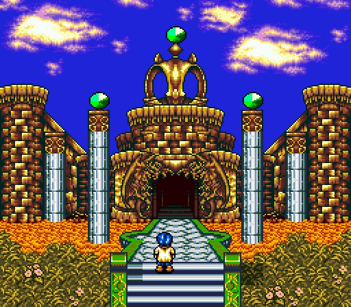

这个游戏可以算打了20多年。最早买回来是在1997年，暑假里打了大约1/4。1998的可怜的只有几天的暑假，发现掉了记录，搁置了。等99年高考结束，终于有了时间，打了10多天也没打穿。大概停在还有最后1/8的样子。上了大学之后，发现有了模拟器，当然在模拟器上又开了一把。但是当年的rom有瑕疵，打不久就会定版。及至再放假回家，却再也没打开过MD实机了。
那时候也没放出过满级和满钱的秘技，打到后来踩地雷真是踩恶心了。
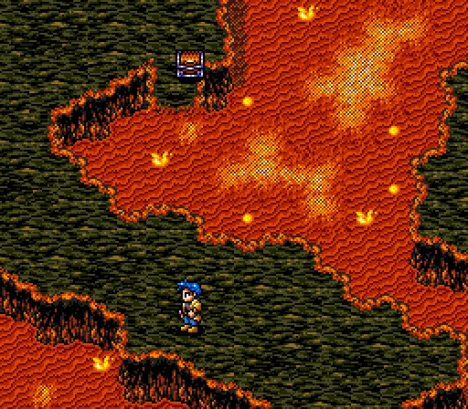
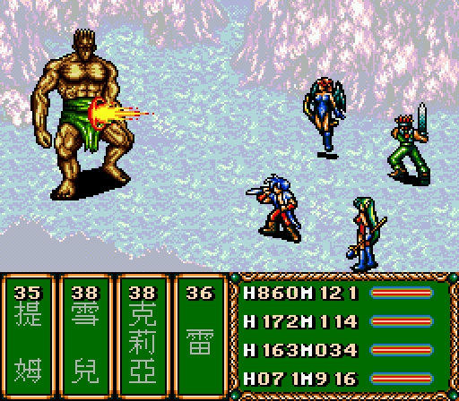

那个年代玩过游戏的都知道，“太空战士”是港台给予square的名系列“最终幻想”的译名。这个译名多数时间用在盗版卡带上，当然也没有官方的授权。台湾这家名为川普的公司太鸡贼了，起了这么个不要脸的名字。以至于在标题画面上连名字都没敢留，怕是被追责吧。其实MD后期的几部台产中文RPG和SRPG作品，一半是这家公司的作品：《封神英杰传》、《亚瑟传说》、《水浒传》和本作。
“太空战士”这几个字虽然不准确，“魔法战士”倒是确实的。本作设计了丰富的魔法，而且每个主角都能使用。魔法可分为村子里买到的厉害的和迷宫里获得的厉害的。其中最具有特色的就是各种召唤魔法，比如下图中的什么什么精灵。反正这个游戏的美工还算下了功夫。但是我打RPG素来不喜魔法的繁琐操作。
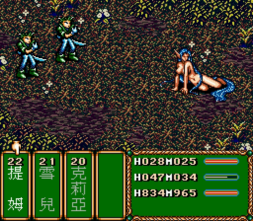

这部作品是我第一次玩到仙剑式的有限踩地雷遇敌以及半实时的进度条回合制。这两种玩法我看来都不怎么样。
这游戏太过于中规中矩，甚至枯燥。包括但不仅限于想前进必须练级，必须及时更换道具，打BOSS前必须屯一堆药，诸如此类。
当然中规中矩已是不容易，起码将又一个中二少年拯救世界的故事讲圆了不是嘛。
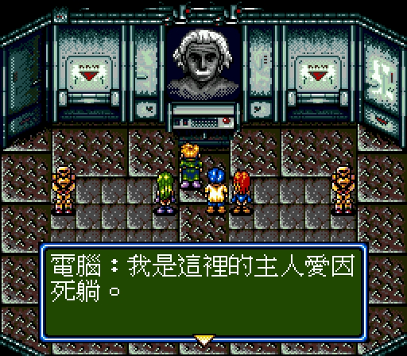
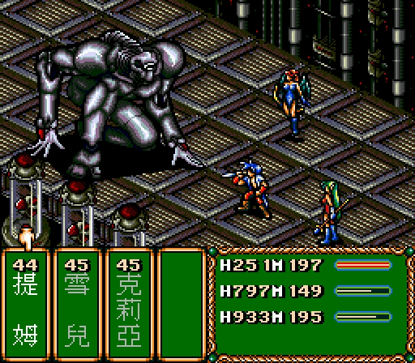
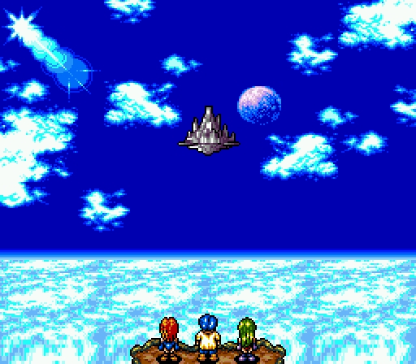

电软的攻略质量还行，就是倒数第二个迷宫的破解方法有问题。攻略作者好心记下的踩机关顺序根本没用，人家迷宫是随机的……
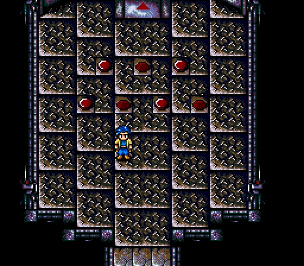

因为一切都没什么特色，所以打到后来除了一股执念也没什么好说的了。
最后的BOSS，我没练级，但是全套最终武器，打BOSS打了20分钟……
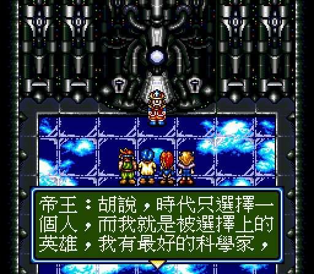
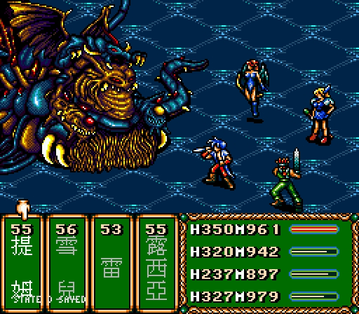

通关！
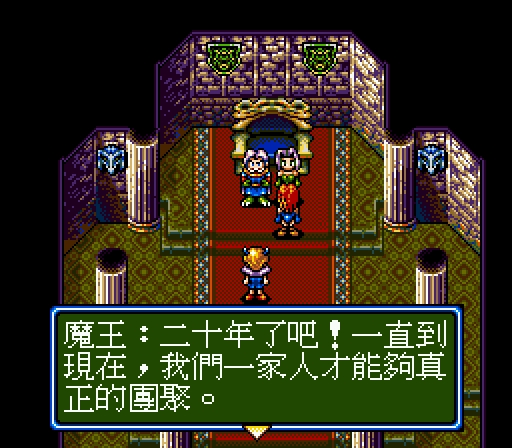
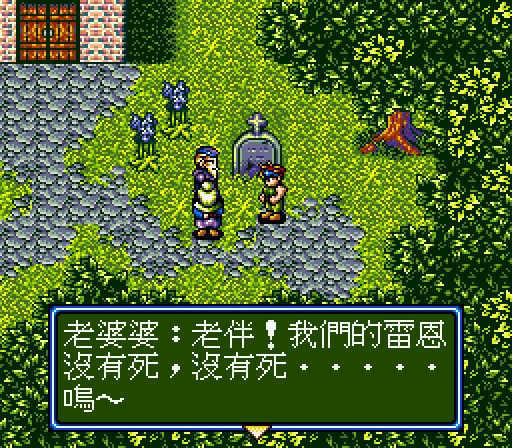
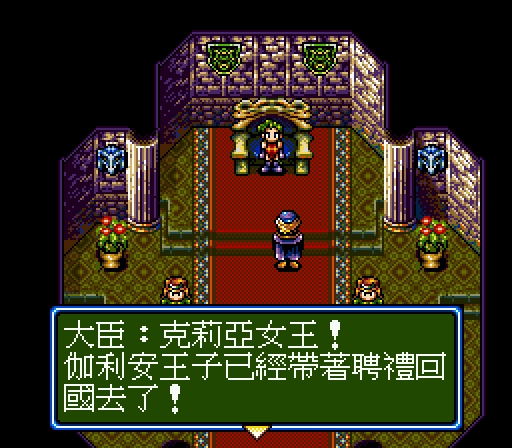
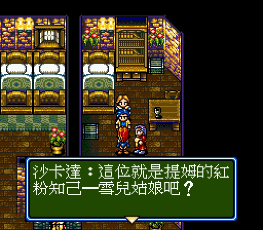
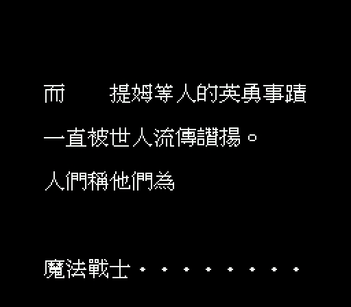
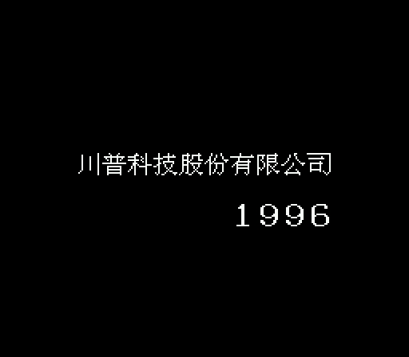