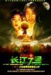
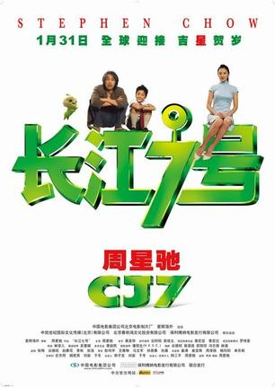

[长江七号](https://pewae.com/gaan/aHR0cHM6Ly9tb3ZpZS5kb3ViYW4uY29tL3N1YmplY3QvMTk2MTk2My8=)

导演：周星驰主演：冯勉恒 / 周星驰 / 姚文雪 / 张雨绮 / 徐娇 / 李尚正 / 林子聪 / 胡倩琳 / 韩永华 / 黄蕾类型：喜剧 / 科幻地区：大陆 / 香港首映时间：2008

不知道是导得不好还是剪得不好,这片看着挺难受的.
不是心里难受,而是皮肤瘙痒的那种.
比如幻想的情节比真实的情节还要长,而且是过分拖沓的长;
比如几个小崽子说小孩子的事情跟大人无关,之后却戛然而止;
比如那个周老虎状的看到飞碟的农民,纯为了搞笑而拖长篇幅;
比如周星驰摔死的过程,让人不由想起十面埋伏里的章子怡,虽然最终周还是死了.
总之这片的节奏让人不舒服.

周神已经老了,对40岁的父亲把握得不错,却怎么看也不像40岁的民工.
小孩演得不错,虽然有点夸张得过,但是放在周式喜剧片里感觉很合拍.
那个大胸花瓶…唉,我就不多要求花瓶什么了.
唯一的亮点就是史莱姆狗了.
