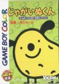
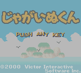
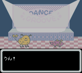
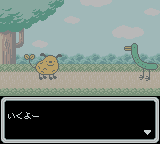
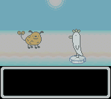
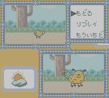
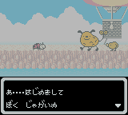
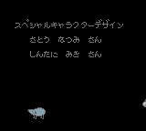

[奇异岛](https://pewae.com/gaan/aHR0cHM6Ly9nYW1lZmFxcy5nYW1lc3BvdC5jb20vZ2JjLzU3Njk5Ni1qYWdhaW51LWt1bg==)

原名：ジャガ犬君机种：GBC厂商：Victor类别：ETC发行年月：2000-03耗时：2

我非常不喜欢“奇异岛”这个名字。这个游戏直译应该叫“马铃薯狗”。本身是一部面向低幼年龄层的动画。能够找到台湾配音的资源，很Q。

看看这画面的配色，实在太萌了。可惜我的GBC丢了十多年了，不然在真机的淡彩液晶上玩一定非常漂亮。

所以这个游戏本身也是面向低幼年龄层，操作就非常非常easy。就是主角不会跳舞，然后跟它的小伙伴黄瓜鸡胡萝卜虾地瓜刺猬什么的学跳舞。跳舞的过程也非常简单，就是上下左右掌握好节奏即可。

之所以选这个游戏，除了画面可爱以外，一个重要的原因是对话简单，可以作为日语的入门读物来读。

流程很短，三关以后就可以看通关画面了。

