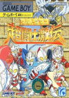

[奥特曼超斗士激传](https://pewae.com/gaan/aHR0cHM6Ly93d3cuZ2lhbnRib21iLmNvbS91bHRyYW1hbi1jaG91LXRvdXNoaS1nZWtpZGVuLzMwMzAtNDE0MTQv)

原名：UltraMan Chou Toushi Gekiden机种：GBC厂商：ANGEL / 万代类别：FTG发行年月：1994-08耗时：4

又是一个合卡里经常出现的游戏。
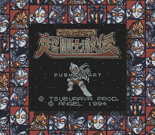
说起来，我们这代人跟奥特曼是没什么交集的，因为奥特曼引进的时候，已经是初三或者高一，根本无暇看电视。即使假期，也不会对一眼假的特摄更多关注了，何况有小时候先入为主的《恐龙特急克塞号》。
所以，当年就对这部根据剧作改编的游戏完全无感。
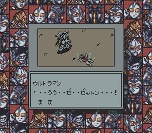
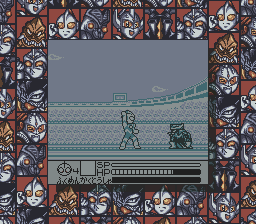

其实，这个游戏倒还蛮好玩的。光游戏类型就把格斗、动作、射击这三大主流类型给占全了。
游戏开始的时候是个普通的动作游戏，拳脚打人那种。按住B攒劲可以根据不同的时间放出不同的招式，有百裂拳、甜甜圈子弹、动感光波三种。动作关卡里敌人非常容易对付，倒是跑地形需要一些耐心。
完全是送来练手的。
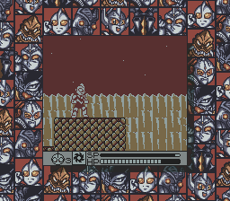
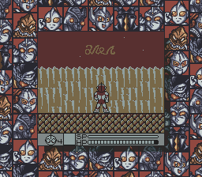
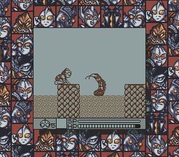

接着画风一变，成了射击类型，同样可以攒劲。射击嘛，就是用子弹打敌人并且不让敌人的子弹打到你的游戏，没什么可说的。
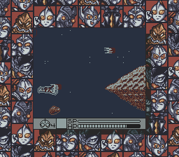

再接下来，BOSS战又成了格斗游戏。大多挺简单的，不等对方放大招就可以KO掉。
这里设计有些不合理，最容易放出的百裂拳反而是威力最大的。
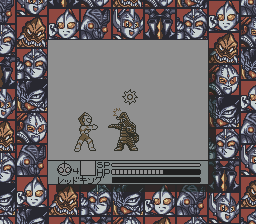
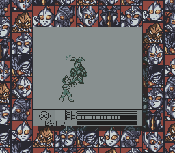

BOSS们都大同小异，同质化严重。
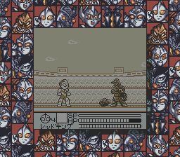
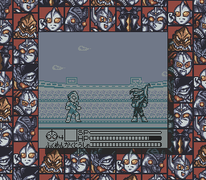
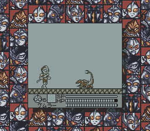
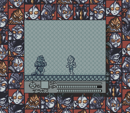

过关时候的小静画倒是做得言简意赅的。虽然我总觉得第三张的脸是从哪儿抄来的。
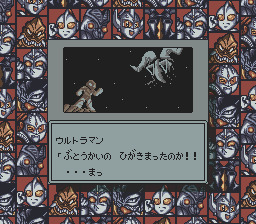
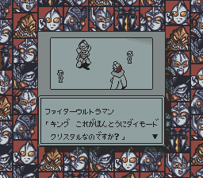
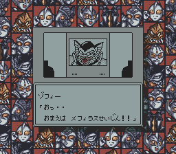

这个场景也像从洛克人抄来的。
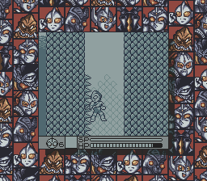

稀里糊涂就通关了。
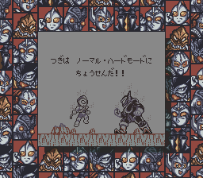

还有对战模式可以选，但不能选敌人你要个对战模式有屁用啊！
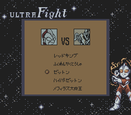