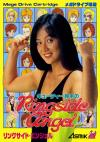

[女子摔角](https://pewae.com/gaan/aHR0cHM6Ly93d3cubW9ieWdhbWVzLmNvbS9nYW1lL2dlbmVzaXMvY3V0aWUtc3V6dWtpLW5vLXJpbmdzaWRlLWFuZ2Vs)

原名：キューティー鈴木のリングサイドエンジェル / Cutie Suzuki Ringside Angel别名：摔角天使 / 铃木女子摔角机种：MD厂商：ASMIK类别：FTG发行年月：1990-12耗时：8

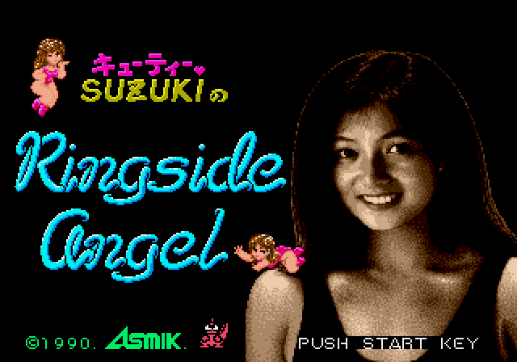
世嘉MD机刚出来那会儿，家用机上的格斗游戏都不怎么多。包机房里刚出现世嘉MD的时候，最受欢迎的格斗游戏就是这个。当然不是因为游戏有多么好玩，而是因为穿的少嘛。
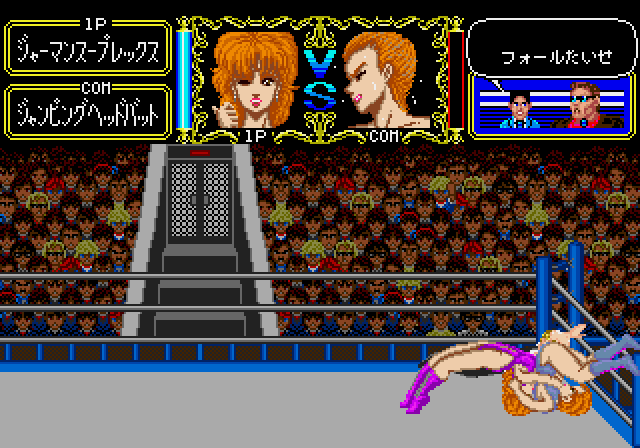

根据资料，封面上这个MM应该是当时的日本女子摔角比赛冠军，江湖人称“Cutie 铃木”。游戏的正式名称意译过来应该是《CUTIE铃木：摔角台上的天使》。这种不伦不类的明星+运动的命名方式当时很流行：什么《迈克泰森拳击》啊，什么《大卫罗宾逊篮球》啊，什么《安德烈阿加西网球》啊，什么《井出洋介名人的实战麻将》啊，什么《中岛悟F1英雄》啊，诸如此类层出不穷。只不过这个女的名气实在是有限。进入游戏里默认的黄衣MM就是她。
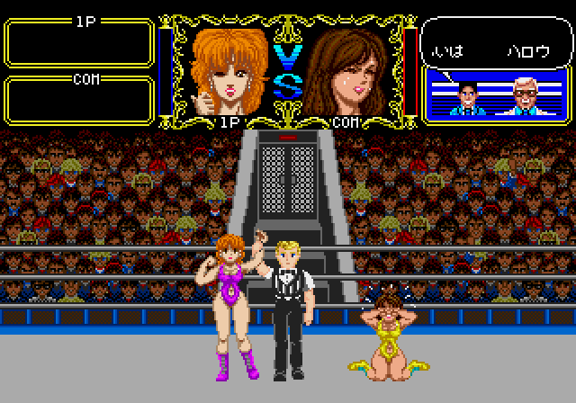

本作说是能选9个人，实际上除了主角有个特殊的投技以外，所有人的体型和招数都差不多，发型、肤色以及衣服不一样罢了。选个自己看顺眼的就行。反正当年肤色较深的两个在包机房里可是没什么人选。其余的选手是否和铃木一样是真人已不可考，说起来这位铃木也是靠着游戏才能在互联网上留下自己的名字。
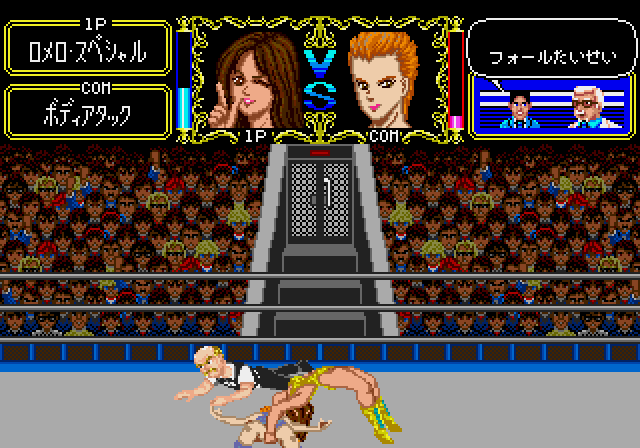
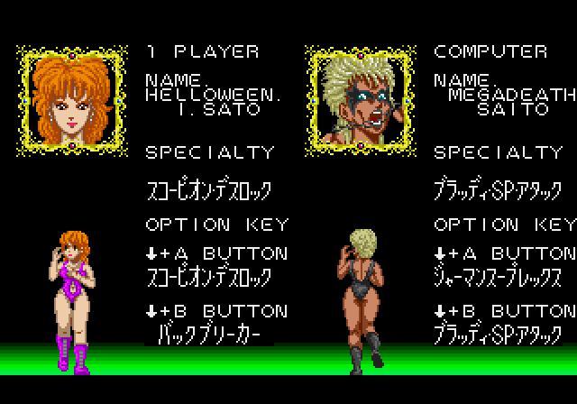

对摔角这个表演项目不了解。反正本游戏的特色攻击手段是一种锁技加背部攻击技的结合，我也不知道具体该叫什么，反正就是把对手扛起来/架住手脚/压在腿下/压在地板上反复蹂躏。这类动作练出来以后会产生咕叽咕叽的音效和轻微不可描述的乳摇，真人PK的时候还能对对手产生羞耻攻击和心理威压，真的是超级解气。反正游戏出来后包机房没过几天就给这个动作起了个毫无争议的名字：ねねね（nenene）。
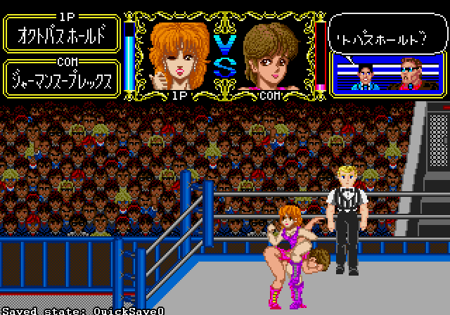
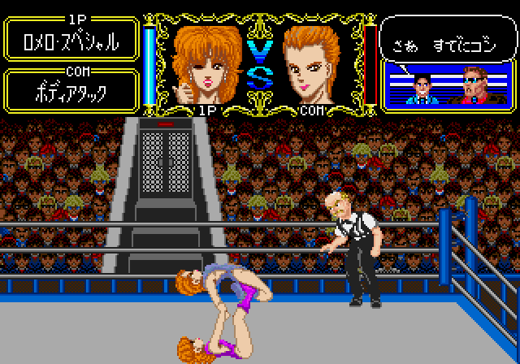
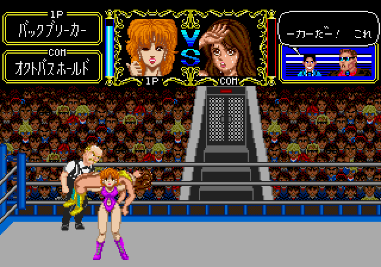
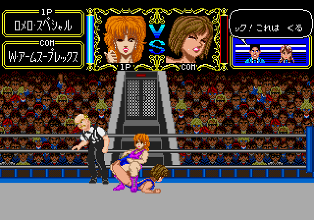

把对手干到没体力，或者干到接近没体力压住3秒，或者干到擂台下面20秒上不来，都能获胜。所以不管什么难度，取胜套路都差不多：先飞腿踹倒，倒地后近身按C键看能不能ねねね。ね两次差不多就可以进行下一步了，不能ね就等站起来以后继续飞腿干倒，重复上一步骤。等对手表情狰狞以后就连续用飞腿把对方踹下擂台，一旦站起来就飞腿干倒，倒计时15秒的时候赶紧跑回擂台上即可。所以打电脑的战术远不如对战来得丰富。说起来当年这游戏刚出来的时候，所有人都只知道体力耗尽一种获胜方式，于是每局对战都很漫长，屏幕上就看到两个体力耗尽的头像在对着飞踹或者对着ね……
用绝招干倒对手还有回放。
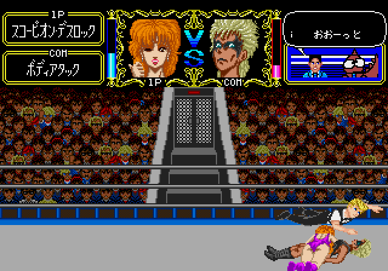
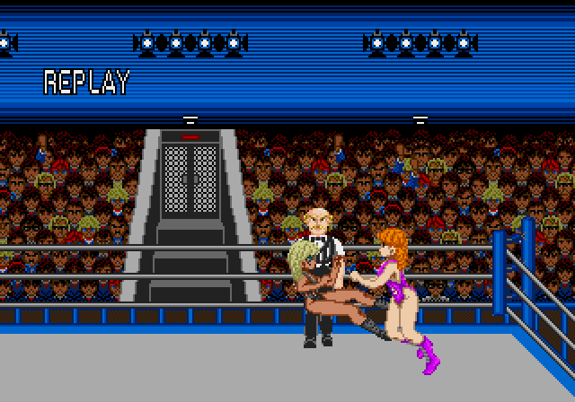

想玩花活还可以爬绳上跳下来进行绳索动作，反正小细节是不错的。
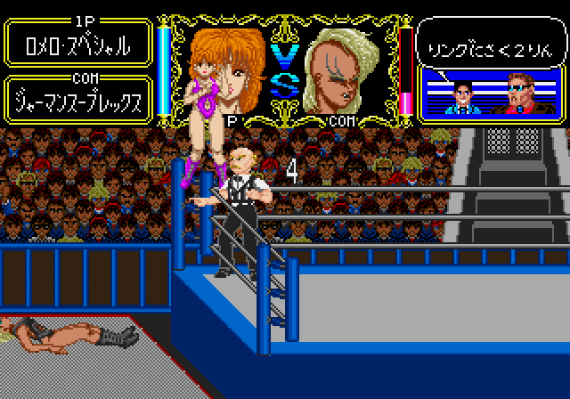
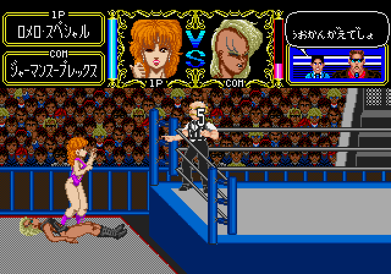

游戏的流程稍微有点长，需要打穿5个难度才能看到真正的结局。玩到后面有些枯燥。好在最后领奖前有个惊喜。
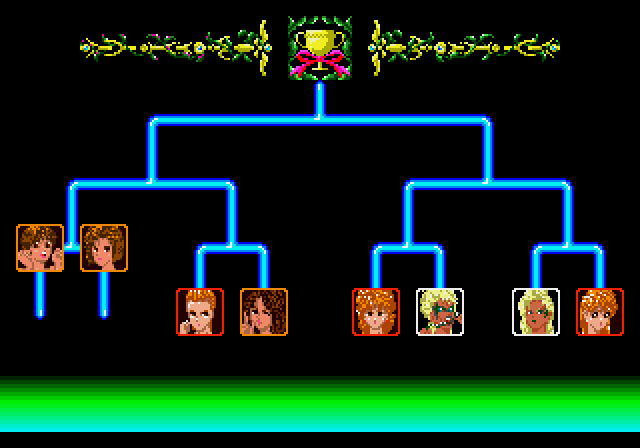
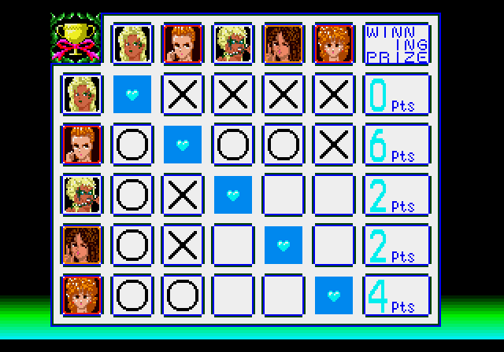
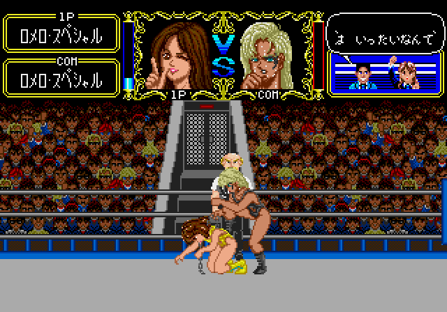

通关。哎呀我说这位铃木小姐姐的大脸盘子啊！
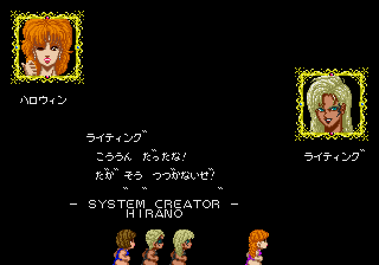
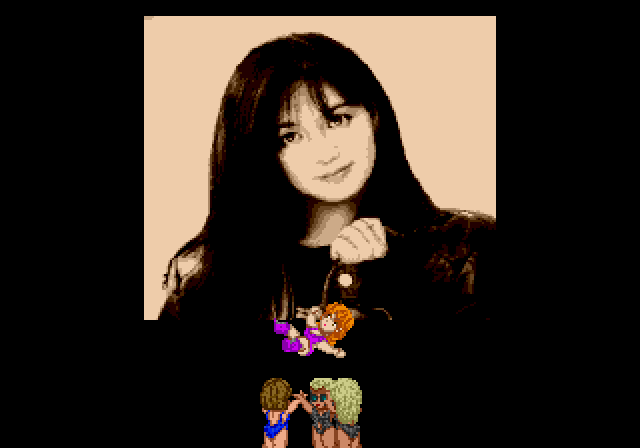