好像是四月的新番吧.
本已经不怎么看新出的动画了,但是认识俺的都知道,俺是个三国控,跟三国沾边的ACG都要去摸一摸的.便开始每周跟这个了.
剧情其实还算靠谱,主人公是陆逊,线索是玉玺.
看第一集的时候就只有两个感觉:
声音听着这么舒服啊!
人设看着这么别扭啊!!

这个感觉貌似随着剧情的发展越来越强烈,直到今天,俺看了第七和第八集…
喷发了…
还是一点点来给感兴趣的介绍吧.
主角陆逊,CV:**宫野真守**,算是个新生代,声音也觉得一般,但是片尾曲唱得着实不赖.形象算是个比较老的正太,倒还能够接受.
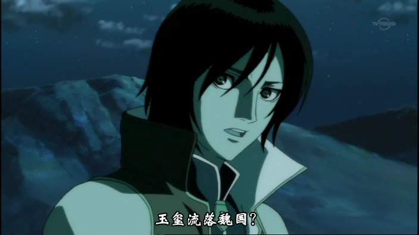

男二号诸葛亮,CV是大名鼎鼎的子安武人,不多介绍了.但是这造型嘛…尤其是他瞅陆逊时候那眼神…可能这年头都流行这个吧,反正是看得人麻酥酥的.
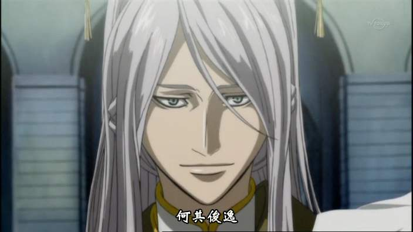

男三号凌统.这个形象就烂了.就算故事里的年纪小,也别整得看着跟巩汉林似的啊!CV是很有名的男声女优斋贺弥月,听起来感觉蛮舒服的.
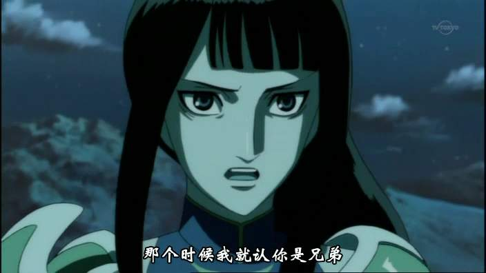

太史慈和吕蒙.史书上他俩身高可没差这么多,都是七尺(172-175).也许作者认为陈寿为了尊敬太史公,在介绍他亲人的时候有意舔吧,用的是英尺?
太史慈的CV是个变声男,叫伊藤健太郎.根本没听出来跟死神里的阿散井是同一人声,是个有前途的特种CV.吕蒙的配音俺一耳朵就听出来了,是常年位居三甲的石田彰.虽然俺比较挑剔,但还是觉得他配的最游记里的悟能是目前俺看过的所有日本动画里,给俺留下第二深印象的男声.不过吕蒙出场很少,他在这部片里面应该算是友情客串.P.S:早死的凌操形象很像金庸群侠传里的左冷禅,名声优井上和彦友情客串.
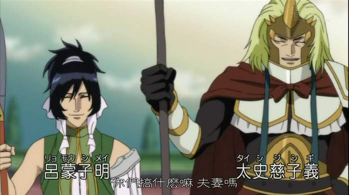

说实话,俺看到第八集了也没弄清楚孙权的性别.估计跟CV是双线的天生目仁美有关.仔细看的话,创作组还真是忠于历史,碧眼儿瞳孔真的是绿的.公瑾桑除了有点鹰钩鼻子还算贴切.声优是鼎鼎大名的三木真一郎.什么,你不认识三木?那你认识周杰伦不?你知道不知道周董还捧过人家的臭脚呢.
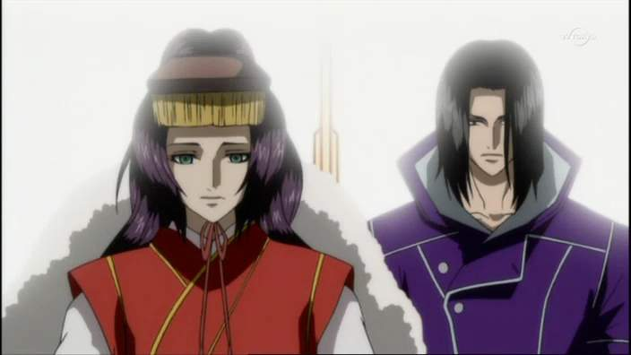

张飞算是整部当中最规矩的一个形象了.作品里用的是益德,看来真的是要跟正史靠拢.关羽嘛…除了变态的一骑当千,俺还是第一次看到不戴绿帽子的关二爷.这帽子整得,像不像迪斯马斯克来客串?三国的形象里,也更会让我想起霸王的大陆里的乌突骨.
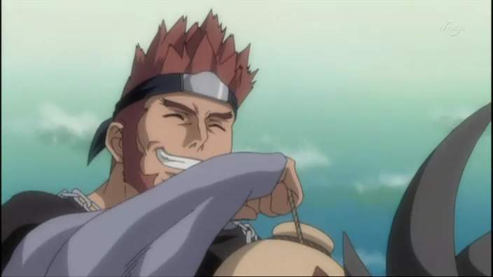
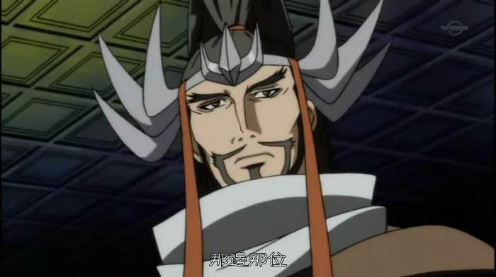

第二强烈震撼…请你告诉我,这是赵云,还是如月影二啊?说是煎了短发的乌鸦都有人信.杉山纪彰比在另两部当红作品火影忍者和死神里的表现都要好(说实话,他在火影里都快被忘了)
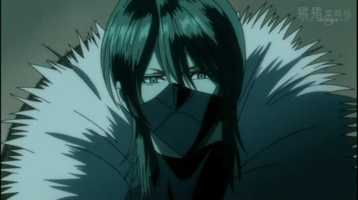

下边就是我喷的原因.大家离显示器远点.注意嘴里除了唾液和舌头别留什么液体固体和糊状物.

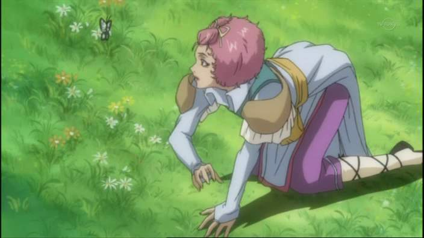
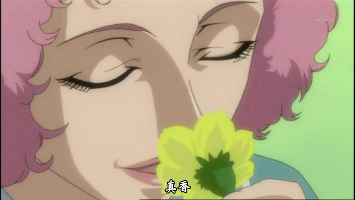
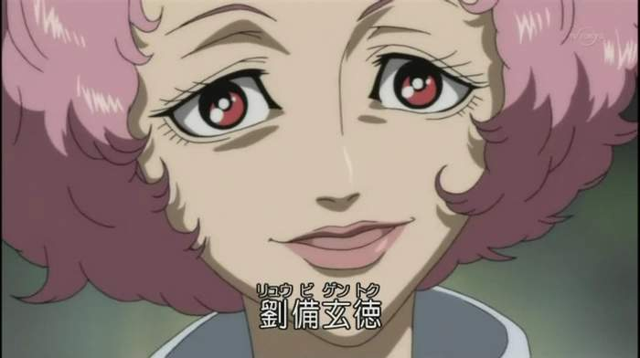