跟很多朋友一样，本站的后台也使用了宝塔面板。但是用到的功能不太多，到后来就只有搬家的时候配一次自动运行的脚本、防火墙的默认端口，并执行一次“一键搬家”。
所以一般这玩意儿我也不升级。

这次“一键搬家”，不得不给两端都升级成最新版本才能继续进行。可这升完级以后的界面看得我浑身不适——当下版本的宝塔面板提供的“工商服务”实在是太多了点。而且他们家弹的很多是“二段式”广告，得点两次叉才能退出来，两次叉间还要等一下。

我是个对广告耐受度极低的人。便用了小半天的时间，动手让它变得清净一点。改完之后，把自己的修改心得记下来，聊做备份，也能给有缘人一些帮助。记录的标题是左侧导航面板的名称，其中“软件商店”没做修改，而FTP、WAF之类的功能我用不上，且可以在面板中屏蔽，也没费力去查。

后面的内容可能读得比较费劲，我为啥不直接提供修改后的文件呢？
因为我发帖前特意查看了一下宝塔的用户协议。有两个要点：第二宝塔允许用户进行源代码的修改，但不得公开发行。第二宝塔不允许修改后的发布。

> 2.2 以自用为目的，在保留版权标识的前提下可任意修改程序源码，但不得公开发行。
> 4.3 用户在发布或者集成堡塔的时候，不得对堡塔源码做任何改动。

我修改的版本是8.0.2。改得记得都匆忙，如遇行号记述不准，请务必对照一下原始代码。
只有两种改法，固定项目在/www/server/panel/BTPanel/templates/default/的html文件中，动态项目在/www/server/panel/BTPanel/static/js/的js文件中。此面板日后如有变化，料想这代码结构也是不会变的。

如果改错了导致白屏，可以在后台运行bt面板修复命令：
`bt 16`
给救回来。

## 共通

### 共通–工具条–右上角“企业版”

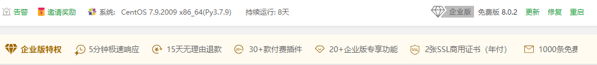
`vim /www/server/panel/BTPanel/templates/default/layout.html`
930行:

```
var _html = '

'+(!is_pay?'免费版  ':'')+' {{session["version"]}}

' + proHTML +'

'
```

改为

```
var _html = '

修改版  {{session["version"]}}

'
```

※重启面板生效

---

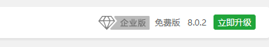
`vim /www/server/panel/BTPanel/templates/default/index.html`

```
149行：
{{data['pd']|safe}} {{session['version']}}
```

改为

```
修改版  {{session['version']}}
```

※重启面板生效


`vim /www/server/panel/BTPanel/static/js/index.js`
3758行：

```
if((day_not_display && parseInt(day_not_display)

注掉或删除

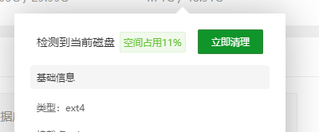

vim /www/server/panel/BTPanel/static/js/index.js

950行:

```
立即清理\
```

改为

```
\
```

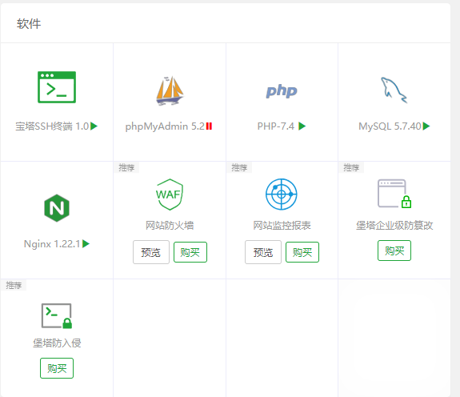

vim /www/server/panel/BTPanel/static/js/index.js

2362行:

```
for (var i = 0; i

改为

```
for (var i = 0; i

---

## 网站

### 功能按钮中的“漏洞扫描”


vim /www/server/panel/BTPanel/static/js/site.js

2449行:

```
{ title: '漏洞扫描', event: function (ev) { site.reader_scan_view() } },
```

注掉

### 网站名前面的小盾牌

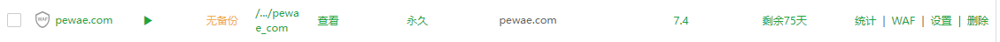

移到齿轮按钮上，去掉WAF前面的勾

### 网站操作里的“统计”和“WAF”


vim /www/server/panel/BTPanel/static/js/site.js

2217行:

```
for (var i = 0; i

改为

```
for (var i = 0; i

### 网站--设置--访问限制--双向认证

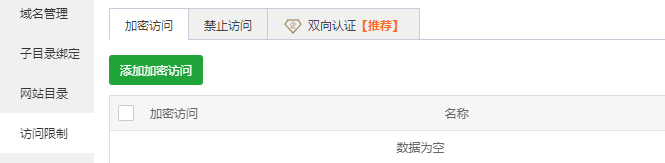

vim /www/server/panel/BTPanel/static/js/site.js

6537行:

```
加密访问禁止访问双向认证【推荐】\
```

改为

```
加密访问禁止访问\
```

### 网站--设置--SSL--商用SSL证书

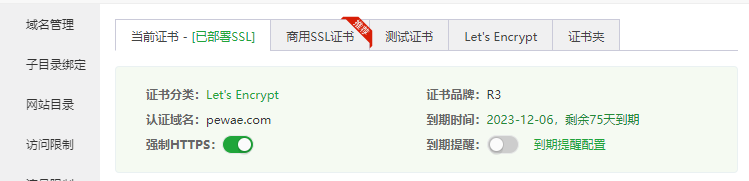

vim /www/server/panel/BTPanel/static/js/site.js

11810行:

d1833d

※注意，这里是删除！

### 网站--设置--php--站点防护

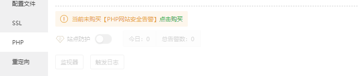

vim /www/server/panel/BTPanel/static/js/site.js

7545行：

```
if (sdata.phpversion != 'other') {
```

改为

```
if (sdata.phpversion != 'other') {return;
```

### 网站--设置--防篡改/安全扫描

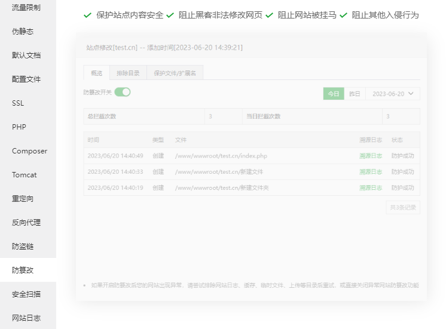

vim /www/server/panel/BTPanel/static/js/site.js

11174行：

```
{ title: '防篡改', callback: site.edit.set_tamper_proof },
{ title: '安全扫描', callback: site.edit.security_scanning },
```

注掉

---

## 数据库

### 数据库--企业增量备份

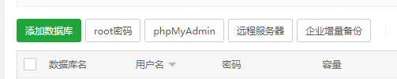

vim /www/server/panel/BTPanel/static/js/database.js

270行：

```
event:function(){
```

改为

```
event:function(){return;
```

### 数据库--点击备份--增量备份

vim /www/server/panel/BTPanel/static/js/database.js

824行：

d635d

※注意，这里是删除！

---

## 安全

### 系统防火墙--IP规则--归属地--点击查看

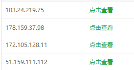

vim /www/server/panel/BTPanel/static/js/firewall.js

694行：

```
title: '归属地',
```

改为

```
title: '归属地',
```

696行：

```
if(parseInt(bt.get_cookie('ltd_end')) 点击查看'
```

改为

```
if(parseInt(bt.get_cookie('ltd_end')) local'
```

### 系统防火墙--SSH登录日志

这项同时在顶部菜单和中间tab页出现，所以要改两个文件。（图忘截了）

vim /www/server/panel/BTPanel/static/js/firewall.js

2031行：

```
$('#sshDetailed').html('成功：'+ error.success +'/失败：'+ error.error +'');
```

改为

```
$('#sshDetailed').html('成功：'+ error.success +'/失败：'+ error.error +'');
```

vim /www/server/panel/BTPanel/templates/default/firewall.html

1792行：

```
SSH登录日志
```

改为

```

```

※重启面板生效

### 安全检测/违规词检测/PHP网站安全/入侵防御/系统加固

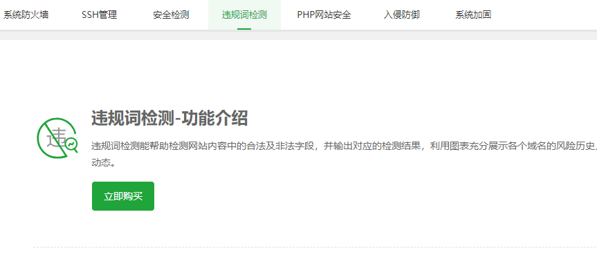

vim /www/server/panel/BTPanel/templates/default/firewall.html

1687行：

```
安全检测

违规词检测

PHP网站安全

入侵防御

系统加固
```

改为

```

```

※重启面板生效

---

## 文件

### 下载列表

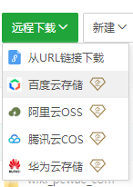

vim /www/server/panel/BTPanel/static/js/files.js

123行：

```
$.each(that.cloud_storage_download_list, function (index, item) {
```

改为

```
$.each(that.cloud_storage_download_list, function (index, item) {return;
```

### 文件--企业级防篡改/文件同步

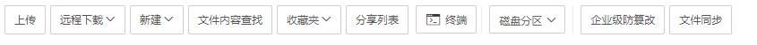

vim /www/server/panel/BTPanel/templates/default/files.html

381行：

```
d14d

※注意，这里是删除！

※重启面板生效

### 文件列表--防篡改

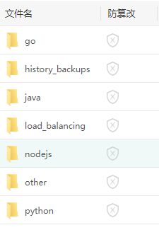

vim /www/server/panel/BTPanel/static/js/files.js

2797行：

```
'

'+
'' +'' +

改为

```
'

'+
'------------' +

---

## 日志

### 日志--日志审计/SSH登录日志

（图忘截了）

vim /www/server/panel/BTPanel/templates/default/logs.html

780行：

```
日志审计

SSH登录日志
```

改为

```
空

空
```

※这两项如果删除，会影响后面的【软件日志】，不想细查所以置空。

※重启面板生效

---

## 计划任务

### 数据库增量备份

（图忘截了）

vim /www/server/panel/BTPanel/static/js/crontab.js

23行：

```
{ title: '数据库增量备份', value: 'enterpriseBackup' },
```

注掉
```
```
```
```
```
```
```
```