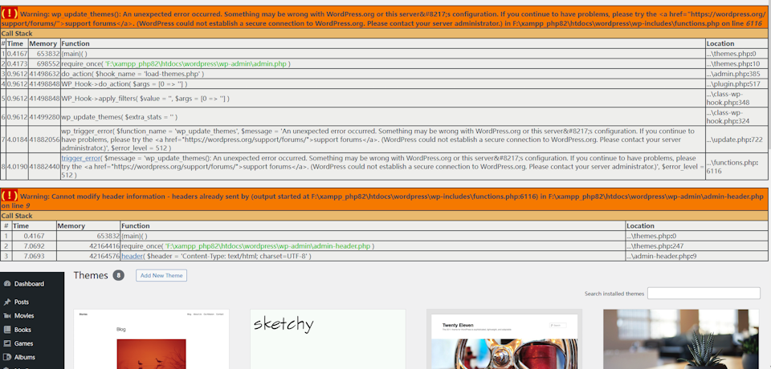

本地调试WordPress时，为了保证代码的正确性，插件和主题作者往往会打开wp-config.php里的WP_DEBUG开关。如果您不知道这个开关，就不要往下看了。

```
define('WP_DEBUG', true);
```

这样PHP运行时的错误和警告就会以醒目的字体直接打印到网页上。


但是这样会带来一个程序员的日经问题：是我的BUG我改，不是我的BUG莫挨老子！
按说WP这种成熟的产品是不会让用户看到警告和错误的。但是，由于众所周知的原因，WP内核、主题和插件升级所需要的WordPress的官网wordpress.org时灵时不灵，连不上的时候就会显示大面积的警告信息。
安装完成以后，后台这种需要连接到wordpress.org的地方大抵有4种：core update、theme update、 plugin update和translation api，出现在后台Dashboard、 Plugin、 Theme、 和Settings页面。其中Dashboard会调用前三种Update，Settings四种都会调用。
这些信息不仅是影响对于出错代码的判断（比如图中提示的“Cannot modify header information”，其实根本就不是本地header的问题），还会直接影响页面元素的渲染和操作。
那就必须要干掉它！

再次更新，

```
define('WP_HTTP_BLOCK_EXTERNAL', true);
```

这个宏屁用没用，还是得用我下面的方法。

开整。

```
//下面的action钩子调用的早，所以在加载主题或插件的时候就要直接remove掉，否则没机会了。
if ( defined( 'WP_DEBUG' ) && WP_DEBUG ) {
remove_action('admin_init', '_maybe_update_core');
remove_action('admin_init', '_maybe_update_plugins');
remove_action('admin_init', '_maybe_update_themes');
remove_action('init', 'wp_schedule_update_checks');

//translations_api默认会返回false，之后会访问wordpress.org，返回空数组之后就不访问了。
//Since 4.0.0
add_filter('translations_api', '__return_empty_array');
}

//调试者作为admin，默认是有各种update权限的。这里令各种内部调用user_has_cap询问4种权限的结果强行置为false。
function _debug_ignore_wp_request ($allcaps, $caps, $args){
$server_caps = array('install_languages', 'update_themes', 'update_plugins', 'update_core', 'install_themes', 'install_plugins');
foreach ($caps as $cap) {
if ( in_array($cap, $server_caps)) {
$allcaps[$cap] = false;
}
}
return $allcaps;
}

function my_admin_init {
if ( defined( 'WP_DEBUG' ) && WP_DEBUG ) {
//下面的钩子很多不能移除得太早。
//宁杀错不放过。
remove_action('upgrader_process_complete', 'wp_update_plugins');
remove_action('upgrader_process_complete', 'wp_update_themes');
remove_action('load-plugins.php', 'wp_plugin_update_rows', 20);
remove_action('load-themes.php', 'wp_theme_update_rows', 20);
remove_action('load-plugins.php', 'wp_update_plugins');
remove_action('load-themes.php', 'wp_update_themes');
wp_unschedule_hook('wp_version_check');
wp_unschedule_hook('wp_update_plugins');
wp_unschedule_hook('wp_update_themes');

remove_action('wp_version_check', 'wp_version_check');
remove_action('load-plugins.php', 'wp_update_plugins');
remove_action('load-update.php', 'wp_update_plugins');
remove_action('load-update-core.php', 'wp_update_plugins');
remove_action('wp_update_plugins', 'wp_update_plugins');
remove_action('load-themes.php', 'wp_update_themes');
remove_action('load-update.php', 'wp_update_themes');
remove_action('load-update-core.php', 'wp_update_themes');
remove_action('wp_update_themes', 'wp_update_themes');
remove_action('update_option_WPLANG', 'wp_clean_update_cache', 10, 0);
remove_action('wp_maybe_auto_update', 'wp_maybe_auto_update');
add_filter('user_has_cap', '_debug_ignore_wp_request', 10, 3);
}
}

add_action('admin_init','my_admin_init');
```

完事。这个世界清净了。