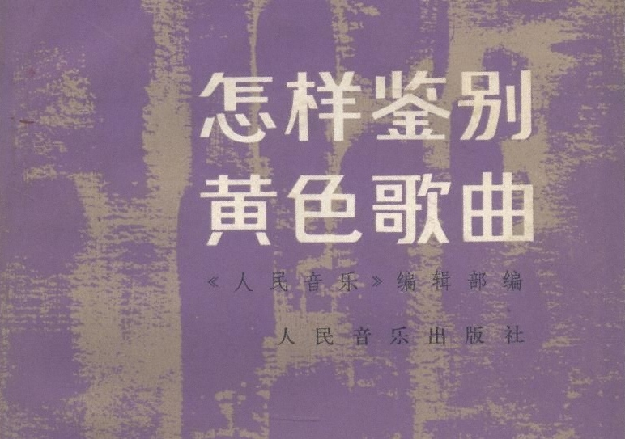

8月11日，文化部列了个黑名单，要求网络文化单位下架该黑名单上的120首歌。
没有调查就没有发言权，所以第一时间我就用“120首 打包下载”做关键字，把这些毒草统统下来鉴别了一番。
从昨天到今天，总算把这120首歌听完了。哥不是私藏的人,也不屑干转发伪原创的事儿，有兴趣的点传送门。
总体感觉是耳朵都快听瞎了，九成的歌封得一点儿毛病没有。
我不仅赞成文化部列这样的黑名单，而且觉得应该加大审查力度，把触线的歌一网打尽。
（我这个态度是不是让熟人觉得我今天没吃药？）

听这个歌单还是有那么点感触的。
比如No93.《溜冰歌》，我艹我之前真不知道溜冰的时候边上还有个DJ在那儿瞎B叨叨。
比如No27.《拉屎歌》，虽然俗不可耐，但真是笑死宝宝了。
比如大连出来的那个说唱歌手葡桃，我几乎都忘了他的名字了，这次也被弄了出来。
比如《大学自习室》里的“40和弦”和《摩的神曲》里的“菠萝奶子”，没一定的岁月积淀都不知人家玩的什么哏……
收藏歌单的哥们也挺搞笑，附赠的那个《小毛驴DJ神曲》，打从有OICQ那年就有了。

听完感觉：文化部果然比光腚总急有文化，起码从这名单看来，他们是有标准并且按标准执行的。
我赞成的就是“按规矩办事”。而且这时候就应该搞一刀切，凡是出现生殖器，出现骂人，出现违法导向，出现崇尚暴力的，一律喀嚓。
有人为李志的《他们》喊冤，不冤，里面出现了“嫖”，这叫违法。
有人为谣乐队的《你是猴子请来的救兵吗》喊冤，不冤，里面出现了一个“逼”，这叫淫秽。
有人为麻吉这个小孩喊冤，不冤，《噩梦》有一句是“怎么办 还没做过爱呀”，同上。
有人为老歌《大学自习室》喊冤，不冤，虽然老，但你是不是骂过“他他妈的就不调成震动di”？骂了就不冤。
有人为许嵩《摇头玩》喊冤，不冤，虽然歌词只是一堆没有实际意义的押韵的文字堆砌，可谁叫你小子在标题上打违禁字的擦边球？
有人为黄立行张震岳喊冤，不冤，你的歌虽然出版了，但那是符合台湾出版法的出版物，在内地，不合规就是不合规就是可以查。

很多人认为这样的做法会打击音乐创作的多样性。我同意。但我觉得，既然既然有诲淫诲盗的法规条文摆在那儿，它就不应该是摆设；既然出版物有出版物的规定，那它在没有被废止被修改前就应该发挥自己的作用。这样的执行，不是不该，而是太晚了。
我同样喜欢地下音乐，但还是让他们待在地下吧，想出版赚钱，只能自己把自己洗白。
一夜成名的阴三儿之前我没听过，《不想上学》、《老师你好/老师好》听过后发现是难得的好歌，我很喜欢。但违规了就是违规了。
黄立行的《屌》是好歌，阿岳的《放屁》是好歌，MCHotDog的《补补补》是好歌，新街口的《我们都不睡觉》是好歌。但违规了就是违规了。

但是，还是有没违规的进榜啊！还是有违规了没抓的啊！

No.112《迷你裙》、No.105《那一夜》 通篇没发现违禁词。尤其是《那一夜》，歌词非常干净，不过是爱来爱去而已。不排除因罗百吉人而废歌的嫌疑。
No.25《自杀日记》，自杀并不是违法行为，所以不能算违法导向。如果涉及违规，请把那种叫死金的音乐类型全收了去。
No.47《321对不起》和No.81《Trouble》，除了出现fuck以外没有别的不妥。如果“fuck”是违规词，那么网易云里歌词含fuck的歌20首一页250页以上，请把它们统统列上榜。
黄立行有一首闽南语歌上榜，黄秋生有一首粤语歌上榜，另外还有一首四川话的歌上榜，甚至No.96这种没有歌词的也能上榜……那么韩语歌维语歌藏语歌蒙古语歌佤语呢（可都是56朵花之一）？英法西日德语呢？下面这个图瓦共和国的龚琳娜是不是应该考虑收了呢？

No.111《为了兄弟》显然是因为暴力原因上的榜。那么宣扬要用人的血肉去筑墙的歌是不是更血腥更应该禁掉呢？

查是好事，但请一视同仁。