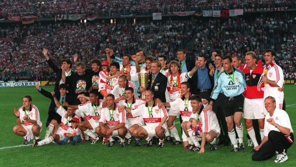

巴塞罗那赢了，干净漂亮令人信服。

以至于公司里一下多出来不少巴塞罗那、梅西、西班牙的“铁杆球迷”。
对于这种看谁踢得好就去疯狂追的，一向很不屑。一点儿节操都没有。

但是，谁又不是从对漂亮的球队和球员的崇拜走过来的呢？

如果不是欣赏利特巴尔斯基不懈的突破和沃勒尔的小胡子，恐怕我至今都会厌恶那耽误我看动画片的世界杯吧……
那时候身边的人往往也是这样。
有觉得不助跑踢点球很酷而崇拜希格诺里和拉齐奥的；有因为皮耶罗对佛罗伦萨那惊天一射而拜倒于老妇人裙下的；有看到坎通纳竖着领子上场就高中三年没把领子放下来的……
当然，也有些例外，比如Andy同学能从众多黑人里一眼认出西多夫，是因为西多夫跟她们家小狗贝贝长得像。

所以，那些新晋的球迷、伪球迷吹捧今天的巴塞罗那，天经地义无可厚非。
只是不太理解现今巴萨的女球迷们。梅西那小正太脸，怎么看怎么一邻家老太太的形象，咋就这么受欢迎涅？还有像土拨鼠的博扬，像大眼贼的哈维，像僵尸的伊涅斯塔，像巫婆的普约尔，像土匪的马斯切拉诺……也就比利亚和皮克长得比较帅，可是前者已经有俩闺女了，后者泡上了大名鼎鼎的拉丁天后。
你们还跟着乱个什么劲儿啊！

要说宇宙队，现今的巴塞罗那也不是我所经历的第一支。

启蒙的那场丰田杯（注意，“丰田杯决赛”是个病句！），我所支持的那一方，有三剑客的米兰就是一只宇宙队。可惜这支队伍于我实在太没有缘分，竟然赶走了古力特先生。后来的维阿牛则牛矣，但长相太丑，失之交臂了。

紧接着是强大到令人发指的阿贾克斯，汇集了一大批年轻才俊。可惜荷甲根本看不到，欧冠又少有直播，所以没有形成强大的气场。

黑风双煞时期的曼联，同样是因为长得太丑而不入法眼。别跟我提小贝和吉格斯，那种帅是给女人看的。贝克汉罚定位球的姿势很丑的有木有？更何况这只队伍的快乐是建立在我们家超级马里奥的痛苦之上的有木有？

马里奥所在的拜仁就更数不上了，我只是他个人的球迷而已。最多再加上一点点儿绍尔。

“银河战舰”所采用的是我最不喜欢的建队方式。纯拿球星堆砌的不说，排挤了颇有好感的雷东多萨尔加多莫伦特斯耶罗才是令我无法接受的。

再说现在的“宇宙队”，确实很好很强大，很强很美丽，让普约尔出场以及让阿比达尔捧杯都有着厚厚的人情味儿，但是，我就是产生不出那种打心眼儿里喜欢的感觉。

我心中的那只球队，并不完美。
它崇尚进攻到了骨子里，防守，只是附带的而已。
李维淼和黄健翔总是喜欢调侃它们的守门员：“你看，简直跟史泰龙一个模子出来的。”
或者它们的核心后卫队长：“都这么强大了，你说，荷兰国家队怎么就不要他呢?”
还有一个本来应该混退休却怎么也看不出老的前德国国家队左后卫。
还有一个总是疯跑的右中场。
还有一个总是在镜头前咆哮的中场重炮手。
还有三个人，准确的说是4个，太有名，不提了。

白衣飘飘的少年时代啊～

==== Update 14.11.8 ====
三个指的是博比奇，巴拉科夫和埃尔博。再多一个就是主教练勒夫。