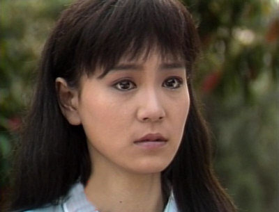
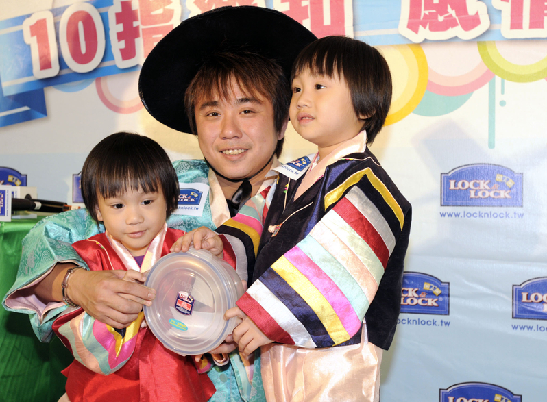
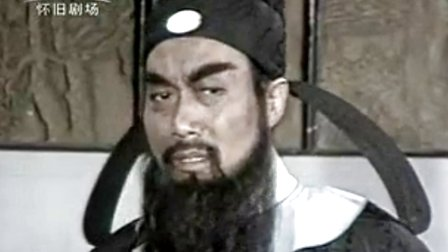
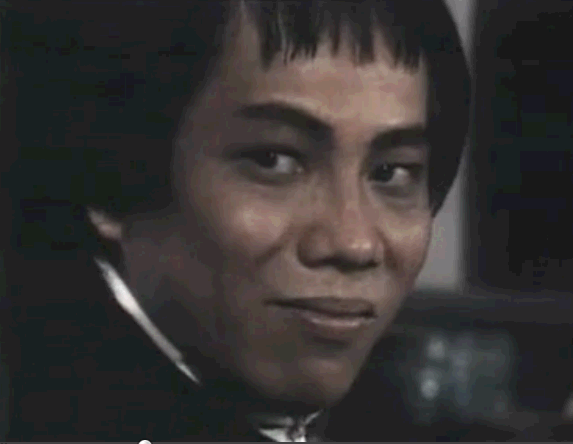
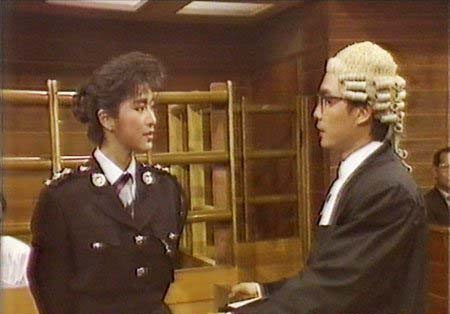
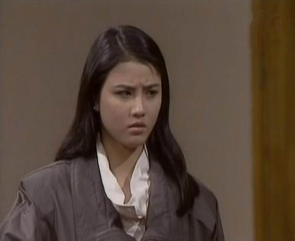
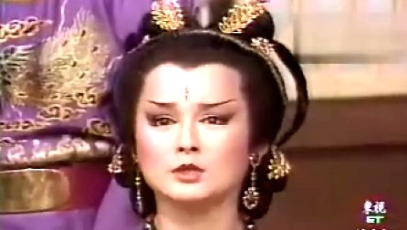

我曾经固执地认为自己小时候是不怎么看电视剧的，但静下心来一回想，发现回忆竟然会像烂海带一样一串串地拽不到根。其实很大一部分是靠主题歌想起来的，而且只能想起主题歌了。
今天这部分是黑白电视时代我有印象的电视剧，大概截至1989年秋天吧。有几部跟假期能挂上边儿的，我故意没提。
想到谁就点谁的名，排名完全乱序。也不管什么冷门热门了，我发现这个系列写下来，自己已经老得没朋友了。

**《几度夕阳红》《海鸥飞处彩云飞》《在水一方》《月朦胧鸟朦胧》**
这几个得放到一起说，因为我根本说不出什么^_^
只记得片名和几首主题歌了。当年琼瑶阿姨那边出一部剧，大连台这厢就放一部。其实还包括后来的《烟雨濛濛》和《庭院深深》——这俩我实在记不住是不是黑白电视年代的了。
刘雪华很漂亮，我妈很迷秦汉。再就是朦胧二字有好几个写法，高中时总考……
四首主题歌都非常不错。演唱者分别是潘越云、高胜美、邓丽君、凤飞飞。全明星阵容！
在水一方歌跟邓丽君都红得一塌糊涂，我却对“看看看潮来 又又又潮往”印象非常深刻，高胜美被打上一首歌歌星的标签这事儿太不科学。写这篇之前把几首歌又轮着听了一遍，重新认识了潘越云～
虽然故事不清晰了，但总记得是哭哭啼啼的调调儿。从《还珠格格》才开始认识琼瑶阿姨的人其实是幸福的，小时候老少爷们被刘雪华哭得烦都烦死了。

**《济公》**
游本昌先生当年可是家喻户晓的大明星。《济公》有好几部，印象最深的一集是济公从身上搓了个大灰丸子，给人当药吃。88年[胳膊摔骨折的那天](https://pewae.com/2010/11/small-xu.html)，我坐在楼下，听到“鞋儿破，帽儿破”的歌声响起却不见老爸回来，心里一团漆黑。

**《星星知我心》**
记不清跟电影《妈妈再爱我一次》谁先谁后了，反正跟琼瑶剧一样哭哭啼啼的。前几年偶然看到一个台湾综艺节目，当年主演的最小的小孩有了两个小小孩，连他的弟弟，全家人小时候几乎长得一模一样，真是强大的遗传基因。从这部剧和琼瑶剧开始，大连台放片就有了每年必放三五部苦情戏的传统。俺娘这种忠实拥趸，几个月不看大连台就浑身难受——所以大连的大老爷们更难受。
蔡幸娟好久不见了，她的声音真好听。

**《神探亨特》**
大名鼎鼎。可能是我懂事之后接触的第一部美剧。《大西洋底来的人》对我来说毫无印象，《加里森敢死队》以后再说。当时就感觉亨特实在太酷了，而且工作之余还可以调戏漂亮的女搭档麦考尔。

**《破烂王》**
比只记得主题歌强一点儿的是，记得里面有个女的非常漂亮。写本文的时候去搜了一下，果然——刘蓓啊！
这部剧的主题歌总出现在盗版磁带合辑里。“破烂的卖～破烂换钱～”

**《皮旅》**
刚学会下军棋的时候，跟小伙伴对有没有“旅”这个编制争论不休。结果这部电视剧出现得正是时候。印象不深。主人公跟皮皮鲁一个姓～

**《乌龙山剿匪记》**
大热作。红了反派申军谊。其实第一次放的时候没怎么看全，就记得不停的死主要人物，而且挂掉后会有剧情回闪。死人的频率可以跟进击的巨人比了。
90年暑假又重放了一次，基本一集没落。可仍旧没搞明白为啥一开始要怀疑秀姑。没有再看一遍的勇气了，因为那个片尾曲非常催人尿下。
四丫头演得非常有味道。

**《包公》**
铡包冕和狸猫换太子两段拍得非常好。尤其是包公的嫂娘，一看就是苦大仇深的样子。
另一个印象深刻的地方是片头，一堆石像，像是个什么墓的样子。
这版包公脑袋上是不长月牙的。这版包公脑袋上是不长月牙的。这版包公脑袋上是不长月牙的。

**《水浒》《武松》《林冲》**
山东版的。无论技术还是资金当然无法跟央视版的比。但李逵斗张顺、江州截法场、野猪林、鸳鸯楼几场戏印象还是非常深刻的。

**《少帅传奇》、《赵四小姐与张学良》**
86年是西安事变50周年，跟张学良有关的电视剧正经放了几个月。非常不理解它喵的成天泡妞抽大烟怎么就英雄了。

**《海灯法师》、《少年海灯法师》**
老妈不让看。总说有人看了电视剧以后练一指禅，把自己练残废了。

**《那五》**
在下海演电影电视剧的相声演员里，冯巩的口碑算相当好。难道因为他是捧哏比较冷静？其实这部剧的剧情小时候是看不懂的，但为小朋友普及了蒙古式摔跤的开场动作。二年级以前，小伙伴们打架开场都是那种派大星一样的架子。

**《霍元甲》、《霍元甲续集》、《陈真》、《霍东阁》**
“海贼～介四里地噶！”霍元甲演的时候我还小，就记得主题歌和“迷踪拳”了。到《陈真》的时候就懂事了不少，当时觉得陈真和柳生都老帅了。还有弄对联还是牌匾的那场戏“我们中国人不是东亚病夫！”，这可能是我最早接触的成语？《功夫》里火云邪神出场的时候我哭了。还我陈真！
《霍东阁》的时候已经上小学二年级了，反倒毫无印象。徐小明先生从1988年就开始炒冷饭了。

**《夜幕下的哈尔滨》**
一部电视剧，导演没红，主演没红，制片没红，旁白红了……真神奇！

**《诽谤》**
这片儿重点说一下。
1987年，我骨折的右胳膊长好之后，再回幼儿园有点不合适了。恰好老爹的工友里有一个小帅(姓)叔叔家在城郊老家夏家河子开了个学前班。我就被寄存到了那里。
每周一老爹骑自行车把我送到周水子站，坐N站大连到旅顺的绿皮通勤火车到夏家河子站下车，自己走到小帅叔叔家。白天跟村里的小朋友一起上学前班，晚上就住在小帅叔叔家里。直到周六下午，我自己走到火车站，自己买火车票再坐回大连。出站老爹接我。
妈蛋啊！老子那时才6周岁不到半啊！那时候治安也太好了吧！
当时小帅叔叔家有个老奶奶，晚上特别喜欢看这部墨西哥裹脚布。我就tm受不了这种唠嗑剧，每天晚上她看没10分钟我就睡着了。后来他们家人见到我爸妈，总夸我省心：“天一黑就睡觉。”我真心觉得冤！
女主好像叫马里亚纳？

**《叶塞尼亚》**
墨西哥裹脚布2.0版。这部剧的配音至今还为人称道。

**《八仙过海》**
播出时间应该是87年的夏天，跟《诽谤》同时。老帅太太不喜欢看，所以我只能在周六周日晚上看几集过过瘾。吕祖跟白牡丹好像有激情戏，被老妈捂眼睛了。主题歌依稀能记得。看的时候完全没有看港剧的觉悟。那个年代的亚视还是能跟TVB正面刚一下的。

**《少女慈禧》**
这部戏虽然拍的早，但播的晚，可能是在88年。其实那个时候看刘雪华都看得烦透了，大部分时间都在外面野跑也不愿意在家看电视。印象仅限于对片名的恶俗联想。
小时候总喜欢问女生：“昨晚看少女cixi了吗？”
放今天这算不算性骚扰？

**《法网柔情》**
好剧。
好一部开启了狗血模式的港剧。
第一次知道香港的法庭上是戴头套的。不少小伙伴默默立下了当律师的志愿。

**《流氓大亨》**
万梓良的气场异常强大。重播的时候迷上了周海媚，虽然后半部分她一直是坐着演的。追这部剧的初衷是因为片名里有流氓。虽然大部分剧情跟流氓无关，但周海媚被凌辱那场戏小时候冲击还蛮大的。

**《秦始皇》**
刘永演的嬴政非常霸气！不晓得为啥给了燕丹那么多戏份，简直男二。荆轲也非常帅。
这部剧给我一个章邯是战国时候最能打的武将的错觉。

**《人在旅途》**
新加坡剧是儿时回忆的重要组成部分，人在旅途好像是最早的一部。
陈丽萍陈之财在这部剧里都有出场。讲得好像是跟大陆做生意的故事。
“我是你爸，多么伟大，辛辛苦苦把你养大……”

**《昨夜星辰》**
more than 赵丽蓉，我还记得一个素云。

**《珍珠传奇》**
首先，主题歌非常好听。“多彩多姿，蝶飞舞……忘断西一一京，留～传～奇～”
其次，这部剧第一次给我科普了安史之乱。什么李隆基啊史思明啊安禄山啊郭子仪啊高力士啊……一度还真以为高力士是力士呢。
那时奶奶邻居家有个小孩叫曹毅，成天被我们死曹毅死曹毅的叫（史思明的儿子叫史朝义），后来听说真的出车祸了= =
还有，人唐德宗明明叫李适，你一口一个刮儿刮儿的～蛤蟆吗？

**《一代女皇》**
潘迎紫，老妖精也。依稀还能想起她几个眼神凌厉的镜头。
主题歌跟楼上的那部经常唱串，不知何故。

下面几部，只能记得歌。
**《康德第一保镖》**
范琳琳《不要逼我说话》。“偷偷瞟一眼 瞟一眼，心中永牵挂 永牵挂”
**《凯旋在子夜》**
董文华《月亮之歌》。小学的音乐老师非常喜欢唱这首歌显摆技巧。其实这歌一点儿也不好听。没经历过那个年代的人无法体会那时的董文华，不是一个红字能概括的。
**《雪城》**
刘欢《心中的太阳》。这首歌很实用，歌词里面有连着三个“我不知道”，小伙伴们互相问问题的时候经常唱出来。
**《便衣警察》**
刘欢《少年壮志不言愁》。大神的成名作。小学二年级我在学校比赛里唱这歌还拿过纪念奖= =
**《铁道游击队》**
《弹起我心爱的土琵琶》。我大姑父喝点儿酒就喜欢唱“唱起那动人的乌七八糟～”
**《四世同堂》**
《重整河山待后生》骆玉笙。骆老先生这唱儿实在霸气！韦唯翻的那叫神马玩意儿。
**《万水千山总是情》**
《万水千山总是情》汪明荃。可能是最早留下印象的粤语歌。（不确定和上海滩比，本地台哪个放得更早）
**《木鱼石的传说》**
《有一个美丽的传说》柳石明。没听过原版也听过牛群冯巩的相声吧……
**《情义无价》**
《情义无价》林灵。按理说这部大作不应该放在这儿，可除了歌和寇世勋我又想不起来神马其他内容。

**《西游记》**
首播的时候是一周一集还是两集来着，每个周日新闻联播后演。
1987年的除夕那集被延到了春晚之后播出。那是我第一次后半夜看电视剧。《大战红孩儿》看完后也一点儿不困。

**《再向虎山行》**
放的时候完全没印象。后来统一学赖宁日记，里面有一篇重点《再向火山行》里提到，才想起来有过这么一部剧。

**《上海滩》**
这个不用多科普了，实际上我从没看全过。但是此片影响深远，虽然没看过几集，但在后来的相声小品演绎什么的里完全把故事给还原了。

**《京华烟云》**
上面说过，我其实没看过《上海滩》，而是在《京华烟云》里认识赵雅芝的。完全看不出她只比俺娘小一岁，那时已经30多的样子，还以为20出头。非常美。

**《警花出更》**
剧情没印象了。那时郑裕玲红得不像个样。这部片子的贡献是第一次向小盆友们科普了什么是“Yes madam”。

**《射雕英雄传》**
大连台首播的时候可能是85年。只记得桃花岛上江南五怪挂掉的那集，某师傅在地上写了个“十”字。后来88年左右重播，梅超风出场时吓得直接把电视关了。

**《聊斋》**
这个就太有名了，名副其实的鬼片。蛋疼的片头非常吓人——漆黑的晚上一个灯笼在那儿晃，不知是人声还是乐器声的时强时弱的呜呜声，十秒之后某超级大牌的主题歌声音进场，之前营造的气氛就全没了。
论起内容则良莠不齐。记得婴宁各种笑。画皮那集则真心恐怖，看完幻想了好几天身边的人是不是由鬼穿了人皮扮演的。
小时候我学那呜呜声学得老像了。

**《新星》**
完全不记得这个片的内容是什么，印象却很深。因为当时播出几集之后上面要求党员回家都要看这个，然后还得写观后感之类。只能陪着老爹看。本片的原著背景很有意思，有兴趣的可以自己去查。原作者柯云路要是不自己作死跟伪科学搞一块提前领盒饭了，现在应该能当上作协主席了吧……
提示：我把它跟聊斋放一块儿是有关联的。

**《十三妹》**
好像蛮多小伙伴喜欢谈论这部剧。
在我这儿……印象无。