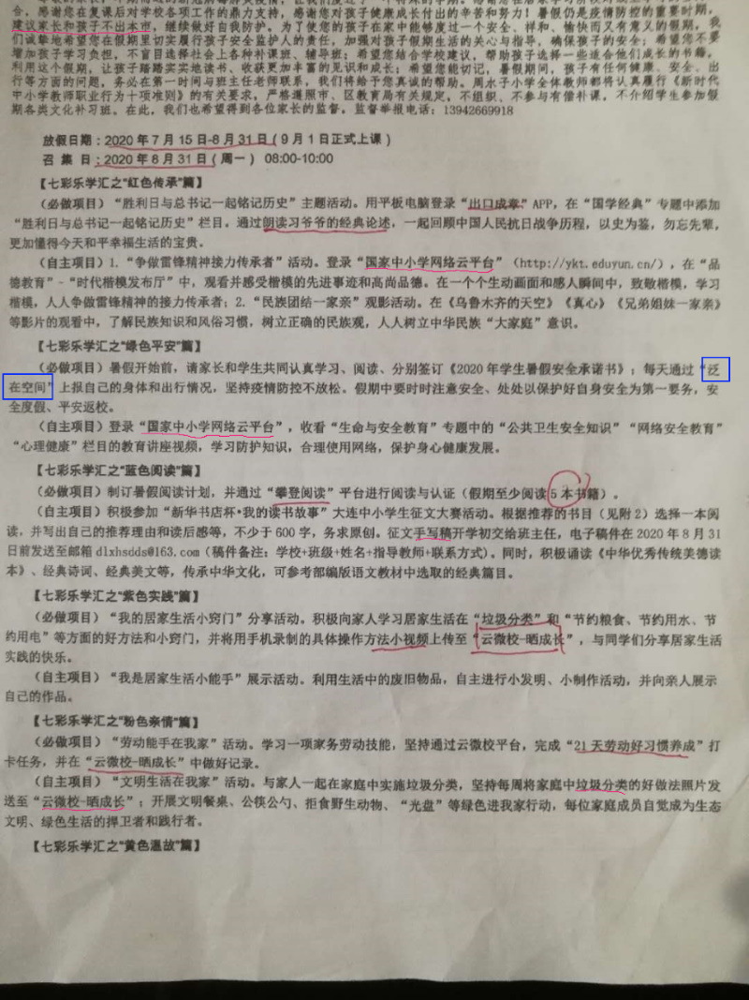

这个闹笑儿一样的学期结束了。

对于小学，各区教育局不再组织统一的期末考试，而由各学校根据自己的情况自行决定。
我闺女学校还是组织了考试，但是把题出的特别特别简单，仿佛生怕背上疫情期间教学不力的黑锅。

第一天考试，第二天到校讲假期注意事项开家长会，第三天放假。对于我闺女所在的官僚主义严重的学校来说，这效率前所未见。

考完试后老师在群里强调的唯一一件事情，是假期还要继续每天上传孩子的体温和家长的“一卡一码”。而且这次不是传给班主任，而是要传到假期里一直使用的区教育局搞出来的[傻逼网站](https://pewae.com/2020/03/new-crown-the-first-day-of-school.html)上。要求放假前的唯一一天家长们要配合好老师，盯紧微信群，进行压力测试。

在线家长会是个好东西。老师把学校布置的任务照本宣科了一番，就宣布解散了。前后没花上十分钟。毕竟成绩也没出来，实在没什么可讲。
会上还有个好消息宣布：傻逼网站又一次没通过压力测试，并且有不选中核酸检测就不能提交的巨大BUG，经过领导们一天的研究决定，弃用。而且家长的一卡一码也不用传了，只要每天给班主任报一次孩子体温即可。
成绩会晚一天出，因为一直在开会研究傻逼网站，没工夫批卷。

呃，至于学校的任务嘛。傻逼软件一三四号群魔乱舞。传个图片上来免得有人不信。

第五天，老师8点钟在群里宣布：所有孩子的成绩.xls已经单独通过QQ发给了家长，爸爸在群里的优先发给爸爸。可是我翻腾半天，还特意肉疼地用移动网络更新到QQ最新版，啥也没有。
私底下一串联，像我这样没收到成绩的不是个例，有那么十个左右，顿时安心不少。
孩他娘追问老师，也不给个回答。
到了下午两点多，终于收到了孩子成绩.pdf。
打开一瞅，原来我家孩子的“道德与法制”考了89分。
怪不得老师连个屁都不放。
这笑话够我笑半年的。