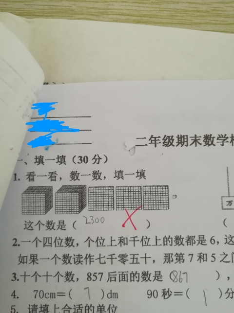
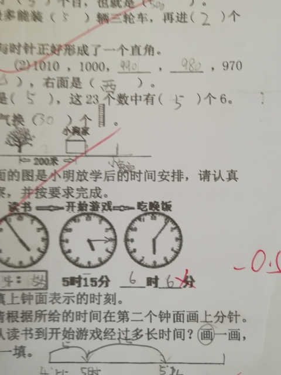

7月17日，又一次坐在闺女的座位上给她开家长会。
老师说，今天入伏，天太热了，我快点儿讲……
然后嘚啵了1小时28分，再次荣膺全校倒数第一。

纳了闷了，把自己前几次用过的语汇拿出来再倒嚼一遍二遍，心里不觉得隔央吗？

新鲜事儿不是没有，差不多十句话就能说完。
教育局不让收班费了，而且是只要在家长群里出现集资二字就不行。所以，对于班级消耗品，老师给出了下面的解决方案：
拖布扫帚黑板擦之类的清扫用品，用坏了由值日小组轮流出钱购买；
消耗最多的打印纸，下学期开学的时候，学号前25号的每个小朋友带一包交到学校。
打印机墨盒，从1号开始轮。老师说她算过了，到六年级毕业，有很大概率轮一圈。
我好容易才忍住笑——全班50人，闺女46号……

数学卷子有点意思。闺女错了两道题。第一题出题人心理太阴暗，第二题我回家问了闺女才知道她当时错在哪儿。

