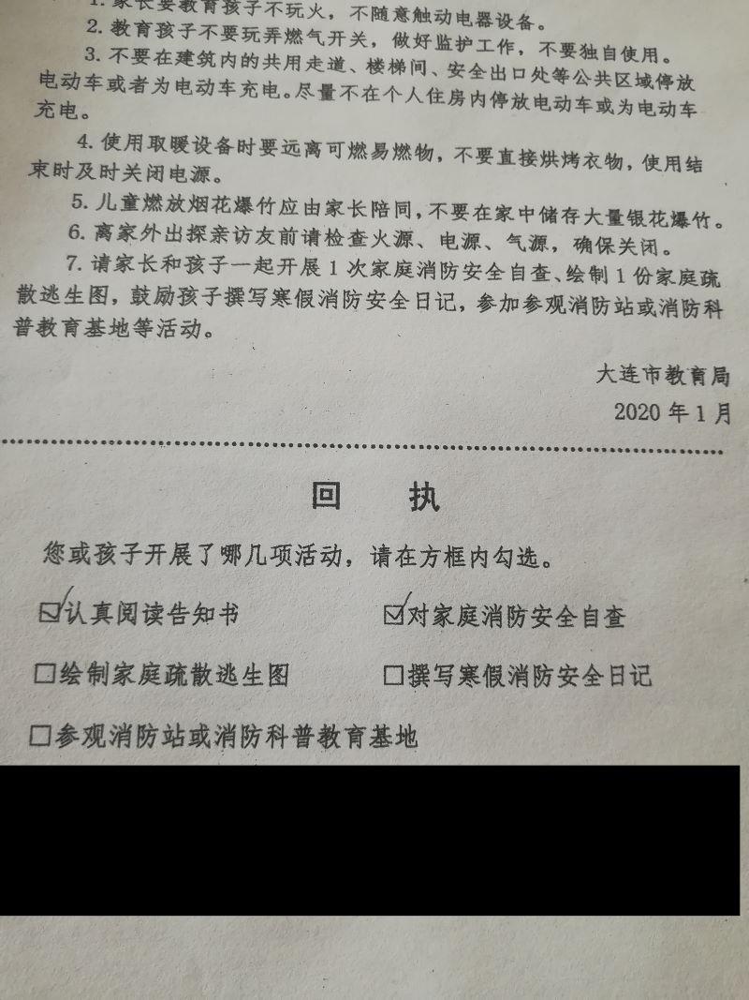

本来老婆大人病假还没结束，在家里无所事事的，就应该她去。
可是她说手术完怕生气，还是指派给了我。

孩子的成绩，英语比平均分高2分，语文低2分，数学刚好持平，反正一切表现都很中庸。表扬也表扬不到，批评也批评不到，去参加这么个会也就是充当个人形背板。

桌子上放了张富含计划经济余毒的教育局告知书，越看越有意思。

神他妈的家庭疏散逃生图，谁家大到找不到大门了是怎地？
电动车不停走廊、不停家里，难道专门买个车位停着？
还有第二条的病句和第五条错别字。
回执家长会当天就要往回收，什么绘制逃生图、撰写消防日记、参观消防队，那都根本做不到啊，现上轿现扎耳朵眼也来不及啊。
我要是教育局长，就一泡尿兹死写这份文件的秘书。

近期流感严重，整个家长会期间，咳嗽声就没断。
班主任老师也病了，发出声音都困难。学校的教导主任嘚啵完事后，本以为能早早回家了。

谁知班主任大人说：“今天不总结不批评，给大家分享一下我跟我跟我女儿相处的小故事。”然后就开始一把鼻涕一把鼻涕，绘声绘色地讲起这个学期她闺女被体育老师批评，回家发脾气的故事。起承转合，承刚刚开始，伴随着敲门声，英语老师进来了。
因为是第一次见面，所以我也好好地打量了一下这位英语老师：身高不高，一米六上下，蔡英文式发型+蔡英文式眼镜。年龄估计跟我们也差不多，大三十小四十的样子。本地人。英文水平未知，普通话里透着一股金州三十里堡的乡土气息。
“各位家长大家好，我是英语老师。四年了第一次跟大家见面，之前都因为各种原因错过了。下面请大家打开英语卷……”
“在这里呢，我要感谢学校……感谢各位家长……感谢班主任杨老师对我工作的配合……谢谢大家！”
鞠躬走人了。
妈的你倒是让我打开卷子干嘛？

班主任大人继续讲故事。闹别扭，生气，找原因，理解……反正就是标准的作文模式吧。
最后，老师说，可能作为一名家长，我也是不太合适的，所以的，我找了咱们班的李XX的家长，来给咱们介绍一下经验！
合着您这20分钟全是垫场啊！

李妈妈也是精心准备，起码PPT做得比教导主任用心多了。其主题强调的是个“陪伴”，也就是“她去上课你得跟着听，她写作业你得跟着做，她写作文你得跟着想……”
她自己还说：“我下班回家也是7点多，但我把非生活必要的每一分钟都用在了孩子身上……”
这一分享，讲了50分钟。
经验就确实是经验，参考价值就完全没有……
全班家长都知道，她干会计的，一个月只上三四天班。

叔可是跟客户报价45w一个月的高级货，这一下午产值合人民币540块钱呢，能不能别闹？