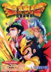

[封神榜](https://pewae.com/gaan/aHR0cHM6Ly93d3cuZG91YmFuLmNvbS9nYW1lLzEwNzg3OTAx)

别名：封神榜之伏魔三太子哪吒机种：FC厂商：全崴资讯类别：RPG发行年月：1995-02耗时：110

秘技：同时按下手柄的【上+SELECT+START+B】，听到效果音。此后可以获得三项功能————
1、自由移动。按一次SELECT，哪吒可以在地图上任意行走且不遇敌（如果无法通过说明此处有隐藏宝箱）。再次按下SELECT解除此状态。注意分层，如解除后卡死可以通过有河的地方（例如女人村）解决。
2、简化升级。非战斗中按一次START，听到效果音后，所有存活队员的升级所需经验数变成1
3、战斗胜利。战斗中按START，直接获得战斗胜利

这又是一款对我来说意义重大的游戏——我玩的第一款中文RPG游戏。
1995年的春天，受《电软》蛊惑，我买了一盘《赌神》，趁每天中午午休的时间跑他家玩耍。然而那盘卡跟宝宝家的游戏机兼容性有问题，第三关以后特别容易定版。再加上赌神那游戏实在太难了，所以一个多月以后，我们俩又跑了一趟市场，加了20块钱，换回了新游戏《封神榜》。
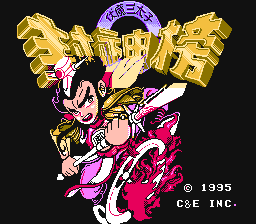

但是RPG游戏的最大缺点就是很难再想玩第二遍。自1995年寒假，一次通关未遂+一次通关之后，二十多年来就没再动过这游戏。
客观地说，即使在当年，这个游戏的水平放在浩如烟海的RPG当中，也只是个中上水准。但全中文这三个字已经足够。
况且这个中上水准也来之不易。因为这部作品是红白机中文游戏里的“第三只小板凳”。
全崴资讯的第一部FC上的RPG，也是FC上开天辟地的第一部中文作品，叫《圣火列传》。我一个同学有卡，借来玩过。“公关秘诀”上还有攻略。看攻略挺热闹，又能学武功又能招队友的，其实真上手能把人痛苦死！跟NPC对话毫无逻辑性可言，随时都可能被秒杀！
后来全崴的部分员工跳槽，整出了FC上第二部中文作品《荆轲新传》。卡带后来我也曾换到过。这部作品最大的“特色”是其令人发指的迷宫——只有主角所在的九宫格是亮的，其余部分全黑。以至于想攻关必须手画地图！
在同行们的衬托之下，故事流畅、难度适宜、流程较长、画面和音乐原创的《封神榜》，就成为中文游戏史上的一座里程碑。
后来不喜欢仙剑，很大程度就是因为系统不新鲜，在《封神榜》里都见识了。
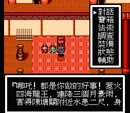

游戏还有个著名的类似于调试模式的秘技，可以轻松穿越地图、战胜强敌。这条秘技当时我是没看任何参考资料自己试出来的，用出来之后相当兴奋，立刻控制哪吒翻山过海杀进朝歌，直接把纣王秒了。然后……这游戏咋不结束啊？只好回村子从头一点一点撸。十天后终于再次打到摘星楼，发现纣王无论如何都不跟自己打，直接卡关，只能删档重来。正常流程走了一遍之后才醒悟到是因为该获得的道具没获得，触发不了剧情了。从那以后，RPG的经验是蹭蹭往上涨啊！
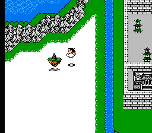

这并不是我的第一款RPG，所以大多数的RPG习惯不是从这里来的。但是，每进一个场景就翻箱倒柜这习惯确实是这个游戏带来的。
游戏里的隐藏宝箱非常多，偷东西很有快感的说。
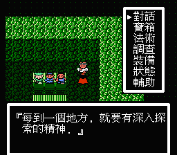

故事当然是取材于大家耳熟能详的《封神演义》，由于机能所限吧，剧情进行了大幅度删减。比较热闹的魔家四将、姜尚还魂、梅山七怪的剧情都留下了，而涉及到截教阐教相争的，除九龙岛四圣，都未见踪迹。
除了哪吒杨戬以外，西岐一方的其余战斗员只有黄天化出过场，而且是很搞笑地被琵琶精关在地牢榨成人干。别人没有都行，雷震子没有还是挺遗憾的。
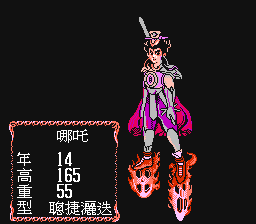
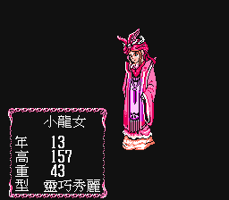
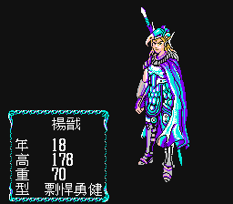
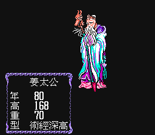

剧情最大的魔改有两部分，都在中前期，一是小龙女的加入。据说从这个游戏以后，涉及封神的电视剧和动画片都会加入个小龙女。我几乎没看过，不置可否。
反正一开始小龙女作为敌人出场的时候，浑身都是绿的，应该不会有人硬得起来吧。
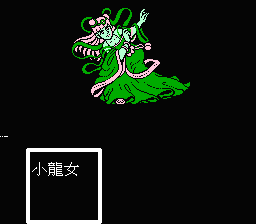

另一部分是追加了哪吒的地狱之行，十殿地狱各具特色，就是BOSS忒节省空间了，同一图案换个颜色……
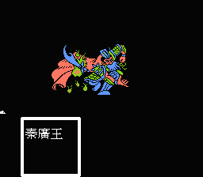

美工方面，应该是专门设计的，不算太差，但小怪也跟中国传统妖怪没太大关系。
除四海龙王和十殿阎罗外的成名BOSS倒是各个用心，大部分BOSS设计得很宽大，形成了一种天然的压迫感。而遗憾也就此产生，除了九龙岛四圣和魔家三将，BOSS战都是主角团队群殴对手一人，不够热闹。
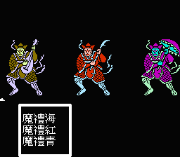
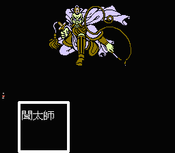

事件虽多，但套路化严重。大部分BOSS需要先上临近的仙山找仙人弄个法宝，不然的话根本打不了。所以在大地图上溜达的时候看见仙山就要记下来，时时提醒自己，要是卡关了可以到这里来试试。
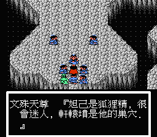

最有意思的设计在梅山。拿到照妖镜之后，觉得村子里每个村民都挺可疑，忍不住拿出镜子晃它一下。
七怪的老大猴精惹出孙悟空就有点扯了，个人感觉纯是为了引出筋斗云这个道具。
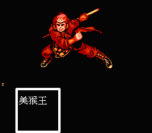

倒数第二个BOSS，妲己，绝对是花了功夫画的。
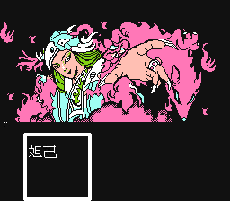

最后的纣王的画风就比较清奇了，像张劣质年画。
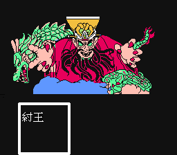

通关！各回各家，各找各妈。
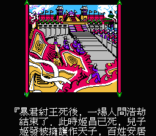
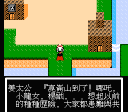
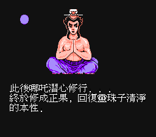
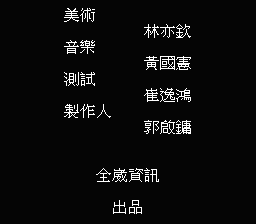