## 摘要

年度佳作：《摄影机不要停！》、《如月疑云》、《万箭穿心》、《海市蜃楼》、《恶魔的艺术2:邪降》、《沦落人》、《准备好了没》
年度抵制：《神探蒲松龄》、《脑浆炸裂少女》、《山炮进城2》、《沙西米》
年度惊喜：《环药房自行车赛》、《解放军在巴黎》、《东京丧尸》、《勒索》、《耳朵大有福》、《平原上的夏洛克》
年度失望：《疯狂的外星人》、《林中小屋》、《摄影机不要停！ 续集 好莱坞大作战！》、《新喜剧之王》、《七月十三之龙婆》、《大侦探皮卡丘》

年度最佳导演：《平原上的夏洛克》徐磊
年度最佳剧本：《摄影机不要停！》上田慎一郎
年度最佳男主角：《希特勒回来了》奥利弗·马苏奇（饰希特勒）
年度最佳女主角：《万箭穿心》颜丙燕（饰李宝莉）
年度最佳男配角：《沦落人》李灿森（饰张辉）
年度最佳女配角：《血观音》吴可熙（饰棠宁）
年度最佳音乐：《死侍2》
年度最佳画面：《寻梦环游记》
年度最差导演：《指甲刀人魔》关智耀
年度最差剧本：《山炮进城2》索墨
年度最差男主角：《暴疯语》黄晓明（饰周明杰）
年度最差女主角：《神探蒲松龄》钟楚曦（饰聂小倩）

## 总结

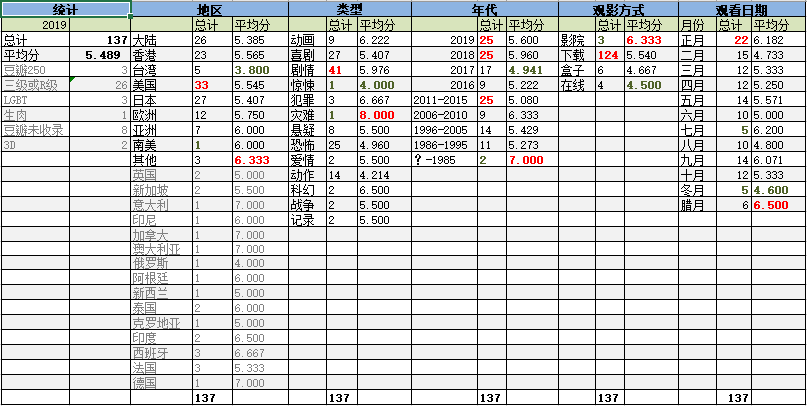
己亥年是平年，全年共354天，共观影137部。平均每2.58天观看一部。总阅片数比[戊戌年](https://pewae.com/2019/02/record-of-movies-2018.html)增加15部，增幅12%。
看片数量增长的一个主要原因是臭宝在托管班的放学时间变得更晚。8：30接意味着只要不加班且想看片，那就一定能看成一部。

本年度所有影片平均分5.489，比上一年度增加0.374分，与丁酉年接近。说明本人的影片关并无太大变化。
满分电影2部，为《摄影机不要停！》和《我不是药神》。《我不是药神》即使不够完美，现实题材也能获得足够多的加成。而《摄影机不要停！》则完全胜在创意方面，其趣味取向与表演风格与本人的欣赏向性高度契合。
0分电影1部，为日本偶像片《脑浆炸裂少女》，一无是处。今年的0分电影比去年减少了50%，难倒意味着选片的谨慎程度有所增加？

今年看了4部豆瓣250。今年发现这个榜单变化还挺剧烈的，《药神》、《小偷家族》都是刚进榜不久，而丁酉年的《驴得水》也是在统计之后挤进了榜单。只是还没想好要不要记录掉出榜单的片片——前250。
三级+R级看了26部，比上年度减少了2部，基本持平。黄暴的片子其实没少看，但好多美国没有引进，这些片子在imdb的记录上就是“未分级”。
豆瓣无记录的片子看了8部，比上一年度少3部，说明没扫过的禁片越来越少了，希望光腚总急多多努力为我指引。

按观影方式划分，仍旧是下载观看占绝对多数。盒子看片的数量锐减，是因为有两个APP删库跑路了。电影院只去了三次，《地球》、《熊出没》、《小飞象》，都是带闺女看的合家欢。今年所有的院线片都勾不起我买票进场的欲望。

按地区分布，本年度美国片的数量最大，其余大陆、香港、日本数量也齐头并进，说明过去的一年，大陆片对我的吸引力又下降了，哪怕是个标题党的标题也起不好了。
其中，发掘了不少香港电影黄金年代的非著名作品，感觉相当不错。
除去样本数不足的地区，评分最高的地区是欧洲，最低的是台湾。欧洲电影下载的大多还是有一定知名度的，所以有虚高的成分，但台湾电影就真的是不合口味了。
扫平范围今年新增了克罗地亚和印尼，两部片都表现平平。

按影片类型划分，连续三年都是动画最高动作最低。我的评判标准还真是坚如磐石。
前所未有地看了两部战争片，纯属意外。

按影片出品年份划分，19、18各25部，往前的时间也分布得很均匀。
2017年的17部片平均得分最低，说明该年份的好片已经被我搜刮殆尽？

本年度新增了对于观影时间的统计。
正月因为春节假期而观影最多，看片最少的是七月和冬月，七月去了广西旅游，冬月则是因为连续加班。

## 详情

按观影时间排序，右侧为评分，仅代表个人观点，拒绝客观公正。
请注意今年新增的福利图标。

[熊出没·原始时代](https://pewae.com/gaan/aHR0cHM6Ly9tb3ZpZS5kb3ViYW4uY29tL3N1YmplY3QvMzAzMzUwNTkv)

导演：丁亮 / 林汇达主演：万丹青 / 刘思奇 / 刘沛 / 孟雨田 / 宋祖儿 / 张伟 / 张秉君 / 张韶涵 / 谭笑类型：冒险 / 动画 / 喜剧地区：大陆首映时间：2019

无惊无喜，给小朋友看算可以。
一搞原始社会就出来猛犸象剑齿虎，能不能来点儿新鲜的。
小狼飞飞如果是狗的始祖的话，那她就要被迫和别的野狼配种，细思极恐。

[武林怪兽](https://pewae.com/gaan/aHR0cHM6Ly9tb3ZpZS5kb3ViYW4uY29tL3N1YmplY3QvMjY0MjUwNjIv)

导演：刘伟强主演：包贝尔 / 古天乐 / 吴樾 / 周冬雨 / 孔连顺 / 小爱 / 潘斌龙 / 王太利 / 郭碧婷 / 陈学冬类型：喜剧 / 奇幻 / 武侠地区：大陆首映时间：2018

剧情比较乱，还算可以接受。
周冬雨和古天乐是在好好演，其余人上班打卡，包贝尔就是个祸害。
腾格尔大叔的插曲不错。

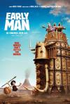

[无敌原始人](https://pewae.com/gaan/aHR0cHM6Ly9tb3ZpZS5kb3ViYW4uY29tL3N1YmplY3QvMjYzODQyOTIv)

原名：Early Man导演：尼克·帕克主演：埃迪·雷德梅恩 / 尼克·帕克 / 汤姆·希德勒斯顿 / 理查德·艾欧阿德 / 米瑞安·玛格莱斯 / 约翰尼·维加斯 / 罗伯·布莱顿 / 蒂莫西·斯波 / 马克·威廉姆斯 / 麦茜·威廉姆斯类型：冒险 / 动画 / 喜剧地区：英国首映时间：2018

英国人这片子排的应该是嘲讽英格兰足球的，但“他们发明了足球，却是都踢不赢，最后放弃了”怎么看怎么像讽刺中国足球。
人物造型实在是丑得可以。

[我们的故事2](https://pewae.com/gaan/aHR0cHM6Ly9tb3ZpZS5kb3ViYW4uY29tL3N1YmplY3QvMjY4Nzg2MDUv)

原名：Long Long Time Ago 2导演：梁智强主演：廖永谊 / 李国煌 / 王雷 / 苏海米 / 萨米·优素夫 / 薛素丽 / 陈丽贞 / 陈俊铭类型：剧情 / 喜剧 / 家庭地区：新加坡首映时间：2016

下部比上部好一丢丢，可能是因为剧情冲突更强烈。
没有回避过重男轻女的问题，可以说是非常有魄力的。

[家和万事惊](https://pewae.com/gaan/aHR0cHM6Ly9tb3ZpZS5kb3ViYW4uY29tL3N1YmplY3QvMjc2MDQyOTYv)

导演：邱礼涛主演：卢海鹏 / 古天乐 / 吴肇轩 / 吴镇宇 / 张达明 / 林雪 / 蔡颂思 / 袁咏仪 / 郑丹瑞 / 黄秋生类型：喜剧 / 家庭地区：大陆首映时间：2019

全港班的制作现在已经很少见了，剧情前半部分也很不错。
结局太糟糕了，怀疑遭遇广电剪刀手。
演女儿的年轻演员莫名其妙跟吴镇宇长得好像，不会是私生女吧……

[烧腊](https://pewae.com/gaan/aHR0cHM6Ly9tb3ZpZS5kb3ViYW4uY29tL3N1YmplY3QvMjY5ODI5NzMv)

原名：Siew Lup导演：罗胜主演：伍洛毅 / 冯推守 / 萝曼迪 / 郑维杰 / 陈姿邑 / 陈益鸣类型：惊悚 / 爱情地区：新加坡首映时间：2017

新加坡版人肉叉烧包，剧情完全讲不通。
没杀过人还没看过电影吗，已经是背后杀人了，竟然还要用刀砍后脑勺！
女主角一对假奶各种凹造型，真实够拼的。

[我去哪儿？](https://pewae.com/gaan/aHR0cHM6Ly9tb3ZpZS5kb3ViYW4uY29tL3N1YmplY3QvMjY3MDAyNzYv)

原名：Quo vado?导演：热纳罗·努基阿德主演：Azzurra Martino / Giustina Buonomo / Paolo Pierobon / 切柯·扎罗内 / 利诺·班菲 / 卢多维卡·莫杜尼奥 / 埃莉奥诺拉·吉奥瓦纳迪 / 安东尼奥·布鲁斯凯塔 / 毛里齐奥·米凯利 / 索尼娅·贝加马斯科类型：喜剧地区：意大利首映时间：2016

意大利公务员拼命保住铁饭碗的故事。
不怎么搞笑，但很中国。

[摄影机不要停！](https://pewae.com/gaan/aHR0cHM6Ly9tb3ZpZS5kb3ViYW4uY29tL3N1YmplY3QvMzAyMzQzMTU=)

原名：カメラを止めるな！导演：上田慎一郎主演：主浜晴美 / 大泽真一郎 / 山崎俊太郎 / 市原洋 / 滨津隆之 / 真鱼 / 秋山柚稀 / 竹原芳子 / 细井学 / 长屋和彰类型：喜剧 / 恐怖地区：日本首映时间：2017

非常有趣的片子，构思巧妙。
但是前面30多分钟如果不是像我这样对血浆B级片很有爱的人，是很难挺过去的。
有个配角老女人，像极了60岁的樱桃老丸子，应该是故意的，好有趣。

[嫌疑人X的献身](https://pewae.com/gaan/aHR0cHM6Ly9tb3ZpZS5kb3ViYW4uY29tL3N1YmplY3QvMjM2OTg0NS8=)

原名：Suspect X导演：西谷弘主演：北村一辉 / 堤真一 / 松雪泰子 / 柴崎幸 / 福山雅治 / 金泽美穗类型：剧情 / 悬疑 / 犯罪地区：日本首映时间：2008

根本不是悬疑片，也没拍出悬念来。
分明是颂扬暖男的爱情片。

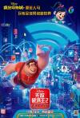

[无敌破坏王2：大闹互联网](https://pewae.com/gaan/aHR0cHM6Ly9tb3ZpZS5kb3ViYW4uY29tL3N1YmplY3QvMjA0Mzg5NjQ=)

原名：Ralph Breaks the Internet导演：瑞奇·摩尔 / 菲尔·约翰斯顿主演：塔拉吉·P·汉森 / 杰克·麦克布瑞尔 / 盖尔·加朵 / 简·林奇 / 约翰·C·赖利 / 肖恩·吉布朗尼 / 艾伦·图代克 / 艾德·奥尼尔 / 萨拉·西尔弗曼 / 阿尔弗雷德·莫里纳类型：冒险 / 动画 / 喜剧 / 奇幻地区：美国首映时间：2018

迪士尼内部大联欢掩盖了剧情的平庸。
14位迪士尼公主同镜，吐槽“皮克斯”来的，这种自黑，真的是太有趣了。
虽然副标题叫大闹互联网，可那些互联网一半连不上，也不知中国公映的时候是否做了处理。

[流浪地球](https://pewae.com/gaan/aHR0cHM6Ly9tb3ZpZS5kb3ViYW4uY29tL3N1YmplY3QvMjYyNjY4OTM=)

导演：郭帆主演：吴京 / 吴孟达 / 姜志刚 / 宁浩 / 屈楚萧 / 屈菁菁 / 张亦驰 / 张欢 / 李光洁 / 李虹辰类型：冒险 / 灾难 / 科幻地区：大陆首映时间：2019

[我看《流浪地球》](https://pewae.com/2019/02/viewed-the-wandering-earth.html)

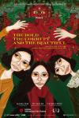

[血观音](https://pewae.com/gaan/aHR0cHM6Ly9tb3ZpZS5kb3ViYW4uY29tL3N1YmplY3QvMjcxMTM1MTc=)

导演：杨雅喆主演：丁强 / 刘尚谦 / 吴可熙 / 惠英红 / 文淇 / 林志儒 / 柯佳嬿 / 温贞菱 / 王月 / 陈莎莉类型：剧情 / 悬疑地区：台湾首映时间：2017

名副其实的三个女人一台戏，每个女人都不简单。
拍得很细腻，甚至有些繁琐。
她姐其实是她妈这种桥段，见多了一点儿也不稀奇。

[车四十四](https://pewae.com/gaan/aHR0cHM6Ly9tb3ZpZS5kb3ViYW4uY29tL3N1YmplY3QvMTMwODYyNw==)

导演：伍仕贤主演：吴超 / 李易祥 / 龚蓓苾类型：剧情 / 犯罪 / 短片地区：香港首映时间：2001

龚蓓苾年轻时候的颜值真不错。
表现手法上过于白描了，全是直线条的，更像是学生的习作。

[荒村怪兽](https://pewae.com/gaan/aHR0cHM6Ly9tb3ZpZS5kb3ViYW4uY29tL3N1YmplY3QvMzAzNjQ5NzE=)

类型：恐怖地区：大陆首映时间：2018

找了个新疆妹子演外国人，另两个妹子都是网红锥子脸。
1分是因为嘲讽了荣威和张翰。
另1分是对国产丧尸片这个题材给予鼓励。

[如月疑云](https://pewae.com/gaan/aHR0cHM6Ly9tb3ZpZS5kb3ViYW4uY29tL3N1YmplY3QvMjM2MTgyNg==)

原名：キサラギ导演：佐藤祐市主演：中山裕介 / 塚地武雅 / 小出惠介 / 小栗旬 / 香川照之类型：喜剧 / 悬疑地区：日本首映时间：2007

非常温情的悬疑推理片。
香川太君的演技仍旧能够碾压同侪。
某种程度上反应了不知名小艺人的艰辛生活状态。

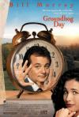

[土拨鼠之日](https://pewae.com/gaan/aHR0cHM6Ly9tb3ZpZS5kb3ViYW4uY29tL3N1YmplY3QvMTMwMDYxMw==)

原名：Groundhog Day导演：哈罗德·雷米斯主演：克里斯·艾略特 / 威利·加森 / 安吉拉·佩顿 / 安迪·麦克道威尔 / 布赖恩·道尔 / 斯蒂芬·托布罗斯基 / 比尔·默瑞 / 瑞克·欧弗顿 / 罗宾·杜克 / 里克·杜科蒙类型：剧情 / 喜剧 / 奇幻 / 爱情地区：美国首映时间：1993

不知是否是一日循环这种类型片的鼻祖，即便不是也是老二。
女主角类型的美女，如今已经不多见了，作为科幻片，片子里充满了腐臭的爱情的味道。
其实也不能算科幻，根本没解释重复这一天的原因啊。

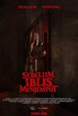

[恶魔的请柬](https://pewae.com/gaan/aHR0cHM6Ly9tb3ZpZS5kb3ViYW4uY29tL3N1YmplY3QvMzAzMDYwOTM=)

原名：Semoga Iblis Mengambilmu导演：提莫·塔哈亚托主演：佩维塔·皮尔斯 / 克拉拉·伯纳迪斯 / 切尔西·艾斯兰 / 卡琳娜·苏万迪 / 吉娜罗西 / 哈迪贾·沙哈布 / 妮科尔·罗西 / 萨摩·拉斐尔 / 雷·萨亥塔彼 / 鲁思·马里尼类型：恐怖地区：印度尼西亚首映时间：2018

结合了东南亚的巫蛊和欧美的血浆，算是不错的恐怖题材。
猛鬼前期只会物理攻击，感觉好弱啊。
对几个女角色脸盲，影响到了观影感受

[她的人生没有错](https://pewae.com/gaan/aHR0cHM6Ly9tb3ZpZS5kb3ViYW4uY29tL3N1YmplY3QvMjY5MjgxNjE=)

原名：彼女の人生は間違いじゃない导演：广木隆一主演：光石研 / 安藤玉惠 / 户田昌宏 / 柄本时生 / 波冈一喜 / 泷内公美 / 磨赤儿 / 筱原笃 / 莲佛美沙子 / 高良健吾类型：剧情地区：日本首映时间：2017

反映核泄漏事故后福岛人生活状况的电影，并没有传说中那么好。
女主角颜值不错，奶量不足。
前一个半小时都是琐事，太闷了。

[夏日大作战](https://pewae.com/gaan/aHR0cHM6Ly9tb3ZpZS5kb3ViYW4uY29tL3N1YmplY3QvMzkwODQyMw==)

原名：夏日大作戰导演：细田守主演：佐佐木睦 / 信泽三惠子 / 富司纯子 / 斋藤步 / 桐本拓哉 / 横川贵大 / 樱庭奈奈美 / 神木隆之介 / 谷川清美 / 谷村美月类型：冒险 / 动画 / 喜剧 / 家庭 / 科幻地区：日本首映时间：2009

很严肃地讨论了互联网隐私和安全问题，但是剧情很不严密。
感情戏家庭戏套路有些多，但互联网和游戏的部分设定和作画无与伦比。
片尾曲非常非常好听。

[地狱为何恶劣](https://pewae.com/gaan/aHR0cHM6Ly9tb3ZpZS5kb3ViYW4uY29tL3N1YmplY3QvMTk5NTU3OTA=)

原名：地獄でなぜ悪い导演：园子温主演：二阶堂富美 / 友近 / 国村隼 / 坂口拓 / 堤真一 / 尾上宽之 / 星野源 / 板尾创路 / 渡边哲 / 长谷川博己类型：剧情 / 喜剧地区：日本首映时间：2013

片子里的角色无一不是癫狂的，看着看着就莫名地上头。
两次出现血流成河的场景，很园子温。
女主角的广告歌非常洗脑。

[指甲刀人魔](https://pewae.com/gaan/aHR0cHM6Ly9tb3ZpZS5kb3ViYW4uY29tL3N1YmplY3QvMjYzNTI0MzU=)

导演：关智耀主演：周冬雨 / 张孝全 / 林辰唏 / 盛朗熙 / 纳豆 / 蔡洁 / 许玮甯 / 谢依霖 / 郑伊健类型：喜剧 / 爱情地区：大陆首映时间：2017

周冬雨烂片接多了，灵气就要渐渐磨没了。
本片就是一块注水肉，15分钟能说明白的事儿，愣是干到100分钟。
作为一名曾经的异食癖，我可以负责地说，异食癖的心理完全不是片子里这样子遮遮掩掩脱裤子放屁的。

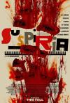

[阴风阵阵](https://pewae.com/gaan/aHR0cHM6Ly9tb3ZpZS5kb3ViYW4uY29tL3N1YmplY3QvMzA5NTUxNA==)

原名：Suspiria导演：卢卡·瓜达尼诺主演：安吉拉·温科勒 / 杰西卡·哈珀 / 玛高莎·贝拉 / 科洛·莫瑞兹 / 米娅·高斯 / 英格丽·卡文 / 蒂尔达·斯文顿 / 西尔维·泰斯蒂 / 达科塔·约翰逊类型：恐怖 / 惊悚地区：意大利 / 美国首映时间：2018

整体节奏太慢，墨迹，导致惊悚度下降，催眠度上升。
不知不觉间，科洛莫瑞兹都快二十了。
有个弹丁丁的镜头很好玩。

[花花性事](https://pewae.com/gaan/aHR0cHM6Ly9tb3ZpZS5kb3ViYW4uY29tL3N1YmplY3QvMjA2NzMwMQ==)

原名：Young People Fucking导演：马丁·格罗主演：克莉丝汀·布丝 / 卡莉·波普 / 卡鲁姆·布鲁 / 迪奥拉·拜尔德 / 阿隆·艾布拉姆斯类型：喜剧 / 爱情地区：加拿大首映时间：2007

五个小故事，典型或非典型，拍得还不错。
即使是外国妞，大乳牛也不多啊……

[山炮进城2](https://pewae.com/gaan/aHR0cHM6Ly9tb3ZpZS5kb3ViYW4uY29tL3N1YmplY3QvMjY3MzM0OTk=)

导演：崔俊杰主演：刘小光 / 唐娜 / 孙立荣 / 宋晓峰 / 小沈阳 / 张家豪 / 张笑菲 / 彭禺厶 / 文松 / 程野类型：喜剧地区：大陆首映时间：2016

“辽宁民间艺术团”这几个字，同时完美地侮辱了“辽宁”、“民间”、“艺术”这三个词。
配乐烂到家了，我都在想今年要不要加个最差配乐奖……
这个编剧是赵家班御用，最受好评的作品豆瓣评分3.9，真乃一朵奇葩。

[疯狂的外星人](https://pewae.com/gaan/aHR0cHM6Ly9tb3ZpZS5kb3ViYW4uY29tL3N1YmplY3QvMjU5ODY2NjI=)

导演：宁浩主演：于和伟 / 刘桦 / 徐峥 / 汤姆·派福瑞 / 沈腾 / 蔡明凯 / 邓飞 / 雷佳音 / 马修·莫里森 / 黄渤类型：喜剧 / 科幻地区：大陆首映时间：2019

黄渤不够，沈腾过了，宁浩是不是欠缺驾驭大牌的能力？
今年的贺岁档，赞美毛子是政治正确？
有些虎头蛇尾，后面的特效简直不能看；梁妈的配乐开始很好，到结束的时候却是拿出自己的旧作“生存”改改词应付

[恶灵之家](https://pewae.com/gaan/aHR0cHM6Ly9tb3ZpZS5kb3ViYW4uY29tL3N1YmplY3QvMjY1NzczMjg=)

原名：Malevolent导演：奥拉弗·约翰内斯松主演：Georgina Bevan / 弗洛伦丝·皮尤 / 斯考特·钱伯斯 / 本·劳埃德-休斯 / 西莉亚·伊姆里类型：恐怖地区：英国首映时间：2018

身为美国佬，就不要学日本鬼子搞气氛那套玩意儿，乖乖地搞血浆就好了。
画虎不成反类犬，都睡了好几觉了。
女主角颜值可以。

[极乐女忍者](https://pewae.com/gaan/aHR0cHM6Ly9tb3ZpZS5kb3ViYW4uY29tL3N1YmplY3QvMzAyNTgwOTI=)

原名：LADY NINJA 青い影导演：藤原健一主演：ルー大柴 / 叶加濑麻衣 / 和合真一 / 坂口征夫 / 岡元あつこ / 持田茜 / 竹本茉莉 / 赤井沙希 / 阿部祐二 / 鸟肌实类型：动作地区：日本首映时间：2018

粗制滥造，要不是中间有一段肉戏就是0分。
全片也就那段肉戏可看。

[快乐写真馆：情欲暗房](https://pewae.com/gaan/aHR0cHM6Ly9tb3ZpZS5kb3ViYW4uY29tL3N1YmplY3QvMjY5ODE3MzQ=)

原名：The Dark Room ＆ Eros导演：富岡忠文主演：古川伊织 / 松原正隆 / 渡部遼介类型：情色地区：日本首映时间：2017

女主角很漂亮，身材也很好，剩下的就没什么了。
养成调教最后失败的剧情，也就日本人能拍出来了吧。

[嫐](https://pewae.com/gaan/aHR0cHM6Ly9tb3ZpZS5kb3ViYW4uY29tL3N1YmplY3QvMjcxOTgxNDM=)

导演：余为彦主演：姚安妮 / 张育邦 / 隋玲类型：剧情地区：台湾首映时间：2017

无聊。
无聊。
无聊。

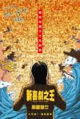

[新喜剧之王](https://pewae.com/gaan/aHR0cHM6Ly9tb3ZpZS5kb3ViYW4uY29tL3N1YmplY3QvNDg0MDM4OA==)

导演：周星驰 / 邱礼涛主演：张全蛋 / 张琪 / 景如洋 / 王宝强 / 田启文 / 苗溢伦 / 蔡哲睿 / 袁兴哲 / 鄂靖文 / 黄骁鹏类型：剧情 / 喜剧地区：大陆首映时间：2019

周星驰也太迷信群众演员了，这片子本来就简陋，上来一帮群演当主演之后，更是异常落魄。
王宝强演谁都是王宝强。
女主角的长相还挺讨喜的。

[本能寺酒店](https://pewae.com/gaan/aHR0cHM6Ly9tb3ZpZS5kb3ViYW4uY29tL3N1YmplY3QvMjY4MjM4Mjg=)

原名：本能寺ホテル导演：铃木雅之主演：八岛智人 / 堤真一 / 平山浩行 / 平岩纸 / 滨田岳 / 田口浩正 / 绫濑遥 / 近藤正臣 / 风间杜夫 / 高岛政宏类型：喜剧地区：日本首映时间：2017

本能寺那点儿破事，竟然叨叨了快两个小时。起码一个半小时是无用功。
只有奶遥（绫濑遥）的奶能看。

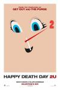

[忌日快乐2](https://pewae.com/gaan/aHR0cHM6Ly9tb3ZpZS5kb3ViYW4uY29tL3N1YmplY3QvMzAyMDk4MTg=)

原名：Happy Death Day 2U导演：克里斯托弗·兰登主演：伊瑟尔·布罗萨德 / 凯莱布·斯比尔亚兹 / 史蒂夫·齐西斯 / 吉吉·埃内塔 / 杰西卡·罗德 / 查尔斯·艾特肯 / 瑞秋·马休斯 / 苏拉·沙玛 / 莎拉·亚金 / 露比·莫迪恩类型：恐怖 / 悬疑 / 惊悚地区：美国首映时间：2019

跟第一部的联系过于紧密了，作为续集来说不是好现象，因为容易出戏。
惊悚片变科幻片了，无聊。
两年不见，女主角演技见长。

[神探蒲松龄](https://pewae.com/gaan/aHR0cHM6Ly9tb3ZpZS5kb3ViYW4uY29tL3N1YmplY3QvMjcwNjU4OTg=)

导演：严嘉主演：乔杉 / 刘智满 / 刘智福 / 成龙 / 林柏宏 / 林鹏 / 潘长江 / 苑琼丹 / 钟楚曦 / 阮经天类型：动作 / 古装 / 喜剧 / 奇幻地区：大陆首映时间：2019

哪怕你像捉妖记那样弄个合家欢也好啊，搞什么聂小倩宁采臣的狗血爱情啊，这剧情完全一塌糊涂。
成龙不要脸。
钟楚曦的造型跟她的气质太不搭了，白瞎了她那张高级电影脸。

[人肉机器：蛊毒](https://pewae.com/gaan/aHR0cHM6Ly9tb3ZpZS5kb3ViYW4uY29tL3N1YmplY3QvMjY5MzAxMTk=)

原名：蠱毒导演：西村喜广主演：富手麻妙 / 川濑阳太 / 斋藤工 / 村杉蝉之介 / 田中要次 / 百合沙 / 鸟居美雪类型：动作 / 喜剧 / 恐怖地区：日本首映时间：2017

非常西村喜广。
虽然含奶量不太高，但含血量真是足够了。
脱bra驾驭外星人，也算是开足了脑洞了。

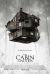

[林中小屋](https://pewae.com/gaan/aHR0cHM6Ly9tb3ZpZS5kb3ViYW4uY29tL3N1YmplY3QvMzE0MzY3Ng==)

原名：The Cabin in the Woods导演：德鲁·戈达德主演：克里斯·海姆斯沃斯 / 克里斯汀·康奈利 / 安娜·哈彻森 / 布莱德利·惠特福德 / 布莱恩·J·怀特 / 弗兰·克朗茨 / 杰西·威廉姆斯 / 理查德·詹金斯 / 艾米·阿克 / 西格妮·韦弗类型：恐怖地区：美国首映时间：2012

非常有名的片子，被一些人奉为圭臬，我不以为然。
十分明显地感觉到一个穷字，虽然怪物很多，但攻击的主力显然是花钱最少的丧尸，这不合理。
宗教的调调儿有点儿多。

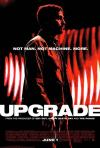

[升级](https://pewae.com/gaan/aHR0cHM6Ly9tb3ZpZS5kb3ViYW4uY29tL3N1YmplY3QvMjcwOTM3MDc=)

原名：Upgrade导演：雷·沃纳尔主演：克里斯托弗·卡比 / 哈里森·吉尔伯特森 / 本尼迪克·哈迪 / 梅拉里·沃列何 / 理查德·考索恩 / 理查德·阿纳斯塔西奥斯 / 琳达·克罗珀 / 罗斯科·坎贝尔 / 罗根·马歇尔-格林 / 贝蒂·加布里埃尔类型：动作 / 惊悚 / 科幻地区：美国首映时间：2018

题材不新鲜，AI和机器人三大定律可真是科幻界永恒的主题。
动作戏还不错，干净利落。
为最后残酷的结局加一分。

[万箭穿心](https://pewae.com/gaan/aHR0cHM6Ly9tb3ZpZS5kb3ViYW4uY29tL3N1YmplY3QvMTA1Mzc4NTM=)

导演：王竞主演：何明兰 / 刘善良 / 李现 / 杨鸣秋 / 焦刚 / 王沫溪 / 赵倩 / 陈刚 / 颜丙燕 / 黄首霞类型：剧情 / 家庭地区：大陆首映时间：2012

颜丙燕真心厉害，演得就像身边的人，40岁就能做到这一点太不容易。
电影的描述手法很直接，也很残忍。
扣一分是因为时间线不对，高考改成六月份是2003年，往前推10年就是1993年，而93年的时候还没有“走进新时代”这首歌。

[小飞象](https://pewae.com/gaan/aHR0cHM6Ly9tb3ZpZS5kb3ViYW4uY29tL3N1YmplY3QvMjU5MjQwNTY=)

原名：Dumbo导演：蒂姆·波顿主演：丹尼·德维托 / 伊娃·格林 / 卡米尔·雷米泽斯基 / 妮可·帕克 / 桑迪·马丁 / 科林·法瑞尔 / 约瑟夫·盖特 / 艾伦·阿金 / 芬利·霍宾斯 / 迈克尔·基顿类型：冒险 / 奇幻地区：美国首映时间：2019

一切都很平庸。
作为一部迪士尼片，音乐太弱了。

[摄影机不要停！ 续集 好莱坞大作战！](https://pewae.com/gaan/aHR0cHM6Ly9tb3ZpZS5kb3ViYW4uY29tL3N1YmplY3QvMzA0NDkwNjQ=)

原名：カメラを止めるな！ スピンオフ ハリウッド大作戦！导演：中泉裕矢主演：主浜晴美 / 大泽真一郎 / 山崎俊太郎 / 市原洋 / 滨津隆之 / 真鱼 / 秋山柚稀 / 竹原芳子 / 细井学 / 长屋和彰类型：喜剧地区：日本首映时间：2019

把第一部的套路再来一遍已经很没诚意了，何况还没有第一部那么严谨。
樱桃老丸子的表现像是特意加的戏。

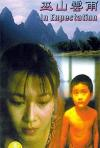

[巫山云雨](https://pewae.com/gaan/aHR0cHM6Ly93d3cuaW1kYi5jb20vdGl0bGUvdHQwMTE4MTk5Lw==)

导演：章明主演：修宗迪 / 张献民 / 李冰 / 杨柳 / 王文强 / 钟萍类型：剧情 / 喜剧地区：大陆首映时间：1996

这片子好抽象。
再次验证了被禁的不一定好。
修宗迪演得挺到位。

[飞驰人生](https://pewae.com/gaan/aHR0cHM6Ly9tb3ZpZS5kb3ViYW4uY29tL3N1YmplY3QvMzAxNjM1MDk=)

导演：韩寒主演：尹昉 / 尹正 / 张本煜 / 易小星 / 沈腾 / 田雨 / 腾格尔 / 赵文瑄 / 魏翔 / 黄景瑜类型：喜剧地区：大陆首映时间：2019

韩寒盯着一个赛车题材拍，挺令人尊敬。
这部片子比较有诚意，后半段的赛车镜头很棒，令人血脉贲张。
沈腾进监狱是为了孩子，可为了冠军就不管孩子了？这说不通。

[奇门遁甲](https://pewae.com/gaan/aHR0cHM6Ly9tb3ZpZS5kb3ViYW4uY29tL3N1YmplY3QvMjY2NjExOTE=)

导演：袁和平主演：伍佰 / 倪妮 / 周冬雨 / 大鹏 / 孙明明 / 李治廷 / 杨一威 / 柳岩 / 许明虎 / 谢苗类型：动作 / 奇幻地区：大陆首映时间：2017

徐克+袁和平+袁家班+施南生就拍出这么个玩意儿？
结局简直莫名其妙，完全没有爆米花片应该有的爽感，特意留意了staff，徐克挂名剪辑，这是想说明什么吗？
伍佰的造型简直太恶心了。

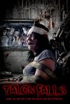

[误入魔爪](https://pewae.com/gaan/aHR0cHM6Ly93d3cuaW1kYi5jb20vdGl0bGUvdHQ3MDQ4Njc2Lw==)

原名：Talon Falls导演：joshua shreve主演：brad bell / fred biggs / lonnie bloomburg类型：恐怖地区：美国首映时间：2017

小成本恐怖片能拍出令我紧张的感觉已经很难得了。
结局有些俗套，看到开头就已经猜出来了。
女主角太丑差评。

[古利亚瓦西亚](https://pewae.com/gaan/aHR0cHM6Ly93d3cuaW1kYi5jb20vdGl0bGUvdHQ1MTYxMDU4)

原名：Гуляй, Вася!导演：roman karimov主演：boris dergachev / efim petrunin / lyubov aksyonova类型：喜剧地区：俄罗斯首映时间：2017

并不有趣，战斗民族拍起烂片来也真够烂的。
等了一个多小时，女二终于漏点了！
怕老婆的死肥宅也有人追，这不科学。

[僵尸集团](https://pewae.com/gaan/aHR0cHM6Ly9tb3ZpZS5kb3ViYW4uY29tL3N1YmplY3QvMjY2NzMzOTcv)

原名：Zombies导演：Hamid Torabpour主演：Raina Hein / Steven Luke / Tony Todd类型：动作 / 恐怖地区：美国首映时间：2017

僵尸片拍那么深沉，去竞逐奥斯卡吗？

[我老婆不是人](https://pewae.com/gaan/aHR0cHM6Ly9tb3ZpZS5kb3ViYW4uY29tL3N1YmplY3QvMTMwODIxOS8=)

导演：陈德森主演：关之琳 / 周文健 / 张坚庭 / 梁家辉 / 梅小惠 / 胡枫 / 郑丹瑞 / 陈雅伦 / 黎彼得类型：喜剧 / 悬疑地区：香港首映时间：1991

关之琳强行卖萌，当然人家是真漂亮。
即使是三无小片，梁家辉也能贡献影帝级别的表现。
陈雅伦也算一代脱星，可惜一直没红起来。

[乌鼠机密档案](https://pewae.com/gaan/aHR0cHM6Ly9tb3ZpZS5kb3ViYW4uY29tL3N1YmplY3QvMTMwMjA4NC8=)

导演：邓衍成主演：任达华 / 关咏荷 / 李修贤 / 郑则仕类型：剧情 / 动作 / 犯罪地区：香港首映时间：1993

剧情很有趣，演绎了什么叫雪崩逻辑——被绿，酒醉误杀老婆，为摆平杀手搭进一个傻冒黑社会，傻冒黑社会的哥哥疯狂报复。
郑则仕和任达华表现非常精彩，一个是窝囊废的逆袭，一个是人狠话不多。
“爸爸，我晒得这么黑，你还认不认得我啊”可算是华语影坛屈指可数的令人心理反感的镜头之一。

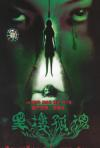

[黑楼孤魂](https://pewae.com/gaan/aHR0cHM6Ly9tb3ZpZS5kb3ViYW4uY29tL3N1YmplY3QvMTgzMDE4OS8=)

导演：梁明 / 穆德远主演：李振峰 / 潘婕 / 管宗祥 / 陈希光 / 韩小磊类型：剧情 / 恐怖 / 惊悚地区：大陆首映时间：1989

中国第一部恐怖片，中国第一部没有鬼的恐怖片，中国第一部被叫停放映的恐怖片。
据说当年很多影院私下播放，一票难求。
可这个类型30年来没什么长进，反而倒退了。

[巴斯特·斯克鲁格斯的歌谣](https://pewae.com/gaan/aHR0cHM6Ly9tb3ZpZS5kb3ViYW4uY29tL3N1YmplY3QvMjY5NTI3MDQv)

原名：The Ballad of Buster Scruggs导演：乔尔·科恩 / 伊桑·科恩主演：佐伊·卡赞 / 克兰西·布朗 / 哈利·米尔林 / 大卫·克朗姆霍茨 / 布莱丹·格里森 / 比尔·赫克 / 汤姆·威兹 / 蒂姆·布雷克·尼尔森 / 詹姆斯·弗兰科 / 连姆·尼森类型：剧情 / 喜剧 / 悬疑 / 歌舞 / 爱情 / 西部地区：美国首映时间：2018

不愧是名家，每个场景都很有味道。
但还是无法接受一言不合就开唱这种形式。
最后一个故事太晦涩，反复看了好几遍。

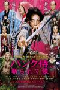

[朋克武士](https://pewae.com/gaan/aHR0cHM6Ly9tb3ZpZS5kb3ViYW4uY29tL3N1YmplY3QvMzAxNDI1ODUv)

原名：パンク侍、斬られて候导演：石井岳龙主演：东出昌大 / 北川景子 / 国村隼 / 村上淳 / 染谷将太 / 浅野忠信 / 涩川清彦 / 绫野刚 / 若叶龙也 / 近藤公园类型：动作 / 喜剧地区：日本首映时间：2018

剧情太跳，政治隐喻太多，但很喜欢人民群众都是傻逼这个设定。
男主角一言不合就大秀屁股和兜裆布，很朋克。
结局是意料之中的反转，不太满意。

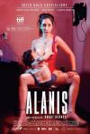

[艾拉妮丝](https://pewae.com/gaan/aHR0cHM6Ly9tb3ZpZS5kb3ViYW4uY29tL3N1YmplY3QvMjcxMjcwODMv)

原名：Alanis导演：安娜希·贝妮主演：但丁·德拉·鲍尔拉 / 哈维尔·范德库特 / 圣地亚哥·佩德雷罗 / 索菲亚·哥拉 / 达纳·巴索类型：剧情地区：阿根廷首映时间：2017

女主角一开场厂商logo放完之后就开始漏点，这很拉美。
一个关于阿根廷扫黄打非的故事，没太大的冲突。
所有的剧情都在一张海报里。

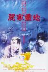

[尸家重地](https://pewae.com/gaan/aHR0cHM6Ly9tb3ZpZS5kb3ViYW4uY29tL3N1YmplY3QvMTMwMDA4NS8=)

导演：刘镇伟主演：元奎 / 卢冠廷 / 叶子楣 / 吴君如 / 白文彪 / 陈淑兰 / 陈硕 / 陈远佳 / 陈龙 / 鲍伟立类型：喜剧 / 恐怖地区：香港首映时间：1990

刘镇伟这辈子拍的烂片数量是好片数量的十几倍，但是这个死胖子早期的作品确实是有想法的。
卢冠廷少有的台前作品，而且表现还不错，挺有喜剧天分的。
刚认出叶子楣的胸，她就领盒饭了。

[狂野目标](https://pewae.com/gaan/aHR0cHM6Ly9tb3ZpZS5kb3ViYW4uY29tL3N1YmplY3QvMzA3ODM4NC8=)

原名：Wild Target导演：乔纳森·林恩主演：杰夫·贝尔 / 格莱格·费什尔 / 比尔·奈伊 / 艾琳·阿特金斯 / 艾米莉·布朗特 / 马丁·弗瑞曼 / 鲁伯特·格林特 / 鲁伯特·艾弗雷特类型：动作 / 喜剧 / 犯罪地区：英国首映时间：2010

英式幽默在看惯了好莱坞风格之后是不错的补充，虽然段子有点儿老。
男主角太老，女主角也太老，反派也老，总之是部老年人电影。
倒是哈利波特里的罗恩表现得很有活力。

[尸奶俱乐部](https://pewae.com/gaan/aHR0cHM6Ly9tb3ZpZS5kb3ViYW4uY29tL3N1YmplY3QvMjY5NzA4MDMv)

原名：Peelers导演：Sevé Schelenz主演：Al Dales / Cameron Dent / Caz Odin Darko / Kirsty Peters / Madison J· Loos / Momona Komagata / Nikki Wallin / Rafael Mateo / Victoria Gomez / Wren Walker类型：恐怖地区：美国首映时间：2016

这片奶量很足，可老美只给评了个PG级，可见多无聊。
坚持到最后，彩蛋加了1分。
女主角实在太丑了。

[怪谈协会](https://pewae.com/gaan/aHR0cHM6Ly9tb3ZpZS5kb3ViYW4uY29tL3N1YmplY3QvMTMwMTE1Ni8=)

导演：叶伟民 / 钱文锜 / 马伟豪主演：张达明 / 江希文 / 舒淇 / 袁咏仪 / 谷德昭 / 黎姿类型：喜剧 / 恐怖地区：香港首映时间：1996

感觉很到位，因为是由三个小短片组成，所以剧情一点儿也不拖沓。
第三个故事非常精彩，并不靠鬼吓人，但“身份”的设定非常惊悚。

[邪](https://pewae.com/gaan/aHR0cHM6Ly9tb3ZpZS5kb3ViYW4uY29tL3N1YmplY3QvMTQ4NDYzMy8=)

导演：桂治洪主演：刘一帆 / 尤翠玲 / 恬妮 / 李寿祺 / 沈劳 / 王戎 / 王清河 / 陈思佳 / 陈立品 / 韩国材类型：奇幻 / 恐怖地区：香港首映时间：1980

老邵氏片的风骨，一板一眼，恐怖就没多恐怖了，可能是因为布景即使在70年代算也太简陋了。
跳大神那段裸体独舞真是蛮拼的，想想那可是40年前，即使那位女演员当年只有20岁，如今也是年过花甲的老太太了。
1988年香港评定老电影的级别，这连毛都露了的片子竟然没评上三级，也不知发生了什么。

[阴阳路](https://pewae.com/gaan/aHR0cHM6Ly9tb3ZpZS5kb3ViYW4uY29tL3N1YmplY3QvMTQ4MDA1MS8=)

导演：谭朗昌 / 邱礼涛 / 郑伟文主演：丁子峻 / 古天乐 / 吴志雄 / 朱永棠 / 白嘉倩 / 罗兰 / 苑琼丹 / 蔡少芬 / 雷宇扬 / 麦家琪类型：恐怖地区：香港首映时间：1997

一帮大咖的幼生期，比如绝版白古天乐。
不怎么吓人，但故事还算有趣，麦家琪的卖肉有点小儿科。
恐怖片分段拍，比较能抓人注意力。

[棒打鸳鸯](https://pewae.com/gaan/aHR0cHM6Ly9tb3ZpZS5kb3ViYW4uY29tL3N1YmplY3QvMzAxNDc2OTIv)

原名：The Breaker Upperers导演：杰姬·凡·比克 / 玛德琳·萨米主演：Celia Pacquola / 凯尔文泰勒 / 尼克·桑普森 / 杰姬·凡·比克 / 玛德琳·萨米 / 瑞玛·特·维塔 / 科恩·霍洛维 / 詹姆斯·罗尔斯顿 / 雅姬·布朗类型：喜剧地区：新西兰首映时间：2018

新西兰版分手大师，大团圆结局有些俗套。
新西兰人的三观是挺有意思的。

[刺透](https://pewae.com/gaan/aHR0cHM6Ly9tb3ZpZS5kb3ViYW4uY29tL3N1YmplY3QvMjY5NzA1NjMv)

原名：Piercing导演：尼古拉斯·佩谢主演：克里斯托弗·阿波特 / 奥利维亚·邦德 / 玛丽亚·迪齐亚 / 米娅·华希科沃斯卡 / 维德尔·皮尔斯 / 莱娅·柯丝达 / 达科塔·卢斯提克 / 马琳·爱尔兰类型：惊悚地区：美国首映时间：2018

变态之间的相爱相杀。
剧情有点儿脱节。
女主角是当年的爱丽丝，举手投足间有种挥洒自如的感觉。

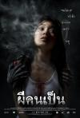

[吓死鬼](https://pewae.com/gaan/aHR0cHM6Ly9tb3ZpZS5kb3ViYW4uY29tL3N1YmplY3QvMjAzMDU2My8=)

原名：ผีคนเป็น导演：蒙松主演：Apasiri Nitibhon / Penpak Sirikul / Pitchanart Sakakorn类型：恐怖 / 悬疑 / 惊悚地区：泰国首映时间：2006

某论坛小孩推荐的，说很吓人。
很失望，只能说小孩看的片子太少。

[你带着我](https://pewae.com/gaan/aHR0cHM6Ly9tb3ZpZS5kb3ViYW4uY29tL3N1YmplY3QvMjY0MTc1NTMv)

原名：Ti mene nosiš导演：Ivona Juka主演：Ana Begic / Goran Hajdukovic / Helena Beljan / Juraj Dabic / Krunoslav Saric / Natasa Dorcic / Natasa Janjic / Vojislav Brajovic / 塞巴斯蒂安·卡瓦扎 / 拉娜·巴里奇类型：剧情 / 动作 / 家庭地区：克罗地亚首映时间：2015

还可以。
优点是比较温情，缺点是太长了。

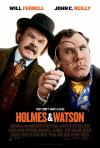

[福尔摩斯与华生](https://pewae.com/gaan/aHR0cHM6Ly9tb3ZpZS5kb3ViYW4uY29tL3N1YmplY3QvMzE0ODY2My8=)

原名：Holmes & Watson导演：伊坦·柯亨主演：丽贝卡·豪尔 / 休·劳瑞 / 凯莉·麦克唐纳 / 劳伦·拉普库斯 / 威尔·法瑞尔 / 帕姆·费里斯 / 拉尔夫·费因斯 / 约翰·C·赖利 / 罗伯·布莱顿 / 贝拉·拉姆齐类型：喜剧 / 悬疑 / 犯罪地区：美国首映时间：2018

烂梗一箩筐。演这种片威尔法瑞尔是不是穷疯了？
维多利亚风格的布景倒是很像样。

[环药房自行车赛](https://pewae.com/gaan/aHR0cHM6Ly9tb3ZpZS5kb3ViYW4uY29tL3N1YmplY3QvMjY4NTU1Mjgv)

原名：Tour de Pharmacy导演：杰克·西曼斯基主演：乔·巴克 / 克里斯·韦伯 / 兰斯·阿姆斯特朗 / 埃里克·内宁格 / 奥兰多·布鲁姆 / 安迪·萨姆伯格 / 弗莱迪·海默 / 戴维德·迪格斯 / 约翰·塞纳 / 迈克·泰森类型：喜剧 / 运动地区：美国首映时间：2017

颠覆人想象的作品：奥兰多布鲁姆露了鸟（虽然是塑料的）；兰斯阿姆斯特朗承担了所有笑点。
克里斯韦伯和泰森的客串只能说中规中矩，韦伯调侃自己的段子实在是不流行了。
女主角青年版和老年版差别太大了。

[勒索](https://pewae.com/gaan/aHR0cHM6Ly9tb3ZpZS5kb3ViYW4uY29tL3N1YmplY3QvMzAxODkzNDIv)

原名：Blackmail导演：Abhinay Deo主演：Anuja Sathe / Gajraj Rao / Kirti Kulhari / Neelima Azim / Pradhuman Singh / 乌尔米拉·马东卡 / 伊尔凡·可汗 / 奥米·瓦依达 / 迪维亚·达塔 / 阿鲁诺德·辛格类型：喜剧地区：印度首映时间：2018

题材不新鲜，但是导演的掌控不错。
死掉的那个处女配角颜值不错，后来没戏份了好可惜。
男主角假装加班在公司打游戏可以理解，但是打吃豆人就太假了。

[A片现场不NG](https://pewae.com/gaan/aHR0cHM6Ly9tb3ZpZS5kb3ViYW4uY29tL3N1YmplY3QvMjYzMzY1MTkv)

原名：メイクルーム导演：森川圭主演：伊东红 / 住吉真理子 / 佐藤仁 / 川上奈奈美 / 栗林里莉 / 森田亚纪 / 蒲公仁 / 那波隆史 / 酒井健太郎 / 重松隆志类型：喜剧 / 情色地区：日本首映时间：2015

把故事拍得温馨感人似乎是日本导演的天赋技能，虽然故事本身挺咸湿挺扯的。
虽然差不多除了女主角之外都有脱，但身材真的是一言难尽啊……

[A片现场不NG2](https://pewae.com/gaan/aHR0cHM6Ly9tb3ZpZS5kb3ViYW4uY29tL3N1YmplY3QvMjY3NTM0MjYv)

原名：メイクルーム2导演：森川圭主演：中原和宏 / 伊东红 / 住吉真理子 / 川上奈奈美 / 平岛夏海 / 栗林里莉 / 森田亚纪类型：喜剧 / 情色地区：日本首映时间：2016

人物增加了，趣味性却降低了，属于不算骗钱却也没多少料的续集。

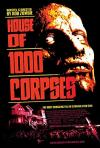

[千尸屋](https://pewae.com/gaan/aHR0cHM6Ly93d3cuaW1kYi5jb20vdGl0bGUvdHQwMjUxNzM2Lw==)

原名：House of 1000 Corpses导演：rob zombie主演：bill moseley / karen black / sid haig类型：恐怖地区：美国首映时间：2003

恐惧氛围尚可，跟邪教扯上就没什么意思了。
一句话，很一般。
低于6分是因为女主角丑。

[666魔鬼复活](https://pewae.com/gaan/aHR0cHM6Ly9tb3ZpZS5kb3ViYW4uY29tL3N1YmplY3QvMTQyMTkyNC8=)

导演：林伟伦主演：吴镇宇 / 张璐1 / 甄子丹 / 苑琼丹 / 邱淑贞 / 黄子华类型：动作 / 惊悚地区：香港首映时间：1996

魔鬼题材由美国人来拍，我都不带正眼瞅的，但是香港片里可就少见了。
牧师带小弟，王晶自己调侃自己，还挺有趣的。
死胖子就是不肯让邱淑贞多脱一点儿。

[青春梦工场](https://pewae.com/gaan/aHR0cHM6Ly9tb3ZpZS5kb3ViYW4uY29tL3N1YmplY3QvMTMyMzc0OS8=)

导演：彭浩翔主演：周俊伟 / 周振辉 / 天宫真奈美 / 张达明 / 徐天佑 / 曾国祥 / 葛民辉 / 詹瑞文 / 黄又南类型：剧情 / 喜剧 / 爱情地区：香港首映时间：2005

宅男都有这样的梦想，彭浩翔把它拍了出来，还很有教育意义。
男孩走向社会的寓言，闪亮而又混蛋的青春啊！
冯小刚《非诚勿扰》里唯一一个有趣的“分歧终端机”竟然是从这里抄的，可见那片子是多么的不走心。

[死侍2：我爱我家](https://pewae.com/gaan/aHR0cHM6Ly9tb3ZpZS5kb3ViYW4uY29tL3N1YmplY3QvMjY1ODgzMDgv)

原名：Deadpool 2导演：大卫·雷奇主演：T·J·米勒 / 乔什·布洛林 / 卡兰·索尼 / 布里安娜·希德布兰德 / 斯蒂芬·卡皮契奇 / 朱利安·迪尼森 / 瑞安·雷诺兹 / 莎姬·贝兹 / 莫蕾娜·巴卡琳 / 莱斯利·格塞斯类型：冒险 / 动作 / 喜剧 / 科幻地区：美国首映时间：2019

原来死侍跟X战警的关系就是李向阳跟地道战的关系。
死侍的碎嘴比正经剧情有意思，配乐比碎嘴有意思。
看好演多诺万的沙姬贝兹以后成大气。

[海市蜃楼（2019）](https://pewae.com/gaan/aHR0cHM6Ly9tb3ZpZS5kb3ViYW4uY29tL3N1YmplY3QvMzAxNjQ0NDgv)

原名：Mientras dure la tormenta导演：奥里奥尔·保罗主演：克拉拉·塞古拉 / 哈维尔·古铁雷斯 / 奇诺·达林 / 米格尔·费南德斯 / 米玛·里埃拉 / 艾娜·克洛特 / 诺拉·纳瓦斯 / 阿尔伯特·佩雷斯 / 阿尔瓦罗·莫奇 / 阿德里亚娜·乌加特类型：悬疑 / 惊悚 / 科幻地区：西班牙首映时间：2019

剧情还算跌宕起伏，唯一缺憾结尾缺少反转，提前猜到了。
女主角好漂亮。
反复提到的柏林墙并没有太重要的作用。

[弱杀](https://pewae.com/gaan/aHR0cHM6Ly93d3cuaW1kYi5jb20vdGl0bGUvdHQwMTExMDM3Lw==)

导演：邓衍成主演：八两金 / 卢敏仪 / 吴毅将 / 戴志伟 / 许思敏 / 钟淑慧类型：恐怖地区：香港首映时间：1994

钟淑惠的身材有多好，脸就有多像弱智。
吴毅将年轻的时候身材真是好到爆衫。
剧情中段钟淑惠明明已经剃毛了，后面一个镜头扫过，竟又长出来了，明显用了替身。

[超时空要爱](https://pewae.com/gaan/aHR0cHM6Ly9tb3ZpZS5kb3ViYW4uY29tL3N1YmplY3QvMTI5NzE0OC8=)

导演：黎大炜主演：八两金 / 刘以达 / 李枫 / 李绮虹 / 林尚义 / 梁朝伟 / 赵银淑类型：动作 / 喜剧 / 奇幻 / 犯罪地区：香港首映时间：1998

刘镇伟又一次有想法没能力，前面的故事太乱根本没铺垫好。
李绮红胸好平。
梁朝伟演了条咸鱼。

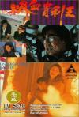

[香港奇案之吸血贵利王](https://pewae.com/gaan/aHR0cHM6Ly93d3cuaW1kYi5jb20vdGl0bGUvdHQwMTExNzY0Lw==)

导演：林庆隆主演：吴启华 / 李兆基 / 林玉紫 / 许蓓 / 黄子扬 / 黄秋生类型：恐怖 / 惊悚 / 犯罪地区：香港首映时间：1994

高利贷教育片，作为三级漏点太少了。
吴启华演变态相当有一套。
黄秋生根本没能好好发挥。

[大侦探皮卡丘](https://pewae.com/gaan/aHR0cHM6Ly9tb3ZpZS5kb3ViYW4uY29tL3N1YmplY3QvMjY4MzU0NzEv)

原名：Pokémon Detective Pikachu导演：罗伯·莱特曼主演：克里斯·吉尔 / 凯瑟琳·纽顿 / 卡兰·索尼 / 普莉安卡·伯福德 / 比尔·奈伊 / 渡边谦 / 瑞塔·奥拉 / 瑞安·雷诺兹 / 苏琪·沃特豪斯 / 贾斯蒂斯·史密斯类型：冒险 / 动画 / 喜剧 / 奇幻地区：美国首映时间：2019

太过于粉丝向了，剧情一般一般再一般。
黑人小孩怎么有个白人爹？
皮卡丘和超梦以外的口袋妖怪都不像是角色，更像道具。

[脑浆炸裂少女](https://pewae.com/gaan/aHR0cHM6Ly9tb3ZpZS5kb3ViYW4uY29tL3N1YmplY3QvMjYyNzQxMzIv)

原名：脳漿炸裂ガール导演：阿部雄一主演：上白石萌歌 / 志田友美 / 春花 / 柏木日向 / 浅香航大 / 荒井敦史 / 菅谷哲也类型：冒险 / 科幻地区：日本首映时间：2015

然而并没有脑浆。

[替天行道之杀兄](https://pewae.com/gaan/aHR0cHM6Ly93d3cuaW1kYi5jb20vdGl0bGUvdHQwMTExNDIyLw==)

导演：邓衍成主演：何家驹 / 卢敏仪 / 吴岱融 / 吴毅将 / 钟淑慧 / 陈蓓琪类型：剧情 / 惊悚 / 犯罪地区：香港首映时间：1994

何家驹驹哥果然是很黄很暴力的代言人。
黄秋生演律师很让人出戏，还以为会有他什么支线，结果屁都没有。

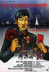

[解放军在巴黎](https://pewae.com/gaan/aHR0cHM6Ly9tb3ZpZS5kb3ViYW4uY29tL3N1YmplY3QvMTg4MzcwMS8=)

原名：Les Chinois à Paris导演：让·雅南主演：尼科尔·卡尔方 / 玛莎·梅赫勒 / 米歇尔·塞罗尔 / 让·雅南 / 长塚京三类型：喜剧 / 奇幻地区：法国首映时间：1974

法国人嘲讽和自嘲的技能点都点满了，这片要是放在现在，可以算是极大地伤害了中国人民感情，可是它伤害法国人民的感情伤得更厉害啊！
全片高潮在卡门配董存瑞，绝对既高雅又革命，我从来没看过那么深刻的舞剧。
可惜里面一个中国人都没有，大部分的中国人都是找法国殖民地的越南人演的，男主角是个日本人，所有的中文台词都南腔北调的。

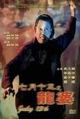

[七月十三之龙婆](https://pewae.com/gaan/aHR0cHM6Ly9tb3ZpZS5kb3ViYW4uY29tL3N1YmplY3QvMTMwODM2NS8=)

导演：钱升玮主演：卢敏仪 / 吴大维 / 李嘉欣 / 罗兰 / 黄子华类型：剧情地区：香港首映时间：1996

吴大维演的烂片还真多啊，黄子华完全游离在片子之外。
罗兰是唯一亮点。

[沙西米](https://pewae.com/gaan/aHR0cHM6Ly9tb3ZpZS5kb3ViYW4uY29tL3N1YmplY3QvMjU5MTc4OTYv)

导演：潘志远主演：周孝安 / 拓也哥 / 李康生 / 波多野结衣 / 纪培慧 / 苏达 / 谢炘昊 / 陈秉立类型：情色地区：台湾首映时间：2015

一部典型的台式烂片。
应该是为了迎合波多野结衣死于海啸的传闻而攒的本子，并且找了波多野本尊来演，以至于根本不知道故事说了些啥。
AV女优们穿上衣服后演技比拼，都不怎么样啊！

[解救吾先生](https://pewae.com/gaan/aHR0cHM6Ly9tb3ZpZS5kb3ViYW4uY29tL3N1YmplY3QvMjU3OTg0NDgv)

导演：丁晟主演：余皑磊 / 刘德华 / 刘烨 / 吴若甫 / 李梦 / 林雪 / 王千源 / 蔡鹭 / 赵小锐 / 陆彭类型：剧情 / 犯罪地区：大陆首映时间：2015

很喜欢的类型片，八十年代有很多这种纪实犯罪题材的，新千年以后逐渐消失了。
除了王千源，都不好。
被绑的另外一个人的女朋友，戏不到半分钟，特别出戏。

[我是你爸爸](https://pewae.com/gaan/aHR0cHM6Ly9tb3ZpZS5kb3ViYW4uY29tL3N1YmplY3QvMTM5NzU1MC8=)

导演：王朔主演：冯小刚 / 刘蓓 / 徐帆 / 胡小培类型：剧情 / 喜剧地区：大陆首映时间：2000

其实冯小刚特别适合演这种色厉内荏的怂人。
演小女朋友的王维凝非常漂亮啊！
徐帆的大婶演得特接地气。

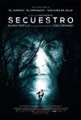

[绑架](https://pewae.com/gaan/aHR0cHM6Ly9tb3ZpZS5kb3ViYW4uY29tL3N1YmplY3QvMjY5MzU0NDIv)

原名：Secuestro导演：玛·塔尔加纳主演：何塞·科罗纳多 / 娜乌西卡·邦宁 / 安东尼奥·德钦特 / 布兰卡·波蒂略 / 文森特·罗米洛类型：惊悚地区：西班牙首映时间：2016

平平淡淡，一开始就知道小孩不是好小孩了。
结局为了反转而反转。

[抢钱夫妻](https://pewae.com/gaan/aHR0cHM6Ly9tb3ZpZS5kb3ViYW4uY29tL3N1YmplY3QvMTI5Njc0Ny8=)

导演：张之亮主演：刘玉翠 / 左诗蓓 / 张之亮 / 萧芳芳 / 许冠文 / 邓一君 / 陈少霞 / 雷宇扬类型：喜剧地区：香港首映时间：1993

香港电影的黄金年代被遗忘的好片。
许冠文无懈可击。
并不十分搞笑，却很温情。

[撕裂人](https://pewae.com/gaan/aHR0cHM6Ly9tb3ZpZS5kb3ViYW4uY29tL3N1YmplY3QvMTQ2NTQxNS8=)

原名：Slither导演：詹姆斯·古恩主演：仙莎·拉德蕾 / 伊丽莎白·班克斯 / 内森·菲利安 / 塔尼亚·索尔尼尔 / 格雷格·亨利 / 迈克尔·鲁克类型：喜剧 / 恐怖 / 科幻地区：加拿大首映时间：2006

女主角伊丽莎白班克斯漂亮是漂亮，但总带着一股婊气，本片的故事也不例外，可能导演就是根据这点挑的演员吧。
依旧是以触手和粘液为恶心点的美式恐怖片，但恶心得还挺萌的。
这片是导演的处女作，他后来还拿过金酸梅，却也指导了银河护卫队，其实这片真的能看。

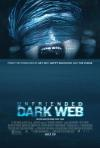

[解除好友2：暗网](https://pewae.com/gaan/aHR0cHM6Ly9tb3ZpZS5kb3ViYW4uY29tL3N1YmplY3QvMjY3MjU2Nzgv)

原名：Unfriended: Dark Web导演：斯蒂芬·苏斯科主演：切尔西·阿尔登 / 安德鲁斯·李斯 / 康纳·戴尔·里奥 / 斯蒂芬妮·诺格拉斯 / 瑞贝卡·瑞滕豪斯 / 科林·伍德尔 / 萨维拉·温蒂亚尼 / 贝蒂·加布里埃尔 / 道格拉斯·泰特 / 阿什顿·斯迈利类型：恐怖 / 犯罪地区：美国首映时间：2018

一部完全以脑洞为卖点的片子，开头铺垫的让人昏昏欲睡。
合理性什么的就不考虑了，世界上就没那么有行动力的黑客组织，黑客都是脑子灵魂手脚不听指挥的吧。
亚裔女配角死得莫名其妙，在美国真是不受重视的族群啊。

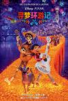

[寻梦环游记](https://pewae.com/gaan/aHR0cHM6Ly9tb3ZpZS5kb3ViYW4uY29tL3N1YmplY3QvMjA0OTUwMjMv)

原名：Coco导演：李·昂克里奇 / 阿德里安·莫利纳主演：加布里埃尔·伊格莱西亚斯 / 安东尼·冈萨雷斯 / 本杰明·布拉特 / 杰米·卡米尔 / 盖尔·加西亚·贝纳尔 / 芮妮·维克托 / 赫伯特·西古恩萨 / 阿兰娜·乌巴赫 / 阿方索·阿雷奥 / 隆巴多·博伊尔类型：动画 / 喜剧 / 奇幻 / 音乐地区：美国首映时间：2017

讲亲情的片子，比较感人。
满地黄叶的效果绝赞。
墨西哥文化和美国文化都是能接受鬼的，天朝怎么就不行。

[希特勒回来了](https://pewae.com/gaan/aHR0cHM6Ly9tb3ZpZS5kb3ViYW4uY29tL3N1YmplY3QvMjY1ODUwMTQv)

原名：Er ist wieder da导演：大卫·韦恩特主演：克里斯托夫·玛丽亚·赫布斯特 / 卡蒂娅·里曼 / 奥利弗·马苏奇 / 妮娜·普罗尔 / 弗郎西斯卡·沃芙 / 拉尔斯·鲁道夫 / 施特凡·格罗斯曼 / 法比安·布施 / 米夏埃尔·克斯勒 / 罗伯托·布兰科类型：喜剧地区：德国首映时间：2015

看完片子的感受：世界需要纳粹。
希特勒因为杀狗被曝光而被杯葛是最嘲讽的地方。
希特勒真的是一人一票选出来的。

[台北夜蒲团团转](https://pewae.com/gaan/aHR0cHM6Ly93d3cuaW1kYi5jb20vdGl0bGUvdHQ0NTM5NzQyLw==)

导演：钱国伟主演：关楚耀 / 昌璟翔 / 王思佳 / 许维恩 / 郑家纯类型：喜剧 / 爱情地区：香港首映时间：2015

真不明白这片为什么在豆瓣没资料，虽然有大胸妹，可根本没露点，在香港也只是二级B没够上三级啊。
女主角许维恩真看不出来已经快40了，挺青春靓丽的。
作为夜蒲系列就不够咸湿，作为一部轻松的娱乐片是及格的。

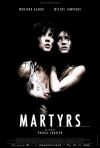

[殉难者](https://pewae.com/gaan/aHR0cHM6Ly9tb3ZpZS5kb3ViYW4uY29tL3N1YmplY3QvMzAxMjAwOS8=)

原名：Martyrs导演：巴斯卡·劳吉哈主演：Catherine Bégin / Jean-Marie Moncelet / Jessie Pham / Louise Boisvert / Robert Toupin / 帕翠西卡·图拉斯内 / 朱丽叶特·高斯林 / 泽维尔·多兰 / 米兰妮·让帕诺米 / 莫贾娜·埃尔阿劳维类型：剧情 / 恐怖 / 惊悚地区：法国首映时间：2008

非常血腥，难得的会让我觉得有点儿疼的电影，反正美国片是做不到的。
宗教意味太浓。
主要人物智商都不怎么在线是最大缺点。

[人奶魔巢](https://pewae.com/gaan/aHR0cHM6Ly9tb3ZpZS5kb3ViYW4uY29tL3N1YmplY3QvMzk5MzI2Mw==)

导演：郑永明主演：东方闻樱 / 王亚玲 / 纪玲类型：剧情 / 情色 / 惊悚 / 战争地区：大陆首映时间：1989

不知道是不是国产抗日雷片的开山鼻祖，反正剧情是毫无逻辑可言，什么大杂烩的武打枪战色情谍战元素都往里加。
峨嵋厂当年很喜欢拍这种cult片，东方闻樱也富有开拓精神，勇气可嘉。
片中没有奶，片中没有奶，片中没有奶！

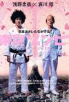

[东京僵尸](https://pewae.com/gaan/aHR0cHM6Ly9tb3ZpZS5kb3ViYW4uY29tL3N1YmplY3QvMTc5NzUxOS8=)

原名：東京ゾンビ导演：佐藤佐吉主演：古田新太 / 哀川翔 / 奥田惠梨华 / 浅野忠信类型：动作 / 喜剧 / 恐怖地区：日本首映时间：2005

“你长着一张被男人搞过的脸”——官方吐槽浅野忠信。
搞笑而不失温情，跟僵尸关系不大。
最后小女孩张嘴喊“巴嘎”那场戏非常惊艳。

[愿上帝宽恕我们](https://pewae.com/gaan/aHR0cHM6Ly9tb3ZpZS5kb3ViYW4uY29tL3N1YmplY3QvMjY2MzU5NTAv)

原名：Que Dios nos perdone导演：罗德里戈·索罗戈延主演：何塞·路易斯·加西亚·佩雷斯 / 劳尔·普列托 / 哈维尔·佩雷伊拉 / 安东尼奥·德·拉·托雷 / 玛丽亚·巴列斯特罗斯 / 玛丽亚·德·纳蒂 / 罗伯托·阿拉莫 / 罗希欧·穆诺兹-科博 / 莫妮卡·洛佩斯 / 路易斯·扎赫拉类型：剧情 / 惊悚 / 犯罪地区：西班牙首映时间：2016

敲黑板，片中至少出现三次裸女镜头。
悬疑什么的倒无所谓，犯罪的类型是够大胆的——奸杀70岁以上老年妇女，这种题材别说天朝了，全世界也只有欧洲几个国家能拍出来吧。
男反的身材极佳。

[暴疯语](https://pewae.com/gaan/aHR0cHM6Ly9tb3ZpZS5kb3ViYW4uY29tL3N1YmplY3QvMjU3NDIyOTkv)

导演：李光耀主演：冼色丽 / 刘青云 / 卫诗雅 / 叶璇 / 孙佳君 / 方中信 / 毛俊辉 / 薛凯琪 / 鲍起静 / 黄晓明类型：悬疑 / 惊悚地区：大陆首映时间：2015

黄晓明的演技本来没有那么烂，但就怕跟刘青云方中信放到一起啊。
就算编剧和导演不差吧，剪辑是真差。

[险恶](https://pewae.com/gaan/aHR0cHM6Ly9tb3ZpZS5kb3ViYW4uY29tL3N1YmplY3QvNjg3NTYxNS8=)

原名：Sinister导演：斯科特·德瑞克森主演：伊桑·霍克 / 克莱尔·弗利 / 弗雷德·多尔顿·汤普森 / 文森特·多诺费奥 / 朱丽叶·赖伦斯 / 詹姆斯·兰索恩类型：恐怖 / 惊悚地区：美国首映时间：2012

构思很好。熊孩子弄死全家这种大翻转还是挺喜闻乐见的。
前期铺垫过于冗长，男猪的穷追不舍动机不足，而专家和NPC警察迟来的解释太过于俗套。
男孩的怪异举动的线终于没了下文，不爽。

[脱衣麻将大逃杀](https://pewae.com/gaan/aHR0cHM6Ly93d3cuaW1kYi5jb20vdGl0bGUvdHQyMzY3OTU0)

原名：脱衣麻雀バトルロワイアル导演：mac p·forever主演：nina / 佐々木杏 / 弘明川連类型：恐怖 / 惊悚地区：日本首映时间：2011

女演员太丑了。
男演员太假了。
麻将打得太臭了。

[恶魔的艺术2：邪降](https://pewae.com/gaan/aHR0cHM6Ly9tb3ZpZS5kb3ViYW4uY29tL3N1YmplY3QvMTg2NjQ2Mi8=)

原名：Long khong导演：Art Thamthrakul / Isara Nadee / Kongkiat Khomsiri / Pasith Buranajan / Putipong Saisikaew / Seree Phongnithi / Yosapong Polsap主演：Akarin Siwapornpitak / Chanida Suriyakompon / 哈泰万·恩甘苏坎普西 / 娜帕克帕发·纳克普拉西特类型：奇幻 / 恐怖地区：泰国首映时间：2005

亚洲的细腻感与美国的血腥兼具，难得的好片。
泰国人有事儿都这么喜欢找降头师的吗？
开头的体育老师被下鱼钩的戏，真是又残忍又艺术，大赞。

[非分熟女](https://pewae.com/gaan/aHR0cHM6Ly9tb3ZpZS5kb3ViYW4uY29tL3N1YmplY3QvMjY3NTI1NTgv)

导演：曾翠珊主演：何彦桦 / 刘永 / 叶童 / 吴慷仁 / 吴浩康 / 太保 / 岑珈其 / 林德信 / 蔡卓妍 / 谈善言类型：剧情 / 情色地区：香港首映时间：2018

阿Sa很努力，记得当年她演的一部什么片里，假装是个演三级片的小演员，没想到40岁了还真的演了三级片，人到中年，就没有容易的。
爱情片本身就很无聊，这个导演的叙事方法更加无聊。
据说很多不适是因为删减导致的，不明真相所以虚高了2分，否则这就是部标准的等外品。

[七日地狱](https://pewae.com/gaan/aHR0cHM6Ly9tb3ZpZS5kb3ViYW4uY29tL3N1YmplY3QvMjU5Mzg4NTYv)

原名：7 Days in Hell导演：杰克·西曼斯基主演：克里斯·艾微特 / 吉姆·兰普利 / 基特·哈灵顿 / 大卫·科波菲尔 / 威尔·福特 / 安迪·萨姆伯格 / 弗莱德·阿米森 / 约翰·麦肯罗 / 菲利普·哈马尔 / 霍伊·曼德尔类型：喜剧 / 运动地区：美国首映时间：2015

主要的恶搞对象是阿加西和穆雷，以及瑞典和腐国。
因为恶搞的项目太多，所以反而没有突出重点。
跟艾弗特一比，大威的演技真是烂啊！

[乔金德·辛格上尉](https://pewae.com/gaan/aHR0cHM6Ly9tb3ZpZS5kb3ViYW4uY29tL3N1YmplY3QvMzAxMzMyOTUv)

原名：Subedar Joginder Singh导演：Simerjit Singh主演：Gippy Grewal / 阿蒂缇·夏尔马类型：剧情 / 战争地区：印度首映时间：2018

印度人拍的抗中神剧。
日本人看“烈火金刚”估计也是这感觉。

[长牙](https://pewae.com/gaan/aHR0cHM6Ly9tb3ZpZS5kb3ViYW4uY29tL3N1YmplY3QvMjU3NzA3MzMv)

原名：Tusk导演：凯文·史密斯主演：哈莉·奎恩·史密斯 / 拉尔夫·加曼 / 海利·乔·奥斯蒙 / 珍尼希斯·罗德里格兹 / 约翰尼·德普 / 莉莉-罗丝·德普 / 詹妮弗·斯沃巴奇·史密斯 / 贾斯汀·朗 / 迈克尔·帕克斯 / 阿什丽·格林尼类型：剧情 / 喜剧 / 恐怖地区：美国首映时间：2014

蛮有趣的想法。
比《人体蜈蚣》要更真实。
片尾曲《The water is wide》挺伤感，上网易云一搜好几百个版本。

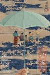

[小偷家族](https://pewae.com/gaan/aHR0cHM6Ly9tb3ZpZS5kb3ViYW4uY29tL3N1YmplY3QvMjc2MjI0NDcv)

原名：万引き家族导演：是枝裕和主演：中川雅也 / 佐佐木美结 / 城桧吏 / 安藤樱 / 山田裕贵 / 松冈茉优 / 树木希林 / 森口瑶子 / 池松壮亮 / 绪形直人类型：剧情 / 家庭 / 犯罪地区：日本首映时间：2018

熟悉的是枝裕和的味道。
最后阶段安藤樱演技大爆发。

[暗杀教室 真人版](https://pewae.com/gaan/aHR0cHM6Ly9tb3ZpZS5kb3ViYW4uY29tL3N1YmplY3QvMjU5MTI5MjQv)

原名：暗殺教室导演：羽住英一郎主演：上原实矩 / 优希美青 / 加藤清史郎 / 山本舞香 / 山田凉介 / 春花 / 知英 / 菅田将晖 / 葵若菜 / 高岛政伸类型：剧情 / 动作地区：日本首映时间：2015

名漫画的电影版，没有任何魔改的前提下，无惊无喜。
细腻的地方都被砍掉了，只剩几个主线剧情，单薄。
好像预算不多的样子，最后的场景过于简陋。

[海街日记](https://pewae.com/gaan/aHR0cHM6Ly9tb3ZpZS5kb3ViYW4uY29tL3N1YmplY3QvMjU4OTU5MDEv)

原名：海街diary导演：是枝裕和主演：中川雅也 / 前田旺志郎 / 加濑亮 / 堤真一 / 夏帆 / 大竹忍 / 广濑铃 / 绫濑遥 / 长泽雅美 / 风吹淳类型：剧情 / 家庭地区：日本首映时间：2015

温馨。
四位主角不停地参加葬礼，每个葬礼过后感情就更进一步，人的成长就是这样不断地死人啊。
竟然忽略了奶遥的奶。

[惊天魔盗团2](https://pewae.com/gaan/aHR0cHM6Ly9tb3ZpZS5kb3ViYW4uY29tL3N1YmplY3QvMjU2NjIzMzcv)

原名：Now You See Me 2导演：朱浩伟主演：丹尼尔·雷德克里夫 / 丽兹·卡潘 / 伍迪·哈里森 / 周杰伦 / 戴夫·弗兰科 / 摩根·弗里曼 / 杰西·艾森伯格 / 桑娜·莱瑟 / 迈克尔·凯恩 / 马克·鲁弗洛类型：剧情 / 悬疑 / 犯罪地区：美国首映时间：2016

水准平平平，主要是魔术缺乏新意。
偷芯片那段的动作戏还算精彩，其余时候就只是一般。
女主角太浮夸。

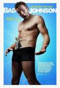

[人形恶吊](https://pewae.com/gaan/aHR0cHM6Ly9tb3ZpZS5kb3ViYW4uY29tL3N1YmplY3QvMjEzMjgxMjAv)

原名：Bad Johnson导演：哈克·博特科主演：Casey Tutton / Danny Rhodes / Holly Houk / 凯姆·吉甘戴 / 凯瑟琳·坎宁安 / 尼克·图恩 / 杰西卡·乔 / 詹姆斯·E·弗雷 / 郑智麟类型：喜剧 / 奇幻地区：美国首映时间：2014

神一般的开头，神弃鬼厌的结局，大团圆，不开心。
这种片子里竟然没有露点镜头，不开心，again。
男主角身材极好。

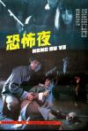

[恐怖夜](https://pewae.com/gaan/aHR0cHM6Ly9tb3ZpZS5kb3ViYW4uY29tL3N1YmplY3QvMjU2ODAwNS8=)

导演：毛玉勤主演：李勇勇 / 汪粤 / 涂中如 / 程之 / 葛存壮类型：剧情 / 恐怖 / 悬疑地区：大陆首映时间：1988

前半部唠嗑，后半部武打，就是没多少悬疑的感觉。
那年代的导演变着法儿的找方法露点打擦边球。
八十年代的峨嵋厂真是个大宝藏，各种cult题材。

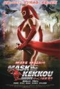

[穴光假面 重生](https://pewae.com/gaan/aHR0cHM6Ly9tb3ZpZS5kb3ViYW4uY29tL3N1YmplY3QvMTA3Nzc3NTQv)

原名：けっこう仮面 新生导演：笠木望主演：希志爱野 / 户田怜 / 清水美砂子 / 粕谷佳五 / 赤木山伍里蔵 / 鈴鹿貴規 / 青木佳文类型：动作地区：日本首映时间：2012

啥玩意儿都没有，只能说，女演员身材不错。

[喋血孤城](https://pewae.com/gaan/aHR0cHM6Ly9tb3ZpZS5kb3ViYW4uY29tL3N1YmplY3QvNDgyNTAwNi8=)

导演：沈东主演：刘奕君 / 吕良伟 / 安以轩 / 杨紫 / 范雷 / 袁文康 / 谢孟伟类型：剧情 / 历史 / 战争地区：大陆首映时间：2010

题材完胜，大陆第三部描写国军正面战场抗日的电影，蒋委员长根本没出现，而且最后的字幕被暗暗黑了，也是一种政治正确吧。
场面真心不够震撼，明显的感觉预算不足的样子。
安以轩的那段感情戏分支太出戏了，而且刚开场不到5分钟就立flag的风格也太八十年代了。

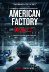

[美国工厂](https://pewae.com/gaan/aHR0cHM6Ly9tb3ZpZS5kb3ViYW4uY29tL3N1YmplY3QvMzAzOTA3MDAv)

原名：American Factory导演：史蒂文·博格纳尔 / 朱莉娅·赖克特主演：曹德旺 / 王河类型：纪录地区：美国首映时间：2019

在我看来这根本不是文化冲突，而是逮着资本家一顿黑，就跟八九十年前某组织做的一样。
那个让工会组织者消失的中方管理层的嘴脸真是令人厌恶。
福耀提供了2000多个就业机会，没违反美国法律，这就够了。

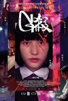

[G杀](https://pewae.com/gaan/aHR0cHM6Ly93d3cuaW1kYi5jb20vdGl0bGUvdHQ5NjQ3MzMwLw==)

导演：李卓斌主演：李任燊 / 杜汶泽 / 杨卓娜 / 陆俊光 / 陈汉娜 / 黄璐类型：剧情 / 动画 / 犯罪地区：香港首映时间：2018

剪辑比较有意思。
看开头就知道肯定是自杀的，悬念没藏住。
看完片特意查了一下，喉咙里还真有可能得淋病……

[三夫](https://pewae.com/gaan/aHR0cHM6Ly9tb3ZpZS5kb3ViYW4uY29tL3N1YmplY3QvMzAzMzQzOTkv)

导演：陈果主演：曾美慧孜 / 邓月平 / 陈万雷 / 陈湛文 / 麦强类型：剧情 / 情色地区：香港首映时间：2019

女主角真是卖力气，满眼望去白花花一片一片的，即使在三级片里都不多见。
对现实的影射简直是赤裸裸的，幸亏是先得奖后来才有的香港游行，反过来说，2019年夏天的事情在之前就有征兆了。
女配邓月平值得关注。

[沦落人](https://pewae.com/gaan/aHR0cHM6Ly9tb3ZpZS5kb3ViYW4uY29tL3N1YmplY3QvMzAxNDAyMzEv)

导演：陈小娟主演：克里瑟尔·孔松希 / 刘朝健 / 叶童 / 李灿森 / 梁健怡 / 黄定谦 / 黄秋生 / 黄素欢 / 黄翠仪类型：剧情地区：香港首映时间：2019

香港电影中难得的表现小人物正常生活的题材。
新人女导演风格很细腻，黄秋生李灿森叶童都很到位，小菲佣也很努力。
缺憾是最后十几分钟的剧情太不真实。

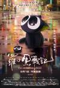

[罗小黑战记](https://pewae.com/gaan/aHR0cHM6Ly9tb3ZpZS5kb3ViYW4uY29tL3N1YmplY3QvMjY3MDkyNTgv)

导演：木头主演：刘明月 / 叮当 / 图特哈蒙 / 山新 / 曹云图 / 李璐 / 杨凝 / 邢凯新 / 郝祥海 / 陈思宇类型：动作 / 动画 / 奇幻地区：大陆首映时间：2019

剧情完全脱节，没头没尾的，自然、妖怪和人类的关系乱七八糟。
开头小猫形态不是挺萌的嘛，后面不出来了，卖萌都不好好卖。
配音是真的差。

[哪吒之魔童降世](https://pewae.com/gaan/aHR0cHM6Ly9tb3ZpZS5kb3ViYW4uY29tL3N1YmplY3QvMjY3OTQ0MzUv)

导演：饺子主演：吕艳婷 / 囧森瑟夫 / 张珈铭 / 杨卫 / 瀚墨 / 绿绮 / 陈浩类型：剧情 / 动画 / 喜剧 / 奇幻地区：大陆首映时间：2019

完成度很高的作品，在国产动画中实属难得。
剧情太一般了，经过仔细打磨的好莱坞三段式剧情在爆米花电影中是足够了，要说有多么深邃就是瞎扯。
全片缺少人文关怀。

[巧巧](https://pewae.com/gaan/aHR0cHM6Ly9tb3ZpZS5kb3ViYW4uY29tL3N1YmplY3QvMjY0MzAxOTUv)

导演：宋川主演：梁雪芹 / 章宇类型：剧情地区：大陆首映时间：2017

粗陋啊！这年头还有直接从电影里截屏当海报的，你敢信？
导演太爱take长镜头了，空旷得难受。
男主角很好，女主角往那一站就妥妥的站街风，一看就是下了功夫的，可惜剧情太水。

[机甲女神之究极神兵](https://pewae.com/gaan/aHR0cHM6Ly9tb3ZpZS5kb3ViYW4uY29tL3N1YmplY3QvMjYxOTk4ODQv)

原名：アイアンガール ULTIMATE WEAPON导演：萩原健一主演：亚纱美 / 岩永洋昭 / 岸明日香 / 明日花绮罗 / 森下悠里 / 河合龙之介类型：动作地区：日本首映时间：2015

认识明日花キララ不？她主演的。
粗制滥造，除了明日花毫无亮点，还暴露了明日花萝卜腿的缺点。
这片子在日本定位R15+，所以说日本孩子从小懂的就多。

[超级三等兵](https://pewae.com/gaan/aHR0cHM6Ly9tb3ZpZS5kb3ViYW4uY29tL3N1YmplY3QvNDkzMDQwMi8=)

导演：朱延平主演：吴宗宪 / 翁虹 / 郝劭文类型：喜剧地区：台湾首映时间：1997

就说嘛，节操这东西对于朱延平这种人来说就是不存在的，完完全全的骗钱续作。
不仅剧情一坨屎，连反攻大陆这个梗也废弃了，自废武功。

[我不是药神](https://pewae.com/gaan/aHR0cHM6Ly9tb3ZpZS5kb3ViYW4uY29tL3N1YmplY3QvMjY3NTIwODgv)

导演：文牧野主演：周一围 / 徐峥 / 杨新鸣 / 王传君 / 王佳佳 / 王砚辉 / 章宇 / 谭卓 / 贾晨飞 / 龚蓓苾类型：剧情 / 喜剧地区：大陆首映时间：2018

研发药仿制药的矛盾一直存在且长期存在，病人难，药企也难，这个话题能过审就不容易。
团队奉献了极为用心的表演和制作，虽然不完美，但现实题材有加分。
都不是坏人，命运是最大的反派。

[耳朵大有福](https://pewae.com/gaan/aHR0cHM6Ly9tb3ZpZS5kb3ViYW4uY29tL3N1YmplY3QvMjI3MjIyMg==)

导演：张猛主演：张永岩 / 张珂 / 张继波 / 张翊 / 田雨 / 程淑波 / 范伟 / 贾瑟 / 赵乃旬类型：剧情 / 喜剧 / 家庭地区：大陆首映时间：2008

影片写的是我父亲那一辈的人，老知青，新中国最苦的一代人，非常真实，范伟演得也好。
比《钢的琴》更接地气，也更加残酷。
小舅子找人把出轨的姐夫给演了，范伟知道后，没有假惺惺地骂儿子，而是塞给他钱让他请人吃饭，这非常爷们，这才是一个父亲该干的事。

[十二个想死的孩子](https://pewae.com/gaan/aHR0cHM6Ly9tb3ZpZS5kb3ViYW4uY29tL3N1YmplY3QvMzAzMjg1ODQv)

原名：十二人の死にたい子どもたち导演：堤幸彦主演：北村匠海 / 吉川爱 / 坂东龙汰 / 新田真剑佑 / 杉咲花 / 桥本环奈 / 渕野右登 / 萩原利久 / 高杉真宙 / 黑岛结菜类型：悬疑地区：日本首映时间：2019

日本的小孩演员，要么就非常灵，要么就非常呆，这部片里就非常呆。
强行励志太勉强了。

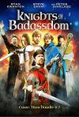

[坏蛆骑士](https://pewae.com/gaan/aHR0cHM6Ly9tb3ZpZS5kb3ViYW4uY29tL3N1YmplY3QvNTE2MDcyMC8=)

原名：Knights of Badassdom导演：乔·林奇主演：D·R· Anderson / Kevin Connell / Khanh Doan / Michael Carpenter / Sean Cook / W·厄尔·布朗 / 彼特·丁拉基 / 瑞恩·柯万腾 / 莎莫·格劳 / 迈克尔·盖拉迪斯类型：冒险 / 喜剧 / 奇幻 / 恐怖地区：美国首映时间：2013

这片子的创意还不错，男主一觉醒来被朋友们绑去玩真人D&D游戏，扮演魔法师的家伙召唤出了真的恶魔。
缺点是不紧凑，主线剧情短小无力，太多不相干的配角。
剧组实在是太简陋，最后的BOSS朴素得不堪入目。

[大病](https://pewae.com/gaan/aHR0cHM6Ly9tb3ZpZS5kb3ViYW4uY29tL3N1YmplY3QvMjY4ODQ4OTIv)

原名：The Big Sick导演：迈克尔·肖沃特主演：佐伊·卡赞 / 博·伯翰 / 库尔特·布劳诺勒 / 库梅尔·南贾尼 / 泽诺比娅·谢罗夫 / 艾迪·布莱恩特 / 阿努潘·凯尔 / 阿迪勒·阿赫塔尔 / 雷·罗马诺 / 霍利·亨特类型：喜剧 / 爱情地区：美国首映时间：2017

标准的美式冲奖鸡汤电影，看多了腻。
主角是个巴基斯坦人，写的也是巴基斯坦+穆斯林与美式文化之间的冲突，但太流于表面。
男主的职业是小剧场脱口秀，是不是相当于美国二人转啊。

[怒](https://pewae.com/gaan/aHR0cHM6Ly9tb3ZpZS5kb3ViYW4uY29tL3N1YmplY3QvMjYyNzkyODkv)

原名：怒り导演：李相日主演：三浦贵大 / 佐久本宝 / 原日出子 / 广濑铃 / 松山研一 / 森山未来 / 泷正则 / 渡边谦 / 绫野刚 / 高畑充希类型：剧情 / 同性 / 悬疑 / 爱情地区：日本首映时间：2016

本来挺有悬念的故事被拍得悬念全无，导演也真有本事。
剧情转折全靠音乐。
最大亮点是妻夫木聪强上绫野刚。

[夺舍](https://pewae.com/gaan/aHR0cHM6Ly9tb3ZpZS5kb3ViYW4uY29tL3N1YmplY3QvMTMwMTk5My8=)

导演：邱礼涛主演：于莉 / 吴倩莲 / 尹扬明 / 成奎安 / 李修贤 / 罗冠兰 / 翁虹 / 蔡少芬 / 金慧英 / 黄子华类型：喜剧 / 恐怖 / 惊悚 / 犯罪地区：香港首映时间：1997

吴倩莲又让我惊诧了一把，真是优秀。
李修贤大哥证明了自己不只会演警察，本片扮多身份，颇具功力，可惜剧本结构松散，叙事不力。
当年的蔡少芬也没什么演技，但青春无敌啊。

[活埋前女友](https://pewae.com/gaan/aHR0cHM6Ly9tb3ZpZS5kb3ViYW4uY29tL3N1YmplY3QvMjU3NzYxNzgv)

原名：Burying the Ex导演：乔·丹特主演：亚历珊德拉·达达里奥 / 嘉布里尔 克里斯蒂安 / 奥利弗·库珀 / 安东·叶利钦 / 斯蒂芬妮·柯尼希 / 迪克·米勒 / 阿什丽·格林尼类型：喜剧 / 恐怖地区：美国首映时间：2014

两个女主角格林尼和达达里奥都是大美女，男主角可有可无。
故事还算有趣，但缺少血浆不够刺激。
服化道成本令人发指的低。

[城市猎人：新宿 PRIVATE EYES](https://pewae.com/gaan/aHR0cHM6Ly9tb3ZpZS5kb3ViYW4uY29tL3N1YmplY3QvMzAxNzQzOTMv)

原名：劇場版シティーハンター　新宿プライベート・アイズ导演：儿玉兼嗣主演：伊仓一惠 / 大塚芳忠 / 小山茉美 / 山寺宏一 / 德井义实 / 户田惠子 / 玄田哲章 / 神谷明 / 饭丰万理江 / 麻上洋子类型：动作 / 动画 / 喜剧地区：日本首映时间：2019

剧场版动画的质量本就不抱什么期望，但谁叫这IP是寒羽良呢。
完全的粉丝向电影，骗钱到不至于，但完全是上世纪的年代剧，虽然又有智能手机又有无人机的。
獠、阿香和寒子的铁三角配音都已明显能听出老态，猫眼大姐的配音老师更是已经去世了，大姐二姐都是二姐配的，仿佛时刻提醒屏幕前的宅男们：你们已失去晨勃……

[烂滚夫斗烂滚妻](https://pewae.com/gaan/aHR0cHM6Ly9tb3ZpZS5kb3ViYW4uY29tL3N1YmplY3QvMjEzNDA3OTMv)

导演：王晶主演：刘浩龙 / 周秀娜 / 彭浩翔 / 杜汶泽 / 梁政珏 / 石咏莉 / 童飞 / 胡然 / 邹凯光 / 钟采羲类型：喜剧地区：香港首映时间：2013

王晶你个死胖子敢不敢拍个正经三级片？
毫无新意。
周秀娜是真不行，未红先丑，越来越丑，被杨天宝甩出十八条街。

[好莱坞往事](https://pewae.com/gaan/aHR0cHM6Ly9tb3ZpZS5kb3ViYW4uY29tL3N1YmplY3QvMjcwODc3MjQv)

原名：Once Upon a Time... In Hollywood导演：昆汀·塔伦蒂诺主演：埃米尔·赫斯基 / 奥斯汀·巴特勒 / 布拉德·皮特 / 布鲁斯·邓恩 / 玛格丽特·库里 / 玛格特·罗比 / 茱莉亚·巴特斯 / 莱昂纳多·迪卡普里奥 / 蒂莫西·奥利芬特 / 达科塔·范宁类型：剧情 / 喜剧地区：美国首映时间：2019

小李子收着演，皮特放着演，对比之下挺有趣。
昆汀一贯的慢节奏，反正不懂老梗的我是觉得挺无聊的。
对李小龙只是一般性的调侃，真不知道他闺女激动个啥，更不要说以此为由撤档毫无依据了。

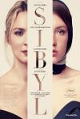

[西比勒](https://pewae.com/gaan/aHR0cHM6Ly9tb3ZpZS5kb3ViYW4uY29tL3N1YmplY3QvMzAzNjU5MTUv)

原名：Sibyl导演：茹斯汀·特里叶主演：Adrien Bellemare / Jeane Arra-Bellanger / 保罗·艾米 / 加斯帕德·尤利尔 / 劳尔·卡拉米 / 尼尔斯·施内德 / 桑德拉·惠勒 / 维尔日妮·埃菲拉 / 阿图·阿拉里 / 阿黛尔·艾克萨勒霍布洛斯类型：剧情地区：法国首映时间：2019

我是真的完完全全的看不懂。

[三分之一](https://pewae.com/gaan/aHR0cHM6Ly9tb3ZpZS5kb3ViYW4uY29tL3N1YmplY3QvMjEzMzkzOTIv)

原名：サンブンノイチ导演：品川祐主演：中岛美嘉 / 哀川翔 / 品川祐 / 坛蜜 / 小杉龙一 / 木村了 / 池畑慎之介 / 洼冢洋介 / 田中圣 / 藤原龙也类型：剧情 / 喜剧地区：日本首映时间：2014

不停地反转反转再反转，能够体会到编剧和导演玩得很high的心情，但是观影感受就一般，并不会跟着产生刺激的感觉，原因不明。
而且也没有感受出主角团队有多聪明，毕竟都被爆菊了。
中岛美嘉明显是老了，腿还不错。

[准备好了没](https://pewae.com/gaan/aHR0cHM6Ly9tb3ZpZS5kb3ViYW4uY29tL3N1YmplY3QvMjc1OTQ5Mzgv)

原名：Ready or Not导演：泰勒·吉勒特 / 马特·贝蒂内利-奥尔平主演：亚当·布罗迪 / 亨利·科泽尼 / 伊利斯·莱韦斯克 / 克里斯蒂安·布鲁恩 / 妮基·瓜达尼 / 安迪·麦克道威尔 / 梅兰妮·斯科洛凡诺 / 约翰·拉尔斯顿 / 萨玛拉·维文 / 马克·奥布莱恩类型：恐怖 / 悬疑 / 惊悚地区：加拿大首映时间：2019

年末的小惊喜，穿婚纱的逃杀已然不新鲜，但新娘足够漂亮啊。
女主在中间负面情绪爆发的时候来了个英文粗口的关口，十多个脏字一气呵成，非常过瘾。
最爱结局，在期待反杀的殷切等待中，天亮，坏人们相继爆炸死去，反套路讨喜。

[中国骗局](https://pewae.com/gaan/aHR0cHM6Ly93d3cuaW1kYi5jb20vdGl0bGUvdHQ3MjE1Mzg4Lw==)

原名：The China Hustle导演：jed rothstein主演：dan david / herb greenberg / matthew wiechert类型：纪录地区：美国首映时间：2017

很好地解释了什么叫做空，以及华尔街的衣冠楚楚们如何通过做空来割美国韭菜。
制片方深谙虚实之道——片场82分钟，其中的75分钟都是真是存在，但片头的恶意用词和最后时刻无端地抹黑阿里曝露了险恶用心。
阿里不是好东西，但黑的方向完全是错误的；中国有很多骗子，但不能用欺骗的方式揭露“真相”。

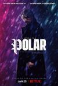

[极线杀手](https://pewae.com/gaan/aHR0cHM6Ly9tb3ZpZS5kb3ViYW4uY29tL3N1YmplY3QvMjcxODA1OTkv)

原名：Polar导演：乔纳斯·阿克伦德主演：佩德罗·米盖尔·阿尔斯 / 凡妮莎·哈金斯 / 凯瑟琳·温妮克 / 约翰尼·诺克斯维尔 / 罗伯特·梅耶 / 阿伊莎·伊萨 / 阿纳斯塔西娅·玛莉尼娜 / 露比·欧·菲 / 马特·卢卡斯 / 麦斯·米科尔森类型：动作地区：美国首映时间：2019

这年头好动作片凤毛麟角，本片能把一个很黄很暴力的故事讲通顺已然不易。
几个年轻杀手太过于傻缺，不知原著里如何。
结局莫名其妙。

[养杀人鬼的女人](https://pewae.com/gaan/aHR0cHM6Ly93d3cuaW1kYi5jb20vdGl0bGUvdHQ5ODQ0MzU4Lw==)

原名：殺人鬼を飼う女导演：hideo nakata主演：airi matsuyama / rin asuka / shin'ya hamada类型：恐怖地区：日本首映时间：2019

飞鸟凛胸形完美，腰好粗。
剧本俗套，整部片下来除激情戏外无甚可取之处。
手铳店长竟然活到了剧终。

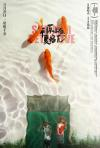

[平原上的夏洛克](https://pewae.com/gaan/aHR0cHM6Ly9tb3ZpZS5kb3ViYW4uY29tL3N1YmplY3QvMzM0MDAzNzYv)

导演：徐磊主演：宿树合 / 张占义 / 徐朝英类型：剧情 / 喜剧 / 悬疑地区：大陆首映时间：2019

非常有趣，除了预算不够画面简陋以外没别的毛病。
全业余演员，但有句老话说得好，男人过了40全是戏精。
一部片看懂“人情社会”。

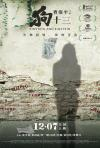

[狗十三](https://pewae.com/gaan/aHR0cHM6Ly9tb3ZpZS5kb3ViYW4uY29tL3N1YmplY3QvMjU3MTYwOTYv)

导演：曹保平主演：代旭 / 周珍 / 张雪迎 / 智一桐 / 曹馨月 / 果靖霖 / 聂鑫 / 黄诗佳类型：剧情 / 家庭地区：大陆首映时间：2018

很多人给出高评价，应该是引发了自己香港的青春回忆；我不以为然可能是跟厌狗体质有关。
戏剧冲突很强，用力过猛。
主角的纯白少女胸围出场频率过高，出戏。