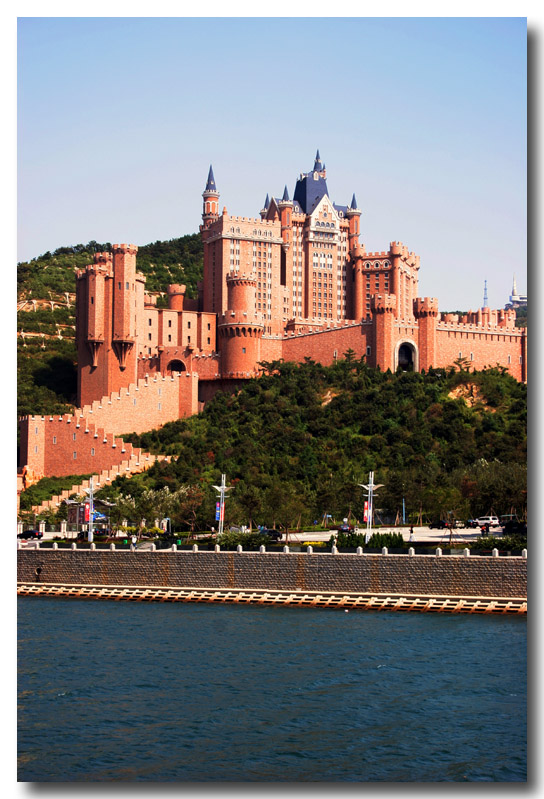

*按:整理blog时发现三年前曾经[答应过@飞猪讲关于市长的段子](https://pewae.com/2012/04/ancient-school-motto.html)，所以这篇东西的目的是还账。好事不出门，坏事传千里，段子里的事面自然没什么正面形象可言，这个时候讲出来有些落井下石。但段子毕竟是段子，市长在普通市民尤其是中老年妇女当中的口碑那是钢钢地。*

**本文内容全是谣言，千万不要说本人造谣诽谤啥的，我说的是浣熊市的市长！你们非对号入座是你们的事！**

**转载请勿注明出处！！**

**市长读博士**
市长当上市长之后，觉得自己的学历不够用了，就打算去浣熊市最著名的学府HXUT深造一下。秘书去跟校长一接洽，校长说：“来读博士欢迎啊，只要来上课并且论文能通过就可以发毕业证。”然后就没有然后了。
市内另一学府HUEF的校长虾仁先生听闻此事，立刻帮市长搞定了博士学历证明。
不久以后，虾仁同志成了副市长。市长离任后，虾仁又当上了市长、市委书记；而浣熊市修建的城市轻轨，路过了HUFE却没有路过HXUT。

**市长和公务猿**
市长他爹当年颇有实权，所以市长总能比别的市长要来更多的预算。
但这样也不够花的。
市长胆大。两次国家给公职人员涨工资的预算都被他扣下了。这两级工资直到他离任后数年才补上。
所以说，为市长歌功颂德的人当中，不包括公务猿和教师、国企员工之流。
实事上市长离任的前一年教师差点组织起来上街要说法。

**市长和广告牌**
市长有一次带一批议员上街体察民情。路过商业街的时候，发现一个坏掉的灯箱在风中摇曳。
市长随口说：“这灯箱多危险啊！”
第二天开始，全市展开清理灯箱牌匾大行动，所有沿街店面不得自行安装灯箱门脸。
市长大怒，换了个大秘。

**市长和大仙儿**
市长当上了市长，但一直想更进一步。但5年不得寸进，只是把老书记耗去看夕阳红了。于是市长找了个大仙，问：“我为啥不能升啊？”
大仙A说：“你看，你办公室对面，那是个啥？”
市长说：“保护伞公司烈士像啊！”
大仙A说：“烈士手里拿的啥？”
市长说：“AK47啊”
大仙A说：“枪口成天对着你办公室，你还想升？弄走！”
于是市长以开发旅游，名胜古迹应该集中到一定范围内为由，把烈士像搬到了郊区一座山上。在雕像的原位置，按照大仙的意思修了喷泉，取井喷之意味以图高升。

**市长和大仙儿续**
可是市长还是没升。
市长找了另一个大仙。
大仙B说：“你知道你们浣熊市的龙脉在哪儿吗？”
市长说：“不知道。”
大仙B说：“城南莲花山。你说说莲花山西面龙头下面的位置，你现在在干嘛？”
市长说：“是垃圾场，兼做刑场。”
大仙B说：“这你还想好吗？还不给好好修修！”
于是市长主持修建了一个广场，还按照大仙的指点，安了一根华表。

**市长和大仙儿再续**
可是市长还是没升。
市长又找了一个大仙。
大仙C指点说：“龙脉是没错，但你们浣熊市这条龙啊，是条恶龙，它压得你不能翻身啊！”
市长问：“那怎么办？”
大仙C说：“你把它龙头炸了！它就不能作怪了。”
于是市长以开发沿海景观，拓宽道路的名义，把原来的山南隧道连同半边山体一起炸了。

**市长和大仙儿三续**
可是市长还是没升。
市长再找了一个大仙。
大仙D说：“你四四彪？华表是什么东西？那是皇帝脚下才能有的东西！你个二货弄个华表，还tm全国最大华表，还升，不弄死你不错了。拆了拆了。要觉得跟市民不好交待，也得换个小的。”
大仙D又说：“华表是个心理问题，真正的问题，是你之前找的人是个2B！瞎bb什么恶龙！明明是条好龙！你给龙头炸了，还升个p啊！”
市长说：“那怎么办？”
大仙D说：“补救的办法是你把龙头再修起来。这样，你修个印形状的楼也好庙也好，把龙镇住。我保你官运亨通。”
于是市长就在被炸塌的山上盖了座城堡，华表也换成了小三号的。
然后市长就真升了。
巧合的是，市长最终身败名裂之前，那城堡先被拆了。

**市长和车夫**
市长要升职离开浣熊市去三藩市就任省长。
临走的前一天车夫联合会通过车载对讲机给所有车夫喊话，明早9点全体到市民广场集合，否则后果自负。此事在狗仔嘴里，变成了车夫自发去送市长离任。试问如果自发，匹夫怎么能知道市长离任的具体时间？！反正喊话而已，也没个对证。