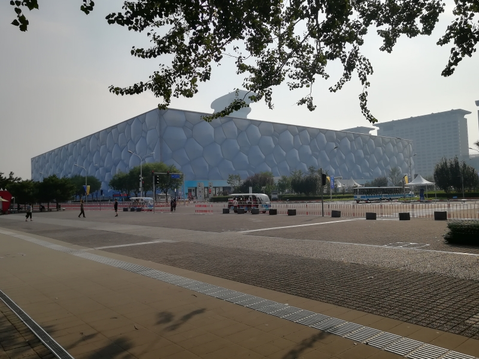
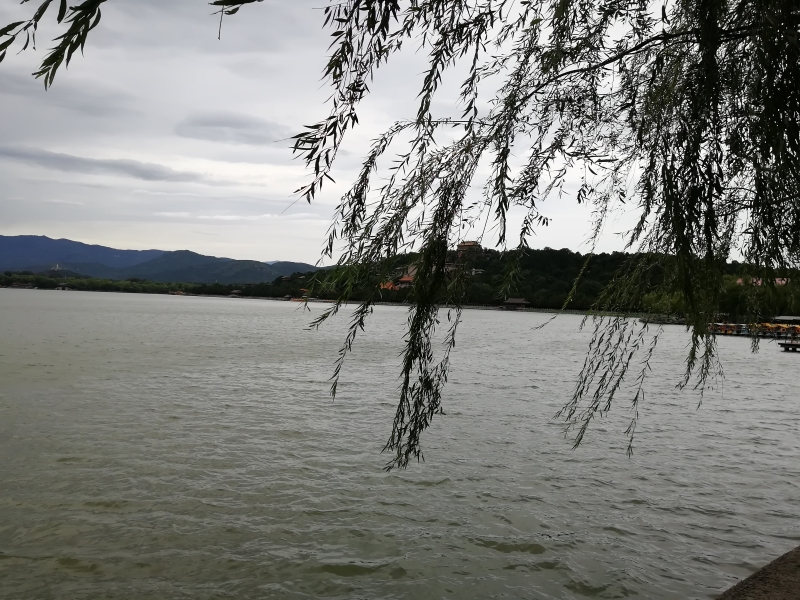
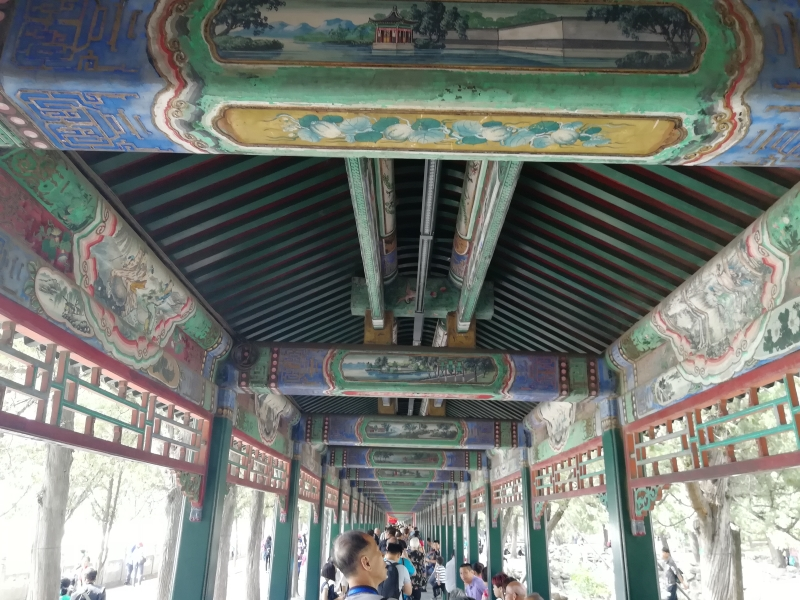
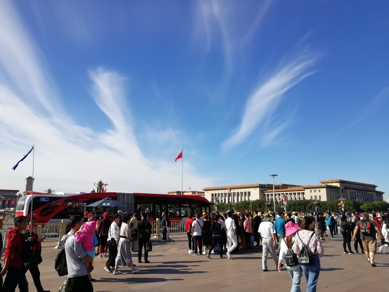
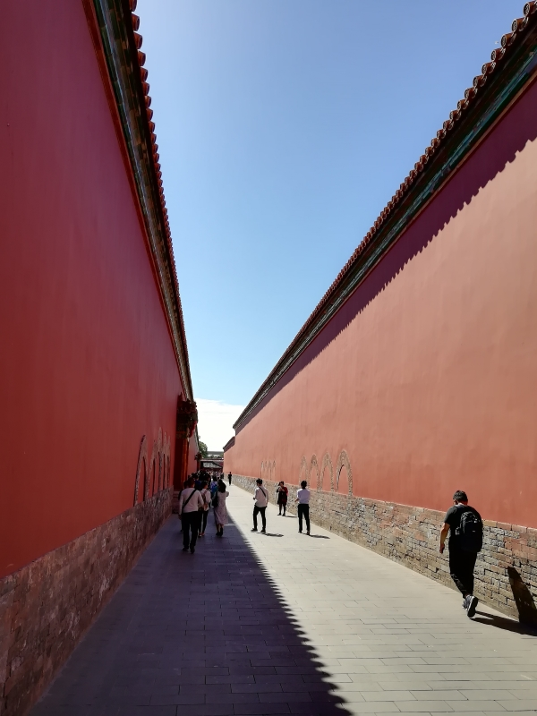
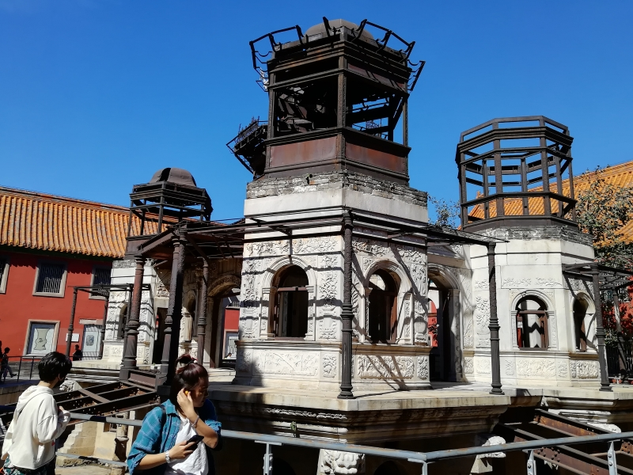

老婆上个礼拜被强制休年假，提前一天通知，国外是不能想了，只能选择在国内转转。
跟臭宝的老师打听请假的事，老师回复说她只能给一天假，超过一天的要校长批。
这下选择的余地就很小了。
本来老婆和臭宝都比较中意厦门，但只去三天的话太亏；臭宝一年级的时候说要去看升旗，而老婆也没去过北京，我去过北京也跟没去过一样，所以目标很快锁定。
幸亏没去厦门（台风山竹）。

## DAY0（星期四） 大连→北京

坐夕发朝至的卧铺而不是高铁或者飞机也是有一番考量的，一是时间比较合适，二是能省一宿住宿钱。
周四我请了假。晚上5点半从托管班接出臭宝，回家换了身衣服就直奔火车站。到车站换好票离开车还有40分钟。
准备进候车室的时候，被检票员拦了下来，说车票不对，是下个礼拜四的。
老婆赶紧去退票买票，7点20这趟车的票已经没有了，但好在买到了后面8点30的。只是本来预计的6点多到北京变成了9点多，票也没挨在一起。

臭宝第一次坐软卧，很兴奋地爬上爬下。
其实我跟老婆大人也是第一次坐软卧，两张连着的上下铺肯定是给老婆和臭宝了，我拿了旁边房间的上铺，等着对面上铺来人好换个位置。
对面的下铺是一位来自新疆的大叔，上车之后就叽里咕噜不停地用维语发语音。车还没开，乘警叔叔就过来要查身份证，把臭宝吓得够呛。老婆自觉地把我们家的身份证递给乘警，人家瞅都不瞅，说了句：“不看你们的”，就直奔新疆大叔而去。
对面上铺的人发车快两个小时之后才在普兰店上车，听到我的要求后，二话没说就跟我换了位置。

## DAY1（星期五） 北京站→中国科技馆→国家体育馆→宾馆→簋街

出北京站，打车去科技馆。
算是见识了北京的交通——仅仅调了个头上二环，13块钱的起步价就用掉了，牛叉的是看导航人家司机大哥还一点儿没绕路。
司机大哥一路开着导航到了科技馆附近，在一座外观酷似水坝横截面的建筑物旁边减速打算停车，我们看着这玩意儿大门长草的样子就觉得不像。看牌子，这家伙的名字是“国学中心”，不过就差在门上喷个“拆”字了。
因为是工作日，科技馆售票处只开了一个窗口，也只有两三个人在排队。
大门外有统计馆内人数的LED屏，显示里面是800多人。我们还挺高兴的，这意味着能多玩一些有趣的项目。
进馆之后，有某个小学的学生在秋游，一会儿拓展一会儿排队进展厅的，只要躲开他们，差不多就能随便玩。
然而，独占了也没什么大用。因为差不多3/4以上都是坏掉的。跟在上海、沈阳的经历差不多，臭宝进了三个厅之后就失去了兴趣，吵吵着要去另外收费的儿童乐园。

秋游的小学生没订儿童乐园的票，零星的几个小孩都是没上学的。我姑娘无论从年龄上还是体型上都堪称一霸，可以肆无忌惮撒开欢地玩，只有人家躲她，没有她躲人。以至于我们俩不得不紧紧跟在附近，生怕撞到了别人。
玩是玩，可没什么新鲜劲。大约辽宁科技馆的儿童乐园是照这里抄的吧，有大概60%的项目，臭宝是玩过的，而且沈阳的还比北京的新。
所以臭宝高兴归高兴，还是有些失望的情绪在的。
中午没吃饭，下午两点半就离开了科技馆。

老婆大人要去附近的鸟巢和水立方拍照。走有点儿远，自行车不会骑，打车打不到，只得接受10块钱一个人的电瓶车。
臭宝一会儿喊饿，一会儿喊脚脖子疼，老婆大人没能尽情拍照。
近距离看上去，鸟巢蛮普通的，而水立方甚至有点儿脏，这是晒掉色了？

出奥林匹克公园西门打车去宾馆。
刚好有人下车，我们跑过去，司机不拉，开走了。
于是开滴滴叫车。眼看地图上一辆车两次调头来接我们——正是刚才不拉的那辆。
司机师傅不尴不尬地解释说，那地方不让停车。
呵呵。

宾馆在三环东北角附近，老楼重新装修的，硬件条件还可以，一楼大堂摆着一些八十年代的物件，缝纫机、收录机、红白机、坐钟、搪瓷茶缸、铁皮青蛙之类。这是一家主打怀旧风的宾馆。
房间里的特色是，床头柜上摆了两本小人书。
进房间第一件事就是开饿了么叫外卖。
吃完休息到六点半，出门去吃小吃。

按原计划是去南锣鼓巷。问前台小哥附近哪里能吃小吃，小哥给指了个簋街。
看地图确实近不少，就打车过去了。
下车就后悔了。这哪里是小吃一条街，分明是小龙虾一条街嘛！
除了一家很火的川菜馆子，马路两边除了小龙虾就是火锅——吃这些玩意儿还用跑北京来？
再说，只有没海鲜的地方才流行小龙虾好吧～
好不容易找到一家“姚记炒肝”，要了一份卤煮、一份炒肝和一份煎香肠。
卤煮和炒肝并没有传说中那么恐怖，不怎么好吃，也不难吃。我本身就是吃大肠的，倒是第一次吃猪肺。
炒肝那玩意儿也太骗人了把，就那么一点点的肝和肠，剩下的都是淀粉和蒜末啊！

用滴滴，打车回宾馆。司机师傅开出去七八分钟才说：“哎呀不好意思没扣表，等会多给点儿吧！”
我觉得他就是故意的。
拖家带口的，也没跟他计较。

## DAY2（星期六） 颐和园→北大→大栅栏

在火车上老婆没怎么睡好，所以8点多才起来。
到楼下的时候已经没什么吃的了，何况房费本身就不含早餐。
本来说好坐地铁去颐和园的，在地铁站旁边吃完早餐，老婆大人就改了主意，还是打车前往。

在颐和园门口，老婆从淘宝上买了个讲解用的APP序列号。
天有些阴，风也有些大。十七孔桥附近的门进入之后老婆就一直在研究那个APP。

逆时针走到什么阁，看了一圈文物。
又过了行宫，来到长廊。我跟她们娘俩说，这个长廊很牛叉的……
可她俩放眼望去，全是人。

到了万寿山正下方，眼看着上面是座庙。三人一对眼色，都对庙这种东西没什么兴趣。我膝盖不好，更不可能爬山。
风已经停了，游船恢复了运营。臭宝对她妈妈一直在研究手机不满，就要坐船返程。
从湖心到过十七孔桥，顺进来的门原路返回了。园子大概走了1/4？
淘宝上把那个没摆弄明白的APP给退了。

老婆想去看看北大或者清华的大门。
用软件搜，有个公交车坐三站下车后走300米就能到北大，就是你了！
下车以后，按照路线走到地方，麻批的是北大西南角的一个小门，只有拿学生证的能进，登时觉得不妙。
但眼瞅着有打着旗的导游领人往前走，这方向应该是没错的。
于是也按照导游指引的方向一路走，走了能有一千米？写有北京大学几个字的牌子才姗姗来迟。
果然是电视上那个门，可这门长得也太袖珍了。

这时已经快下午三点了，打车直奔下一站：大栅栏。
目标——烤鸭。
对于家门口的全聚德连锁店的印象太过恐怖，所以出发时就商议好不吃全聚德。
七拐八拐找到了四季民福的大栅栏店。
一只鸭子228。
还真不错。
也可能是饿得吃什么都香。

出了烤鸭店，开启闲逛模式。
这条叫鲜鱼口的横街上尽是北京小吃的店。可总觉得它们太过雷同，家家都在卖烤鸭、炒肝、卤煮、爆肚、炸酱面……
这回老婆搜了个所谓老店，挑战炸糕等各色点心和豆汁！
点心还好，没什么惊喜，油大糖大，吃一半扔一半。
豆汁这玩意儿太过于黑暗料理了，闻上去一股烂酸菜缸的味道嘛！
老婆喝一口，放那儿了，我也只尝了一口。毕竟要是不喝的话就没资格骂了。

为了安抚臭宝，给她买了炸串和糖葫芦。
都没达到协弃市的一般水平。

本来前门就有地铁站，可臭宝急着找地方拉臭臭。
好不容易看到一家肯德基，兴冲冲跑过去，进里面发现没厕所。
艹，就这样还全中国第一家肯德基呢？！
前门车可真不好叫，最后打了个专车回的酒店。

在前台问早上5点能不能退房，前台说随时都可以退，并友情提示说以前的客人看升旗一般3点就出发了，去晚了没好位置。
臭宝听说看个破升旗要两点半起床，赶紧扒拉手指头算了一下，发现自己只能睡5个小时，立刻表示：“不去看那个破升旗了，我要睡到自然醒！”
本来我们两口子也没那么迫切的愿望，臭宝不去那就最好了。

## DAY3（星期日） 天安门→故宫→王府井→北京南站→大连

酒店退房很快。我领着臭宝在红白机上打坦克大战，第一关还没打完，退房就办完了。

老婆说最后一天了，干脆不碰地铁，打车算了。
叫到车，司机大叔却说：“今天日子不行，北京马拉松，交通管制，拉到附近你们走得太远了，给你们送地铁站吧。”
然后把我们拉到2号环线的一站，2号线换1号线，从天安门东站出来。

离城楼还老远的地方就设了安检岗。倒没有太严，包里的水连问都没问。查了身份证。
说起来这点北京没有传闻中那么可怕，三天里只被查了这一次身份证。

天气很好。
不知能不能称得上是“马拉松蓝”。
反正对天安门周围的建筑也没什么兴趣，纪念碑大会堂什么的，我们两夫妻远眺了十几秒就算全看过了。

老婆是第一次看到天安门华表的真实大小，不禁感叹：“正版的这么小啊，薄小草胆确实太大了！”

天安门城楼在修整，上不去。
我们一家每人租了一个讲解器。这玩意儿每到一个地方就会讲这地方的特色，挺有用的。
遗憾的是我的接触不太好，好几次忽然断掉之后接不上了。
讲解器分为20块钱的贵宾型和40块钱的外宾型。这名起的不找骂嘛！外宾是比贵宾还贵的宾？

人很多。中轴线一路走下去，每个宫殿门口都聚了一大群人。
又不放人进去，里面又没灯，即使能凑到跟前也看不清里面什么样子。还不如回家重温《戏说乾隆》来得清楚呢！

本来计划是从北门出去，奔南锣鼓巷的。
老婆大人刷了一番资料后，说：“估计都是像大栅栏一样骗外地人的，咱们返回去吧，我要看看延禧宫。”
臭宝也说她要去看珍宝展。
于是又顺着东侧往南走，看了东六宫和太和殿。太和殿有展览，是额外收费的。

原来传说中的延禧宫长成酱婶，是个烂尾工程+废墟啊！

从东华门出来已经快12点了，没工夫再去折腾，径直走到了王府井。
在名称很怪的北京APM里吃了顿川菜，就准备回家了。

又要打车，司机听说我们要去北京南站，说还是地铁快，就把我们晾路边了，也不知是真心为我们好还是只是甩客的借口。
好在没什么行李，坐地铁到南站也挺顺利的。

高铁车厢的前5排被大连某私立中学的初中生占领了，我们坐在第六排。
该中学打的旗号跟我们高中时期进京一样——接受爱国主义教育。
老师上车时的关于要肃静的叮嘱好用了大概半个小时吧，蛤蟆吵湾就开始了。
而且这帮小孩好像跟钱有仇，不肯把钱带回家似的，卖东西的小车每次经过都不会走空，总有小孩买辣条冰淇淋薯片牛肉干什么的。可能也正是因为卖得好，所以小车来得更频繁，车厢里也更乱了。

我必须做点什么了。
小车再来的时候，我故意问了半天，买了罐啤酒。
前面的小孩羡慕地看了我一眼，倒是忍住了。
那就再来一罐。两次都是刷的支付宝。
前排那个小胖子再也忍不住了，趁老师不注意，跟着要了两罐，跟他旁边的小瘦子分享。
又有旁边一个钱花光了的小女孩，哆哆嗦嗦地偷偷从包里拿出了手机，买了包薯片。
过了几分钟，喝酒的小胖子小瘦子和玩手机的小女孩都被老师抓去过道罚站了，剩下的人，噤若寒蝉。
这个世界清净了。

打车回家的时候觉得大连的出租比北京好五倍。