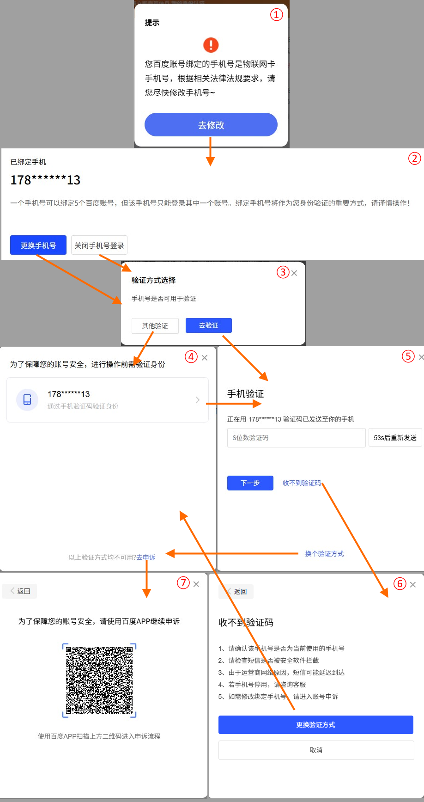

国产大厂们我都不怎么待见，其中最讨厌的就是百你妈的度。
不过他们家的应用，大多数情况我也用不上，唯一能产生交集的就是网盘。
——我是不会主动用的，但是架不住学校和各种商家提供远程文件的时候，还是会把百你妈的度的网盘当作首选。
这不，孩子找了个道法老师，咵叽扔过来一大套百你妈的度的材料链接。在单位想打开看看吧，不让我用邮箱登录了，非跟我要手机认证。
我的号当然是在实名制之前注册的，要求实名制那会儿刚好开通了虚拟小号的服务，就填了小号；但是虚拟号报废已经5年多了，现在能收个屁的验证码啊。
回家之后，PC客户端和网页上存的cookie倒是都还好用。
网页版还给出了要换注册手机号的温馨提升，这一通操作下来：

尼玛，还是要我下载你们家APP呗？
且不说，我从来都不在手机上用你们家服务，在手机上装个APP就为了申个诉这是否合理。
想也知道，我装完APP之后，不注册账号，APP是不能用的。
但我要注册了账号呢，我用新账号就完事了，还申诉个屁啊！

是的，我是百你妈的度网盘的极轻度用户，网盘里没有任何不能舍弃的内容。