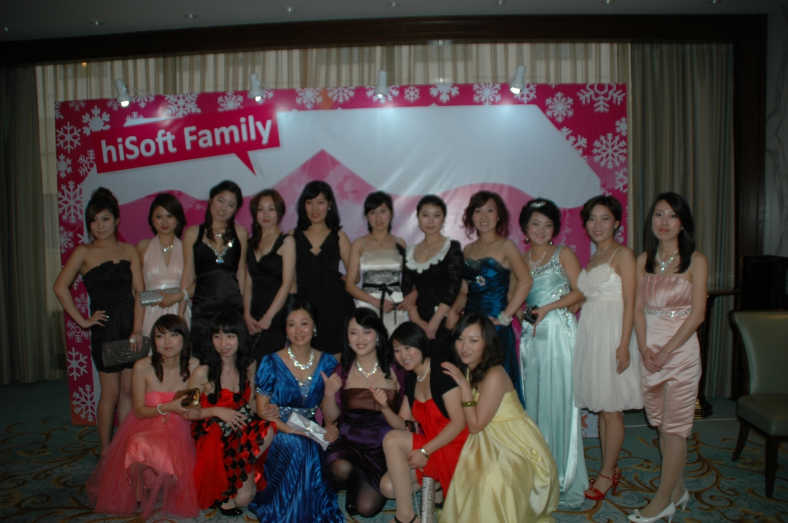
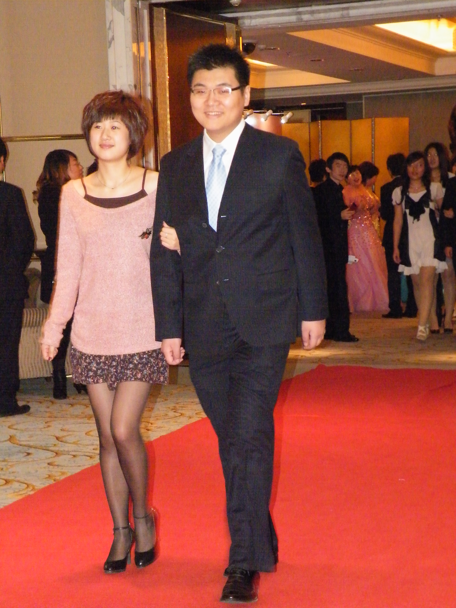
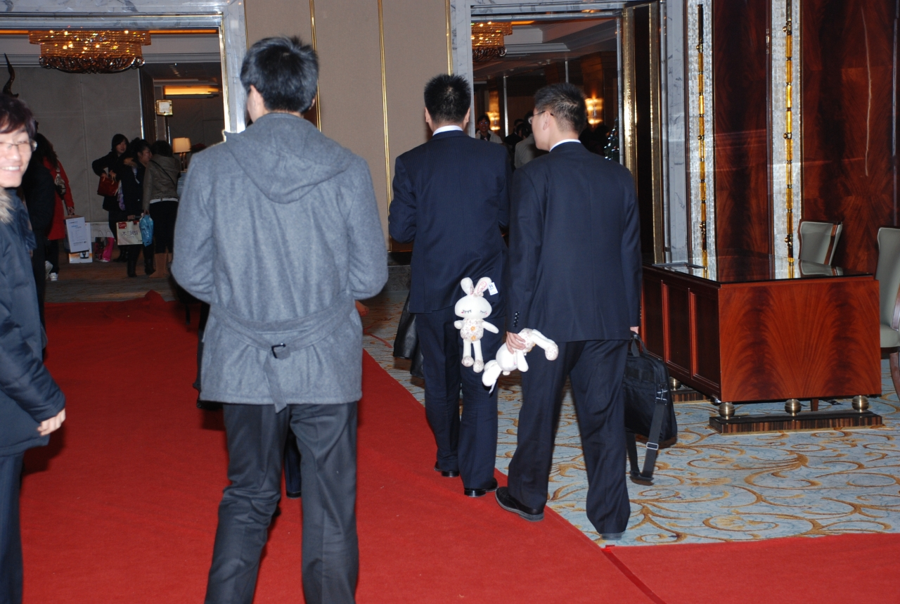
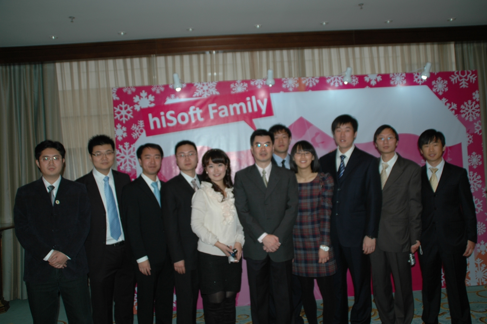

一个月以前，H记举行了盛装年会。
弄得还挺像那么回事儿的，又是走红地毯又是拍照的。虽然一个个穿着租来的礼服，像在夜总会工作似的。（下面的照片不知道是哪个部门的，一个也不认识。）

再比如这个跟我走红地毯的，我也不认识。

不多描述了吧。反正公司想得算挺周到的，下午开会前有车接，包括会开完去吃饭的地方也有车接。（因为那个酒店大厅摆了113桌，挤得像罐头一样，喝喝茶聊聊天都勉强，吃饭根本施展不开，所以是分部门吃的。）

问题就出在回家没车接上。
对，我根本也没打算讲什么会上发生的事儿。
这事儿发生在会后。

话说，吃饭的那个酒店位置其实不偏僻，吃饭结束的时间也不算晚，才八点半。
不巧的是，下雪了。这个冬天的第一场雪。
出租车司机大叔们看到这拉帮结伙出来的，根本就不拉。

于是我就带着部门的哥们儿们去坐公交车。没办法，谁叫咱是土著呢！
车站不远不近，也就500米左右的样子。覆盖他们回家的所有线路基本都在那里有站点。

可就是有人不信我关于这种天气打不到车的言论，某三个（就不点名了吧），坚持认为是人多司机才不拉的，顺着车流的反方向走，要去打车。

好吧，我又不欠你们的，爱听不听。

其实那天公交车也挺难坐，我们几个最早到家的10点，最晚的11点半。
第二天天气更恶劣。兄弟们普遍都迟到了……

截至10点的时候，PM秦桑接到一个电话，然后就表情怪异地跟我们说：“XX、XX和XX上午来不了了。他们昨天晚上没回了家，在酒店住了半宿。今天上午得各自回家整理。”
于是，三个大男人在酒店挤一个房间还让人加一张床的故事速速在公司内流传。

第三天，XX给我描述了他们的痛苦经历。
“打了20分钟车没打着，我们也想坐公交车回家了。我们光知道在兴工街能换上202，换了202就可以回家。正好酒店门口有201，我们就坐了40分钟201到了兴工街。本来202还有车，可是XX说这里车多人多好打车。打了一阵，有个司机要每人50我们没上车，又决定去坐202，当时看站台上排了好几辆电车，就以为来得及，眼看着那车开了。再仔细一看，其余的都是201。又等了快两个小时，也没见来车……”

下面是无奖竞猜时间……