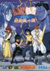

[幽游白书：魔强统一战](https://pewae.com/gaan/aHR0cHM6Ly93d3cuZG91YmFuLmNvbS9nYW1lLzEwNzU0MjUyLw==)

原名：YuYu Hakusho: Makyou Toitsusen机种：MD厂商：TREASURE / 世嘉类别：FTG发行年月：1994-09耗时：70

秘技：
DEBUG模式：按住A和C，选中“选项”后按START键进入选项，会出现一个“デバッグ”选项,选成”あり”。则可以享受以下福利:
1：游戏中按暂停,方向键对应玩家，按住后再按Z给该角色加满血，按住后再按Y将该角色血扣为1。
2：出现TREAURE商标时按START直接观看通关画面。
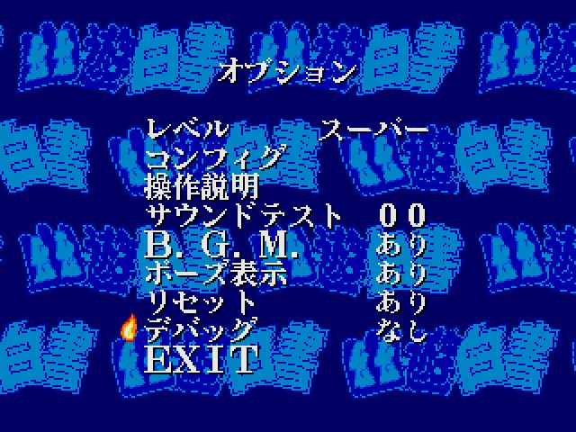
称号：
SUPER模式下，通关后可以获得称号。
1.最强：任意角色（户愚吕兄外）统一战胜出。
2.最狂：户愚吕兄统一战胜出。
3.鬼畜：统一战模式打出一次MAX连击后通关。
4.不屈：统一战模式通关时接续20次。
5.最低：统一战模式通关时接续100次。
6.无敌：最高难度1VS3胜利。
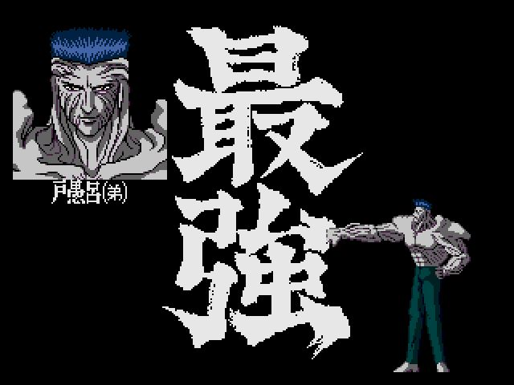
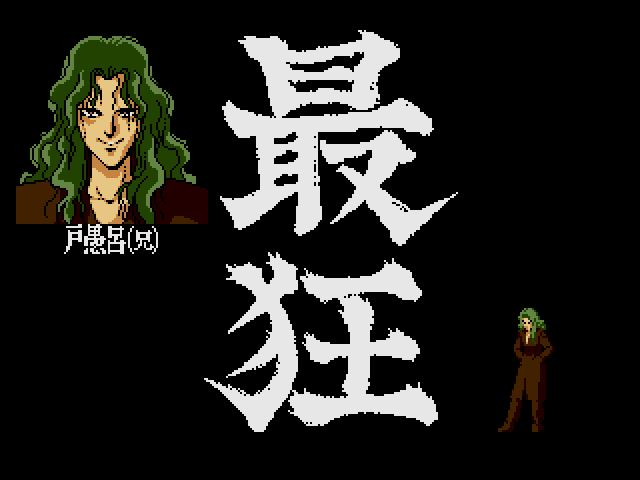
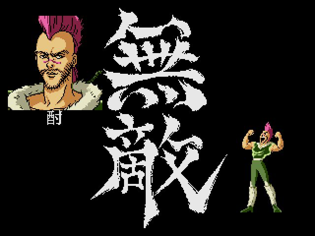

神一般的制作公司制作的神一般的游戏。要不是因为Y开头的游戏太少，我是不会推这种大热作品的。魔强统一战在MD上是可以排名前五的游戏，已经超越了格斗游戏本身。
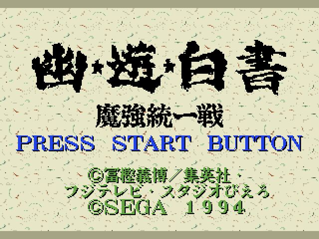

除了大热漫画的因素，它同时兼具了动作畅快，连续技爽快，格斗判定准确，音乐动听等优点。而且也不失趣味性：独树一帜的技能抵消系统和恶狼传说式的换线操作，增加了很多战略上的构思。而且同时支持斯人同时游戏绝对是亮点！邀三五好友进行2V2，绝对能够增进友谊消磨时光。犹记在PS和SS都快被淘汰的时候，依然有人到游戏机摊位上包机打幽白。可见其魅力。
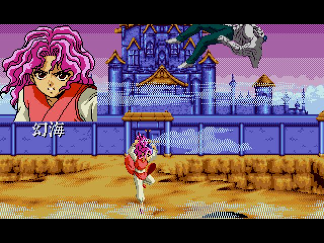
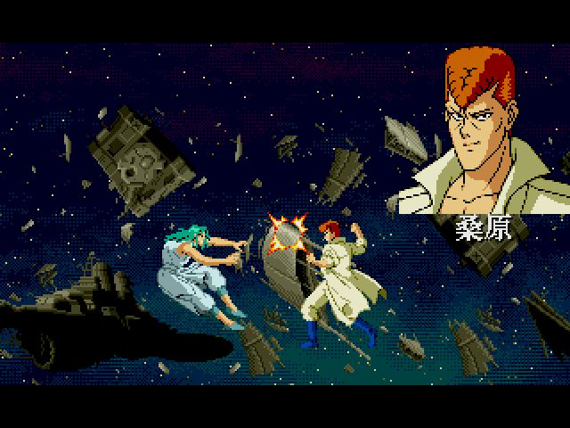
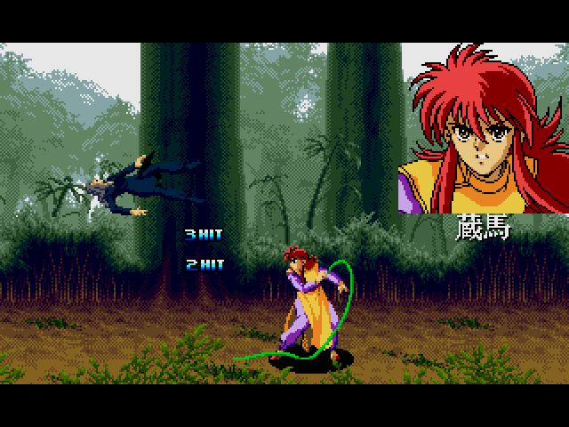
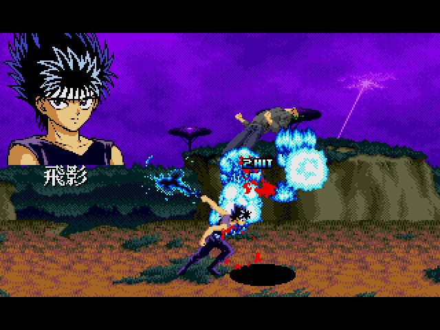
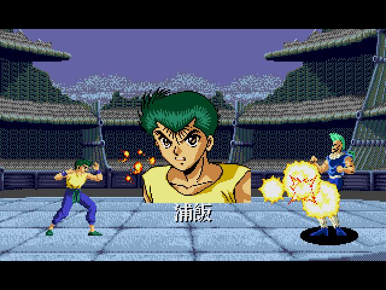

富奸老贼的节操是负值，但本作的还原度非常高，比如下面的酎的这两个动作，在原著里几乎可以找到一模一样的页面出来。所以后期出场的仙水忍和树，对于我来说基本是靠游戏里的认识反过来去套漫画的原型的。
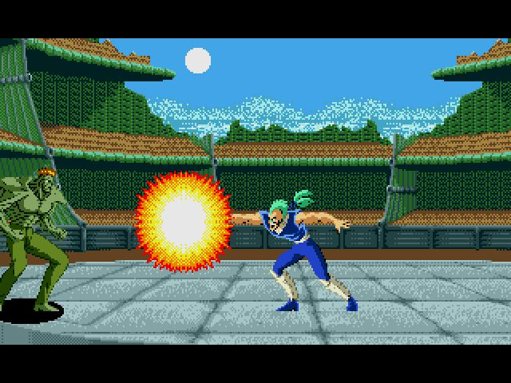
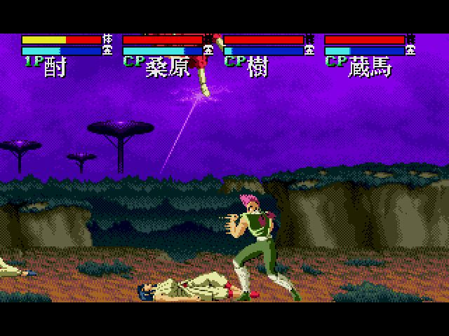

虽然是神作，但也不是没缺点的。
第一是角色不平衡。酎、浦饭、仙水、桑原强的一塌糊涂；而身材矮小的飞影和户愚吕兄的抗击打能力就非常吃亏；最悲惨的是藏马，好歹也是F4之一，可被设计得移动慢得要死，对战时根本没人用；树也很弱，弱到不会有人选他打电脑。倒是二对二的时候有点儿存在感。
第二就是出场人物太少。后期的黄泉啊躯啊早期的朱雀啊中期的画魔啊冻矢刃雾啊之类的，要是再丰富一些就好了。
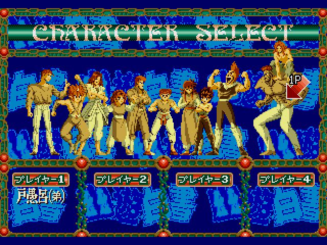

出招技能什么的，随手一搜一大堆，就不列了。下面说说我最喜欢的人物：在原著里和本作中是统一的——当当当当——
户愚吕兄。
很遗憾，魔强统一战里户愚吕兄并不是非常好用的角色，连续技很少，战术变化也不丰富，而且皮太脆，很容易被打晕。跟人对战的时候只能玩心理战，靠骗的。唯一的亮点是他的背身超必，不用前戏可以直接打出MAX。
下面回放一下我的通关之路。
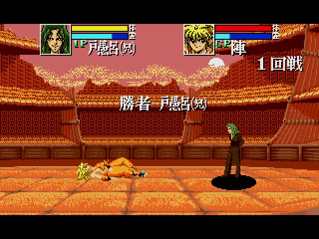
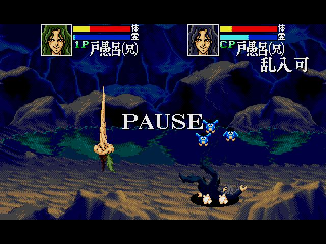
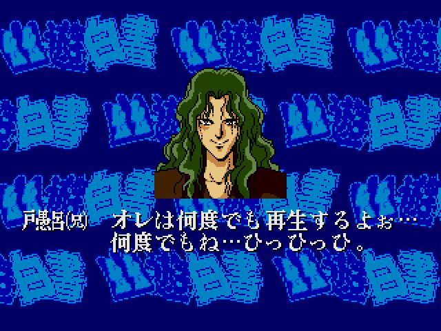
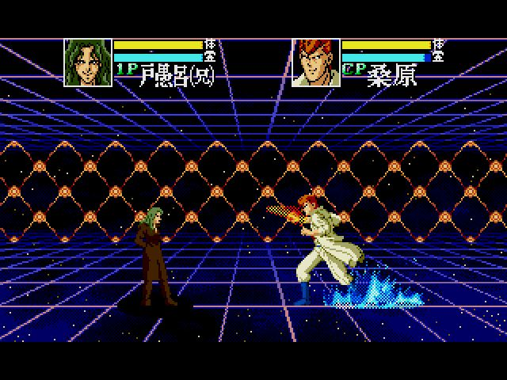
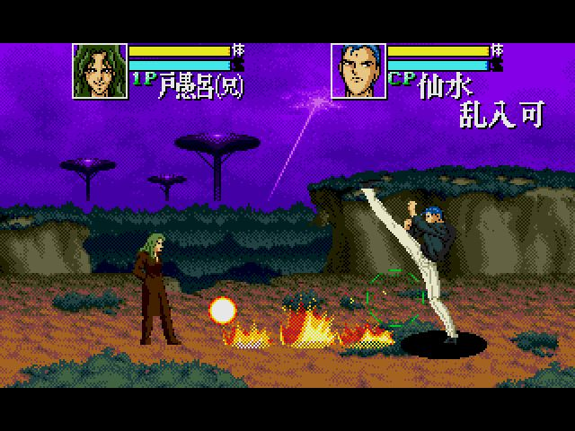
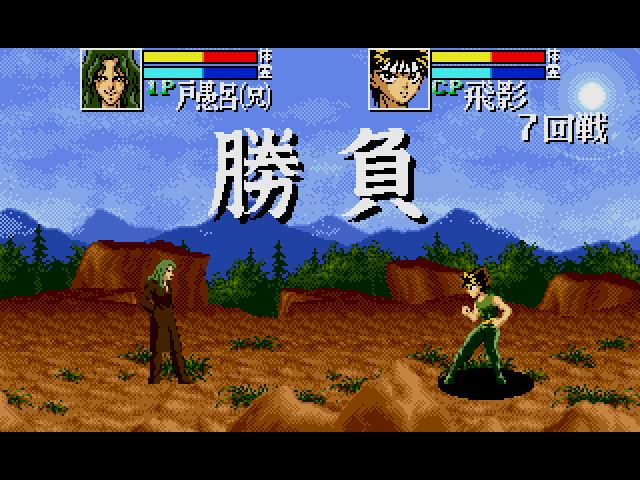
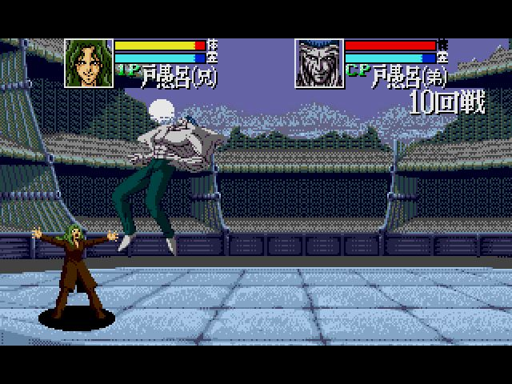

通关画面的亮点在于，游戏的配音卡斯就是第一版动画版的配音。无数的大神晃瞎了我的氪金狗眼……
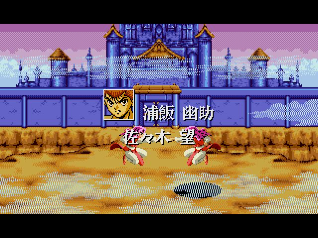
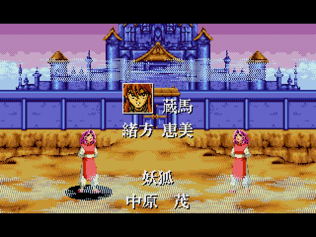
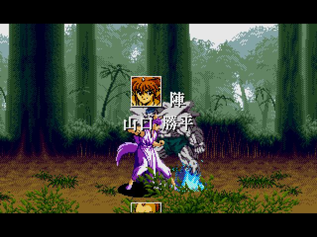
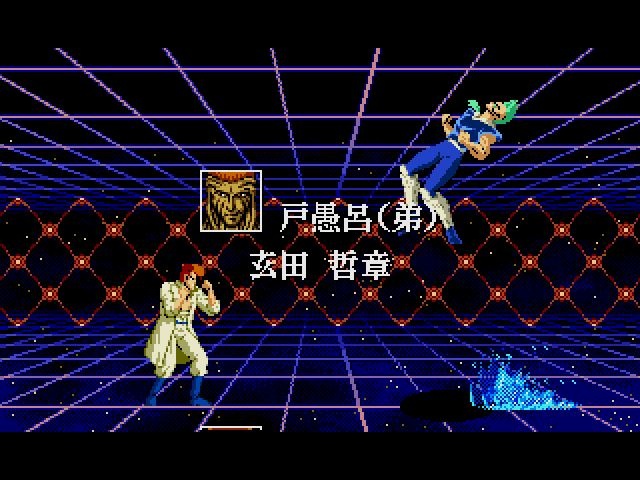
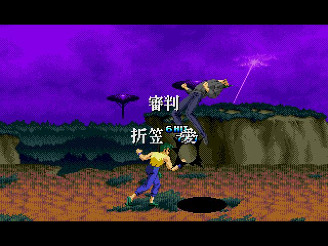
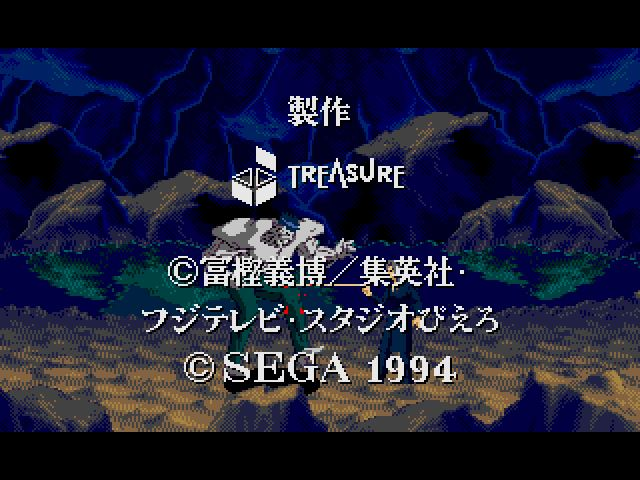