## 摘要

年度佳作：《少年的你》、《十二公民》、《色，戒》、《我们天上见》、《无人区》、《你妈妈也一样》、《一一》、《学校风云》、《心理游戏》、《昭和歌谣大全集》、《香港制造》、《半个喜剧》
年度抵制：《烈火英雄》、《曼蒂》、《怪物狩猎者》
年度惊喜：《放荡青春》、《勺子杀人狂》、《狩猎》、《聊斋变异》、《复仇者之死》、《光荣的愤怒》、《夜生活女王之霞姐传奇》、《邪不压正》
年度失望：《丧尸乐园2》、《订亲》、《红雀》、《囧妈》、《情书》、《男人四十》

年度最佳导演：《少年的你》 曾国祥
年度最佳剧本：《我们天上见》 蒋雯丽
年度最佳男主角：《金手套》 乔纳斯·达斯勒（饰洪卡）
年度最佳女主角：《你妈妈也一样》 玛丽维尔·贝尔杜（饰露莎）、《李米的猜想》 周迅 （饰李米）
年度最佳男配角：《十二公民》 钱波（饰7号陪审员）、《学校风云》 张耀扬（饰潇洒哥）
年度最佳女配角：《误杀》 陈冲（饰拉韫）
年度最佳音乐：《心理游戏》
年度最佳画面：《我们天上见》
年度最佳续集或翻拍：《十二公民》

年度最差导演：《游》 云翔
年度最差剧本：《烈火英雄》于勇敢/陈国辉
年度最差男主角：《曼蒂》尼古拉斯凯奇（饰米勒）
年度最差女主角：《死亡录像4：启示录》贝拉斯科（饰安吉拉）
年度最差男配角：《义胆群英》周星驰（饰小奇）
年度最差女配角：《烈火英雄》杨紫（饰王璐）
年度最差续集或翻拍：《丧尸乐园2》

注:
因为周星驰在“龙蛇争霸”中的表现过于辣眼睛，增加了最差男配角一项。为追求对称，杨紫受牵累，但不冤枉。

## 总结

庚子年是闰年，全年共384天。
本年度因为疫情的原因，片刷得过量，共看片235部，比去年增加了71.5%，也就是多看了98部片。下半年意识到刷片太多已经有所收敛，否则突破表格原来公式范围的255部是很轻易的事。
平均分5.47，只比去年低了大约0.02，基本一致。综合这两年的刷片数量，这差不多就是我评分的基准线了。
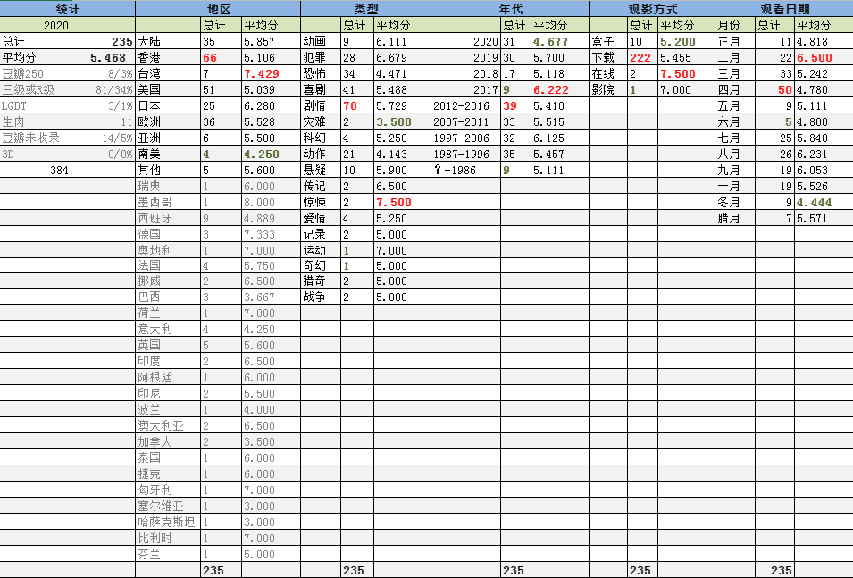
豆瓣250刷了8部，《情书》得分最低，《一一》最高，总体看来确实比一般的电影高。
豆瓣没有收录的电影仍然占了5%。其实还有一种imdb没记录的电影，俗称网大。明年也许会酌情增加统计项。
三级和限制级的数量非常多，刷了81部占到34%。这还没算很多明显超范围却未分级的作品。再过两年会不会面临无限制级影片可看的尴尬境地。嗯～
本年度还刷了一些系列电影。比如《致命弯道》，《阴阳路》。也特意按照导演和演员刷了一些作品，曹保平已经刷通关，邱礼涛、萨马拉·维文以及达达里奥能搜到资源的也差不多都看了。下一步进入计划的是林岭东、园子温和彭浩翔。

从地区分布来看，港片在数量上第一次成为冠军。这是因为刷了很多香港电影辉煌期的影片。当然，其得分总体来讲偏低，毕竟高产也意味着泥沙俱下。往下依次是美、欧、日、大陆。日本片数量第一次掉出前三，这意味着感兴趣的日本片可能被我刷的差不多了。
因为刷了三部台湾豆瓣250名作，加上剩余的四部也总体表现良好，所以台湾片的评分创造了本人统计观影以来，超过5部片以上地区的评分新历史，高达7.4分。日本片的评分其实也很高，达到了6.28。
新开拓的地区版图是墨西哥、捷克、波兰、比利时、匈牙利、哈萨克斯坦和芬兰。捷克的《有希望的男人》是部非常奇怪的作品，应该是导演的恶趣味而跟出身地区无关。
东南亚、南亚电影今年刷得很少。

从影片类型来看，仍旧是喜剧和恐怖占了大头。但一个问题是，有点名气的恐怖片都快被我刷光了。而恐怖片又是个最容易出烂片的类型，不能乱点鸳鸯谱。
刨去小样本，最烂类型被动作片蝉联。我就是不好这口儿。

这次年代分布得特别匀称，得分最高的是2017年的影片。不过也跟样本数有关。70年代的片子看了6部，抛开技术手段，还是各有可取之处的。但并不包含两部意大利的“铅黄电影”，那玩意儿真是胡编乱造。
还看了一部来自1968年的《太空英雌芭芭丽娜》，看这部片是因为“只要你愿意，就能找到大多数好莱坞女星为艺术献身的镜头。”本片是本人开展记录行动以来，观看的最古老的影片。同时，这部片子也是本年度唯一一部观看的时候豆瓣还有记录，几个月后却消失了的电影。

观影方式来说，仍旧是习惯了下载后观看。受疫情影响，电影院只去了一次（《夺冠》）。这项统计没什么意义，明年可以取消了。

今年新追加了观看日期的统计。四月因为闰月而当之无愧地成为第一。拆成两份也是并列第一。四月初十（阳历5月2日），老婆大人带孩子出门，我在家刷了6部电影，为全年最高。

本年度观看的《牯岭街少年杀人事件》、《欢乐时光》、《一一》、《地久天长》、《阳光普照》都是很细腻娓娓道来的片子，片长都是150分钟以上。细腻可是细腻，但这种片子看多了真是致郁，明年坚决要限制在两部以下。

辛丑年的目标是200部以下。

## 详情

下面是影片的详细信息和三句话简评。右侧为本人评分，仅代表个人观点，拒绝客观公正。
满分电影两部。《学校风云》和《心理游戏》，都是在技术上都不是特别完美，但情绪非常饱满的作品。
零分电影同样是两部：《烈火英雄》、《曼蒂》。

9月份经历了豆瓣API失效，情急之下全换成了imdb。后来虽然找到了替代的方法，为了保持统一还是留用了IMDB的结果。可能阅读体验上比去年有所下降。不过我估计也没几个人能看完。
评论皆原创。

[冰雪奇缘2](https://pewae.com/gaan/aHR0cHM6Ly9tb3ZpZS5kb3ViYW4uY29tL3N1YmplY3QvMjU4ODcyODgv)

原名：Frozen II导演：克里斯·巴克 / 珍妮弗·李主演：乔什·加德 / 乔纳森·格罗夫 / 伊迪娜·门泽尔 / 克里斯汀·贝尔 / 圣蒂诺·方塔纳 / 埃文·蕾切尔·伍德 / 斯特林·K·布朗 / 杰森·雷特 / 玛莎·普林顿 / 阿尔弗雷德·莫里纳类型：冒险 / 动画 / 喜剧 / 歌舞地区：美国首映时间：2019

令人发指的爱莎变装秀。

[人民英雄](https://pewae.com/gaan/aHR0cHM6Ly9tb3ZpZS5kb3ViYW4uY29tL3N1YmplY3QvMTMwNDc1My8=)

导演：尔冬升主演：林保怡 / 梁家辉 / 梁朝伟 / 江道海 / 狄龙 / 秦沛 / 金燕玲 / 黄斌类型：剧情 / 动作 / 犯罪地区：香港首映时间：1987

狄龙大哥这头发可真够可怜的。
对当年大圈帮的一些思考吧，却也没多少深度。

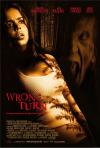

[致命弯道](https://pewae.com/gaan/aHR0cHM6Ly9tb3ZpZS5kb3ViYW4uY29tL3N1YmplY3QvMTMwMzg0Ny8=)

原名：Wrong Turn导演：罗布·施密特主演：Garry Robbins / Ted Clark / Yvonne Gaudry / 凯文·席格斯 / 埃曼纽尔·施莱琪 / 戴斯蒙德·哈灵顿 / 朱利安·瑞钦斯 / 杰瑞米·西斯托 / 林蒂·布丝 / 艾丽莎·杜什库类型：恐怖地区：美国首映时间：2003

挺有想法的，不然也不能接二连三的拍续集。
典型的美式恐怖片，以血浆和恶心为卖点，开启了“猜猜谁能活到最后”的模式

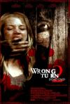

[致命弯道2](https://pewae.com/gaan/aHR0cHM6Ly9tb3ZpZS5kb3ViYW4uY29tL3N1YmplY3QvMjAzMjMzOS8=)

原名：Wrong Turn 2: Dead End导演：乔·林奇主演：Kimberly Caldwell / 丹妮拉·阿隆索 / 亨利·罗林斯 / 克瑞斯塔尔·洛维 / 史蒂夫·博朗 / 特夏斯·巴特尔 / 艾丽卡·李尔森 / 阿莱卡萨·帕拉迪诺 / 韦恩·罗布森 / 马修·库里·霍尔姆斯类型：恐怖地区：美国首映时间：2007

第二部开始露点。
虽然不合理的地方挺多，但剧情是系列中最有想法的。

[摩登保镖](https://pewae.com/gaan/aHR0cHM6Ly9tb3ZpZS5kb3ViYW4uY29tL3N1YmplY3QvMTMwMjUxMi8=)

导演：许冠文主演：冯淬帆 / 许冠文 / 许冠杰 / 许冠英 / 黄造时类型：喜剧地区：香港首映时间：1981

许氏三兄弟合体。
笑料挺足，剧情太散。

[致命弯道3](https://pewae.com/gaan/aHR0cHM6Ly9tb3ZpZS5kb3ViYW4uY29tL3N1YmplY3QvMzE0ODg3Ny8=)

原名：Wrong Turn 3: Left for Dead导演：德克兰·奥布莱恩主演：Tom Frederic / 克里斯蒂安·孔特雷拉斯 / 吉尔·科雷林 / 塔梅尔·哈桑 / 杰克·库兰 / 杰克·戈登 / 查尔斯·维恩 / 汤姆·麦凯 / 詹妮特·蒙哥马利 / 路易斯·克里夫类型：恐怖地区：美国首映时间：2009

第三部开始，片头漏点成为新传统。
同时，剧情开始崩坏，不合理的地方太多以至于都不屑解释了。
唯一的亮点是结局的黑吃黑，却也不稀奇。

[致命弯道4：血腥起源](https://pewae.com/gaan/aHR0cHM6Ly9tb3ZpZS5kb3ViYW4uY29tL3N1YmplY3QvNjA4MjUxNy8=)

原名：Wrong Turn 4: Bloody Beginnings导演：德克兰·奥布莱恩主演：凯特琳·勒柏 / 凯特琳·勒柏 Kaitlyn Leeb / 小维克多·津克 / 泰妮卡 戴维斯 / 詹妮弗·皮达维克 / 迪恩·阿姆斯特朗 / 阿里·塔塔林类型：恐怖地区：美国首映时间：2011

这是部前传，所以剧情也回到了傻缺青年作大死的美式穷鬼恐怖片的老路子上。
最后一个镜头还蛮赞的。

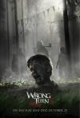

[致命弯道5：血族](https://pewae.com/gaan/aHR0cHM6Ly9tb3ZpZS5kb3ViYW4uY29tL3N1YmplY3QvMTA3NzQ5ODAv)

原名：Wrong Turn 5: Bloodlines导演：德克兰·奥布莱恩主演：Kyle Redmond-Jones / Simon Ginty / 保罗·路德维克 / 卡米拉·阿维森 / 哈里·阿尼奇金 / 安德鲁·伯恩 / 拉多斯拉夫·巴瓦诺夫 / 罗姗妮·麦琪 / 菲恩·琼斯 / 道格·布拉德利类型：恐怖地区：美国首映时间：2012

坏人干掉所有好人，扬长而去。
剧情发生在晚上，所以视觉效果也差。

[致命弯道6：终极审判](https://pewae.com/gaan/aHR0cHM6Ly9tb3ZpZS5kb3ViYW4uY29tL3N1YmplY3QvMjYwMjI3NjUv)

原名：Wrong Turn 6: Last Resort导演：瓦列·米利夫主演：Harry Belcher / 乔·贾米纳拉 / 克里斯·贾维斯 / 安东尼·伊洛特 / 拉多斯拉夫·巴瓦诺夫 / 比利·阿什沃斯 / 罗克珊·帕利特 / 罗洛·斯金纳 / 莎蒂·卡茨 / 阿奎拉·佐尔类型：恐怖地区：美国首映时间：2014

吃人吃得毫无特色。
前几部的畸形儿沦为吉祥物，这个系列完了。

[裤甲天下](https://pewae.com/gaan/aHR0cHM6Ly9tb3ZpZS5kb3ViYW4uY29tL3N1YmplY3QvMTI5NzQ3Ny8=)

导演：陆剑明主演：卢冠廷 / 吴元俊 / 吴君如 / 吴耀汉 / 张艾嘉 / 沈殿霞 / 王晶 / 秦祥林 / 金燕玲类型：喜剧地区：香港首映时间：1988

很普通很普通的香港年代剧。
吴耀汉的蛋蛋真是多灾多难，笑点来自秦祥林。
卢冠廷幕前的表现不错，挺有喜剧天份的。

[方形](https://pewae.com/gaan/aHR0cHM6Ly9tb3ZpZS5kb3ViYW4uY29tL3N1YmplY3QvMjY2MTAyMjkv)

原名：The Square导演：鲁本·奥斯特伦德主演：伊丽莎白·莫斯 / 克拉斯·邦 / 克里斯托弗·莱索 / 多米尼克·韦斯特 / 泰瑞·诺塔里 / 玛丽娜·希彭蔻类型：喜剧地区：瑞典首映时间：2017

很有名，但是很闷。
现代艺术都是蒙人的。

[我们是小僵尸](https://pewae.com/gaan/aHR0cHM6Ly9tb3ZpZS5kb3ViYW4uY29tL3N1YmplY3QvMzAzOTEzMDAv)

原名：ウィーアーリトルゾンビーズ导演：长久允主演：中岛塞娜 / 二宫庆多 / 佐佐木藏之介 / 初音映莉子 / 奥村门土 / 工藤夕贵 / 村上淳 / 水野哲志 / 池松壮亮 / 西田尚美类型：剧情 / 音乐地区：日本首映时间：2019

据说这个类型叫做“日式丧片”。
主题相当不错，没有父母的时候，孤儿真的会悲伤吗？
拖沓，难道是为了向街霸致敬而强行12关？

[你妈妈也一样](https://pewae.com/gaan/aHR0cHM6Ly9tb3ZpZS5kb3ViYW4uY29tL3N1YmplY3QvMTMwMzMzMy8=)

原名：Y tu mamá también导演：阿方索·卡隆主演：Giselle Audirac / Nathan Grinberg / 丹尼尔·希梅内斯·卡乔 / 安娜·洛佩斯·梅尔卡多 / 玛丽亚·亚拉 / 玛丽维尔·贝尔杜 / 盖尔·加西亚·贝纳尔 / 贝罗尼卡·兰格 / 迭戈·卢纳 / 阿图罗·里奥斯类型：剧情 / 情色地区：墨西哥首映时间：2001

这部片的切入有些不适应，很吵的样子，难道墨西哥就是这个鸟样？
关于青春期的公路片，然而一切尽在少妇的掌握中。

[传染病](https://pewae.com/gaan/aHR0cHM6Ly9tb3ZpZS5kb3ViYW4uY29tL3N1YmplY3QvNDMwMTA0My8=)

原名：Contagion导演：史蒂文·索德伯格主演：凯特·温丝莱特 / 劳伦斯·菲什伯恩 / 埃利奥特·古尔德 / 布莱恩·科兰斯顿 / 格温妮斯·帕特洛 / 玛丽昂·歌迪亚 / 裘德·洛 / 詹妮弗·艾莉 / 马特·达蒙 / 黄经汉类型：剧情 / 惊悚 / 灾难 / 科幻地区：美国首映时间：2011

应景看一下，没有太多感觉，片子的质量一般。
喜欢凯特温斯莱特片中的造型。
大团圆结局太糟糕了。

[太空英雌芭芭丽娜](https://pewae.com/gaan/aHR0cHM6Ly9tb3ZpZS5kb3ViYW4uY29tL3N1YmplY3QvMTI5MjU2Ny8=)

原名：Barbarella导演：罗杰·瓦迪姆主演：Nino Musco / 克洛德·多芬 / 塞尔日·马康 / 安妮塔·帕里博格 / 简·方达 / 米罗·奥西 / 约翰·菲利浦·劳 / 维罗尼卡·旺代勒 / 贾恩卡洛·科贝利 / 马塞尔·马索类型：冒险 / 喜剧 / 奇幻 / 科幻地区：法国首映时间：1968

看这部片纯为猎奇，因为“只要有心，绝大多数奥斯卡影后为艺术献身的片段都能找到”。
简·方达今年83岁高龄，她的IMDB演员编号是404。
当时的服化道太有质感了，现在的电脑特效怎样也模拟不出。

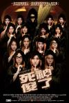

[死神傻了](https://pewae.com/gaan/aHR0cHM6Ly9tb3ZpZS5kb3ViYW4uY29tL3N1YmplY3QvNDAxMTE2NC8=)

导演：邱礼涛主演：周柏豪 / 周秀娜 / 方皓玟 / 欧阳靖 / 许志安 / 谢安琪 / 郑融 / 郑诗君 / 陆永 / 陈伟霆类型：喜剧地区：香港首映时间：2009

老式香港搞笑片的风骨，有细节没整体。
谢安琪那个小段真的挺有意思的。
全片充满对AngelaBaby深深的恶意。

[选老顶](https://pewae.com/gaan/aHR0cHM6Ly93d3cuaW1kYi5jb20vdGl0bGUvdHQ1NjA5MzAyLw==)

导演：邱礼涛主演：冼色丽 / 夏韶声 / 姜皓文 / 杜汶泽 / 汤怡 / 王宗尧 / 赵硕之 / 陈家乐 / 黄德斌类型：剧情 / 犯罪地区：香港首映时间：2016

“要选一个话事人，为什么只有九个人可以投票？”所以这片被消失了。
杜汶泽啊，黄秋生啊，邱礼涛啊，统统too naive。
垃圾特效大幅度降低了质感，还不如用血包和橡胶人。

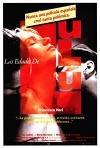

[露露情史](https://pewae.com/gaan/aHR0cHM6Ly93d3cuaW1kYi5jb20vdGl0bGUvdHQwMDk5NDg0Lw==)

原名：Las edades de Lulú导演：bigas luna主演：francesca neri / maría barranco / Óscar ladoire类型：剧情地区：西班牙首映时间：1990

欧洲奶牛也不多。
花式漏点秀——婴儿漏、男人露、人妖露，还是拉丁民族最开放。
看懂了剧情，没看懂导演想说什么。

[气球](https://pewae.com/gaan/aHR0cHM6Ly9tb3ZpZS5kb3ViYW4uY29tL3N1YmplY3QvMzAxOTI0MDEv)

原名：Ballon导演：米夏埃尔·赫尔比希主演：乔纳斯·霍登里德尔 / 克里斯蒂安·内特 / 卡罗利妮·舒赫 / 塞巴斯蒂安·胡克 / 大卫·克劳斯 / 弗莱德里奇·穆克 / 托马斯·克莱舒曼 / 罗纳德·库克利斯 / 艾丽西娅·冯·里特贝格 / 蒂尔曼·多布勒类型：剧情 / 历史 / 惊悚地区：德国首映时间：2018

片长较长，却不觉得累，因此气氛营造殊为难得。
演小女朋友的爆假的人工双眼皮看着好顺眼。
扭曲的体制下，根本没有好人。

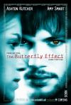

[蝴蝶效应](https://pewae.com/gaan/aHR0cHM6Ly9tb3ZpZS5kb3ViYW4uY29tL3N1YmplY3QvMTI5MjM0My8=)

原名：The Butterfly Effect导演：J·麦基·格鲁伯 / 埃里克·布雷斯主演：凯文·G·施密特 / 埃尔登·汉森 / 威廉姆·李·斯科特 / 杰西·詹姆斯 / 梅洛拉·沃尔特斯 / 约翰·帕特里克·阿梅多利 / 罗根·勒曼 / 艾琳·戈洛瓦娅 / 艾米·斯马特 / 阿什顿·库彻类型：剧情 / 悬疑 / 惊悚 / 科幻地区：美国首映时间：2004

十几年后我终于看了这部名作，酷。
没觉得片中的蝴蝶效应如何厉害，倒是破窗效应牛得一批。

[行骗天下JP：浪漫篇](https://pewae.com/gaan/aHR0cHM6Ly9tb3ZpZS5kb3ViYW4uY29tL3N1YmplY3QvMzAyNDExMDIv)

原名：コンフィデンスマンJP导演：田中亮主演：三浦春马 / 东出昌大 / 前田敦子 / 小手伸也 / 小日向文世 / 小栗旬 / 江口洋介 / 竹内结子 / 织田梨沙 / 长泽雅美类型：喜剧 / 悬疑地区：日本首映时间：2019

长泽雅美的迷之演技。
好久不见的广末凉子，已经开始演中学生的母亲了，她可是跟我同岁的“二十世纪最后的美少女”啊。
剧情平平，没太大的惊喜，也没太多破绽。

[阳光姐妹淘](https://pewae.com/gaan/aHR0cHM6Ly9tb3ZpZS5kb3ViYW4uY29tL3N1YmplY3QvMjcxNjA2MTgv)

原名：SUNNY 強い気持ち・強い愛导演：大根仁主演：友坂理惠 / 小池荣子 / 山本舞香 / 广濑铃 / 板谷由夏 / 池田依来沙 / 渡边直美 / 田边桃子 / 筱原凉子 / 野田美櫻类型：剧情 / 喜剧 / 歌舞地区：日本首映时间：2018

筱原凉子啊！
虽然在高中的年代并不喜欢安室奈美惠，也不喜欢JPop，更没有生活在日本，但这部片子真的反映了那个年代。
池田依来沙的颜真棒。

[臭屁王](https://pewae.com/gaan/aHR0cHM6Ly9tb3ZpZS5kb3ViYW4uY29tL3N1YmplY3QvMTQxNjcyMi8=)

导演：朱延平主演：吴孟达 / 朱茵 / 郝劭文 / 金城武类型：剧情 / 动作 / 喜剧地区：香港首映时间：1995

郝劭文只有一招鲜，朱延平也是。
混乱的逻辑可惜了达叔的精彩表演。
结局值得称道，并不是所有的单相思都有美好的结局，备胎去死吧。

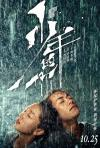

[少年的你](https://pewae.com/gaan/aHR0cHM6Ly9tb3ZpZS5kb3ViYW4uY29tL3N1YmplY3QvMzAxNjY5NzIv)

导演：曾国祥主演：吴越 / 周也 / 周冬雨 / 尹昉 / 张歆怡 / 张耀 / 张艺凡 / 易烊千玺 / 赵润南 / 黄觉类型：剧情 / 爱情 / 犯罪地区：大陆首映时间：2019

题材太讨喜了，相信如果不是不分级制度的存在，片子可以拍得更凌厉。
周冬雨很棒，一羊迁徙有前途。
配角糟糕，点名批评反派女学生和年轻警察。

[金手套](https://pewae.com/gaan/aHR0cHM6Ly9tb3ZpZS5kb3ViYW4uY29tL3N1YmplY3QvMjcyMDUxMzIv)

原名：The Golden Glove导演：法提赫·阿金主演：乔纳斯·达斯勒 / 亚当·布斯多柯斯 / 卡特加·斯图特 / 哈克·波姆 / 特里斯坦·勾贝尔 / 玛格丽特·提塞尔 / 玛蒂娜·艾特纳-阿奇姆彭 / 维多莉亚·塔拉特曼斯多夫 / 菲利普·巴尔特斯 / 马克·霍泽曼类型：剧情 / 惊悚 / 犯罪地区：德国首映时间：2019

导演很厉害，片子拍得充满腐臭气息的同时却没用多少血浆。
老女人真可怕。

[趣味游戏](https://pewae.com/gaan/aHR0cHM6Ly9tb3ZpZS5kb3ViYW4uY29tL3N1YmplY3QvMTMwNjU0OC8=)

原名：Funny Games导演：迈克尔·哈内克主演：Stefan Clapczynski / 乌尔里希·穆埃 / 亚诺·弗里斯奇 / 多丽丝·昆斯特曼 / 弗朗克·吉林 / 苏珊娜·洛塔尔类型：剧情 / 悬疑 / 惊悚 / 犯罪地区：奥地利首映时间：1997

这部片子表现的是纯粹的、无缘无故的恶。
并没有多少血腥镜头，却让人毛骨悚然。

[十二公民](https://pewae.com/gaan/aHR0cHM6Ly9tb3ZpZS5kb3ViYW4uY29tL3N1YmplY3QvMjQ4NzU1MzQv)

导演：徐昂主演：何冰 / 张永强 / 李光复 / 王刚 / 班赞 / 米铁增 / 赵龙豪 / 钱波 / 韩童生 / 高冬平类型：剧情地区：大陆首映时间：2015

不是片子不好，而是太像话剧了，缺少电影语言。
故事的发端扯淡而牵强，但一帮老戏骨飚戏太有意思了。
关于如何独立思考，这是部每个中国人都应该看的电影。

[未来的未来](https://pewae.com/gaan/aHR0cHM6Ly9tb3ZpZS5kb3ViYW4uY29tL3N1YmplY3QvMjcwNDU2MTUv)

原名：未来のミライ导演：细田守主演：上白石萌歌 / 吉原光夫 / 宫崎美子 / 星野源 / 本渡枫 / 畠中祐 / 真田麻美 / 神田松之丞 / 麻生久美子 / 黑木华类型：动画 / 奇幻地区：日本首映时间：2020

标题哗众取宠。
精细有余而故事不足。
大人不管小孩，小孩自己就悟了，这三观不正啊！

[泄密者](https://pewae.com/gaan/aHR0cHM6Ly9tb3ZpZS5kb3ViYW4uY29tL3N1YmplY3QvMjcxOTUwODAv)

导演：邱礼涛主演：佘诗曼 / 刘浩龙 / 卫诗雅 / 吴镇宇 / 周秀娜 / 张智霖 / 张继聪 / 李灿森 / 杨柳青 / 郑则仕类型：剧情 / 犯罪地区：香港首映时间：2018

最大的缺点是没有悬念，剧情俗套。
编剧前半部分还算紧凑，后半部分马来西亚篇完全就是扯犊子放飞自我。
拍摄过程中有位特技大哥心脏病去世了，片尾特意有个致敬桥段，好评。

[90年代中期](https://pewae.com/gaan/aHR0cHM6Ly9tb3ZpZS5kb3ViYW4uY29tL3N1YmplY3QvMjY3NjIyNjkv)

原名：Mid90s导演：乔纳·希尔主演：亚历克萨·德米 / 凯瑟琳·沃特斯顿 / 卢卡斯·赫奇斯 / 吉奥·加利西亚 / 哈莫尼·科林 / 奥伦·普雷纳特 / 杰洛德·卡尔迈克 / 桑尼·苏尔季克 / 纳-凯尔·史密斯 / 赖德·麦克劳克林类型：剧情 / 喜剧地区：美国首映时间：2018

虽然跟我的年代相符，但里面的文化太过于美国街头化了，而且人家是多胎，咱是独生，感不同则身不受。
小孩试图用PS1手柄线自杀那场很有年代感。

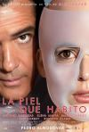

[吾栖之肤](https://pewae.com/gaan/aHR0cHM6Ly9tb3ZpZS5kb3ViYW4uY29tL3N1YmplY3QvMjk5NzA1Mi8=)

原名：La piel que habito导演：佩德罗·阿莫多瓦主演：何塞·路易斯·戈麦斯 / 埃伦娜·安纳亚 / 安东尼奥·班德拉斯 / 布兰卡·苏亚雷斯 / 扬·科奈特 / 爱德华·费尔南德斯 / 玛丽萨·帕雷德斯 / 罗伯托·阿拉莫 / 苏西·桑切斯 / 费尔南多·卡约类型：剧情 / 悬疑 / 惊悚地区：西班牙首映时间：2011

非常非常非常变态的剧情，即使像我这样的重口味爱好者，也不是一下子能接受得了的。
女主胸形堪称完美。
安东尼奥班德拉斯越老越帅。

[仲夏夜惊魂](https://pewae.com/gaan/aHR0cHM6Ly9tb3ZpZS5kb3ViYW4uY29tL3N1YmplY3QvMzAyODg2Mzgv)

原名：Midsommar导演：阿里·艾斯特主演：亨里克·诺伦 / 伊莎贝尔·古瑞 / 埃洛拉·托尔基亚 / 威尔·保尔特 / 威廉·杰克森·哈珀 / 弗洛伦丝·皮尤 / 杰克·莱诺 / 维尔赫尔姆·布洛姆根 / 贡内尔·弗雷德 / 阿奇·马德基类型：恐怖地区：美国首映时间：2019

论邪教是怎么忽悠人的。
尸体没多吓人，倒是邪教的各种仪式，看进去的话相当渗得慌。

[义胆群英](https://pewae.com/gaan/aHR0cHM6Ly9tb3ZpZS5kb3ViYW4uY29tL3N1YmplY3QvMTI5OTA1Ny8=)

导演：午马 / 吴宇森主演：午马 / 周星驰 / 姜大卫 / 恬妞 / 李修贤 / 狄龙 / 赵雷 / 邝美云 / 陈观泰 / 黄霑类型：动作地区：香港首映时间：1989

本片就是某位同学心心念念的“龙蛇争霸”，所以破例多说几句。
他提的时候我就没什么感觉，这下确定了，我小时候确实没看过，因为我一向不喜欢枪战片。
为了张彻大导演庆贺从影40周年，他的弟子朋友们搞的片子，质量还不错。
巅峰期的吴宇森加一批迟暮英雄，情怀和场面都有了，除了最后三个人枪战都是身中数枪而不死太八十年代。
只是那活龙活现的午马、黄霑、董骠、成奎安、岳华、罗烈们啊……“岁月啊你带不走那一串串熟悉的姓名。”
周星驰演得非常尴尬，以至于我在犹豫本年度要不要特意给他开辟一个最差男配角奖。
在姜大卫的回忆里，别人都只是镜头扫过，唯一的一句台词给了狄龙：“这是龙哥，我十几年的好朋友。”
不论主角配角，有周星驰出现的片子里，他竟然不是笑点担当，真挺意外。
搞笑担当的是倪震，剧组里最年轻的一个，戏份不少是因为编剧名叫倪匡。
倪匡把刺马的故事又翻了一遍就完事了，写手成名了赚钱真叫个容易。

[再见王老五](https://pewae.com/gaan/aHR0cHM6Ly9tb3ZpZS5kb3ViYW4uY29tL3N1YmplY3QvMTI5OTc2My8=)

导演：尔冬升主演：午马 / 张坚庭 / 张曼玉 / 曾志伟 / 林建明 / 沈殿霞 / 王小凤 / 胡枫 / 郑丹瑞 / 钟镇涛类型：喜剧地区：香港首映时间：1989

小场面的小喜剧，很温馨，风格一点儿也不像世纪末黑化之后的尔冬升。
练级期的张曼玉并不是单纯的花瓶，还是有可取之处的。
酒席、彩礼、房子，30年了，结婚的问题还是那些样。

[猛鬼佛跳墙](https://pewae.com/gaan/aHR0cHM6Ly9tb3ZpZS5kb3ViYW4uY29tL3N1YmplY3QvMTI5NTY3NC8=)

导演：于仁泰主演：Chuen Chan / 何启南 / 文隽 / 李丽珍 / 梁小龙 / 狄波拉 / 王俊棠 / 董骠 / 陈卓欣 / 韩坤类型：喜剧 / 恐怖地区：香港首映时间：1988

不是翻拍的翻拍，剧情倒也算层层递进，只是一切都很俗套，即使用八十年代的眼光。
骠叔不演警察也很棒，李丽珍少女感十足，梁小龙原来早在火云邪神以前就早已放飞自我了。
片名差评，佛跳墙是配角梁小龙的名字，他是个道士，又不是鬼。

[辣警霸王花](https://pewae.com/gaan/aHR0cHM6Ly9tb3ZpZS5kb3ViYW4uY29tL3N1YmplY3QvMjYyMzUzNTEv)

导演：钱国伟主演：伍允龙 / 何珮瑜 / 岑丽香 / 崔碧珈 / 杨思琦 / 杰西卡·C / 林晓峰 / 邓丽欣 / 郑欣宜 / 钱嘉乐类型：动作 / 喜剧地区：香港首映时间：2016

卖肉没什么可耻的，但是肉不够多就很可耻了，除了郑欣宜真的有很多肉。
动作戏缺少打击感。
最大的问题是所有主角和配角都长得没特色，除了胖子以外主角却有5个之多，完全分不清谁是谁，只能胡猜。

[辣警霸王花：澳门行动](https://pewae.com/gaan/aHR0cHM6Ly9tb3ZpZS5kb3ViYW4uY29tL3N1YmplY3QvMjcxMzU1NjMv)

导演：李志伦主演：何珮瑜 / 吕珊 / 唐文龙 / 杨恭如 / 林明祯 / 梁琤 / 袁文杰 / 谭耀文 / 邓洢玲 / 陆诗韵类型：剧情 / 动作 / 喜剧地区：香港首映时间：2020

一部3.9分的电影竟然还能有续集，我tm竟然还下了。
肉更少，剧情比上一部有聊得多。
导演动不动take个慢镜头这事实在太二了，导演傻，剪辑也不聪明。

[色，戒](https://pewae.com/gaan/aHR0cHM6Ly9tb3ZpZS5kb3ViYW4uY29tL3N1YmplY3QvMTgyODExNS8=)

导演：李安主演：庹宗华 / 朱芷莹 / 柯宇纶 / 梁朝伟 / 汤唯 / 王力宏 / 钱嘉乐 / 阮德锵 / 陈冲 / 高英轩类型：剧情 / 情色 / 爱情地区：台湾首映时间：2007

终于有时间看了完整版，汤唯作为新人可以算是神级的演出了，被封杀完全没道理。
李安的片子一贯特有的细腻，旧中国的年代感十足。
结合自己家二姥爷的经历，我倾向于梁朝伟是延安方面的判断，即使如此，也没有再看一次的必要。

[双面玛莎](https://pewae.com/gaan/aHR0cHM6Ly9tb3ZpZS5kb3ViYW4uY29tL3N1YmplY3QvMzc1MDA4OC8=)

原名：Martha Marcy May Marlene导演：肖恩·德金主演：伊丽莎白·奥尔森 / 休·丹西 / 克里斯托弗·阿波特 / 布拉迪·科贝特 / 玛丽亚·迪齐亚 / 约翰·浩克斯 / 莎拉·保罗森类型：剧情 / 悬疑 / 惊悚地区：美国首映时间：2011

可能是没找到好字幕的原因，没看懂，虽不明亦不觉厉。
不给及格分是因为奥尔森的身材很一般啊。
我没看过妇联后面几部，所以奥尔森哪里好了？

[我在布鲁克林卖大麻](https://pewae.com/gaan/aHR0cHM6Ly9tb3ZpZS5kb3ViYW4uY29tL3N1YmplY3QvMjU3NzYxNzkv)

原名：Baked in Brooklyn导演：Rory Rooney主演：乔·格里法西 / 乔什·布雷纳 / 亚历珊德拉·达达里奥 / 保罗·拉克诺 / 托芙·菲尔德舒 / 林赛·布罗德 / 泰隆·布朗 / 迈克尔·里韦拉 / 阿尔·萨皮恩扎 / 马克·费厄斯坦类型：剧情 / 喜剧 / 爱情 / 犯罪地区：美国首映时间：2016

一无是处。
达达里奥确实硕大无朋，有个穿衣服的镜头，正背面的角度能看到车头灯……

[烈火英雄](https://pewae.com/gaan/aHR0cHM6Ly9tb3ZpZS5kb3ViYW4uY29tL3N1YmplY3QvMzAyMjE3NTcv)

导演：陈国辉主演：侯勇 / 印小天 / 张哲瀚 / 杜江 / 杨紫 / 欧豪 / 谭卓 / 谷嘉诚 / 高戈 / 黄晓明类型：剧情 / 灾难地区：大陆首映时间：2019

你主旋律我可以不管，煽情恶心我也能无视，麻痹的诋毁大连人就是不行！
火是头天晚上6点着的，第二天上午就不见明火了，普通市民根本只能闻到味道根本不清楚有多严重，逃跑的只有收到消息的中石油和市政府的头头们！！！

[丧尸乐园2](https://pewae.com/gaan/aHR0cHM6Ly9tb3ZpZS5kb3ViYW4uY29tL3N1YmplY3QvNDE4NTgzNC8=)

原名：Zombieland: Double Tap导演：鲁本·弗雷斯彻主演：伍迪·哈里森 / 佐伊·达奇 / 卢克·威尔逊 / 托马斯·米德蒂奇 / 杰西·艾森伯格 / 维多利亚·哈尔 / 罗莎里奥·道森 / 艾玛·斯通 / 阿万·乔贾 / 阿比盖尔·布雷斯林类型：动作 / 喜剧 / 恐怖地区：美国首映时间：2019

十年过去了，四位主演相继成名立万，续集本身却令人失望。

[安娜](https://pewae.com/gaan/aHR0cHM6Ly9tb3ZpZS5kb3ViYW4uY29tL3N1YmplY3QvMjcxNjY5NzYv)

原名：Anna导演：吕克·贝松主演：亚历山大·佩特罗夫 / 卢克·伊万斯 / 基里安·墨菲 / 安娜·克里帕 / 尼基塔·帕夫连科 / 海伦·米伦 / 艾力克·高敦 / 莱拉·阿波瓦 / 萨莎·露丝 / 阿列克谢·马斯洛杜多夫类型：动作 / 惊悚地区：法国首映时间：2019

很棒的动作片，爽快。
有些女权主义，女主角也有些木讷，但都不重要。
动作指导竟然没出现华裔，意外。

[买凶拍人](https://pewae.com/gaan/aHR0cHM6Ly9tb3ZpZS5kb3ViYW4uY29tL3N1YmplY3QvMTMwMDYxNi8=)

导演：彭浩翔主演：刘以达 / 张达明 / 方子璇 / 林雪 / 樋口明日嘉 / 缪非临 / 葛民辉 / 詹瑞文 / 陈惠敏 / 陈辉虹类型：动作 / 喜剧 / 犯罪地区：香港首映时间：2001

彭浩翔的处女作，非常精彩，带有老式港片的余辉。
杀手也有烦恼，也要搞好翁婿关系，这就是华人的世界吧。
女主角找的日本人失败，但身份设定很有趣，是专门给男优维持硬度的工作人员。

[完美陌生人(西班牙版)](https://pewae.com/gaan/aHR0cHM6Ly9tb3ZpZS5kb3ViYW4uY29tL3N1YmplY3QvMjY4ODg5MDUv)

原名：Perfectos desconocidos导演：艾利克斯·德·拉·伊格莱希亚主演：欧内斯特·艾戴里欧 / 爱德华·费尔南德斯 / 爱德华多·诺列加 / 胡安娜·阿科斯塔 / 贝伦·鲁埃达 / 达夫内·费尔南德斯类型：喜剧地区：意大利 / 西班牙首映时间：2017

没下载到意大利版，西班牙版还好吧，离 TOP250 还有一段差距。
同性恋胖子演技不错。

[致命ID](https://pewae.com/gaan/aHR0cHM6Ly9tb3ZpZS5kb3ViYW4uY29tL3N1YmplY3QvMTI5NzE5Mi8=)

原名：Identity导演：詹姆斯·曼高德主演：克里·杜瓦尔 / 威廉姆·李·斯科特 / 普路特·泰勒·文斯 / 杰克·布塞 / 约翰·C·麦金雷 / 约翰·库萨克 / 约翰·浩克斯 / 阿尔弗雷德·莫里纳 / 阿曼达·皮特 / 雷·利奥塔类型：剧情 / 悬疑 / 惊悚地区：美国首映时间：2003

尚可，达不到TOP100的程度。
感觉某种程度借鉴了阿婆的“无人生还”。

[死亡之雪](https://pewae.com/gaan/aHR0cHM6Ly9tb3ZpZS5kb3ViYW4uY29tL3N1YmplY3QvMzIzMDE0OC8=)

原名：Død snø导演：托米·维尔科拉主演：Charlotte Frogner / Jenny Skavlan / Jeppe Beck Laursen / Lasse Valdal / Ørjan Gamst / 伊芙·卡塞思·罗斯腾 / 安妮·达尔·托普 / 斯蒂格·弗洛德·亨里克森 / 比约恩·桑德奎斯特 / 维加·霍尔类型：喜剧 / 恐怖地区：挪威首映时间：2009

叕是熊孩子们组队去作死的林中小屋嘲讽模式，虽然它拍在林中小屋之前。
影片的雪地冷色调，白色的雪与红色的血配合，感觉很好。
用准备半天的燃烧瓶把木屋给点了，会心一笑。

[疯狂的米罗](https://pewae.com/gaan/aHR0cHM6Ly9tb3ZpZS5kb3ViYW4uY29tL3N1YmplY3QvMjEzMzQ1NDYv)

原名：Bad Milo导演：Jacob Vaughan主演：Nick Jaine / 乔纳森·丹尼尔·布朗 / 吉莉安·雅各布斯 / 帕特里克·沃伯顿 / 库梅尔·南贾尼 / 彼得·斯特曼 / 托比·哈斯 / 斯蒂芬·鲁特 / 肯·马里诺类型：喜剧 / 恐怖地区：美国首映时间：2013

都说屎尿屁，其实真正玩屎梗的不多，这次见识了。
也就是说，想谁死就弄谁这个脑洞还不赖，就是拍得太糙了。
主角和他爹屁眼怪物的对决是亮点。

[竞雄女侠秋瑾](https://pewae.com/gaan/aHR0cHM6Ly9tb3ZpZS5kb3ViYW4uY29tL3N1YmplY3QvNTkyNDM2MC8=)

导演：邱礼涛主演：刘兆铭 / 夏文汐 / 徐天佑 / 杜宇航 / 林雪 / 熊欣欣 / 郑嘉颖 / 陈嘉桓 / 黄奕 / 黄秋生类型：传记 / 剧情 / 动作地区：大陆首映时间：2011

挺好的题材，制作方也很努力，可惜被来回插叙把节奏搞乱了。
黄奕身上有一股英武之气，扮相还不错。
黄秋生的角色莫名其妙。

[死亡之雪2](https://pewae.com/gaan/aHR0cHM6Ly9tb3ZpZS5kb3ViYW4uY29tL3N1YmplY3QvMjU3ODU4MDcv)

原名：Død snø 2导演：托米·维尔科拉主演：乔斯琳·德波尔 / 克里斯托弗·约纳尔 / 卡尔-马格努斯·阿德纳 / 德里克·梅耶斯 / 斯蒂格·弗洛德·亨里克森 / 爱丽达·阿察瑞儿 / 维加·霍尔 / 英加·海尔格·吉姆勒 / 马丁·斯塔尔类型：喜剧 / 恐怖地区：挪威首映时间：2014

恐怖片中，很少有续集比前作出色的，本作是其中之一，虽然第二部更加搞笑了。
毛熊僵尸大战纳粹僵尸的部分感觉好High。
最后男猪把上一部死掉的女朋友挖出来XX，太重口了，我喜欢！

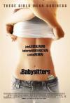

[三陪保姆](https://pewae.com/gaan/aHR0cHM6Ly9tb3ZpZS5kb3ViYW4uY29tL3N1YmplY3QvMjMwMTE0NS8=)

原名：The Babysitters导演：David Ross主演：Anthony Cirillo / Chira Cassel / Harold Fort / Jason Dubin / 保罗·鲍格才 / 劳伦·伯克尔 / 安·唐德 / 安迪·科米乌 / 斯宾塞·崔特·克拉克 / 阿丽克谢·吉尔莫类型：剧情地区：美国首映时间：2007

看题目以为是援助交际题材，其实是老鸨的养成。
女主角能力不错，全片下来太沉闷了。

[无人区](https://pewae.com/gaan/aHR0cHM6Ly9tb3ZpZS5kb3ViYW4uY29tL3N1YmplY3QvMzgwNDg5MS8=)

导演：宁浩主演：余男 / 多布杰 / 巴多 / 徐峥 / 杨新鸣 / 王双宝 / 郭虹 / 陶虹 / 黄渤 / 黄精一类型：剧情 / 犯罪 / 西部地区：大陆首映时间：2013

确实是好片，却还是不够凌厉，难以想象要是没有广电总急，该片的全貌应该如何。
徐峥乎胖乎瘦，有时出戏。
余男的下半截脸跟丁嘉丽好像啊！

[我们天上见](https://pewae.com/gaan/aHR0cHM6Ly9tb3ZpZS5kb3ViYW4uY29tL3N1YmplY3QvMzczMjgwMC8=)

导演：蒋雯丽主演：刘烨 / 姚君 / 朱一诺 / 朱旭 / 蒋雯丽 / 马思纯类型：剧情 / 家庭地区：大陆首映时间：2010

蒋雯丽很厉害，感情细腻，描写特殊时期却不见戾气只有温情。
查职员表，才知道朱旭老爷子已经过世了。
雨伞的使用有时太过刻意，也是本片唯一的缺点。

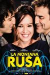

[过山车](https://pewae.com/gaan/aHR0cHM6Ly9tb3ZpZS5kb3ViYW4uY29tL3N1YmplY3QvMTA1NTI5MjAv)

原名：La montaña rusa导演：埃米利奥·马丁内斯·拉萨罗主演：Maria Lapiedra / Verónica Sánchez / 欧内斯特·艾戴里欧类型：剧情 / 喜剧 / 爱情地区：西班牙首映时间：2012

啃的西班牙生肉，要不是乳量惊人早放弃了。
女主角婊得厉害。

[看不见的女人](https://pewae.com/gaan/aHR0cHM6Ly9tb3ZpZS5kb3ViYW4uY29tL3N1YmplY3QvMzAzMDEyNjQv)

原名：A vida invisível de Eurídice Gusmão导演：卡里姆·埃诺兹主演：乌戈·克鲁兹 / 卡罗尔·杜阿尔特 / 卢安娜·泽维尔 / 塞缪尔·托莱多 / 安托尼欧·方塞卡 / 尼古拉斯·安东尼 / 弗拉维亚·古兹曼 / 朱莉娅·斯托克勒 / 格莱郭廖· 杜威维埃 / 马丽亚·曼诺埃拉类型：剧情地区：巴西首映时间：2019

巴西出品的反抗父权的电影，近些年的政治正确，多少有些刻意。
什么叫情，什么叫义，不过是自己骗自己。

[放荡青春](https://pewae.com/gaan/aHR0cHM6Ly9tb3ZpZS5kb3ViYW4uY29tL3N1YmplY3QvMzAxMzQ1NTEv)

原名：Wij导演：雷纳·埃勒主演：Aime Claeys / Laura Drosopoulo / Salome van Grunsven / 蒂伊门·戈瓦尔茨类型：剧情地区：荷兰首映时间：2018

美妙而又残酷的青春。
觉得分段描述没有必要，因为主要事件其实没多少悬念，故弄玄虚降低了评价。
荷兰的市长也太好接近了吧。

[误杀](https://pewae.com/gaan/aHR0cHM6Ly9tb3ZpZS5kb3ViYW4uY29tL3N1YmplY3QvMzAxNzYzOTMv)

导演：柯汶利主演：姜皓文 / 张熙然 / 施名帅 / 秦沛 / 肖央 / 许文姗 / 谭卓 / 边天扬 / 陈冲 / 黄健玮类型：剧情 / 悬疑 / 犯罪地区：大陆首映时间：2019

剧情很完整，前有铺垫后有转折，可能跟翻拍有关。
自从国内出台种种这不让拍那不让拍，电影里的泰国就倒了血霉。

[操蛋的永生](https://pewae.com/gaan/aHR0cHM6Ly9tb3ZpZS5kb3ViYW4uY29tL3N1YmplY3QvMzAxNjI2MDgv)

原名：Fuck You Immortality导演：费德里科·斯卡吉亚里主演：Brutius Selby / Kelly Chen / Matthew T· Reynolds / Nella Scott / Nicholas Vince / Sean James Sutton / Silvio Pollio / 乔安娜·希雅 / 比尔·哈琴斯 / 约瑟芬·斯坎迪类型：喜剧 / 奇幻 / 恐怖地区：意大利首映时间：2019

能看出来编导一直在玩梗，却水平有限。
致（chao）敬（feng）香港武侠电影那段单独拿出来还蛮有趣的。

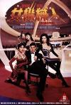

[女机械人](https://pewae.com/gaan/aHR0cHM6Ly93d3cuaW1kYi5jb20vdGl0bGUvdHQwMTAyNTYyLw==)

导演：陆剑明主演：叶子楣 / 吴大维 / 周比利 / 林聪 / 翁世杰 / 胡枫 / 许晓丹 / 青山知可子 / 鬼冢类型：动作 / 喜剧 / 犯罪地区：香港首映时间：1991

青山知可子真是有胸有样。
晃过一个镜头，令我对“叶子楣从不露点，露点必是替身”一事再次产生了怀疑，也不知这次是不是真替身。

[点指兵兵](https://pewae.com/gaan/aHR0cHM6Ly9tb3ZpZS5kb3ViYW4uY29tL3N1YmplY3QvMzAyMzE3NS8=)

导演：章国明主演：张国强 / 王钟 / 金兴贤 / 陈诗棣类型：剧情 / 犯罪地区：香港首映时间：1979

据说是港式警匪片的鼻祖，除了男猪王钟以外的角色都太死板了。
结局不落窠臼，很棒。

[四头狮子](https://pewae.com/gaan/aHR0cHM6Ly9tb3ZpZS5kb3ViYW4uY29tL3N1YmplY3QvMzM4OTU5MS8=)

原名：Four Lions导演：克里斯多夫·莫利斯主演：Kayvan Novak / Preeya Kalidas / 朱莉娅·戴维斯 / 里兹·阿迈德类型：剧情 / 喜剧地区：英国首映时间：2010

很悲惨的喜剧，四个傻冒穆斯林组织圣战，自己搞死自己的故事。
不知影片里的几个“恐怖分子”真身究竟是不是阿拉伯人，也不知他们究竟如何看待自己的信仰。

[阳光普照](https://pewae.com/gaan/aHR0cHM6Ly9tb3ZpZS5kb3ViYW4uY29tL3N1YmplY3QvMzAyOTI3Nzcv)

导演：钟孟宏主演：刘冠廷 / 吴岱凌 / 尹馨 / 巫建和 / 林志儒 / 柯淑勤 / 温贞菱 / 许光汉 / 陈以文 / 龙劭华类型：剧情 / 家庭 / 犯罪地区：台湾首映时间：2019

是那种看完以后会感慨一句“这操蛋的社会”的电影。
导演拍得很细，小细节很有滋味。
多线叙事有点玩脱。

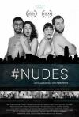

[裸爱](https://pewae.com/gaan/aHR0cHM6Ly9tb3ZpZS5kb3ViYW4uY29tL3N1YmplY3QvMzUwMTM5MzAv)

原名：Nudes导演：Guily Machovec主演：Gabriela Pimenta / Guily Machovec / Vini Hideki / Yolanda de Paulo类型：喜剧地区：巴西首映时间：2020

海报比剧情好看系列。
黑白片无必要。

[安娜·弗里茨的尸体](https://pewae.com/gaan/aHR0cHM6Ly9tb3ZpZS5kb3ViYW4uY29tL3N1YmplY3QvMjYzMzYzMTYv)

原名：El cadáver de Anna Fritz导演：埃克托·埃尔南德斯·比森斯主演：克里斯蒂安·巴伦西亚 / 蒙特塞拉特·米拉列斯 / 贝伦·法布拉 / 贝尔纳特·绍梅尔 / 阿尔瓦·里瓦斯 / 阿尔维特·卡尔沃类型：剧情 / 惊悚地区：西班牙首映时间：2015

开头有关于 Easy Girl 的话题，涉嫌如花，此方面如敏感勿看。
开局很棒，后面平平，反杀力度不够。
女主角胸不行，演裸尸勉为其难。

[真人快打传奇：蝎子的复仇](https://pewae.com/gaan/aHR0cHM6Ly9tb3ZpZS5kb3ViYW4uY29tL3N1YmplY3QvMzQ4NzU1ODgv)

原名：Mortal Kombat Legends: Scorpion's Revenge导演：伊桑·斯波尔丁主演：Grey Griffin / 乔尔·麦克哈尔 / 凯文·迈克尔·理查德森 / 詹妮弗·卡朋特类型：冒险 / 动作 / 动画地区：美国首映时间：2020

MK 这个 IP 出的电影就没能看的，这次也不例外。
人物设定过于粉丝向了，好几个人没头没尾，仔细一想，哦，原来是为了给 MK 一代的出场人物一个胶带。
出现了好几个人的终结技，好评。

[完美陌生人](https://pewae.com/gaan/aHR0cHM6Ly9tb3ZpZS5kb3ViYW4uY29tL3N1YmplY3QvMjY2MTQ4OTMv)

原名：Perfetti sconosciuti导演：保罗·杰诺维塞主演：卡夏·斯穆特尼亚克 / 安娜·福列塔 / 朱塞佩·巴蒂斯通 / 爱德华多·莱奥 / 瓦莱里奥·马斯坦德雷亚 / 阿尔芭·罗尔瓦赫尔 / 马可·贾利尼类型：剧情 / 喜剧地区：意大利首映时间：2018

表演上跟西班牙版难分伯仲，但是原版的女演员更养眼一些。
结局不如西班牙版好，都这样了还能和好？

[人类动物园](https://pewae.com/gaan/aHR0cHM6Ly9tb3ZpZS5kb3ViYW4uY29tL3N1YmplY3QvMzIxNzEyOS8=)

原名：Human Zoo导演：丽·拉丝姆森主演：Hiam Abbass / Nikola Djuricko / Rie Rasmussen类型：剧情地区：法国首映时间：2009

丹麦超模自编自导自演，题材也很冷门，关于科索沃战争的。
可能是没字幕加多线叙事的关系吧，有些乱。
Cult是足够Cult的，足够血腥暴力。

[贝尔科实验](https://pewae.com/gaan/aHR0cHM6Ly9tb3ZpZS5kb3ViYW4uY29tL3N1YmplY3QvMzAwODY5MS8=)

原名：The Belko Experiment导演：克瑞格·麦克林恩主演：乔什·布雷纳 / 大卫·达斯马齐连 / 小约翰·加拉赫 / 布伦特·塞克斯顿 / 托尼·戈德温 / 梅罗妮·迪亚兹 / 欧文·约曼 / 约翰·C·麦金雷 / 肖恩·古恩 / 阿德里娅·阿霍纳类型：动作 / 惊悚地区：美国首映时间：2016

逃杀类电影的佼佼者，缺点是男主角有些圣母。
实习生妹子死得突然，好评。
喜欢二号坏人的单纯。

[我的个神啊](https://pewae.com/gaan/aHR0cHM6Ly9tb3ZpZS5kb3ViYW4uY29tL3N1YmplY3QvMTA3NDE2NDMv)

原名：PK导演：拉吉库马尔·希拉尼主演：博曼·伊拉尼 / 安努舒卡·莎玛 / 帕里卡沙特·萨赫尼 / 桑杰·达特 / 沙鲁巴·舒克拉 / 瑞玛·德纳斯 / 苏尚特·辛格·拉吉普特 / 迪伦德拉·德维韦迪 / 阿米尔·汗 / 阿马尔迪普·杰哈类型：喜剧 / 奇幻地区：印度首映时间：2015

把现代人认为的常识一本正经地拍出来的，现在好像只有印度人还这么干了。
笑料一般，片长过长。
阿米尔汗身材真不错，他身为一位穆斯林，跟一位印度教徒私奔，后来又离婚，演这部电影还真挺讽刺。

[阴阳路3：升棺发财](https://pewae.com/gaan/aHR0cHM6Ly9tb3ZpZS5kb3ViYW4uY29tL3N1YmplY3QvMTMwMjQ5NS8=)

导演：邱礼涛主演：丁子峻 / 伍咏薇 / 古天乐 / 张锦程 / 罗兰 / 袁洁莹 / 谢天华 / 谷德昭 / 钱嘉乐 / 雷宇扬类型：喜剧 / 恐怖地区：香港首映时间：1998

好怀念恐怖喜剧的年代。
雷宇扬表现非常好，当然更棒的是短发女神袁洁莹。
三人撞鬼那场戏有些过长，有凑时间的嫌疑。

[东京之声的地图](https://pewae.com/gaan/aHR0cHM6Ly9tb3ZpZS5kb3ViYW4uY29tL3N1YmplY3QvMzAxMzYxMC8=)

原名：Mapa de los sonidos de Tokio导演：伊莎贝尔·科赛特主演：中原丈雄 / 塞尔希·洛佩斯 / 押尾学 / 榊英雄 / 田中泯 / 菊地凛子 / 菱沼康介类型：剧情 / 惊悚地区：日本 / 西班牙首映时间：2009

以华丽的女体盛做第一个镜头的电影，这辈子目前只看过两部，几分钟之后，发现当盘子的是金发大洋马，好有趣。
虽然啃的是生肉，但是掩饰不了故事狗屁不通的事实。
也就配乐值得称道了。

[狩猎（2020）](https://pewae.com/gaan/aHR0cHM6Ly9tb3ZpZS5kb3ViYW4uY29tL3N1YmplY3QvMzAxODI3MjYv)

原名：狩猎导演：克雷格·卓贝主演：伊克·巴里霍尔兹 / 埃米·马迪根 / 希拉里·斯万克 / 斯蒂芬·考特尔 / 格伦·豪尔顿 / 梅肯·布莱尔 / 特瑞·韦伯 / 艾玛·罗伯茨 / 贝蒂·吉尔平 / 贾斯汀·哈特雷类型：动作 / 惊悚地区：美国首映时间：2020

爽快的动作电影，完全不拖泥带水，尤其是人狠话不多的女主角。
各种反套路好欢乐，艾玛罗伯茨不到五分钟就领盒饭了。
最后的结局有些不爽。

[勺子杀人狂](https://pewae.com/gaan/aHR0cHM6Ly9tb3ZpZS5kb3ViYW4uY29tL3N1YmplY3QvMzg3MjI0OQ==)

原名：The Horribly Slow Murderer with the Extremely Inefficient Weapon导演：理查德·盖尔主演：Brian Rohan / Fay Kato / Melissa Paladino / Michael James Kacey / Richard Gale / 保罗·克莱门斯类型：喜剧 / 恐怖 / 短片地区：美国首映时间：2008

again and again and again……

[目击者之追凶](https://pewae.com/gaan/aHR0cHM6Ly9tb3ZpZS5kb3ViYW4uY29tL3N1YmplY3QvMTE2MDAwNzgv)

导演：程伟豪主演：卜国耕 / 庄凯勋 / 李淳 / 李铭顺 / 柯佳嬿 / 汤志伟 / 许玮甯 / 郑志伟 / 陈彦允类型：悬疑 / 惊悚 / 犯罪地区：台湾首映时间：2017

多线叙事玩得不错，有点层峦叠嶂的感觉。
演员演技全体在线，其中有个男配是李安的儿子，女配柯佳嬿有丢丢像桂纶镁。
结局太烂。

[昆宝出拳](https://pewae.com/gaan/aHR0cHM6Ly9tb3ZpZS5kb3ViYW4uY29tL3N1YmplY3QvMTMwODcxNy8=)

原名：Kung Pow: Enter the Fist导演：史蒂夫·欧德科克主演：史蒂夫·欧德科克 / 詹妮弗·董 / 龙飞类型：动作 / 喜剧地区：美国首映时间：2002

当年很火的大战奶牛短视频的出处。
屎尿屁电影。
美国人用自己的方式解读了邵氏的《虎鹤双形》，令人有“功夫电影不过如此”的喟叹。

[少林少女](https://pewae.com/gaan/aHR0cHM6Ly9tb3ZpZS5kb3ViYW4uY29tL3N1YmplY3QvMjQxNzM0Ni8=)

导演：本广克行主演：仲村亨 / 冈村隆史 / 张雨绮 / 林子聪 / 柴崎幸 / 江口洋介 / 田启文类型：动作 / 喜剧 / 运动地区：日本首映时间：2008

周星驰自己山寨自己，把功夫和少林足球抄了一遍。
柴崎幸和张雨绮根本不适合演这种片。
演这样的片子实在是辱没了江口洋介、冈村隆史、林子聪和田启文。

[订亲](https://pewae.com/gaan/aHR0cHM6Ly9tb3ZpZS5kb3ViYW4uY29tL3N1YmplY3QvMzQ4NTc5MDQ=)

导演：安建军 / 杨惠龙主演：丁嘉丽 / 何政军 / 凡妮莎·吉德 / 刘佩琦 / 曹力 / 曹雨童 / 朱丽叶·贝松 / 杜旭东 / 达娃卓玛 / 陶慧敏类型：剧情地区：大陆首映时间：2019

不知道制片方什么来头，刘佩琪、丁嘉丽、曹力、陶慧敏、杜旭东这一大帮老戏骨像完成任务一样配合男女主角拍完这部戏。
2019年拍了部1985年就该拍的片。

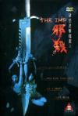

[孽欲追击档案之邪杀](https://pewae.com/gaan/aHR0cHM6Ly93d3cuaW1kYi5jb20vdGl0bGUvdHQwMTE2NjE2Lw==)

导演：黎继明主演：何家驹 / 刘的之 / 吴瑞庭 / 张璐1 / 彭丹 / 杉浦朋美 / 郑浩南 / 黄祖儿类型：恐怖地区：香港首映时间：1996

典型的三俗的没头没尾的很黄很暴力的三级片。
一位来自日本的女艺术家演得比彭丹要好很多。

[擒爱记](https://pewae.com/gaan/aHR0cHM6Ly9tb3ZpZS5kb3ViYW4uY29tL3N1YmplY3QvMTA1NTQ5NDE=)

导演：韩承桓主演：冯丹滢 / 刘恩佑 / 巩新亮 / 曾祥程 / 杨金承 / 王钧赫 / 莫小奇 / 谭卓类型：喜剧 / 爱情地区：大陆首映时间：2012

如果这是部网大，在网大里还能算质量不错的。
可惜不是。

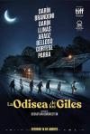

[英勇废柴](https://pewae.com/gaan/aHR0cHM6Ly9tb3ZpZS5kb3ViYW4uY29tL3N1YmplY3QvMzQ2NjM2ODgv)

原名：La odisea de los Giles导演：塞巴斯帝安·波连斯坦主演：Carlos Belloso / Daniel Aráoz / Federico Berón / Marco Antonio Caponi / 丽塔·科尔泰塞 / 奇诺·达林 / 安德烈斯·帕拉 / 维罗妮卡·利纳斯 / 路易斯·布兰多尼 / 里卡多·达林类型：冒险 / 剧情 / 喜剧地区：阿根廷首映时间：2019

主角团队不是天才，计划实施的过程状况频发，才让感觉更加真实。
据说背景是阿根廷的现状，那这个国家还真是水深火热。
片中的父子现实中也是父子，难得。

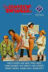

[疯狂军院俏护士](https://pewae.com/gaan/aHR0cHM6Ly9tb3ZpZS5kb3ViYW4uY29tL3N1YmplY3QvNTA1MTM4OC8=)

原名：L'infermiera nella corsia dei militari导演：Mariano Laurenti主演：Carlo Sposito / Elio Zamuto / Ermelinda De Felice / Gino Pagnani / Marcello Martana / Renato Cortesi / 保罗·朱斯蒂 / 利诺·班菲 / 卡琳·舒伯特 / 娜蒂娅·卡茜妮类型：喜剧地区：意大利首映时间：1979

没字幕。
无底线的三俗大多数段子在40年后看已经太老了。
女主角身材是极好的。

[猫汤](https://pewae.com/gaan/aHR0cHM6Ly9tb3ZpZS5kb3ViYW4uY29tL3N1YmplY3QvMTQ1NzcwNw==)

原名：ねこぢる草导演：佐藤龙雄主演：n/a类型：动画 / 奇幻 / 短片地区：日本首映时间：2001

脑洞奇大。
非常带感的日式小确丧。

[人妖阿发 痴人三部曲 1/3](https://pewae.com/gaan/aHR0cHM6Ly9tb3ZpZS5kb3ViYW4uY29tL3N1YmplY3QvMzQ5NjczNzM=)

导演：罗守耀主演：Aphirak CHAIYASIT / 林上 / 王貝兒 / 麦芷谊类型：剧情地区：香港首映时间：2020

题材很大胆，主角也很拼。
剧情棉裤腰一样。

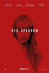

[红雀](https://pewae.com/gaan/aHR0cHM6Ly9tb3ZpZS5kb3ViYW4uY29tL3N1YmplY3QvMjU3MDQ0OTIv)

原名：Red Sparrow导演：弗朗西斯·劳伦斯主演：乔尔·埃哲顿 / 乔莉·理查德森 / 塞伦·希德 / 夏洛特·兰普林 / 斯科拉·鲁特 / 杰瑞米·艾恩斯 / 比尔·坎普 / 玛丽-露易丝·帕克 / 詹妮弗·劳伦斯 / 马提亚斯·修奈尔类型：剧情 / 悬疑 / 惊悚地区：美国首映时间：2018

乏善可陈，连黑俄罗斯都黑得没特色。
大表姐三旬未到，颜值却颠峰已过，身材也显得发糠。

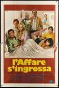

[男人想要的](https://pewae.com/gaan/aHR0cHM6Ly9tb3ZpZS5kb3ViYW4uY29tL3N1YmplY3QvNTEwNzI0Ny8=)

原名：Maschio latino cercasi导演：Giovanni Narzisi主演：Adriana Asti / Carlo Giuffrè / Dayle Haddon / Gianfranco D'Angelo / Gino Bramieri / Gloria Guida / Salvatore Funari / Stefania Casini / Vittorio Caprioli类型：喜剧地区：意大利首映时间：1977

很黄。
不暴力。
假萌假萌的。

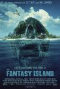

[梦幻岛](https://pewae.com/gaan/aHR0cHM6Ly9tb3ZpZS5kb3ViYW4uY29tL3N1YmplY3QvMjM2NDAwMS8=)

原名：Fantasy Island导演：杰夫·瓦德洛主演：埃文·埃瓦戈拉 / 夏洛特·麦金尼 / 帕里莎·菲兹-亨利 / 李美琪 / 波茜娅·道布尔戴 / 瑞恩·汉森 / 迈克尔·佩纳 / 迈克尔·鲁克 / 金·寇兹 / 露西·海尔类型：冒险 / 恐怖地区：美国首映时间：2020

中规中矩的片子，虽然创意有那么点意思，但编排上还是差点儿意思。
电视咖就是缺少气场。
Maggie Q显得好老好老，她只比我大一岁而已啊！

[聊斋变异](https://pewae.com/gaan/aHR0cHM6Ly9tb3ZpZS5kb3ViYW4uY29tL3N1YmplY3QvMjY5MDEyNzI=)

导演：陆宣主演：张星宇 / 徐蒙源 / 萧赫 / 萨钢云 / 谈苏阳 / 郁晓冬 / 高原 / 龚芳妮类型：剧情 / 恐怖 / 悬疑 / 惊悚地区：大陆首映时间：2016

编剧真心精妙，绕过了灵异事件的“原因”一节，拍成网大屈才了。

[不文骚](https://pewae.com/gaan/aHR0cHM6Ly93d3cuaW1kYi5jb20vdGl0bGUvdHQwMTAzODkw)

导演：陈学人主演：叶子楣 / 尹光 / 朱咪咪 / 罗冠兰 / 谷德昭 / 高志森 / 黄光亮 / 黄霑类型：喜剧地区：香港首映时间：1992

90年代霑叔债台高筑，危急时刻导演高志森跟他签了四部电影的约，黄霑感动到下跪，这是其中的第一部。
霑叔完全本色演出，气场碾压一众专业演员，却压不住叶子楣的一对波。
虽然语言比较下流，也有拿电动玩具耍梗的情况，但真的没露点，豆瓣没记录的原因很迷，猜测可能是跟最后一闪而过的文蛤海豹有关。

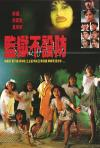

[监狱不设防](https://pewae.com/gaan/aHR0cHM6Ly9tb3ZpZS5kb3ViYW4uY29tL3N1YmplY3QvMTkxNzM4NC8=)

导演：夏秀轩主演：冯淬帆 / 叶子楣 / 夏志珍 / 李丽珍 / 玛利亚 / 穆铁柱 / 陈佩珊 / 陈洁灵类型：剧情 / 喜剧 / 恐怖地区：香港首映时间：1990

那个年代典型的大杂烩电影，什么题材火都一股脑攙进去，监狱+驱鬼+搞笑，最后不伦不类。
虽然有李丽珍和叶子楣两大艳星，但露点的另有人在（李丽珍这时还是新艺城的玉女呢）。
片尾惊现穆铁柱。

[山狗2003: 兽性陷阱](https://pewae.com/gaan/aHR0cHM6Ly9tb3ZpZS5kb3ViYW4uY29tL3N1YmplY3QvMzA5NTM3Ni8=)

导演：院志强主演：何华超 / 大迫由美 / 张碧珊 / 曾德华 / 梁焯满 / 金俊汶 / 黄榕类型：恐怖地区：香港首映时间：2003

诞生于2003年的网大，除了外聘的日本女优的乃滋一无是处。

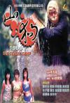

[山狗1999](https://pewae.com/gaan/aHR0cHM6Ly9tb3ZpZS5kb3ViYW4uY29tL3N1YmplY3QvMTMwNzgwNC8=)

导演：刘宝贤主演：曾德华 / 杨梵 / 林子善 / 梁敏仪 / 梁焯满 / 黄秋生 / 黎骏类型：恐怖地区：香港首映时间：1999

完全不血腥，失去了这种题材意义。

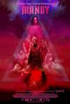

[曼蒂](https://pewae.com/gaan/aHR0cHM6Ly9tb3ZpZS5kb3ViYW4uY29tL3N1YmplY3QvMjcwNjYyMDMv)

原名：Mandy导演：帕诺斯·科斯马图斯主演：亚历克西斯·朱蒙特 / 克莱蒙·马霍内 / 兰恩·皮雷 / 奈德·丹内利 / 安德丽娅·赖斯伯勒 / 尼古拉斯·凯奇 / 欧文·弗热瑞 / 比尔·杜克 / 理查德·布雷克 / 莱纳斯·罗彻类型：动作 / 恐怖 / 犯罪地区：美国首映时间：2018

前一小时二十分讲邪教，画面红了吧唧云山雾罩，后面开始喷血浆，又黑乎乎的看不清楚。
什么狗屁凯奇的翻身之作，分是买来的吧！
本系列第一部0分非国产电影诞生！

[牯岭街少年杀人事件](https://pewae.com/gaan/aHR0cHM6Ly9tb3ZpZS5kb3ViYW4uY29tL3N1YmplY3QvMTI5MjMyOS8=)

导演：杨德昌主演：姜秀琼 / 张国柱 / 张翰 / 张震 / 杨静怡 / 林鸿铭 / 王启赞 / 王琄 / 赖梵耘 / 金燕玲类型：剧情 / 犯罪地区：台湾首映时间：1991

又除草一部名作，很细腻。
但毕竟是30年前的电影，是60年代的人们的年代故事，且背景是台湾，时空都有距离，感不同则身不受。
张震这种小孩，没被打死就是幸运的。

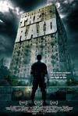

[突袭](https://pewae.com/gaan/aHR0cHM6Ly9tb3ZpZS5kb3ViYW4uY29tL3N1YmplY3QvNjc3MTUyOS8=)

原名：The Raid: Redemption导演：加雷斯·埃文斯主演：乔·塔斯利姆 / 伊科·乌艾斯 / 唐尼·阿兰西亚 / 皮埃尔 格伦特 / 维利·崔·尤里斯曼 / 雅彦·鲁伊安 / 雷·萨亥塔彼类型：动作 / 惊悚 / 犯罪地区：印度尼西亚首映时间：2011

即使在动作片的老巢香港，也拍不出这样快节奏从头打到尾的爽快动作片了！过瘾！

[死囚大逃杀2](https://pewae.com/gaan/aHR0cHM6Ly9tb3ZpZS5kb3ViYW4uY29tL3N1YmplY3QvMjY2NTk0MTAv)

原名：The Condemned 2导演：罗伊·雷内 / 贾瓦德斋月 Javad Ramezani主演：兰迪·奥尔顿 / 埃里克·罗伯茨 / 韦斯·斯塔迪类型：动作 / 惊悚 / 犯罪地区：美国首映时间：2015

除爆炸场面再无看点。
即便爆炸场面也已经看腻了啊。

[恶魔影院](https://pewae.com/gaan/aHR0cHM6Ly9tb3ZpZS5kb3ViYW4uY29tL3N1YmplY3QvMzA0MzgwNzgv)

原名：Porno导演：Keola Racela主演：Bill Phillips / Evan Daves / Jillian Mueller / Katelyn Pearce / Larry Saperstein / Peter Reznikoff / Robbie Tann类型：喜剧 / 恐怖地区：美国首映时间：2019

整体很一般，缺乏新意。
蛋蛋被打爆然后做土手术的镜头堪称名场面。

[黑帮大佬和我的365日](https://pewae.com/gaan/aHR0cHM6Ly9tb3ZpZS5kb3ViYW4uY29tL3N1YmplY3QvMzQ5NjgzMjkv)

原名：365 dni导演：托马斯·曼丁斯 / 芭芭拉·比尔拉瓦斯主演：Otar Saralidze / 娜塔莎·厄本斯卡 / 安娜·玛丽亚·西克拉克 / 布罗尼斯拉夫瓦格拉斯基 / 普热米斯瓦夫·萨多夫斯基 / 格拉日娜·沙波沃夫斯卡 / 迈克·米柯拉哈克萨克 / 迈克尔·莫罗内 / 阿格尼斯·瓦丘尔斯卡 / 马特乌斯·拉索夫斯基类型：情色地区：波兰首映时间：2020

很好的身材，莫名其妙的故事。
号称欧洲的五十度灰，确实也跟五十度灰一样无聊。
借位太假。

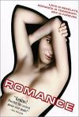

[罗曼史](https://pewae.com/gaan/aHR0cHM6Ly93d3cuaW1kYi5jb20vdGl0bGUvdHQwMTk0MzE0Lw==)

原名：Romance导演：catherine breillat主演：caroline ducey / françois berléand / sagamore stévenin类型：剧情 / 爱情地区：法国首映时间：1999

点煤气罐的时候，真是出了口恶气。

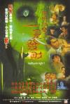

[阴阳路5：一见发财](https://pewae.com/gaan/aHR0cHM6Ly9tb3ZpZS5kb3ViYW4uY29tL3N1YmplY3QvMTI5NzUzOC8=)

导演：邱礼涛主演：关宝慧 / 古天乐 / 吴志雄 / 吴毅将 / 李蕙敏 / 罗兰 / 钱嘉乐 / 雷宇扬 / 黎耀祥类型：恐怖地区：香港首映时间：1999

电梯一幕颇为经典。
不错的电影，尤其是古天乐点火星星的时候，还蛮感人的。
吴义雄(B哥)戴假发的样子好有趣。

[阴阳路4：与鬼同行](https://pewae.com/gaan/aHR0cHM6Ly93d3cuaW1kYi5jb20vdGl0bGUvdHQwMjg5NTg2Lw==)

导演：邱礼涛主演：关宝慧 / 古天乐 / 孙佳君 / 张达明 / 汤宝如 / 洪天明 / 陈妙瑛 / 雷宇扬 / 黎耀祥类型：喜剧 / 恐怖地区：香港首映时间：1998

系列最咸湿的一部，请了好多菲律宾大波妹。
太过于cult以至于故事断片了。

[隐形人](https://pewae.com/gaan/aHR0cHM6Ly9tb3ZpZS5kb3ViYW4uY29tL3N1YmplY3QvMjM2NDA4Ni8=)

原名：The Invisible Man导演：雷·沃纳尔主演：伊丽莎白·莫斯 / 哈丽特·戴尔 / 奥利弗·杰森-科恩 / 布莱恩·米根 / 斯托姆·瑞德 / 本尼迪克·哈迪 / 瑞妮·林 / 薇薇安·格里尔 / 迈克尔·多曼 / 阿尔迪斯·霍吉类型：恐怖 / 惊悚 / 科幻地区：加拿大首映时间：2020

前半部分气氛很好，后半部分莫名其妙。
隐身衣的原理很奇怪，竟然还能压水花。

[撩乱的裸舞曲](https://pewae.com/gaan/aHR0cHM6Ly9tb3ZpZS5kb3ViYW4uY29tL3N1YmplY3QvMjY4NzI1NTAv)

原名：ジムノペディに乱れる导演：行定勋主演：冈村泉 / 板尾创路 / 芦那堇类型：情色地区：日本首映时间：2016

故事虽很奇怪却能自圆其说。
原来比西野翔演技更差的大有人在。

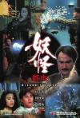

[妖怪都市](https://pewae.com/gaan/aHR0cHM6Ly9tb3ZpZS5kb3ViYW4uY29tL3N1YmplY3QvMTMwMjAzMy8=)

导演：袁祥仁主演：周比利 / 张国强 / 徐曼华 / 曹查理 / 朱咪咪 / 林正英 / 胡枫 / 袁祥仁 / 陈雅伦类型：喜剧 / 奇幻地区：香港首映时间：1992

一股纯粹的王晶味。
陈雅伦一辈子都没怎么红，莫名其妙。

[误杀瞒天记](https://pewae.com/gaan/aHR0cHM6Ly9tb3ZpZS5kb3ViYW4uY29tL3N1YmplY3QvMjY0MTk2Mzcv)

原名：Drishyam导演：尼西卡特·卡马特主演：伊西塔·杜塔 / 塔布 / 尤盖莎·索南 / 帕拉斯莫什·帕拉布 / 拉贾特·卡普尔 / 施芮娅·萨兰 / 瑞瑟·查达哈 / 皮拉桑纳·凯特卡尔 / 莫伦诺·贾达夫 / 阿贾耶·德乌干类型：剧情 / 悬疑 / 犯罪地区：印度首映时间：2015

印度片的一大缺点就是片长没短的。
女主角美得冒泡。

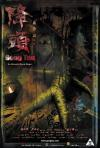

[降头](https://pewae.com/gaan/aHR0cHM6Ly9tb3ZpZS5kb3ViYW4uY29tL3N1YmplY3QvMjA1MzY2NS8=)

导演：邱礼涛主演：刘锦玲 / 古宇 / 林雪 / 滕子萱 / 许绍雄 / 邵美琪 / 郑浩南 / 黄德斌类型：恐怖地区：香港首映时间：2007

给5分虚高鼓励一下，因为纯正的港产三级片真是越来越缺稀了。
但水平确实太一般了，故事温吞水。
女主身材很棒，好像是个什么选美的冠军，演过这一部戏之后就消失了。

[追龙Ⅱ](https://pewae.com/gaan/aHR0cHM6Ly9tb3ZpZS5kb3ViYW4uY29tL3N1YmplY3QvMzAxNzUzMDYv)

导演：关智耀 / 王晶主演：任达华 / 余安安 / 古天乐 / 叶项明 / 杜江 / 林家栋 / 梁家辉 / 王敏德 / 邱意浓 / 韦家雄类型：剧情 / 动作 / 犯罪地区：香港首映时间：2019

讲个笑话：王晶的节操。
除了冗长而不合时宜的追逐戏，质量还凑合，只是这似乎不应该是梁家辉，古天乐，林家栋，任达华这种级别的演员所奉献出来的水平。
邱意浓就一网红脸，大大拉低了晶女郎的平均水平。

[火云邪神之降龙十八掌](https://pewae.com/gaan/aHR0cHM6Ly9tb3ZpZS5kb3ViYW4uY29tL3N1YmplY3QvMzUwNzMwMjU=)

导演：孙宵主演：余薇薇 / 元秋 / 恬妞 / 李俊麟 / 杨博潇 / 梁小龙 / 金迪类型：动作地区：大陆首映时间：2020

没龙标，但是特效多到吓人，对于网大来说成本有些过高了，但5分还是按网大标准给的。
元秋、田妞、梁小龙来给搭戏，香港演员真是给钱就上啊！
女反派演得还不错。

[阴阳路6：凶周刊](https://pewae.com/gaan/aHR0cHM6Ly93d3cuaW1kYi5jb20vdGl0bGUvdHQwMjUzODQx)

导演：邱礼涛主演：古天乐 / 吴志雄 / 敖志君 / 李慧敏 / 罗兰 / 陈松伶 / 雷宇扬 / 韩君婷 / 黎姿 / 黎耀祥类型：恐怖 / 神秘地区：香港首映时间：1999

故事过于太简单，单线的故事反复回闪也不如前几部穿插小故事有趣。
李蕙敏的扮相也太像杨千嬅了吧！
黎姿真是没少演女鬼啊。

[血恋](https://pewae.com/gaan/aHR0cHM6Ly93d3cuaW1kYi5jb20vdGl0bGUvdHQwMTIxODk4Lw==)

导演：李华月 / 牟敦芾主演：侯焕玲 / 李华月 / 苏B / 陈伟狄 / 陈惠兰类型：剧情 / 恐怖 / 犯罪地区：香港首映时间：1995

本片之所以是三级片，是因为香港电影没分出四级来，李华月女士演而优则制，拍片的时候就说好要打真军，以至于全香港没有男演员敢上，最后找了个素人。
片子影射了一些大陆的70年代，只是佐料，并没有什么批判的意思。
一小时零二分的镜头，堪称电影史上的名场面。

[血恋2](https://pewae.com/gaan/aHR0cHM6Ly93d3cuaW1kYi5jb20vdGl0bGUvdHQwMTIxODk5Lw==)

导演：李华月 / 石村二郎主演：何其勇 / 周文浩 / 徐锦江 / 李华月 / 钱军类型：恐怖 / 犯罪地区：香港首映时间：1995

制作水准大大降低，连打真军的噱头都没有了，借位假得要命。
徐锦江友情出演，二十分钟就领了盒饭，放在主演名单里就是挂羊头卖狗肉，尤其耻辱的是，徐先生很可能用了替身。
另一位女主演钱军其实水平颇高，就是没遇上好点子，脱是脱了不少，就是不红。

[阴阳路7：撞到正](https://pewae.com/gaan/aHR0cHM6Ly9tb3ZpZS5kb3ViYW4uY29tL3N1YmplY3QvMTQ3OTgwOS8=)

导演：南燕主演：古天乐 / 吴志雄 / 施念慈 / 李蕙敏 / 罗兰 / 罗冠兰 / 陈松伶 / 雷宇扬 / 黎耀祥类型：喜剧 / 恐怖地区：香港首映时间：2000

有古仔的正牌阴阳路刷通关，从第八部开始水平急转直下，也不知南燕监制究竟经历了什么。
第一集是古天乐当鬼，最后一集又轮到古天乐当鬼，就像个轮回。
李慧敏的那首插曲《撒旦的情人》很魔性。

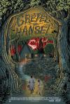

[格蕾特和韩塞尔](https://pewae.com/gaan/aHR0cHM6Ly9tb3ZpZS5kb3ViYW4uY29tL3N1YmplY3QvMzQ4MDcwNTgv)

原名：Gretel & Hansel导演：奥兹·珀金斯主演：伊安·肯尼 / 塞缪尔·利基 / 曼纽尔·庞波 / 杰西卡·德·古维 / 查尔斯·巴巴洛拉 / 索菲娅·莉莉丝 / 艾丽丝·克里奇 / 贝娅特丽克斯·帕金斯 / 阿卜杜勒·阿尔沙瑞夫类型：奇幻 / 恐怖 / 惊悚地区：加拿大首映时间：2020

看得人昏昏欲睡。
女权这玩意儿玩多了真是令人生厌。
屠龙者变龙忒俗。

[突袭2：暴徒](https://pewae.com/gaan/aHR0cHM6Ly9tb3ZpZS5kb3ViYW4uY29tL3N1YmplY3QvMTA1MzU1NjIv)

原名：The Raid 2导演：加雷斯·埃文斯主演：伊科·乌艾斯 / 北村一辉 / 唐尼·阿兰西亚 / 奥卡·安塔拉 / 朱莉·埃斯特尔 / 松田龙平 / 蒂奥·帕库苏德沃 / 远藤宪一 / 阿里芬·普特拉 / 雅彦·鲁伊安类型：剧情 / 动作 / 犯罪地区：印度尼西亚首映时间：2014

加了太多无聊的文戏，而且两个半小时太冗长了。
血暴指数还是足够的。
雅加达下雪跟六月飞雪哪个更难？

[我和我的祖国](https://pewae.com/gaan/aHR0cHM6Ly9tb3ZpZS5kb3ViYW4uY29tL3N1YmplY3QvMzI2NTk4OTAv)

导演：宁浩 / 张一白 / 徐峥 / 文牧野 / 管虎 / 薛晓路 / 陈凯歌主演：任素汐 / 刘昊然 / 吴京 / 宋佳 / 张译 / 杜江 / 王千源 / 葛优 / 韩昊霖 / 黄渤类型：剧情地区：大陆首映时间：2019

金碗盛狗矢。
情节矫情，好几段故事连基本的戏剧冲突都不存在。
点名批评张一白，白瞎了张译演那么好。

[欲望号快车](https://pewae.com/gaan/aHR0cHM6Ly9tb3ZpZS5kb3ViYW4uY29tL3N1YmplY3QvMTI5MjY4Mi8=)

原名：Crash导演：大卫·柯南伯格主演：Cheryl Swarts / Yolande Julian / 伊莱亚斯·科泰斯 / 妮基·瓜达尼 / 彼得·麦克内尔 / 朱达·卡茨 / 罗姗娜·阿奎特 / 詹姆斯·斯派德 / 霍利·亨特 / 黛博拉·卡拉·安格类型：剧情地区：加拿大首映时间：1996

阴沉且迷幻，并没有传说中那么过瘾。

[请叫我英雄](https://pewae.com/gaan/aHR0cHM6Ly9tb3ZpZS5kb3ViYW4uY29tL3N1YmplY3QvMjU4OTkzNzkv)

原名：アイアムアヒーロー导演：佐藤信介主演：冈田义德 / 吉泽悠 / 塚地武雅 / 大泉洋 / 德井优 / 有村架纯 / 槙田雄司 / 片桐仁 / 片濑那奈 / 长泽雅美类型：动作 / 恐怖地区：日本首映时间：2015

先看过影评“扛枪的高晓松”之后，对主角就不忍直视了。
长泽雅美扮相显老，拍这片的时候她还没到30呢啊。
血暴指数足够，反派自戮双目那场带劲。

[爱很烂](https://pewae.com/gaan/aHR0cHM6Ly93d3cuaW1kYi5jb20vdGl0bGUvdHQyMjI5NTkyLw==)

导演：云翔主演：周德邦 / 张馨云 / 戴于成 / 梁敏仪 / 苏梅类型：剧情地区：香港首映时间：2011

作为一名老司机，我能接受各种各样的乃子，但完全接受不了本片这么频繁的遛鸟。
片子像小学生作文一样多次点题：“sucks”。

[游](https://pewae.com/gaan/aHR0cHM6Ly9tb3ZpZS5kb3ViYW4uY29tL3N1YmplY3QvMjQyOTQ3NzMv)

导演：云翔主演：Adrian Ron Heung / Debra Baker / Jason Poon / Leni Speidel / Leon Hill / Linda So / Susan Siu / 塞巴斯蒂安·卡斯特罗 / 彭罡原 / 梁卓禧类型：剧情 / 同性 / 悬疑 / 情色地区：香港首映时间：2013

有的导演脑子里想的是狗屎；有的导演拍出来是狗屎；本作导演脑子里想的是人屎，但拍出来的还不如狗屎。
1分给每位认真表演的演员。

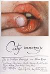

[不道德的故事](https://pewae.com/gaan/aHR0cHM6Ly93d3cuaW1kYi5jb20vdGl0bGUvdHQwMDcxMzU5Lw==)

原名：Contes immoraux导演：瓦莱利安·博罗夫奇克主演：charlotte alexandra / fabrice uchini / lise danvers类型：剧情 / 爱情地区：法国首映时间：1973

波兰导演拍的法国片。
由五个小故事组成，其中三个都跟宗教历史有关，晦涩。
第三个故事属实不错，把熊干死也算脑洞大开。

[情书](https://pewae.com/gaan/aHR0cHM6Ly9tb3ZpZS5kb3ViYW4uY29tL3N1YmplY3QvMTI5MjIyMC8=)

原名：Love Letter导演：岩井俊二主演：中山美穗 / 丰川悦司 / 光石研 / 加贺麻理子 / 柏原崇 / 田口智朗 / 篠原胜之 / 范文雀 / 酒井美纪 / 铃木庆一类型：剧情 / 爱情地区：日本首映时间：1999

可能我天生就不具备浪漫的神经，我认知中的暗恋不是这个样子的，完全get不到点。
中山美穗好美。

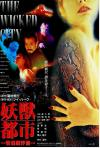

[妖兽都市](https://pewae.com/gaan/aHR0cHM6Ly9tb3ZpZS5kb3ViYW4uY29tL3N1YmplY3QvMTI5MzQ1Mi8=)

导演：麦大杰主演：仲代达矢 / 叶山丽子 / 张学友 / 张耀扬 / 李嘉欣 / 李若彤 / 袁和平 / 黎明类型：动作 / 科幻地区：香港首映时间：1992

基本可以算烂片，但能明显感觉到属于徐克的恶趣味。
李嘉欣难得地露了两次背。
黎明演技明显比不上学友哥、乌鸦哥和日本老头。

[李米的猜想](https://pewae.com/gaan/aHR0cHM6Ly9tb3ZpZS5kb3ViYW4uY29tL3N1YmplY3QvMzIzMDQ1OS8=)

导演：曹保平主演：周迅 / 张涵予 / 王宝强 / 王柠 / 王砚辉 / 胡宝安 / 董琳达 / 邓超 / 颜北类型：剧情 / 爱情 / 犯罪地区：大陆首映时间：2008

片子被剪刀手剪得乱七八糟的，却完全掩盖不了周迅的鹤立鸡群。
周迅是真的会抽烟。
曹保平几乎是国内犯罪黑色题材的良心了。

[乜代宗师](https://pewae.com/gaan/aHR0cHM6Ly9tb3ZpZS5kb3ViYW4uY29tL3N1YmplY3QvMzMzODM3MTEv)

导演：黄子华主演：刘心悠 / 周家怡 / 杨诗敏 / 泰臣 / 王菀之 / 罗天池 / 许绍雄 / 陆永 / 陈嘉佳 / 黄子华类型：剧情 / 喜剧地区：香港首映时间：2020

毫无笑点的喜剧片。
这不应该是黄子华的水平。

[欢乐时光](https://pewae.com/gaan/aHR0cHM6Ly9tb3ZpZS5kb3ViYW4uY29tL3N1YmplY3QvMjY1NTAxNzYv)

原名：ハッピーアワー导演：滨口龙介主演：三原麻衣子 / 三浦博之 / 出村弘美 / 坂庄基 / 川村莉拉 / 柴田修平 / 田中幸惠 / 申芳夫 / 菊池叶月 / 謝花喜天类型：剧情地区：日本首映时间：2015

分低不是因为不好，而是因为太长了，令人发指的五个多小时！比我小时候睡了好几觉的大决战第一部都要长一个多小时！
估计认真看完之后，就没有人想要结婚了。

[死亡录像4：启示录](https://pewae.com/gaan/aHR0cHM6Ly9tb3ZpZS5kb3ViYW4uY29tL3N1YmplY3QvNDg0NTcyMy8=)

原名：[REC] 4: Apocalypse导演：豪梅·巴拉格罗主演：Críspulo Cabezas / Mariano Venancio / 伊斯梅尔·弗里奇 / 哈维尔·博泰特 / 埃米利奥·布阿勒 / 帕科·曼萨内多 / 曼努埃拉·贝拉斯科 / 玛利亚·阿尔方萨·罗索 / 赫克特·科洛梅 / 马克·沙尔丹类型：剧情 / 恐怖 / 惊悚地区：西班牙首映时间：2014

一个被过度消费的IP，一部平平无奇的丧尸片。
女主老得真快。

[女劫](https://pewae.com/gaan/aHR0cHM6Ly9tb3ZpZS5kb3ViYW4uY29tL3N1YmplY3QvMjYzMTIxMDQv)

原名：XX导演：乔宛卡·默克维克 / 卡瑞恩·库萨马 / 圣·文森特 / 罗克珊·本杰明主演：乔纳森·沃顿 / 佩顿·肯尼迪 / 塞思·杜哈梅 / 娜塔莉·布朗 / 希拉·凡德 / 彼得·达莰哈 / 梅兰妮·林斯基 / 罗恩·利 / 萨奈·维多利亚 / 迈克尔·戴森类型：恐怖地区：加拿大首映时间：2017

四位女导演的拼盘恐怖电影，我喜欢第二个故事。
中间串场的黏土动画有点儿味道。
最后的故事又往宗教上靠了，好无聊。

[鬼夫](https://pewae.com/gaan/aHR0cHM6Ly9tb3ZpZS5kb3ViYW4uY29tL3N1YmplY3QvMjE4NzE0MDUv)

原名：พี่มากพระโขนง导演：班庄·比辛达拿刚主演：坎塔帕特·帕姆潘帕查拉苏克 / 威瓦特·康格拉斯里 / 查特朋·纳塔彭 / 肖恩·金达科特 / 邦沙敦·宗威拉克 / 马里奥·毛瑞尔 / 黛薇卡·霍内类型：喜剧 / 惊悚 / 爱情地区：泰国首映时间：2013

翻译烂透了，明明应该是鬼之夫，不知泰语究竟怎么个语法。
有那么点上世纪八十年代末九十年代初电影的古早味。
原来黑齿国就是东南亚吃槟榔的族群，长见识了。

[有希望的男人](https://pewae.com/gaan/aHR0cHM6Ly9tb3ZpZS5kb3ViYW4uY29tL3N1YmplY3QvNjg0NTUyOS8=)

原名：Muži v naději导演：伊力·维伊德雷克主演：彼得拉·赫雷比科娃 / 杰里·马哈萨克 / 波莱克·波利夫卡 / 维卡·克里克斯 / 西蒙娜·史达索娃类型：剧情 / 喜剧地区：捷克首映时间：2011

著名的用内裤扎马尾的动图的出处，女主人间凶器。
本片三观极为清新脱俗，不是正或不正能形容的。
后面有个坐过山车撒骨灰的镜头更cult。

[囧妈](https://pewae.com/gaan/aHR0cHM6Ly9tb3ZpZS5kb3ViYW4uY29tL3N1YmplY3QvMzAzMDY1NzAv)

导演：徐峥主演：宋小宝 / 徐峥 / 沈腾 / 袁泉 / 贾冰 / 郭京飞 / 高以翔 / 黄景瑜 / 黄梅莹 / 黄渤类型：喜剧地区：大陆首映时间：2020

既不够夸张，也不够写实，最关键是不搞笑。
完成度太低，后面的转折尬得要死。
因渴望而享誉全国的全民恶大姑姐没能凭本片翻身，估计以后也没机会了。

[魔偶奇谭：至小帝国](https://pewae.com/gaan/aHR0cHM6Ly9tb3ZpZS5kb3ViYW4uY29tL3N1YmplY3QvMjY3OTEwNzAv)

原名：Puppet Master: The Littlest Reich导演：Sonny Laguna / Tommy Wiklund主演：Alex Beh / Skeeta Jenkins / 乌多·基尔 / 内尔森·富兰克林 / 托马斯·列农 / 查琳·易 / 珍妮·佩利塞尔 / 芭芭拉·克兰普顿 / 迈克尔·帕尔 / 马蒂亚斯·休斯类型：喜剧 / 恐怖地区：英国首映时间：2018

血腥程度是够了，剧情就是一坨屎。

[少女潘金莲](https://pewae.com/gaan/aHR0cHM6Ly93d3cuaW1kYi5jb20vdGl0bGUvdHQwMDExMTE1NA==)

导演：李翰祥主演：单立文 / 甘海 / 田隽 / 黄美贞类型：剧情地区：香港首映时间：1994

李翰祥把一部1994年的片子拍出了1974年的感觉，真他娘是个人才。
单立文同学是不是保持着演西门庆次数的吉尼斯世界纪录？

[甜蜜皮鞭](https://pewae.com/gaan/aHR0cHM6Ly93d3cuaW1kYi5jb20vdGl0bGUvdHQyNDc0OTA2Lw==)

原名：甘い鞭导演：石井隆主演：坛蜜 / 间宫夕贵类型：神秘地区：日本首映时间：2013

坛蜜和间宫夕贵的身材都很棒。
跟日本的SM片片一比，五十度灰就是渣。

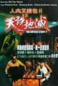

[人肉叉烧包2](https://pewae.com/gaan/aHR0cHM6Ly93d3cuaW1kYi5jb20vdGl0bGUvdHQwMTg2NjU4Lw==)

导演：吴耀权主演：孙佳君 / 张锦程 / 杨梵 / 石少麟 / 罗兰 / 陆剑明 / 黄秋生 / 黄美娟 / 黄美芬 / 黄锦燊类型：恐怖 / 犯罪地区：香港首映时间：1998

跟人肉1完全不是一个风格，也算是不错的三级片了。
黄sir演完变态演警察，利用了反差萌。
张锦程是好演员。

[火口的两人](https://pewae.com/gaan/aHR0cHM6Ly9tb3ZpZS5kb3ViYW4uY29tL3N1YmplY3QvMzA0MDUwODcv)

原名：火口のふたり导演：荒井晴彦主演：柄本佑 / 柄本明 / 泷内公美类型：情色 / 爱情地区：日本首映时间：2019

从头干到尾，没看出什么内涵，只看出女主角身材蛮好的。
男主的行为放在国内可不是偷情这么简单，得叫破坏军婚罪。

[偷神家族](https://pewae.com/gaan/aHR0cHM6Ly9tb3ZpZS5kb3ViYW4uY29tL3N1YmplY3QvMTMwMDg4Ni8=)

导演：王振仰主演：元华 / 卢大伟 / 周弘 / 大岛由加利 / 李赛凤 / 胡慧中 / 胡枫 / 袁祥仁 / 黄一山 / 黄光亮类型：喜剧地区：香港首映时间：1992

汇集了大批打女的烂片。
除了大反派元华，演得都是坨屎。

[光荣的愤怒](https://pewae.com/gaan/aHR0cHM6Ly9tb3ZpZS5kb3ViYW4uY29tL3N1YmplY3QvMTkyMDYyMC8=)

导演：曹保平主演：吴刚 / 孔庆三 / 朱义 / 李小川 / 李昌元 / 李晓波 / 王树军 / 王砚辉 / 蒲小虎 / 贺云庆类型：剧情地区：大陆首映时间：2006

“我是党员，我觉悟很高的”～然后这人就把主角给卖了。
高潮部分充分展示了农民革命的随性，结局太糟糕。
曹保平从编剧转导演的处女作，为了过审进行了大量的改动，但还是觉得曹先生上面有人，不然怎么能拍那么多现实题材？

[豪情](https://pewae.com/gaan/aHR0cHM6Ly93d3cuaW1kYi5jb20vdGl0bGUvdHQwMzg1NzU0Lw==)

导演：林超贤 / 陈庆嘉主演：何超仪 / 何韵诗 / 刘以达 / 古天乐 / 周丽淇 / 应采儿 / 李修贤 / 田启文 / 谷祖琳 / 陈奕迅类型：剧情 / 喜剧地区：香港首映时间：2003

多年前看的《3D豪情》竟然是个续集，这部是原传。
造型师太敷衍了，里面几个女角色发型服饰完全分不开，失败。
我所见过的何超仪演得最好的一部电影，虽然她只是个配角。

[妖猫传](https://pewae.com/gaan/aHR0cHM6Ly9tb3ZpZS5kb3ViYW4uY29tL3N1YmplY3QvNTM1MDAyNy8=)

导演：陈凯歌主演：刘昊然 / 张榕容 / 张雨绮 / 张鲁一 / 染谷将太 / 欧豪 / 田雨 / 秦昊 / 阿部宽 / 黄轩类型：剧情 / 古装 / 奇幻 / 悬疑地区：大陆首映时间：2017

陈大导演讲故事的水平还是那么不敢恭维，剪辑就像是道边雇来的临时工。
故事很好。
如果是我，会直接砍掉阿部宽那条支线。

[好久不见，武汉](https://pewae.com/gaan/aHR0cHM6Ly9tb3ZpZS5kb3ViYW4uY29tL3N1YmplY3QvMzUxMjEzMDc=)

导演：竹内亮类型：纪录地区：大陆 / 日本首映时间：2020

导演是个中国通，也很会聊天。
像极了多年前“讲述老百姓自己的故事”的《生活空间》的调子。

[复仇者之死](https://pewae.com/gaan/aHR0cHM6Ly93d3cuaW1kYi5jb20vdGl0bGUvdHQxNzc4MjU4Lw==)

导演：黄精甫主演：何超仪 / 刘永 / 苍井空 / 钱小豪 / 麦浚龙类型：惊悚 / 犯罪 / 神秘地区：香港首映时间：2010

我给出了苍井空老师参演电影的最高分数。
剧本有力而残忍，却毁于多线叙事。

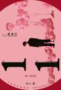

[一一](https://pewae.com/gaan/aHR0cHM6Ly9tb3ZpZS5kb3ViYW4uY29tL3N1YmplY3QvMTI5MjQzNC8=)

导演：杨德昌主演：吴念真 / 尾形一成 / 张洋洋 / 李凯莉 / 林孟瑾 / 柯宇纶 / 萧淑慎 / 金燕玲 / 陈以文 / 陈希圣类型：剧情 / 家庭 / 爱情地区：台湾首映时间：2017

无愧于名作二字。
每个人都想逃离却又无法逃脱的生活。

[香港奸杀奇案](https://pewae.com/gaan/aHR0cHM6Ly93d3cuaW1kYi5jb20vdGl0bGUvdHQwMzQ1OTY4Lw==)

导演：郑建平主演：叶玉萍 / 吴健保 / 吴瑞廷 / 嘉玲 / 李莉莉 / 林敬刚 / 洪峰 / 谷峰 / 连伟健类型：剧情 / 惊悚 / 犯罪地区：香港首映时间：1992

刨去无聊的激情镜头，对主角犯罪的心理刻画其实很到位。
分低是因为献身的女艺术家比较丑。

[盗梦特攻队](https://pewae.com/gaan/aHR0cHM6Ly9tb3ZpZS5kb3ViYW4uY29tL3N1YmplY3QvMzAyNzIxNDMv)

原名：Ruben Brandt, a gyujto导演：米洛拉德·科斯蒂奇主演：乔鲍·马顿 / 亨利‧格兰特 / 伊万·卡马拉斯 / 佐兰·马克兰兹 / 保罗‧贝兰托尼 / 加布里瑞拉·哈默里 / 卡塔琳‧东比 / 彼得·林卡 / 马泰‧梅萨罗什 / 马特·戴维尔类型：动画 / 犯罪地区：匈牙利首映时间：2018

艺术修养不够，没看懂，还不敢给低分。

[学校风云](https://pewae.com/gaan/aHR0cHM6Ly9tb3ZpZS5kb3ViYW4uY29tL3N1YmplY3QvMTQ2ODU0Ny8=)

导演：林岭东主演：何家驹 / 何沛东 / 刘松仁 / 张耀扬 / 李丽蕊 / 林正英 / 袁洁莹 / 郑雷 / 黄光亮类型：剧情 / 动作 / 惊悚 / 犯罪地区：香港首映时间：1988

粗砺、激愤、热血而残酷的青春，看完之后荷尔蒙荡漾。
小时候真不知道，龙虎风云、监狱风云其实是三部曲，最后的学校风云因为没有周润发和梁家辉这样的顶级大牌压着，反而每个演员都迸发出了前所未有的能量——袁洁莹、李丽蕊、张耀扬、刘松仁、林正英、何佩东、霍瑞华、韩坤都很在状态。
本片也是张耀扬“潇洒哥”诨号的出处。

[香港奇案之强奸](https://pewae.com/gaan/aHR0cHM6Ly93d3cuaW1kYi5jb20vdGl0bGUvdHQwMDEwODYwOS8=)

导演：刘伟强主演：任达华 / 叶先儿 / 吴雪雯 / 夏萍 / 张家辉 / 李兆基 / 苑琼丹 / 邱淑贞 / 郑浩南 / 陈国新类型：惊悚 / 犯罪地区：香港首映时间：1993

王晶监制，故意把名字往三俗了整，其实是个讨论完美犯罪的好主题。
郑浩南好变态，邱淑贞的艳舞好美。
利用艾滋女进行报复，放到现在太不政治正确了。

[南洋十大邪术](https://pewae.com/gaan/aHR0cHM6Ly93d3cuaW1kYi5jb20vdGl0bGUvdHQwMTEzOTI4Lw==)

导演：钱文锜主演：吴毅将 / 吴瑞庭 / 徐锦江 / 李华月 / 欧阳震华 / 苑琼丹 / 钟淑慧 / 钱军 / 陈雅伦类型：喜剧 / 奇幻 / 恐怖地区：香港首映时间：1995

很一般的三级片，抄袭王晶。
陈雅伦原来真的露过，之前以为她是脱而不露那一卦的，不过仍旧有用替身的可能。
欧阳震华出来就死了，相当搞笑。

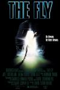

[变蝇人](https://pewae.com/gaan/aHR0cHM6Ly9tb3ZpZS5kb3ViYW4uY29tL3N1YmplY3QvMTI5MzA3My8=)

原名：The Fly导演：大卫·柯南伯格主演：乔·波希尔 / 吉娜·戴维斯 / 大卫·柯南伯格 / 杰夫·高布伦 / 约翰·盖兹 / 莱斯利·卡尔森类型：恐怖 / 科幻地区：美国首映时间：1986

大卫柯南伯格的代表作品之一，小成本硬科幻，1986年能做出这样的化妆非常厉害！
没觉得恶心。
女主角是“末路狂花”那位，身上自带婊气。

[奸人世家](https://pewae.com/gaan/aHR0cHM6Ly9tb3ZpZS5kb3ViYW4uY29tL3N1YmplY3QvMTMwMjM1Ni8=)

导演：林庆隆主演：何家驹 / 成奎安 / 沈威 / 玛利亚 / 石坚 / 胡枫 / 陈惠敏 / 黄一飞 / 黄子扬 / 龙方类型：动作地区：香港首映时间：1994

片如其名，汇集了石坚、成奎安、陈惠敏、李兆基、黄子扬、何家驹、龙方等一众坏蛋专业户，硬凑出的一部喜剧片。
太过刻意，说教意味很浓。
诸位恶人之中，除了胡枫陈惠敏黄子扬以外，均已故去，可见这坏人们也不长命啊！

[忠义群英](https://pewae.com/gaan/aHR0cHM6Ly9tb3ZpZS5kb3ViYW4uY29tL3N1YmplY3QvMTMwNTIzMC8=)

导演：唐基明主演：午马 / 叶晨 / 张学友 / 成奎安 / 林国斌 / 梁朝伟 / 罗烈 / 莫少聪 / 郑少秋 / 郭追类型：剧情 / 动作 / 犯罪地区：香港首映时间：1989

港版《七武士》，阵容闪瞎人眼睛。
实际上生硬刻板，是地地道道的烂片。

[进击的巨人：编年史](https://pewae.com/gaan/aHR0cHM6Ly9tb3ZpZS5kb3ViYW4uY29tL3N1YmplY3QvMzUwODg1Njkv)

原名：编年史 進撃の巨人 〜クロニクル〜导演：荒木哲郎主演：三上枝织 / 下野纮 / 井上麻里奈 / 小林优 / 桥诘知久 / 梶裕贵 / 石川由依 / 细谷佳正 / 藤田咲 / 谷山纪章类型：动画地区：日本首映时间：2020

可能是因为前面的故事太多，叙事特散，感觉就像一部超长的预告片。

[羞耻](https://pewae.com/gaan/aHR0cHM6Ly9tb3ZpZS5kb3ViYW4uY29tL3N1YmplY3QvNTM2MDg5MC8=)

原名：Shame导演：史蒂夫·麦奎因主演：亚历克斯·马内塔 / 伊丽莎白·马苏茨 / 凯瑞·穆里根 / 妮可·贝哈瑞 / 汉娜·韦尔 / 玛丽-安格·拉米雷斯 / 玛尔塔·米兰斯 / 詹姆斯·戴尔 / 迈克尔·法斯宾德 / 露西·沃特斯类型：剧情 / 情色地区：英国首映时间：2011

想上又不敢上的人最寂寞。
还以为会是德国骨科片。
主演里有位黑人，难道BLM十年前就已经蔓延到大英帝国了么？

[花木兰](https://pewae.com/gaan/aHR0cHM6Ly9tb3ZpZS5kb3ViYW4uY29tL3N1YmplY3QvMjYzNTczMDcv)

原名：Mulan导演：妮琪·卡罗主演：刘亦菲 / 安柚鑫 / 巩俐 / 李截 / 李连杰 / 温明娜 / 甄子丹 / 赵家玲 / 郑佩佩 / 马泰类型：冒险 / 动作 / 古装地区：美国首映时间：2020

拧巴，要是想搞幻想风格，就再搞酷炫一些，要想写实，就应该在军阵战争上多下功夫，成片这不上不下的鬼样子，是因为请不起群演么？
连几句台词的特约，在表情管理方面都能碾压女主角。

[人工性智能](https://pewae.com/gaan/aHR0cHM6Ly9tb3ZpZS5kb3ViYW4uY29tL3N1YmplY3QvMzAxNDk4NjQv)

原名：A.I. Rising导演：拉扎尔·博德罗扎主演：塞巴斯蒂安·卡瓦扎 / 斯托雅 / 玛鲁萨·马杰尔 / 科斯蒂·贝斯特曼类型：剧情 / 爱情 / 科幻地区：塞尔维亚首映时间：2018

女主身材很好。
科幻部分故弄玄虚。

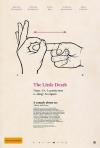

[爱的那点性事](https://pewae.com/gaan/aHR0cHM6Ly9tb3ZpZS5kb3ViYW4uY29tL3N1YmplY3QvMjU5NDcxNTQv)

原名：The Little Death导演：约什·劳森主演：Alan Dukes / TJ·鲍尔 / 丽萨·麦坤 / 凯特·波克斯 / 凯特·马尔瓦尼 / 博亚娜·诺瓦科维奇 / 尔琳·詹姆斯 / 帕特里克·布拉莫尔 / 约什·劳森 / 达蒙·海瑞曼类型：喜剧 / 爱情地区：澳大利亚首映时间：2014

题材不新鲜，角度比较独特。
澳洲女主们身材都挺壮硕的。

[女子大乱斗](https://pewae.com/gaan/aHR0cHM6Ly9tb3ZpZS5kb3ViYW4uY29tL3N1YmplY3QvMzE1MTM4OC8=)

原名：Bitch Slap导演：Rick Jacobson主演：Erin Cummings / 朗·迈伦德兹 / 朱莉娅·沃斯 / 迈克尔·赫斯特 / 阿美莉嘉·奥利沃类型：剧情 / 动作 / 喜剧 / 惊悚 / 犯罪地区：美国首映时间：2009

三位女主这么假的奶都不肯露一下，太令人失望了。
以B级片的标准来评判，最大的问题就是不够爽，动作场面雷同点太多。

[布达佩斯大饭店](https://pewae.com/gaan/aHR0cHM6Ly9tb3ZpZS5kb3ViYW4uY29tL3N1YmplY3QvMTE1MjU2NzMv)

原名：The Grand Budapest Hotel导演：韦斯·安德森主演：威廉·达福 / 托尼·雷沃罗利 / 拉尔夫·费因斯 / 比尔·默瑞 / 爱德华·诺顿 / 艾德里安·布洛迪 / 蒂尔达·斯文顿 / 蕾雅·赛杜 / 裘德·洛 / 西尔莎·罗南类型：冒险 / 剧情 / 喜剧地区：美国首映时间：2014

精致而已。
越狱的部分有节奏上的快感。
#不感冒的高分电影+1

[银蛇谋杀案](https://pewae.com/gaan/aHR0cHM6Ly9tb3ZpZS5kb3ViYW4uY29tL3N1YmplY3QvMTkxOTIzMA==)

导演：李少红主演：张京生 / 李勤勤 / 贾宏声 / 韩廷琦类型：惊悚地区：大陆首映时间：1988

如此cult的片子，竟然是李少红大师导的。
贾宏声年轻的时候真是神仙颜值。

[群龙夺宝](https://pewae.com/gaan/aHR0cHM6Ly9tb3ZpZS5kb3ViYW4uY29tL3N1YmplY3QvMTI5NzM5NQ==)

导演：袁振洋主演：元奎 / 关之琳 / 刘德华 / 午马 / 叶荣祖 / 徐少强 / 林忆莲 / 泰迪·罗宾 / 谢宁 / 钱嘉乐类型：剧情 / 动作地区：香港首映时间：1988

骗中骗的结构，节奏很快，动作戏也不错，就是赌术的部分有些多且儿戏了。
徐少强也蛮帅的嘛。

[报告老师！怪怪怪怪物！](https://pewae.com/gaan/aHR0cHM6Ly9tb3ZpZS5kb3ViYW4uY29tL3N1YmplY3QvMjY3MjA2Mjcv)

导演：九把刀主演：乾德门 / 刘奕儿 / 林姵妡 / 梁洳瑄 / 禾浩辰 / 蔡凡熙 / 赖浚程 / 邓育凯 / 陈珮骐 / 陶柏萌类型：剧情 / 恐怖地区：台湾首映时间：2017

表面上是丧尸片，实际说的却是校园凌霸的事。
坏学生和女坏学生的塑造都很到位，男主角稍弱。
迄今为止看过最好的华语B级片。

[烈日灼心](https://pewae.com/gaan/aHR0cHM6Ly9tb3ZpZS5kb3ViYW4uY29tL3N1YmplY3QvMjQ3MTkwNjMv)

导演：曹保平主演：吕颂贤 / 杜志国 / 段奕宏 / 王珞丹 / 白柳汐 / 邓超 / 郭涛 / 高虎类型：剧情 / 悬疑 / 犯罪地区：大陆首映时间：2015

邓超和段奕宏都发挥得很棒。
可惜永远看不到高虎戏份没被删减的版本了。

[极度兽性](https://pewae.com/gaan/aHR0cHM6Ly93d3cuaW1kYi5jb20vdGl0bGUvdHQwMTU5NDMx)

导演：朱伟光主演：吴家丽 / 彭丹 / 林保怡 / 翁世杰 / 钟秀贤 / 麦长青类型：惊悚 / 神秘地区：香港首映时间：1996

林保怡和吴家丽这对老搭档联袂出演的三级片。
吴家丽和彭丹应该都是用了替身。

[群星会](https://pewae.com/gaan/aHR0cHM6Ly9tb3ZpZS5kb3ViYW4uY29tL3N1YmplY3QvMTQ2MTA2OC8=)

导演：李力持主演：万梓良 / 何婉盈 / 关礼杰 / 刘德华 / 吴孟达 / 周星驰 / 夏雨 / 温兆伦 / 郑少秋 / 陈玉莲类型：剧情 / 喜剧 / 奇幻地区：香港首映时间：1992

穿越集合，如果没看过无线的那几部“名作”的话，根本不知道玩的什么梗，也就没那么好笑了。
秋官当年俨然是总瓢把子范儿！

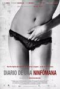

[性瘾日记](https://pewae.com/gaan/aHR0cHM6Ly93d3cuaW1kYi5jb20vdGl0bGUvdHQxMTExODkwLw==)

原名：Diary of a Nymphomaniac导演：christian molina主演：belén fabra / leonardo sbaraglia / llum barrera类型：剧情 / 爱情地区：西班牙首映时间：2008

见过平胸的，没见过毛这么长的。
又一个被残疾人感化的妓女。
结局强行拔高，失败。

[辣手保姆](https://pewae.com/gaan/aHR0cHM6Ly9tb3ZpZS5kb3ViYW4uY29tL3N1YmplY3QvMjY3MDQ2MjEv)

原名：The Babysitter导演：约瑟夫·麦克金提·尼彻主演：安德鲁·巴切勒 / 汉娜·梅·李 / 犹大·刘易斯 / 罗比·阿梅尔 / 肯·马里诺 / 艾米丽·阿琳·林德 / 莱丝莉·比伯 / 萨玛拉·维文 / 贝拉·索恩 / 道格·海利类型：喜剧 / 恐怖地区：美国首映时间：2017

萨马拉维文俨然是新一代的Cult片女王啊。
21世纪加料版的小鬼当家。
不带脑子看的话，效果还不错。

[地久天长](https://pewae.com/gaan/aHR0cHM6Ly9tb3ZpZS5kb3ViYW4uY29tL3N1YmplY3QvMjY3MTU2MzYv)

导演：王小帅主演：咏梅 / 徐程 / 李菁菁 / 杜江 / 王景春 / 王源 / 艾丽娅 / 赵燕国彰 / 齐溪类型：剧情 / 家庭地区：大陆首映时间：2019

悲伤的故事。
没觉得有多娓娓道来，剪辑师是不称职的，即使不能剪到一个半小时以内，两个小时也应该是能做到的，现在的三个小时时长真是太夸张了。
最喜欢外遇未遂那part。

[美丽的图画](https://pewae.com/gaan/aHR0cHM6Ly9tb3ZpZS5kb3ViYW4uY29tL3N1YmplY3QvMjcxMTEwNjMv)

原名：Picture of Beauty导演：Maxim Ford主演：Amer Riad El Muafy / Danielle Rose / Elen Moore / Ernestyna Winnicka / Frantisek Smejkal / Joanna Mazewska / Joanna Sobocinska / Magdalena Bochan-Jachimek / Pawel Hajnos / 泰勒·桑德类型：剧情 / 同性 / 情色地区：英国首映时间：2017

毫无故事性。

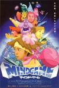

[心理游戏](https://pewae.com/gaan/aHR0cHM6Ly9tb3ZpZS5kb3ViYW4uY29tL3N1YmplY3QvMTQ3NzkxNi8=)

原名：マインド・ゲーム导演：汤浅政明主演：Joji Shimaki / Kenichi Chujou / Sayaka Maeda / Seiko Takuma / Toshio Sakata / 今田耕司 / 山口智充 / 藤井隆 / 西凛太郎类型：冒险 / 动画 / 喜剧 / 悬疑地区：日本首映时间：2004

我所看过的最迷幻最接近梦境的电影。
虽然我没磕过药，但是我觉得磕了药就是这样的感觉。
音乐也很棒。

[辣手保姆2：女王蜂](https://pewae.com/gaan/aHR0cHM6Ly9tb3ZpZS5kb3ViYW4uY29tL3N1YmplY3QvMzQ5Mzg2NTAv)

原名：The Babysitter: Killer Queen导演：约瑟夫·麦克金提·尼彻主演：安德鲁·巴切勒 / 汉娜·梅·李 / 犹大·刘易斯 / 珍娜·奥尔特加 / 罗比·阿梅尔 / 肯·马里诺 / 艾米丽·阿琳·林德 / 莱丝莉·比伯 / 贝拉·索恩 / 阿曼達·瑟妮类型：喜剧 / 恐怖地区：美国首映时间：2020

强行出续集，强行黑化，强行洗白。
又是常见的美式花样死人秀，但是死得没特点。
洋妞真是厉害，第一部的小女孩三年不到就变得那么雄伟了。

[极恶非道](https://pewae.com/gaan/aHR0cHM6Ly9tb3ZpZS5kb3ViYW4uY29tL3N1YmplY3QvMzgxOTkzOS8=)

原名：アウトレイジ导演：北野武主演：三浦诚己 / 加濑亮 / 北村总一朗 / 北野武 / 坂田聪 / 小日向文世 / 柄本时生 / 椎名桔平 / 江藤淳 / 野中隆光类型：动作 / 犯罪地区：日本首映时间：2010

黑社会该有的样子。
北野武也太喜欢剁手指了吧！！

[夺冠](https://pewae.com/gaan/aHR0cHM6Ly9tb3ZpZS5kb3ViYW4uY29tL3N1YmplY3QvMzAxMjg5MTYv)

导演：陈可辛主演：吴刚 / 姚迪 / 巩俐 / 张常宁 / 彭昱畅 / 徐云丽 / 朱婷 / 林莉 / 白浪 / 黄渤类型：剧情 / 运动地区：大陆首映时间：2020

郎平以及现役女排的圈钱之作，恰好赶上好时候，假如今年东京奥运会没取消而女排没夺冠，她们能被骂死。
传记类，尤其是活人或者有后人的传记片真是不好拍，张蓉芳、陈招娣、赵蕊蕊、冯坤、陈忠和们不配有名字吗？
宋世雄老爷子都80岁了，不仅不复当年的激情，连力气都不足了，失败。

[邪不压正](https://pewae.com/gaan/aHR0cHM6Ly9tb3ZpZS5kb3ViYW4uY29tL3N1YmplY3QvMjYzNjY0OTYv)

导演：姜文主演：丁嘉丽 / 史航 / 周韵 / 姜文 / 安地 / 廖凡 / 彭于晏 / 李梦 / 泽田谦也 / 许晴类型：剧情 / 动作 / 喜剧地区：大陆首映时间：2018

姜文电影的节奏真是令人痴迷。
周韵实在是风情万种。
彭于晏是败笔，可能是现在肌肉男类型的演员太少了吧。

[杀戮都市](https://pewae.com/gaan/aHR0cHM6Ly9tb3ZpZS5kb3ViYW4uY29tL3N1YmplY3QvNDA3OTExNy8=)

原名：Gantz导演：佐藤信介主演：二宫和也 / 伊藤步 / 千阪健介 / 吉高由里子 / 夏菜 / 本乡奏多 / 松山研一 / 水泽奈子 / 田口智朗 / 白石隼也类型：动作 / 科幻地区：日本首映时间：2010

血量和奶量与原著严重不符。

[军鸡](https://pewae.com/gaan/aHR0cHM6Ly93d3cuaW1kYi5jb20vdGl0bGUvdHQxMDI5MjM4)

导演：郑宝瑞主演：余文乐 / 刘心悠 / 吴镇宇 / 梁小龙 / 郭品超类型：动作地区：香港首映时间：2007

不带劲。
余文乐固然拼命，到头来白费力气。

[后会有期](https://pewae.com/gaan/aHR0cHM6Ly9tb3ZpZS5kb3ViYW4uY29tL3N1YmplY3QvMzA0MzQ5MDIv)

原名：Come As You Are导演：Richard Wong主演：Daisye Tutor / Delaney Feener / Jennifer Jelsema / Kari Perdue / 加布蕾·丝迪贝 / 司徒颂曦 / 拉维·帕特尔 / 李升熙 / 格兰特·罗森梅耶 / 詹妮安·加罗法洛类型：喜剧地区：美国首映时间：2019

别出心裁的残疾人主题的公路片，主角团队一位亚裔一位印度裔一位黑人，政治上非常正确。
瘸子指挥瞎子开车虽然是老梗，但真的挺有笑点的。

[安全邻域](https://pewae.com/gaan/aHR0cHM6Ly9tb3ZpZS5kb3ViYW4uY29tL3N1YmplY3QvMjY3MzEyMzgv)

原名：Better Watch Out导演：克里斯·佩寇维主演：亚历克斯·米基克 / 塔拉·杰德·博格 / 奥利维亚·德容格 / 崔西娅·玛丽·亨尼西 / 布伦丹·克莱金 / 帕特里克·沃伯顿 / 戴克·蒙哥马利 / 维吉妮娅·马德森 / 艾德·奥克森博尔德 / 莱维·米勒类型：喜剧 / 恐怖地区：美国首映时间：2016

以熊孩子都该死为题材的电影总是令人开心。
含血量不足。

[大骚乱](https://pewae.com/gaan/aHR0cHM6Ly9tb3ZpZS5kb3ViYW4uY29tL3N1YmplY3QvMjY3OTgwMzIv)

原名：Mayhem导演：乔·林奇主演：克莱尔·德拉马尔 / 凯瑞·福克斯 / 卡罗琳·奇克泽 / 史蒂文·元 / 史蒂文·布兰德 / 安德烈·埃里克森 / 尼古拉·肯特 / 萨玛拉·维文 / 达拉斯·罗伯特斯 / 马克·福斯特类型：动作 / 恐怖地区：美国首映时间：2017

开始还有点意思，后来就无聊了。
动作设计太单调。

[瑞士军刀男](https://pewae.com/gaan/aHR0cHM6Ly9tb3ZpZS5kb3ViYW4uY29tL3N1YmplY3QvMjY0MzcyMzcv)

原名：Swiss Army Man导演：丹·关 / 丹尼尔·施纳特主演：丹尼尔·雷德克里夫 / 保罗·达诺 / 玛丽·伊丽莎白·温斯特德 / 玛丽卡·卡斯蒂尔 / 理查德·格罗斯 / 蒂莫西·尤里齐类型：冒险 / 喜剧 / 奇幻地区：美国首映时间：2016

一事无成的失败者的故事。
深刻但无聊。
哈利波特演僵尸，不知算不算突破。

[芋虫](https://pewae.com/gaan/aHR0cHM6Ly9tb3ZpZS5kb3ViYW4uY29tL3N1YmplY3QvNDAzNjM2Ny8=)

原名：キャタピラー导演：若松孝二主演：井浦新 / 地曳豪 / 大西信满 / 寺岛忍 / 小仓一郎 / 河原萨布 / 石川真希 / 粕谷佳五 / 饭岛大介类型：剧情地区：日本首映时间：2010

政治上太正确了，太想拿奖了，刻板。
片头出staff，片尾定版放歌的设定很少见。
男主角投水的场面还算有趣。

[郎心如铁](https://pewae.com/gaan/aHR0cHM6Ly9tb3ZpZS5kb3ViYW4uY29tL3N1YmplY3QvMTMwMzg0NS8=)

导演：霍耀良主演：吴家丽 / 李丽珍 / 白石千 / 罗慧娟 / 陈国新 / 黄锦燊类型：剧情 / 惊悚 / 犯罪地区：香港首映时间：1993

男女主角以及女配李丽珍表演都很好，但是情节的安排比较糟糕。
作为cult片来衡量不够过瘾。

[油鬼子](https://pewae.com/gaan/aHR0cHM6Ly9tb3ZpZS5kb3ViYW4uY29tL3N1YmplY3QvMTMwNDUxMC8=)

导演：何梦华主演：李丽丽 / 李修贤 / 陈萍类型：恐怖地区：香港首映时间：1976

抛开拙劣的五分钱特效来看，剧情虽然无聊但完整，设定也挺合理的。
那时的香港电影还没分级，所以本片有花式秀奶的感觉，而且主演竟然是李修贤大哥。
动作设计拙劣了些。

[死亡阴影](https://pewae.com/gaan/aHR0cHM6Ly9tb3ZpZS5kb3ViYW4uY29tL3N1YmplY3QvMjk3Nzk1Ni8=)

原名：Bereavement导演：斯蒂文·梅纳主演：亚历珊德拉·达达里奥 / 佩顿·李斯特 / 凯瑟琳·迈瑟尔 / 布雷特·里克比 / 斯宾塞·李斯特 / 瓦伦蒂娜·德·安吉丽斯 / 约翰·萨维奇 / 诺兰·杰拉德·冯克 / 迈克尔·比恩类型：恐怖 / 惊悚 / 犯罪地区：美国首映时间：2010

小屁孩不是好东西again。
作为达达里奥的球迷，只给我看凸点是不能满足的。
故事神神叨叨的，而且尖叫太多动作太少，差评。

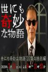

[世界奇妙物语 2020夏季特别篇](https://pewae.com/gaan/aHR0cHM6Ly9tb3ZpZS5kb3ViYW4uY29tL3N1YmplY3QvMzUxMjk4NjI=)

原名：世界奇妙物语 2020夏之特别篇 / 世界奇妙物语 20夏特别篇导演：植田泰史 / 河野圭太 / 渊上正人主演：伊藤英明 / 关惠美 / 宫川一朗太 / 山口香绪里 / 广濑爱丽丝 / 杏 / 松下洸平 / 白洲迅类型：剧情 / 恐怖 / 悬疑地区：日本首映时间：2020

四个故事，神灯和烧人及格，另两个不及格。
总的说来平淡无奇。

[夜生活女王之霞姐传奇](https://pewae.com/gaan/aHR0cHM6Ly93d3cuaW1kYi5jb20vdGl0bGUvdHQwMTAzMzAw)

导演：黄靖华主演：单立文 / 叶子楣 / 吕良伟 / 吴孟达 / 大友梨奈 / 成奎安 / 柯受良 / 陈宝莲 / 韩俊 / 黎姿类型：剧情 / 喜剧 / 犯罪地区：香港首映时间：1991

相当不错的传记电影，叶子楣、成奎安、韩俊都呈现出了很好的水平。
黎姿特水灵。
缺点在剪辑上，有的地方转得太硬。

[乔乔的异想世界](https://pewae.com/gaan/aHR0cHM6Ly9tb3ZpZS5kb3ViYW4uY29tL3N1YmplY3QvMzAxNzA1NDYv)

原名：Jojo Rabbit导演：塔伊加·维迪提主演：卢克·布兰登·菲尔德 / 塔伊加·维迪提 / 山姆·洛克威尔 / 托马辛·麦肯齐 / 斯嘉丽·约翰逊 / 斯戴芬·莫昌特 / 罗曼·格里芬·戴维斯 / 蕾蓓尔·威尔森 / 阿奇·耶茨 / 阿尔菲·艾伦类型：剧情 / 喜剧 / 战争地区：美国首映时间：2020

没有想象中那么出色。
太过于政治正确。
希特勒、小胖子和胖女人演得都挺好。

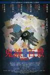

[鬼谈百景](https://pewae.com/gaan/aHR0cHM6Ly9tb3ZpZS5kb3ViYW4uY29tL3N1YmplY3QvMjY2NzI1NDUv)

原名：鬼談百景导演：中村义洋 / 内藤瑛亮 / 大畑創 / 安里麻里 / 岩澤宏樹 / 白石晃士主演：三浦透子 / 吉倉あおい / 山田キヌヲ / 岡山天音 / 根岸季衣 / 森崎ウィン / 細川佳央 / 藤本泉 / 西山真来 / 長井短类型：恐怖地区：日本首映时间：2016

看介绍是残秽的前传，观影感受比残秽好10倍，这才是日式怪谈片应该有的调子。
最喜欢广播和小孩们坟头蹦迪的两个故事。

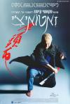

[座头市](https://pewae.com/gaan/aHR0cHM6Ly9tb3ZpZS5kb3ViYW4uY29tL3N1YmplY3QvMTMwMDc1Mi8=)

原名：座頭市导演：北野武主演：井口薰仁 / 北野武 / 夏川结衣 / 大家由祐子 / 大楠道代 / 岸部一德 / 柄本明 / 橘大五郎 / 浅野忠信 / 石仓三郎类型：剧情 / 动作 / 喜剧 / 犯罪 / 音乐地区：日本首映时间：2003

装逼犯导演多了去了，亲自下场当主演还不会玩脱的最厉害的还要数北野武。
日式的一刀流动作设计相当过瘾。
雨中对决的镜头堪称名场面。

[三狼奇案](https://pewae.com/gaan/aHR0cHM6Ly9tb3ZpZS5kb3ViYW4uY29tL3N1YmplY3QvMTI5OTM2Ny8=)

导演：黄泰来主演：吴家丽 / 徐锦江 / 梁家辉 / 郑则仕类型：犯罪地区：香港首映时间：1989

虽然三级，虽然标题耸人听闻，其实制作相当精良，如果删掉无聊的肉戏会更好。
所有主演表现都很精彩，包括戏份不多的商天娥，只是徐锦江的表现对比梁家辉和郑则仕这两个影帝还是弱了。
同年同月同日死，梁家辉最后没见到吴家丽，搞得还挺煽情的。

[科学怪妓](https://pewae.com/gaan/aHR0cHM6Ly9tb3ZpZS5kb3ViYW4uY29tL3N1YmplY3QvMTk1ODM0Mi8=)

原名：Frankenhooker导演：Frank Henenlotter主演：J·J· Clark / James Lorinz / Joanne Ritchie / Patty Mullen / 露易丝·拉塞尔类型：喜剧 / 恐怖 / 科幻地区：美国首映时间：1990

精彩的B级片，可惜成本太低，模型太假，以及前半截节奏太慢。
尤为难得的是，拍得特别喜性。
冰柜里涌出的缝合怪，太有日式猎奇漫画的风骨了。

[正义的子弹](https://pewae.com/gaan/aHR0cHM6Ly9tb3ZpZS5kb3ViYW4uY29tL3N1YmplY3QvMjY5NjY3NTQv)

原名：Bullets of Justice导演：瓦列·米利夫主演：Dinko Angelov / Doroteya Toleva / Ester Chardaklieva / Gergana Arolska / Neli Andonova / Semir Alkadi / Svetlio Chernev / Timur Turisbekov / 丹尼·特雷霍 / 雅娜·梅里诺娃类型：动作 / 恐怖 / 科幻地区：哈萨克斯坦首映时间：2019

集各种胡编乱造的大成，编不下去了拐成梦境。
你说他请个好莱坞明星吧，竟然找的是丹尼特乔大爷，不到十分钟就盒饭了。
本来只值一星，但是女艺术家的身材都怪好的，这哈萨克人不是信回教吗，拿猪头玩梗且露这么多太不清真了。

[天方异谈](https://pewae.com/gaan/aHR0cHM6Ly9tb3ZpZS5kb3ViYW4uY29tL3N1YmplY3QvMzAzODc0NDE=)

导演：周浩晖主演：小爱 / 王初伊 / 葛布 / 黄垲翔类型：剧情 / 奇幻 / 悬疑地区：大陆首映时间：2018

万宜天合搞的类似世界奇妙物语的片子，第一部算比较惊艳。
第一个故事很平庸，第二个有点散，第三个称得上精彩。
葛布终于变得像个真正的演员了。

[风流3壮士](https://pewae.com/gaan/aHR0cHM6Ly9tb3ZpZS5kb3ViYW4uY29tL3N1YmplY3QvMzM0ODcxNS8=)

导演：林子皓主演：伍咏薇 / 吴志雄 / 雷宇扬 / 高飞 / 黎姿 / 黎耀祥类型：喜剧地区：香港首映时间：1998

两分给两位为艺术献身却在STAFF里没留下名字的菲律宾女艺术家。
一分给黎耀祥。

[天方异谈2](https://pewae.com/gaan/aHR0cHM6Ly9tb3ZpZS5kb3ViYW4uY29tL3N1YmplY3QvMzQ4MjIzMTY=)

导演：周浩晖主演：张华宇 / 张博楠 / 洪士雅 / 罗夏 / 葛布类型：剧情 / 奇幻 / 悬疑地区：大陆首映时间：2020

故事不新鲜且拖沓。

[寒战](https://pewae.com/gaan/aHR0cHM6Ly9tb3ZpZS5kb3ViYW4uY29tL3N1YmplY3QvNjg5MDczMC8=)

导演：梁乐民 / 陆剑青主演：安志杰 / 尹子维 / 彭于晏 / 李治廷 / 杨采妮 / 林家栋 / 梁家辉 / 郭富城 / 钱嘉乐 / 马伊琍类型：剧情 / 动作 / 犯罪地区：香港首映时间：2012

国语版出戏。
剧本谈不上多出色，但几个老男人加杨采妮一个老女人演得确实好。
天台放烟花的镜头精彩。

[强奸3：OL诱惑](https://pewae.com/gaan/aHR0cHM6Ly93d3cuaW1kYi5jb20vdGl0bGUvdHQwMzgwNDc5Lw==)

导演：张敏主演：张慧仪 / 张文慈 / 方中信 / 租尊尼亚 / 郭可盈 / 陈东 / 雷宇扬 / 黄德斌类型：惊悚 / 神秘地区：香港首映时间：1998

仍旧是主角不脱龙套脱的三级经典配置，王晶玩套路骗钱，挺没劲的。
黄德斌是不是也没演过好人？

[共产小子西游记](https://pewae.com/gaan/aHR0cHM6Ly9tb3ZpZS5kb3ViYW4uY29tL3N1YmplY3QvNDAyMDk5MS8=)

原名：Friendship!导演：马库斯·高勒主演：凯文·兰金 / 卡梅隆·古德曼 / 弗莱德里奇·穆克 / 德怀恩·阿德维 / 托德·斯塔什维克 / 皮特·马孔 / 科科·布朗 / 艾丽卡·巴赫蕾达-库鲁斯 / 金伯利·简·布朗 / 马提亚斯·施维赫夫类型：喜剧地区：德国首映时间：2010

普普通通的公路片，细节不错。
女主婊得很。

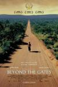

[杀戮禁区](https://pewae.com/gaan/aHR0cHM6Ly9tb3ZpZS5kb3ViYW4uY29tL3N1YmplY3QvMTc1ODQzOS8=)

原名：Shooting Dogs导演：迈克尔·卡顿-琼斯主演：Louis Mahoney / 休·丹西 / 多米尼克·霍卫兹 / 约翰·赫特类型：剧情 / 历史地区：英国首映时间：2005

白人视角描述卢旺达大屠杀。
维和部队的小心翼翼透出制度性的无奈。

[八佰](https://pewae.com/gaan/aHR0cHM6Ly9tb3ZpZS5kb3ViYW4uY29tL3N1YmplY3QvMjY3NTQyMzMv)

导演：管虎主演：唐艺昕 / 姜武 / 张俊一 / 张宥浩 / 张译 / 杜淳 / 欧豪 / 王千源 / 魏晨 / 黄志忠类型：剧情 / 历史 / 战争地区：大陆首映时间：2020

制作比较精良，结局部分太糟糕了。
题材加一分。
李晨竟然要跟王千源、张译、姜武一起演电影，上辈子是造了什么孽啊！

[女蛹](https://pewae.com/gaan/aHR0cHM6Ly9tb3ZpZS5kb3ViYW4uY29tL3N1YmplY3QvNjc5MzMxOS8=)

导演：邱处机主演：严千千 / 任泉 / 崔杰 / 张榕容 / 李威 / 高蓓蓓类型：悬疑 / 惊悚 / 爱情地区：大陆首映时间：2013

国产同类型比较算不错的了。
张榕荣跑起来真丑。
奥迪被撞成那样两次都不弹安全气囊，这是忘交保护费了吧。

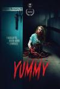

[美味](https://pewae.com/gaan/aHR0cHM6Ly9tb3ZpZS5kb3ViYW4uY29tL3N1YmplY3QvMzQ4ODcxNDAv)

原名：Yummy导演：拉斯·达摩索主演：克拉拉·克莱曼斯 / 努尔丁·法拉西 / 安妮可·克里斯蒂安斯 / 巴特·霍兰德斯 / 本杰明·莱蒙 / 汤姆·奥德纳尔特 / 泰克·尼古拉 / 玛艾可·纽维尔 / 约书亚·鲁宾 / 艾力克·高敦类型：喜剧 / 恐怖地区：比利时首映时间：2019

好久没有这么有趣的丧尸片了，堪比多年前的《双宝斗恶魔》。
搞笑有了，血腥有了，趣味结局有了，妹子也有了，唯一的遗憾就是大胸妹衣服一直在身上吧。

[过昭关](https://pewae.com/gaan/aHR0cHM6Ly9tb3ZpZS5kb3ViYW4uY29tL3N1YmplY3QvMzAyMDY0MzE=)

导演：霍猛主演：万众 / 李云虎 / 杨太义 / 聂栋才类型：儿童 / 剧情 / 家庭地区：大陆首映时间：2019

又一部全业余演员出演的电影，还可以，但没那么好。
老大爷的台词过多，说教味道太浓，导致某些时候出戏；小朋友倒是表现得很棒。
河南话怪有意思咧。

[非洲功夫战纳粹](https://pewae.com/gaan/aHR0cHM6Ly9tb3ZpZS5kb3ViYW4uY29tL3N1YmplY3QvMzUyNDU3MTEv)

原名：アフリカン・カンフー・ナチス导演：Sebastian Stein主演：Elisha Okyere / Marsuel Hoppe / Nkechi Chinedu / Sebastian Stein / Yoshito Akimoto类型：动作 / 喜剧 / 恐怖地区：加纳 / 日本首映时间：2020

类型一言难尽——日本人拍的，主演是黑叔叔黑婶婶，致敬香港功夫电影。
生啃一部日本网大，倒是图啥啊！

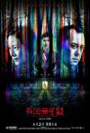

[死因无可疑](https://pewae.com/gaan/aHR0cHM6Ly9tb3ZpZS5kb3ViYW4uY29tL3N1YmplY3QvMzAzOTQ4NDEv)

导演：袁剑伟主演：冯素波 / 廖启智 / 林嘉欣 / 欧锦棠 / 欧阳伟豪 / 汤怡 / 邓建明 / 陈家乐 / 骏雄 / 黄秋生类型：悬疑 / 惊悚地区：香港首映时间：2020

好剧本烂导演，主次不分。
林嘉欣真棒。
男主角好一般好一般。

[春潮](https://pewae.com/gaan/aHR0cHM6Ly9tb3ZpZS5kb3ViYW4uY29tL3N1YmplY3QvMjcxODYzNDgv)

导演：杨荔钠主演：张紫淇 / 曲隽希 / 李文波 / 李至强 / 杨均柏 / 赵阳 / 郝蕾 / 金燕玲 / 韩佳娟 / 黄尚禾类型：剧情 / 家庭地区：大陆首映时间：2020

典型的冲奖片，过于正确，说教意味太浓。
导演能力欠缺，冲突感不够强，可惜了金燕玲和郝蕾这么好的演员。
临近最后的话剧式的大篇幅独白是导演能力低下的具体表现，拍不出来，只好说出来了。

[金都](https://pewae.com/gaan/aHR0cHM6Ly9tb3ZpZS5kb3ViYW4uY29tL3N1YmplY3QvMzAxNTk1Njcv)

导演：黄绮琳主演：卢镇业 / 岑珈其 / 易健儿 / 朱栢康 / 林二汶 / 许素莹 / 邓丽欣 / 金楷杰 / 陆添新 / 鲍起静类型：剧情地区：香港首映时间：2020

港味浓郁，说的也是有香港特色的故事，非常讨喜。
邓丽欣令人刮目相看。

[来电狂响](https://pewae.com/gaan/aHR0cHM6Ly9tb3ZpZS5kb3ViYW4uY29tL3N1YmplY3QvMzAzNzc3MDMv)

导演：于淼主演：乔杉 / 代乐乐 / 佟大为 / 奚梦瑶 / 张晨光 / 杨玏 / 田雨 / 艾伦 / 霍思燕 / 马丽类型：剧情 / 喜剧地区：大陆首映时间：2018

霍思燕差，奚梦瑶简直是灾难。
本来本土化改编还凑合，但是结局画蛇添足的东西太多了。
片尾彩蛋假的要死。

[魔屋](https://pewae.com/gaan/aHR0cHM6Ly9tb3ZpZS5kb3ViYW4uY29tL3N1YmplY3QvMTMwMjQwMS8=)

原名：The Last House on the Left导演：韦斯·克雷文主演：Marc Sheffler / 大卫·赫斯 / 弗雷德·J·林肯 / 杰拉米·雷恩 / 桑德拉·佩巴迪 / 露茜·格兰瑟姆类型：恐怖 / 惊悚地区：美国首映时间：1972

也就是著名的禁片“杀人不分左右”，其实还好，尺度尚可，杀与反杀也没啥特色。
难道是片里面对毒品的态度不正确导致被封杀？
配乐很骚。

[伊甸湖](https://pewae.com/gaan/aHR0cHM6Ly9tb3ZpZS5kb3ViYW4uY29tL3N1YmplY3QvMzAxMTk5Ny8=)

原名：Eden Lake导演：詹姆斯·瓦特金斯主演：凯利·蕾莉 / 劳琳·斯坦利 / 塔拉·艾利斯 / 布隆森·韦伯 / 托马斯·图尔格斯 / 杰克·奥康奈尔 / 芬·阿特金斯 / 詹姆斯·伯罗斯 / 迈克尔·法斯宾德 / 邵恩·杜里类型：惊悚地区：英国首映时间：2008

不能算恐怖片，而应该是现实题材。
英国拍的，跟好莱坞量产的风格完全不同。
看来英国也有未成年混蛋保护法。

[蛮荒的童话](https://pewae.com/gaan/aHR0cHM6Ly9tb3ZpZS5kb3ViYW4uY29tL3N1YmplY3QvMTI5ODg5NS8=)

导演：卢坚主演：吴镇宇 / 张耀扬 / 梁思浩 / 温碧霞类型：喜剧 / 爱情地区：香港首映时间：1991

中规中矩的爱情动作搞笑片，温碧霞竟然也是平胸。
吴镇宇打了个酱油。
缅甸被黑了个底儿掉。

[世界奇妙物语 2020秋季特别篇](https://pewae.com/gaan/aHR0cHM6Ly9tb3ZpZS5kb3ViYW4uY29tL3N1YmplY3QvMzUxNDEwNTI=)

原名：世にも奇妙な物語 '20秋の特別編导演：北坊信一 / 小林义则 / 松木创 / 植田泰史主演：吉川爱 / 堀内敬子 / 大竹忍 / 岐洲匠 / 广濑铃 / 成海璃子 / 森田一义 / 横田真悠 / 滨田岳 / 高桥克实类型：剧情 / 恐怖 / 悬疑 / 惊悚地区：日本首映时间：2020

不知是不是疫情影响，总体非常乏味，除了言灵的故事以外毫无新意。
大竹忍演技碾压其余所有人。

[圣何塞谋杀案](https://pewae.com/gaan/aHR0cHM6Ly9tb3ZpZS5kb3ViYW4uY29tL3N1YmplY3QvMjcxMTAzMTQv)

原名：聖荷西謀殺案导演：潘源良主演：佟大为 / 林嘉华 / 蔡卓妍 / 谭耀文 / 郑秀文类型：悬疑 / 爱情 / 犯罪地区：香港首映时间：2020

导演水平太差,本来还凑合的故事被讲得絮絮叨叨的。
金像奖欠郑秀文一个影后。
蔡卓妍都40了还能演出那么点少女感，真不易。

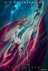

[姜子牙](https://pewae.com/gaan/aHR0cHM6Ly9tb3ZpZS5kb3ViYW4uY29tL3N1YmplY3QvMjU5MDcxMjQv)

导演：李炜 / 程腾主演：图特哈蒙 / 姜广涛 / 季冠霖 / 杨凝 / 郑希 / 阎么么类型：剧情 / 动画 / 奇幻地区：大陆首映时间：2020

不是说有多烂，但真的真的很无聊。
幸亏没在影院看。

[诺瓦利斯的蓝玫瑰](https://pewae.com/gaan/aHR0cHM6Ly9tb3ZpZS5kb3ViYW4uY29tL3N1YmplY3QvMzA0MzgxODYv)

原名：The Blue Flower of Novalis导演：Gustavo Vinagre / Rodrigo Carneiro主演：Cristian Sedemaka / Majeca Angelucci / Marcelo Diorio / Rafael Rudolf / Thais Almeida Prado类型：纪录地区：巴西首映时间：2018

看到简介以为会露点，就下了；真的看到了露点，却不是自己想要的那种。
2分已经给得很高了，还是在最后一个镜头极度震撼的前提之下。

[生化寿尸](https://pewae.com/gaan/aHR0cHM6Ly9tb3ZpZS5kb3ViYW4uY29tL3N1YmplY3QvMTM5NDQ3MC8=)

导演：叶伟信主演：张锦程 / 李灿森 / 汤盈盈 / 邹凯光 / 陈小春 / 黎淑贤 / 黎耀祥类型：喜剧 / 恐怖地区：香港首映时间：1998

导演的想法还是有的，但是香港电影的通病缺少大局观。
预算是肉眼可见的寒酸。
黎耀祥喊人那段剧情好真实。

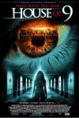

[九人禁闭室](https://pewae.com/gaan/aHR0cHM6Ly9tb3ZpZS5kb3ViYW4uY29tL3N1YmplY3QvMTQwMTk2Ni8=)

原名：House of 9导演：史蒂文·R·蒙若尔主演：Raffaello Degruttola / 丹尼斯·霍珀 / 伊波利特·吉拉尔多 / 凯莉·布鲁克 / 吉姆·卡特 / 彼得·卡帕尔迪 / 朱利安·戴维斯 / 艾什雷·沃特斯 / 苏西·阿米 / 莫文·克里斯蒂类型：剧情 / 恐怖 / 悬疑 / 惊悚地区：英国首映时间：2005

同类型里算无聊的，人物塑造不力。
2005年的凯利布鲁克依稀还能见到一点胶原蛋白。

[波拉特2](https://pewae.com/gaan/aHR0cHM6Ly9tb3ZpZS5kb3ViYW4uY29tL3N1YmplY3QvNDEzNTQzOS8=)

原名：Borat Subsequent Moviefilm导演：杰森·威奈勒主演：Rudy Giuliani / 玛丽亚·巴卡洛娃 / 萨莎·拜伦·科恩 / 迈克·彭斯类型：喜剧地区：英国首映时间：2020

黑了川普，黑了彭斯，黑了朱利安尼，黑了奥巴马，黑了克林顿夫妇，黑了哈萨克斯坦，黑了沙特，黑了汉克斯，黑了犹太人，并且高喊“wuhan flu”，所以，究竟谁是我们的朋友，谁是我们的敌人？
神来之笔就是仙人跳朱利安尼，我开始一直以为这位前纽约市长是找人演的，直到找资料的时候才知道离休老干部真被人给下套了。
要不是片中的女权成分过于生硬，得分还能更高。

[37秒](https://pewae.com/gaan/aHR0cHM6Ly9tb3ZpZS5kb3ViYW4uY29tL3N1YmplY3QvMzAzMjc0NTEv)

原名：37 Seconds导演：宮崎光代主演：佳山明 / 大东骏介 / 奥野瑛太 / 宇野祥平 / 涩川清彦 / 渡边真起子 / 熊篠慶彦 / 神野三铃 / 芋生悠 / 萩原实里类型：剧情地区：日本首映时间：2019

本身脑瘫残疾人的性爱题材就已经很猎奇了，制作方竟然真的找了一位脑瘫少女来当女主角，并且听从她的建议大幅度修改剧情。
印象最深的是女主角说话永远细声细气地，显得特别卑微，令人心酸。
板谷由夏好美～

[金刚川](https://pewae.com/gaan/aHR0cHM6Ly9tb3ZpZS5kb3ViYW4uY29tL3N1YmplY3QvMzUxNTU3NDgv)

导演：管虎 / 路阳 / 郭帆主演：刘显达 / 吴京 / 周思羽 / 张译 / 李九霄 / 欧豪 / 石昊正 / 邓超 / 邱天 / 魏晨类型：剧情 / 战争地区：大陆首映时间：2020

这么多夜戏，打的灯跟过家家一样，完全没有夜晚的感觉，还不如60多年前的《雾海夜航》。
拍出来的根本就不是战争，而是两伙古惑仔在菜鸡互啄：一方在灯火通明的修桥，另一方不疼不痒地坚持只派两架飞机还不关舱盖，还有打仗竟然靠飘字幕的。
根本没拍出多角度的感觉，放三遍就是在骗钱。

[一屋两妻](https://pewae.com/gaan/aHR0cHM6Ly9tb3ZpZS5kb3ViYW4uY29tL3N1YmplY3QvMTI5ODUwNy8=)

导演：陈友主演：吴君如 / 周宝珊 / 夏文汐 / 梅艳芳 / 苏杏璇 / 郑丹瑞 / 郑孟霞 / 郑文雅 / 钟镇涛 / 陈友类型：喜剧地区：香港首映时间：1987

中规中矩。
梅艳芳戴眼镜的样子瞅着怎么那么像詹瑞文呢？

[昭和歌谣大全集](https://pewae.com/gaan/aHR0cHM6Ly9tb3ZpZS5kb3ViYW4uY29tL3N1YmplY3QvMjAzMTQ1MC8=)

原名：昭和歌謡大全集导演：筱原哲雄主演：安藤政信 / 岸本加世子 / 市川实和子 / 村田充 / 松田龙平 / 樋口可南子 / 池内博之 / 近藤公园 / 铃木砂羽 / 齐藤阳一郎类型：剧情 / 恐怖地区：日本首映时间：2003

荒诞而美妙的观影体验，两伙无聊的人杀上头以后就是干，为什么都不重要了，过瘾。
每个人都可能有过世界核平的梦想，但即使在电影里附注实现的也没几个，本片做到了，我本人对乙烯丙烯的氯化物最后弄出了个什么非常感兴趣。
市川实和子的颜值惊世骇俗。

[怪物猎人们](https://pewae.com/gaan/aHR0cHM6Ly9tb3ZpZS5kb3ViYW4uY29tL3N1YmplY3QvMzUxOTAxMzEv)

原名：Monster Hunters导演：Brendan Petrizzo / Jihane Mrad主演：Cherish Holland / Connie Jo Sechrist / Eric Delgado / Jarrid Masse / Jonathan Nation / Jumarcus Mason / Meg Colburn / 安东尼·詹森 / 汤姆·塞兹摩尔 / 雅姿·坎利类型：冒险 / 动作 / 惊悚 / 科幻地区：美国首映时间：2020

粗制滥造，看睡了好几次。

[砍人快乐](https://pewae.com/gaan/aHR0cHM6Ly9tb3ZpZS5kb3ViYW4uY29tL3N1YmplY3QvMzQ5NTQzMzYv)

原名：Freaky导演：克里斯托弗·兰登主演：凯利·拉莫尔·威尔逊 / 凯瑟琳·纽顿 / 凯蒂·芬内朗 / 尤赖亚·谢尔顿 / 文斯·沃恩 / 梅丽莎·科拉佐 / 汉娜·拉塞尔 / 米切尔·霍格 / 米沙·奥谢洛维奇 / 阿兰·卢克类型：喜剧 / 恐怖 / 惊悚地区：美国首映时间：2020

血量略显不足，趣味性还是够的。
女主角演技略显僵硬，杀人狂大叔演得很好。

[香港制造](https://pewae.com/gaan/aHR0cHM6Ly9tb3ZpZS5kb3ViYW4uY29tL3N1YmplY3QvMTI5MjM5Ni8=)

导演：陈果主演：严栩慈 / 李栋全 / 李灿森 / 林洁芳 / 谭嘉荃 / 陈达义类型：剧情 / 爱情 / 犯罪地区：香港首映时间：1997

难得的青春感。
遗书的运用非常到位。
李灿森的处女作品，片子里除他之外的演员，后来都近乎销声匿迹。

[僵尸飞鲨](https://pewae.com/gaan/aHR0cHM6Ly9tb3ZpZS5kb3ViYW4uY29tL3N1YmplY3QvMjY2MTc1NzIv)

原名：Sky Sharks导演：Marc Fehse主演：伊娃·哈伯曼 / 娜奥米·格罗斯曼 / 戴夫·谢里登 / 戴安娜·普林斯 / 托尼·托德 / 拉尔·帕克·林肯 / 田川洋行 / 罗伯特·拉萨多 / 芭芭拉·尼德尔加科娃 / 阿曼达·比尔斯类型：喜剧 / 恐怖 / 科幻地区：德国首映时间：2020

血量和奶量都可以。
前后两次飞机屠杀场面过于雷同。
两次屠杀中间的剧情就是一坨屎。

[猛鬼通宵陪住你](https://pewae.com/gaan/aHR0cHM6Ly9tb3ZpZS5kb3ViYW4uY29tL3N1YmplY3QvMTMwNzAyMi8=)

导演：钱升玮主演：吴镇宇 / 江希文 / 罗兰 / 苑琼丹 / 钱嘉乐 / 雷宇扬 / 黄子华 / 黎姿类型：喜剧 / 恐怖地区：香港首映时间：1997

黄子华一分，吴镇宇一分，黎姿一分。

[红夜](https://pewae.com/gaan/aHR0cHM6Ly9tb3ZpZS5kb3ViYW4uY29tL3N1YmplY3QvMzYyMTQwMS8=)

导演：Julien Carbon / Laurent Courtiaud主演：Carole Brana / Frédérique Bel / 吴家丽 / 雨宫琴音类型：惊悚地区：香港首映时间：2010

也就刚开始雨宫琴音的肉能看。
往后导演都不知道自己在讲啥。

[天气预爆](https://pewae.com/gaan/aHR0cHM6Ly9tb3ZpZS5kb3ViYW4uY29tL3N1YmplY3QvMjY5OTQ3ODkv)

导演：肖央主演：代乐乐 / 小沈阳 / 岳云鹏 / 常远 / 杜鹃 / 桑平 / 王小利 / 肖央 / 蔡明 / 衣云鹤类型：喜剧 / 奇幻地区：大陆首映时间：2018

肖央拯救不了一盏盏璀璨的烂片明灯：小沈阳、常远、岳云鹏、宋小宝、王小利、杜鹃，尤其杜鹃，白瞎了那张脸。
开头和结尾的两次CG大战实在催眠。
对我来说唯一的笑点在片尾谐音梗彩蛋里。

[我和我的家乡](https://pewae.com/gaan/aHR0cHM6Ly9tb3ZpZS5kb3ViYW4uY29tL3N1YmplY3QvMzUwNTE1MTIv)

导演：俞白眉 / 宁浩 / 彭大魔 / 徐峥 / 邓超 / 闫非 / 陈思诚主演：张占义 / 徐峥 / 沈腾 / 王宝强 / 范伟 / 葛优 / 邓超 / 闫妮 / 马丽 / 黄渤类型：剧情 / 喜剧地区：大陆首映时间：2020

搞完数星星大杂烩之后，又开始一年一部小品组合大杂烩了，这不是电影，没意思。
北京好人：5；天上掉下个UFO：3；最后一课：5；回乡之路：4；神笔马亮：2。
点名批评开心麻花团队，作文都写跑题了——你家住西虹市啊？

[隧道尽头](https://pewae.com/gaan/aHR0cHM6Ly9tb3ZpZS5kb3ViYW4uY29tL3N1YmplY3QvMjY2NjEyMjkv)

原名：Al final del túnel导演：罗德里戈·格兰德主演：Cristóbal Pinto / Laura Faienza / Sergio Ferreiro / Uma Salduende / 克拉拉·拉戈 / 哈维尔·戈迪诺 / 巴勃罗·埃查里 / 沃尔特·多纳多 / 莱昂纳多·斯巴拉格利亚 / 费德里科·路皮类型：惊悚 / 犯罪地区：西班牙首映时间：2019

脑洞不错，紧张感不足。
最终的结局有些失望。

[半个喜剧](https://pewae.com/gaan/aHR0cHM6Ly9tb3ZpZS5kb3ViYW4uY29tL3N1YmplY3QvMzAyNjkwMTYv)

导演：刘露 / 周申主演：于奥 / 任素汐 / 刘宸翎 / 刘迅 / 吴昱翰 / 梁瀛 / 梁翘柏 / 汤敏 / 裴魁山 / 赵海燕类型：喜剧 / 爱情地区：大陆首映时间：2019

《驴得水》外开心麻花最好的电影，任素汐棒棒的。
比较切合现代人的痛点，可惜不够深入，而且隐晦的成人段子有点多了。
赵海燕演得不错，如果她是赵家班的人，那么这是我看过赵家班参演主要角色的电影中评分最高的一部。

[铜牌巨星](https://pewae.com/gaan/aHR0cHM6Ly9tb3ZpZS5kb3ViYW4uY29tL3N1YmplY3QvMjU5MzE2MTgv)

原名：The Bronze导演：布莱恩·巴克利主演：埃勒里·斯派比利 / 塞巴斯蒂安·斯坦 / 塞西莉·斯特朗 / 戴尔·拉乌尔 / 托马斯·米德蒂奇 / 梅丽莎·劳奇 / 海莉·露·理查森 / 海蒂·莱万多夫斯基 / 盖瑞·科尔 / 迈克尔·肖姆斯·维尔斯类型：剧情 / 喜剧 / 运动地区：美国首映时间：2015

1小时13分处开始有约1分钟的亮点，其余乏善可陈。
其实体操题材圣费尔南多谷也拍过，不过这双人的确实新鲜。
女主角咬牙切齿的样子太过于刻意。

[钢铁苍穹](https://pewae.com/gaan/aHR0cHM6Ly9tb3ZpZS5kb3ViYW4uY29tL3N1YmplY3QvMzEwMzE4Ni8=)

原名：Iron Sky导演：提莫·沃伦索拉主演：Peta Sergeant / 乌多·基尔 / 克里斯托弗·卡比 / 戈兹·奥托 / 斯洛·派克内尔 / 斯黛芬妮·保罗 / 茱莉亚·迭泽类型：动作 / 喜剧 / 科幻地区：芬兰首映时间：2012

芬兰出品，特效没法看。
对世界政治格局的看法很北欧，反讽到位。
配乐太过于出戏。

[大峰祖师](https://pewae.com/gaan/aHR0cHM6Ly9tb3ZpZS5kb3ViYW4uY29tL3N1YmplY3QvMjU3MDA4MzE=)

导演：张蠡主演：俞灏明 / 吕晶 / 安贞京 / 蒋恺 / 许还山 / 隋咏良类型：传记 / 剧情 / 古装 / 悬疑地区：大陆首映时间：2014

好无聊的电视电影，就不应该被拍出来。

[疯狂原始人2](https://pewae.com/gaan/aHR0cHM6Ly9tb3ZpZS5kb3ViYW4uY29tL3N1YmplY3QvMjQyOTg5NTQv)

原名：The Croods: A New Age导演：乔尔·克劳福德主演：乔安娜·林莉 / 克拉克·杜克 / 克萝丽丝·利奇曼 / 凯瑟琳·基纳 / 凯莉·玛丽·陈 / 尼古拉斯·凯奇 / 彼特·丁拉基 / 瑞安·雷诺兹 / 艾玛·斯通 / 莱斯利·曼恩类型：冒险 / 动画 / 喜剧地区：美国首映时间：2020

创意与惊喜消失殆尽，只留下无尽的政治正确。
如果它不是名作续集那么一文不值。

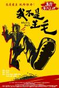

[我不是王毛](https://pewae.com/gaan/aHR0cHM6Ly9tb3ZpZS5kb3ViYW4uY29tL3N1YmplY3QvMjU3NTcxODc=)

导演：赵小溪主演：徐箭 / 王大治 / 王旭东 / 王蕴凡 / 童振军 / 罗京民 / 苏丽 / 葛晓凤 / 赵中华 / 郭金杰类型：喜剧 / 战争地区：大陆首映时间：2016

对比成本算相当成功的作品。
配角杨三出彩，符合当时小人物的特征。
指导员那段算高级黑吧。

[男人四十](https://pewae.com/gaan/aHR0cHM6Ly9tb3ZpZS5kb3ViYW4uY29tL3N1YmplY3QvMTMwNDUzMC8=)

导演：许鞍华主演：庹宗华 / 张学友 / 林嘉欣 / 梅艳芳 / 葛民辉 / 谭俊彦类型：剧情地区：香港首映时间：2002

为了特意把这部片留到40岁看而等了三年，却有不小的失望。
中年男人的无奈是有的，包容和谅解的主题也是好的，然而语文老师和女学生这种身份还是太缺乏代入感了，而且中年男人的生活里，腐臭的爱情真的已经是很不重要的部分了好么。
那一年张学友没拿影帝真冤。