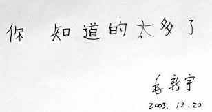

前一阵，老丈人参加了个旅游团，去北京玩了5天。
老人家是被楼门口的小广告忽悠而第一个报名的。拿他的话说：“主要是便宜。赧姑赧姑父一辈子没出去过，这趟带他俩出去玩玩。要是他们自己，可不敢出远门。”
（老婆的）姑姑是老知青，下乡到普兰店，后来嫁给了姑父。然后一直在农村待了20多年，直到90年代中期才搬回市内，户口还留在农村。当时的政策是对于在当地结婚的知青，给就近安排工作但不让回城。所以在供销社工作的姑姑和纯农民的姑父，生活一直比较清贫。回城之后更是这样，直到3年前他70岁实在没有人敢用以前，姑父四处给人做打更当保安之类的零活。而近3年老两口的生活更是仅仅靠着姑姑那点儿退休金。他家的两个儿子也“混得不太好”。大哥给一个在小平岛部队大院里开小卖店和食堂的老板打杂，大嫂是事业单位的临时工，二哥开货车在批发市场外面等活给人送装饰装修材料，二嫂在胜利广场下面站柜台卖手机——总之，她们家一直挺困难的。
只有这种真正便宜的团才能使他们动心。确实便宜——650元包括往返（大客）车费，住宿费，餐费和收费景点（八达岭长城、十三陵、故宫、颐和园）的门票。

听到这个价格，我和我老婆都惊呆了。
于是，在他们出发前，拼命地给老丈人下毛毛雨——别指望吃得好，别指望住得好，著名景点做好走马观花的准备，千万别花钱买任何东西！

第一条他们做得很好。老哥俩带了花生米咸菜香肠面包，晚上自己在房间里喝酒自娱。
第二条旅行社做得比预想得要好——虽然是在六环以外（昌平），但总算是干净整洁带独立卫生间和热水的双人标准间。
第三条确实是这样。八达岭长城2小时，颐和园2小时，故宫1小时，十三陵半小时，鸟巢水立方一共15分钟……因为有了心理预防，所以也没什么大碍。

故事就来自最后一条——
老丈人回来的第二天，我们全家回去吃饭。我下班早，先到的。
老头儿见到我回去就开始抱怨：“导游领俺们进了好几个购物店，主要是卖吃的，那个果脯我看都是色素啊！哎呀那些老头老太太叫人家熊的啊～～卖那个阿胶枣，25块钱270克，赧姑说在超市最多20块钱就能买一斤！”
我一听挺高兴：“爸，你不掏钱就对了。”

“最后一天，大客拉到运德广场。我觉得那个地方不错。怎么？导游说是毛泽东的孙子是幕后老板。专门卖水晶。说是他爷爷就趟在水晶棺材里，所以他要把这个事业继承下去。（我操这烂故事编的！）水晶不是北京特产么！我觉得这个不能是假的……”

张卫平张指导曾经曰过的：“要糟，要糟！”。我的个爹唉，你就不能跟我亲爹学学，少看点儿相亲节目二人转，多看点鉴宝一锤定音华豫之门什么的？专家都说了，买东西千万不能听故事啊！！就算没听说全国旅游城市至少一半特产水晶，总该知道名声在外的“四大将军”之一就是毛爷爷唯一的孙子吧？部队的人要是敢公开经商，早就被政敌弄进去了！

“来，看看，我给嘻嘻买的水晶坠子。我觉得不能是假的，怎么？一分钱价不讲，而且有质保证书，不对可以回去找。”说着，把水晶和“证书”递到我手里。
水晶这玩意儿我亲爹和老舅都玩过的，如何鉴定还是会的——不压手，不凉，没有气泡和纹路——天然水晶肯定不是了。再看雕刻边缘的痕迹，可以确定连玻璃的都不是，是tm树脂的！再看那张所谓的“证书”。上面写的是“质保卡 SS-1203一枚”——这tm跟什么都没写有什么区别！

“还给小霞和嘻嘻一家买了个镯子，猫眼石的。一百五一个，也是不讲价。”又递过来两个盒子。
我了个去，我读书少，一直觉得猫眼石应该跟红宝蓝宝一个级别甚至更高，应该是论克拉卖的，啥时候也能雕出镯子了？打开一看，怎么都感觉颜色不像天然的，敲一敲声音更像玻璃来的。

正想要说您上当了之类，老丈人最后的一句把到了嘴边的话又憋了回去——
“赧姑这次比谁都积极，这镯子她也买了两个，说回去大媳妇一个，二媳妇一个。”

全明白了。其实老头儿自己也未必就相信买到了真东西，却不得不买。不知诸位看官看懂了没？

极度压缩的行程，每天早4点起床晚8点回酒店，除了坐车就是在景点照相。住处偏僻周边啥都没有。唯一的自由活动时间是看完了故宫在王府井小吃街放风半个小时。这就导致了，这帮老人家们根本没有地方买纪念品！！在兲朝这个人情社会，老爷爷老奶奶们进趟京城哪儿好意思空手回去？到了最后一天，又是看起来挺好看的工艺品，就算是假的也得硬头皮买啊！宁可买错也不能放过不是？

人情。这就是所谓“运德广场”和650元包吃住交通旅行团们的生存之道。