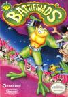

[忍者蛙](https://pewae.com/gaan/aHR0cHM6Ly93d3cuZG91YmFuLmNvbS9nYW1lLzI2MzY4Njg1)

原名：バトルトード别名：战斗蛙机种：FC厂商：RARE类别：ACT发行年月：1991-06耗时：23

忍者蛙，又名战斗蛙。其实主角准确地说不是蛙（Frog），而是蛤蟆（Toad）。看图，创意是抄的谁不言而喻。
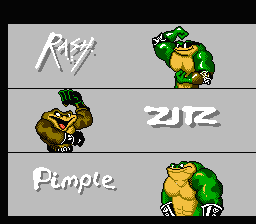

这部游戏的制作方是RARE，任天堂最著名的第二方。最厉害的时候跟本社也没差多少，制作了大金刚系列的成名三作。非常有实力。这部作品是有故事情节的。上图的三只蛤蟆是个团队，一天，老三带马子出去兜风，被人抓走了，于是老大和老二去救。救可是救，本作美版有个非常恶心的设定：如果双打，有一方死光了，立刻GameOver。加上游戏以逃跑为主，所以是个非常典型的双打比单打难得多的游戏。
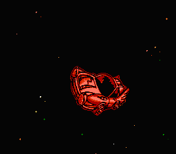
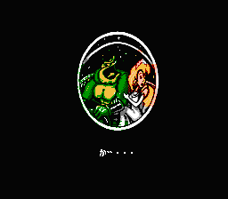
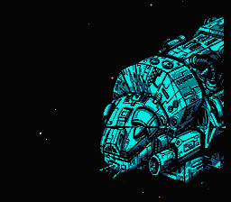
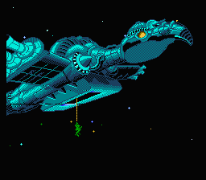

这个游戏在各个“红白机最难游戏”的榜单上均榜上有名。综合看来在（流行度尚可的）最难的红白机游戏当中，可以名列三甲。另一款怨声载道的高难度游戏《魔界村》算是无可奈何的难，而这款游戏称得上是惊心动魄的难。
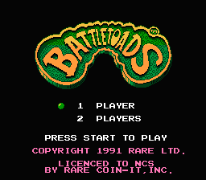
玩这个游戏的起因说来话长。上次打穿《[电击小子](https://pewae.com/2019/03/clash-at-demonhead.html)》的时候，跟3P哥沟通了一下，问他对该生僻游戏是否有印象。3P哥说他完全没见过，然后随口问了一句，打不打算搞一下《忍者蛙》？然后主动跟我说，这是他唯一一个上了手却搞不定的游戏。这可真是令我大吃一惊。要知道我的这个死党可是个比我HARDCORE得多的玩家。当年玩个“香蕉王子大冒险”，不懂日文的他愣是把所有问题都记了下来，然后用穷举法通了关。而且我们都是用模拟器的啊，不仅有SL大法，还可以锁血半透明什么的啊。
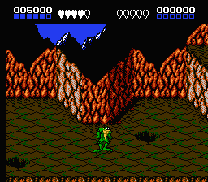

3P说完之后，我发现自己对于这部作品的难度判断是有偏差的。当年这个游戏在92、93年的包机厅里的点播率极高，让我产生了“大众化的游戏一定不会太难”的错误推断。从记忆库再仔细翻一下，我想起来了当年这部游戏受欢迎，并不是谁能打通关值得炫耀，而是这部作品的打击效果很好，又是红白机上为数不多的可以1P2P对战的游戏，所以当时包机房里的小屁孩们其实是把这个游戏当格斗游戏来打的！当年根本没人过得了第五关！
行不行上吧。虽然这种既考验背板又考验手法的游戏是我非常不喜欢的类型。
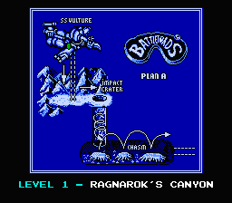

又翻了一下当年的留言。在遥远的2006年，我打通[踢王](https://pewae.com/2006/08/kick-master.html)的时候，我的另一个朋友xie留言说他搞定了忍者蛙，其实是在炫耀来着。
很多游戏难是因为操作性不好，像魔界村、恶魔城1、绿色兵团之类，总是眼到心到，操作却跟不上，死得憋屈。但是忍者蛙这部作品跟那些妖艳贱货可不一样，操作感很好。帧率控制得很棒，打敌人的时候可谓拳拳到肉。而且动作设计上有些美漫式的夸张，超级巨大的拳头或者jue么丫子倍增爽感。
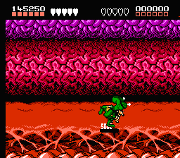

前两关中规中矩，电游厅里最常见的场景也是这两关。甚至第一关可以称得上容易，不知不觉就把BOSS打死了。
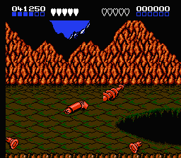
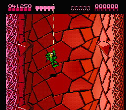

然而，制作组从第三关开始就跑偏了，并没有做一款中规中矩的动作过关游戏，而是把追跑的玩法玩到了极致，把打击敌人的事情放在次要的地位上。这个游戏可以算作是我们这个年龄层的人玩过的第二款跑酷类游戏（第一个是索尼克）。从第三关开始，什么摩托艇、滑板、飞机、独轮车轮番上阵，玩家要做的就是一个字：跑。虽然有血槽的设定，但是大多数时间根本用不上，70%的情况被地形杀死的。跑酷类游戏就是容易让人肾上腺素飙升，一波还未平息一波又来侵袭，中间喘息的时间只够把手心上的汗往秋裤上抹一把的。
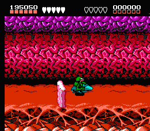
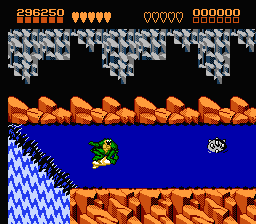
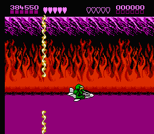

上面的是又快又难，还有不那么快也很难的。第六关要踩着贪吃蛇往上方蹦，第九关被齿轮追着跑，以及第十关跟袋鼠赛跑。都是要频繁地切换方向，玩游戏玩到拇指脱臼真不奇怪。
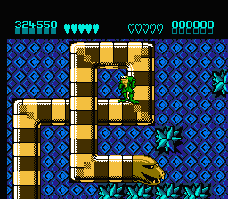
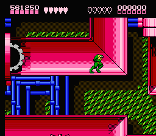
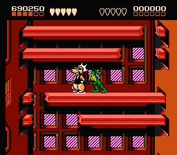

出现不用拼手速的地方就算烧了高香。即使出现偷血的恶贼和一般难的中BOSS，不要那么紧张就好。
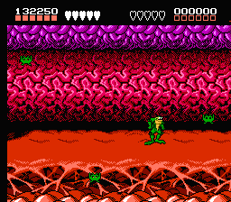
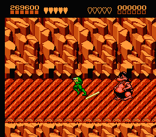

因为第三关没打好，误打误撞钻进了秘道，把第四关跳过去了……
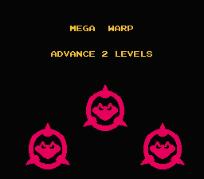

重点介绍一下倒数第二关，独轮车赛。3P就是被这个整自闭了，xie也是在过了这关之后长出了一口气。我打到这里的时候其实已经看过攻略了，学会了拐弯按暂停的办法，难度已经是大大降低了。其实这个游戏这次我连着通了两遍（第一次截图键设错了），第二次再打这关的时候，手已经不怎么听使唤了，暂停大法也不太好用，我改了帧率……
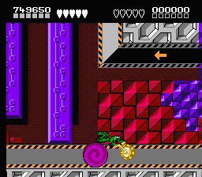

动作游戏的部分，BOSS其实也挺难的。主要是攻击力都很强，第八关的大猩猩子弹全撸中直接死一条命，第十关的犀牛也是，只要被它搂上就是直接连到死。
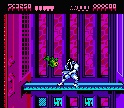
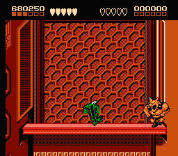

最后一关是座高塔，利用时隐时现的踏板向上蹦。比较有特色的是塔的左右方向可以自由转动。一定层数以后开始有去无回，一个操作不当就摔死。但是用即时存档的话，倒没有倒数第二关难。
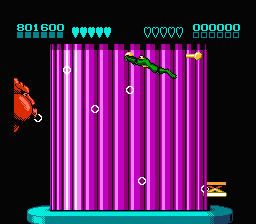

跟前面的困难比起来，最终BOSS就根本不算个啥了。就是血长一点而已，只要不刚正面，不贪图连击，绕着打就能打过。
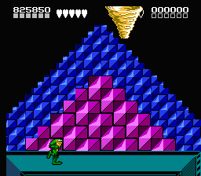
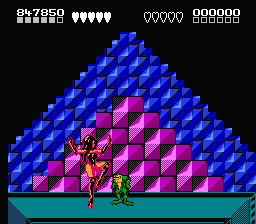

通关，1P和2P救出了被抓走的那只和它的妹子。通关画面的水平明显跟难度不成正比。
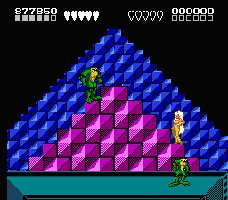
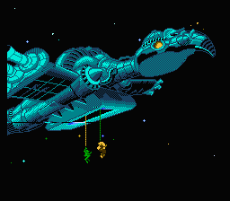
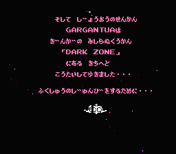