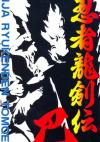

[忍者龙剑传：巴](https://pewae.com/gaan/aHR0cHM6Ly93d3cuZG91YmFuLmNvbS9nYW1lLzMwMzY0MzIw)

原名：忍者龍剣伝 巴别名：Ninja Gaiden Trilogy / Ninja Ryukenden Tomoe机种：SFC厂商：TECMO类别：ACT发行年月：1995-08耗时：5

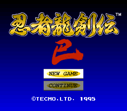
最近单位属实有点儿闲，有点儿飘了，觉得自己又行了，便挑战了一下童年时不太可能完成的任务：忍龙。
这是一款在红白机历史上有举足轻重地位的系列作品，也是脱裤魔公司没学会脱裤[[1]](https://pewae.com/2022/08/ninja-ryuuken-den-tomoe.html#inner_anchor_1)以前的代表作。无论讨论红白机最难游戏、最佳音乐游戏或者最佳画面游戏，都会被提及。
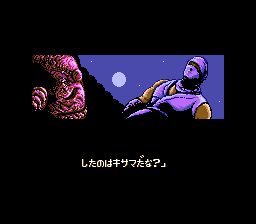
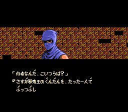
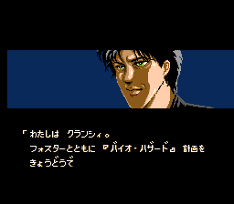

以我玩硬核游戏的水平来说，用“不可能”更准确，加个“太”字是因为我对这个系列实在是太不熟悉了：三部加一块儿可能都没玩上过半个小时。
当时我进（包机）游戏厅，八成时间只看看不动手。少数情况坐下来玩，要么请小伙伴，要么小伙伴请我。当然以双打游戏为主。忍龙这种只能一人一条命轮着单打的游戏，先天便是劣势。
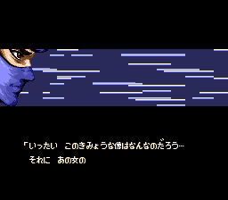
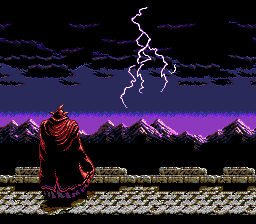
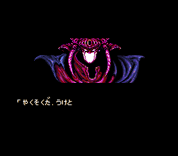

我对1代简直毫无印象。
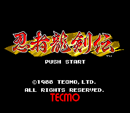
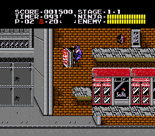
当年厅里最常被翻牌子的是能带影子的2代，小时候大概只有老沙请我玩过一次，我对于来回翻墙爬墙的操作极不适应，过了第一关，第二关挂掉了就再没上了场。某个雨天的星期六下午我在厅里有幸看过一次有人2代打通关，当时的电游厅老板也跑跟前去看通关动画，没让摁复位，额外奖励了那哥们十分钟。
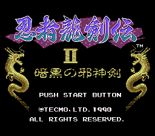
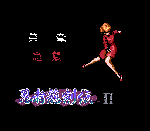
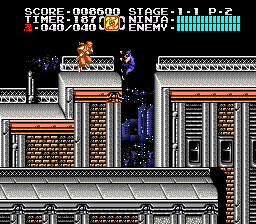

3代倒是有机会玩一下。初一下半学期（1994），我的同桌兼死党宝宝同学换到过一盘3代的合卡。那时候我们每天中午都会跑他家玩一会儿。但彼时我已经转型玩文字卡了，宝宝也一向知道我手潮，一般就是他在打，我在整理推测密码——三代有了密码系统，4个位置4种图案，全排列出来也不过256种[[2]](https://pewae.com/2022/08/ninja-ryuuken-den-tomoe.html#inner_anchor_2)罢了。
第一个被我推算出来的密码是第五关的“头镖血字”。宝宝过了第五关，打第六关满地冰的地方实在过不去，让我试过10分钟，我当然也是过不去。所以后来宝宝让我带这盘卡回家玩，我直接敬谢不敏了[[3]](https://pewae.com/2022/08/ninja-ryuuken-den-tomoe.html#inner_anchor_3)。
不久后我们就试出了最后一关的密码，第六关也就不用打了。宝宝用了两个礼拜，终于把三代给打穿了，我也有幸看到了三代的结局。
若是论“纯”难度，个人感觉三代是要略微难于二代的。但是三代有了续关密码这一利器，因而通关率反而要比二代高。SFC版给一代二代也追加了续关密码，是唯一被好评的改进。
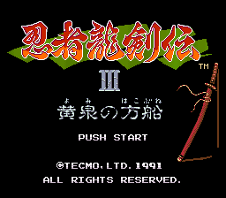

这次为了截图方便，直接选了SFC上面的《忍者龙剑传：巴》来玩。“巴”这个词本意是指漩涡，引申为漩涡状的家徽，又引申为三个或者四个东西纠缠在一起。有个“巴戦”的词，就是指三方争斗。在这里大概是类似眼球传里三勾玉血轮眼那么个三合一的意思。如果换英文标题就一目了然了，直接用的就是“三部曲”。
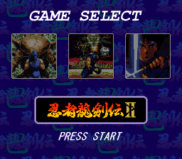

我本以为SFC对比FC，画面音乐总该是有提升的，而红白机忍龙为人称道的三个特点，便是难、音乐和动画。一次能提升两个看点，何乐而不为呢？但打通后整理资料的时候才发现自己玩了一个坑爹的骗钱版。图像方面，清晰度调整的不多，只是改了一些配色，最明显是二代装奖励物品的球，红白机是红色的，到超任版给变成了莫名其妙的土黄色。最离谱的地方是二代复活魔剑的过场动画，把血改成了绿色。由此看来广电总急也不止中国特色的专利。
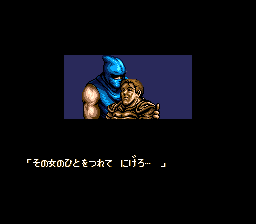
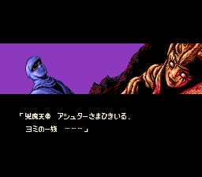

日本网友骂得最多的是“改进”后的音乐。忍龙最具特色的音乐是一代4-2的“鲜烈之龙”，一首快节奏的进行曲，听者无不感到打了鸡血，斗志昂扬。然而超任版的这首曲子，却被戏称为“木琴之龙”，毫无慷慨之意。此曲在全球范围内都颇有名气，讨论红白机最佳音乐的时候，总是一个十楼之内必然出现的提名项。对我来说，游戏虽然没玩过，曲子却在2001年左右玩VOS时听过许多次。时间太久，完全不记得是来自标准曲库还是自己另下的。这次玩了一代之后我不禁腹诽：这游戏这么难，真有那么多厉害人能像他们说的那样，打倒4-2之后按暂停听歌？
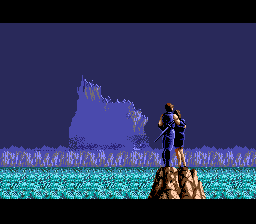
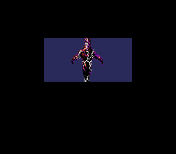
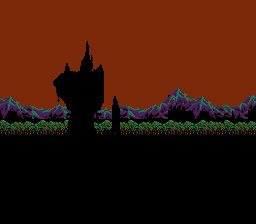

另一处明显的改版在二代3-1。原版要趁着打雷的光亮背住地形，然后摸黑凭记忆踩悬崖，非常难搞。而当年电游厅里脑袋活泛的小学生有的是，按暂停等雷电照亮地形再前进这招能想到的人挺多。问题是电游厅要计时啊，边上看热闹的一围七嘴八舌一讨论，多数人还是会选择摸黑前进了。超任版里直接把雷雨天的设定取消了，大亮地往前走，难度夶降低。
实际上不知道是不是因为受到《口袋妖怪》动画片晃坏小朋友眼睛的影响，超任版把原版里闪屏的动画都做了删减。“拆楼”场景虽然比原版更加精美，震撼性却有所减弱。
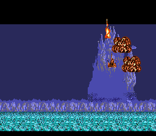
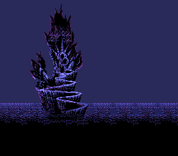
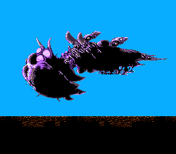

说到拆楼，不得不说FC时代的脱裤魔在八十年代提前抓住了时代的脉搏。忍者龙剑传一代是公认的第一款有剧情过场动画的游戏。甚至有说法，忍龙一难度高的一个原因是制作方把一半以上的容量用于存储动画和音乐，导致游戏本身没地方装了，只能删减。一代到三代难度逐渐降低，游戏的特色传统部分却一直得以保留：游戏都分成两部分，城外和城内，故事切换的时候有固定动画“看楼”；BOSS中必然有一关为一真一假；打穿以后也一定要有动画“拆楼”和“日出/日落”。这些传统的维持，保证了三作的整体性。
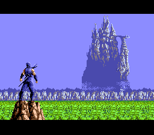
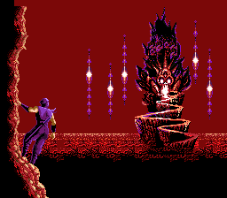
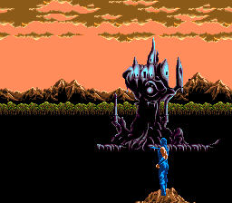

这个系列对我来说实在是太难了，尤其是一代。动作游戏难的几个要素：操控性、跳跃问题、卡时间、敌我速度差、反复刷怪、地形杀、挂掉后从头开始、敌人火力过于强大等问题，在一代里几乎全部命中。尤其是跳跃问题。一代抄袭恶魔城抄得很具体，只把鞭子换成刀，圣水十字架换成忍术，剩下的玩法相差无几，甚至恶魔城一代的僵直手感也一般无二。这个游戏最恶心的设定是一旦被敌人撞到，会向后退一小段。这一小段在连续跳跃障碍的时候便是致命的。跑得快的忍者很恶心，会扔回旋大刀的骨头伤害很高，但全系列最烦人的敌人绝对是“鸟”，在你准备过悬崖的时候一定会出现会飞的鹰啊蝙蝠啊之类的敌人，撞一下直接摔死没商量。故而一代又被戏称为“忍者掉坑传”。
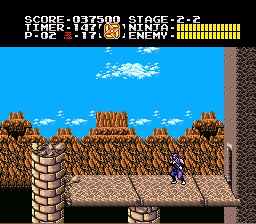
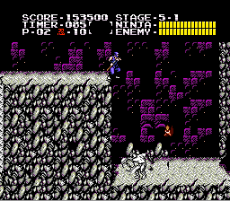

除了一代BOSS的第二形态有点儿难（我卡不到墙角BUG，时间不够），历代BOSS们倒不是太难打。按照惯例还是要出来遛一圈。
一代：
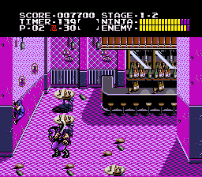
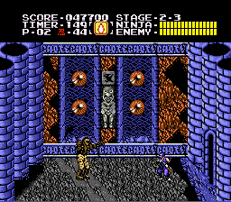
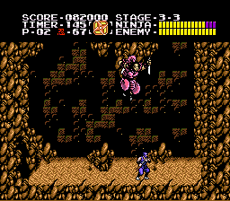
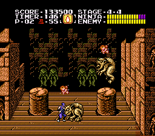
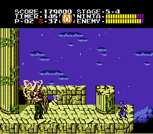
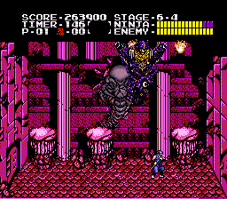
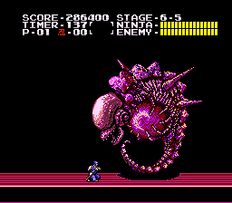
二代：
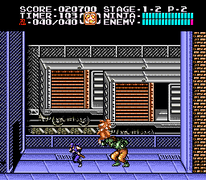
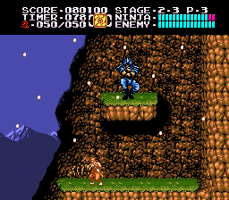
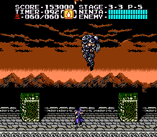
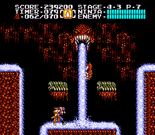
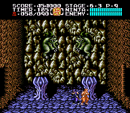
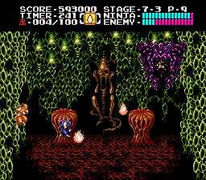
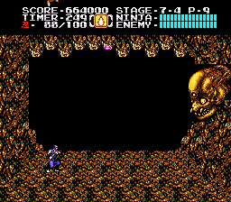
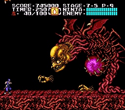
三代：
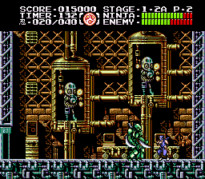
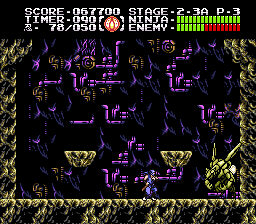
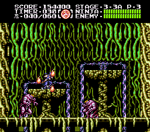
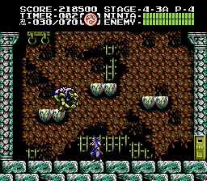
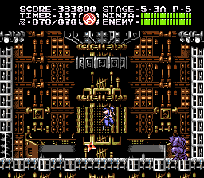
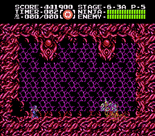
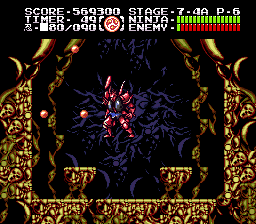

通关画面，三作都差不多，一代三代搂着女朋友看日出，二代看日落。整理图片的时候才发现一代没截到太阳出来的情景，算了就这样了，让我再打一遍是万万不可能的。

---

- [(1)](https://pewae.com/2022/08/ninja-ryuuken-den-tomoe.html#inner_ref_1)：该公司从《死或生》开始发生剧变。
- [(2)](https://pewae.com/2022/08/ninja-ryuuken-den-tomoe.html#inner_ref_2)：该游戏密码太容易被试出来，所以美版发行的时候为了提高难度，把密码功能取消了。
- [(3)](https://pewae.com/2022/08/ninja-ryuuken-den-tomoe.html#inner_ref_3)：二合一的另一个游戏是恶心得要死的《TOPGUN》。