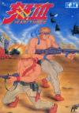

[怒3](https://pewae.com/gaan/aHR0cHM6Ly93d3cuZG91YmFuLmNvbS9nYW1lLzMwMzM2MjA4Lw==)

原名：怒III机种：FC厂商：SNK类别：ACT发行年月：1990-03耗时：8

伟大的SNK菜鸟时期的作品.用一个字来形容:难,两个字:累手,三个字:没意思.
要不是当年宝宝的小学某同学有这个卡,估计跟这个游戏是一辈子绝缘的.
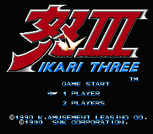

虽然游戏不怎么样,但是两个主人公却大大有名.
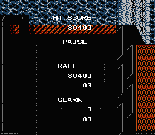

在当年看来已经蛮不错的过场图片动画,基本交代清楚了剧情.是去营救一个小孩.
可以看到,年轻的时候拉尔夫可是穿蓝色的,哈迪兰这个时候眼睛也没瞎.
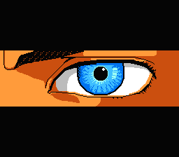
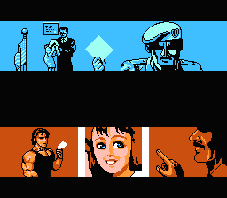
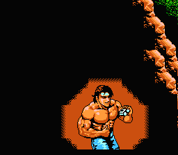

从游戏画面可以看到兰波式的英雄当年是多么的流行,也可以看到”霹雳旋风腿”(提到这个名词就会想起那部电影”[无敌鸳鸯腿](https://pewae.com/2017/01/review_wu_di_yuan_yang_tui.html)“)之类的招数被用得太滥.
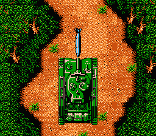
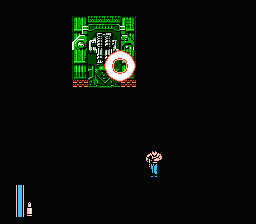
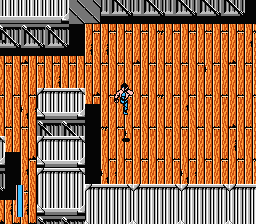
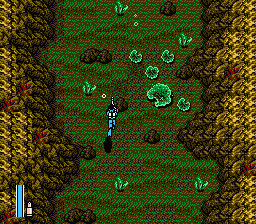
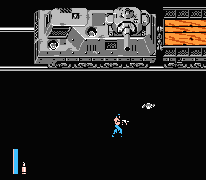

救出人质
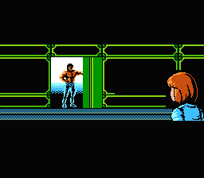
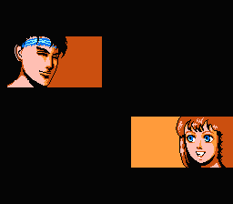
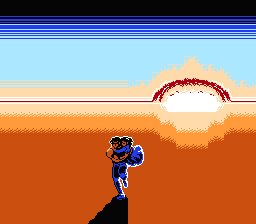

突出重围
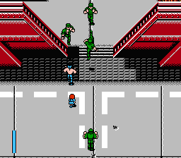

通关
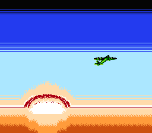
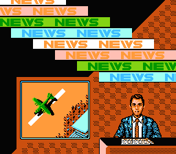
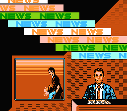
