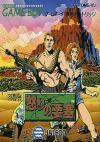

[怒之要塞GB](https://pewae.com/gaan/aHR0cHM6Ly93d3cuZ2lhbnRib21iLmNvbS9mb3J0aWZpZWQtem9uZS8zMDMwLTE4NjE2Lw==)

原名：怒りの要塞机种：GB厂商：JALECO类别：ACT发行年月：1991-02耗时：3

秘技:
输入密码AAAA开始游戏，男主角无限命。
输入密码BBBB开始游戏，女主角无限命。

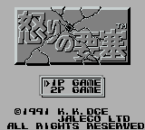
这个专题都玩了10年了，竟然第一次介绍到杰力科（JALECO），我也觉得挺讶异的。杰力科作为红白机时代任天堂六大第三方之一，在红白机的早期做出了不可磨灭的贡献。杰力科制作的，为大家所熟悉的红白机游戏有火凤凰、忍者1～3（其实这个系列的正式名称叫忍者茶茶丸）、机器人变飞机、碰碰车等。甚至杀戮战场和西游记这两个都是我非常喜欢的游戏，只可惜B开头跟S开头的竞争都太激烈，才没能上榜。

不过杰力科制作的游戏有个普遍的问题，就是操作性不太好。包括动作类大作西游记，如果操作性再好一点，绝对不止现在这点儿名气。进入90年代，杰力科不知为什么逐渐掉队，再也没什么激动人心的作品问世，后来破产了。
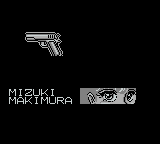
说回怒之要塞，这是一个带有解密要素的射击类游戏。这个系列最有名的一作出现在SFC上。之所以记录GB这一版，是因为这个游戏是砖头机时代为数不多的我能真机打通关的动作/射击类游戏之一。为什么能通关？看到前面的秘技了呗，只要有手有电池的，都能打通关。
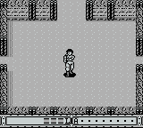
90年代初，ARPG的概念还没有完全形成，所以这种迷宫里找钥匙的类型还是挺吃香的。有特色一点的关卡包括看不见脚下的路以及反方向操作这两种。但要跟真正的ARPG比起来，这个游戏的关卡射击就弱爆了。塞尔达梦见岛第二个迷宫就可以完爆本作所有流程了。
没错，这个游戏的流程真的很短。一共只有4关5个boss。GB机能有限，早期的游戏更是没有充分发挥其性能。关卡名起的挺好，又是丛林又是山洞的，真打起来只有围墙和地面的纹理有区别而已。

这个游戏可以操控两个主角，按select键也可以随时切换。正在操作的血条和副武器是各自的，总命数和其它道具是共通的。这么设定唯一的意义就是打boss的时候可以多带一管副枪。女主持枪的形象非常猥琐，所以我这次通关用的是男猪。
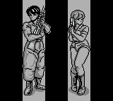
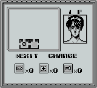

游戏的音乐呈两个极端。第一关第二关的旋律极不协调，第三关却好听到爆炸。
游戏里一般挨一两下子弹都不叫事儿，但boss战的时候千万不要被boss蹭到，一下一管血就空了。下面是BOSS图鉴，其中第四关有两个BOSS。
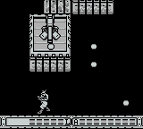
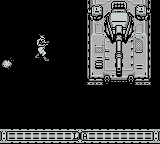
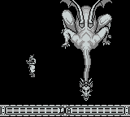
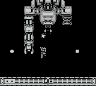
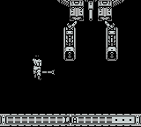

通关！
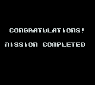
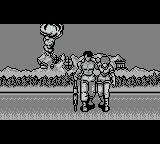
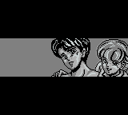
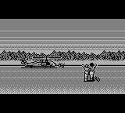