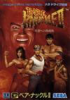

[怒之铁拳2](https://pewae.com/gaan/aHR0cHM6Ly93d3cuZG91YmFuLmNvbS9nYW1lLzIyMzU0MDk1Lw==)

原名：ベア・ナックルII 死闘への鎮魂歌别名：格斗四人组 / 格斗三人组2机种：MD厂商：世嘉类别：ACT发行年月：1992-12耗时：15

怒之铁拳系列的名字其实是非常纠结的。作为最早出现的MD游戏之一，Streets of Rage一代可能为了销量，被冠以“双截龙”的名字。后来平反，官方译名是“格斗三人组”。这名字倒也确实，主角恰恰是一黑一白一女三人。但隔了一年出二代的时候，就瞎了——主人公变成了四个人。于是被翻成了“格斗四人组”（）或者“格斗三人组2”。再过一年，三代仍旧是4主人公，先是叫“格斗四人组2”，后来觉得别扭，终于想起了人家正统的名字，才叫回“怒之铁拳”。
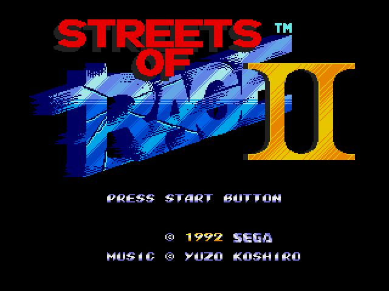
这个系列本来我最喜欢的是一代。因为它的音乐是最爽的，而且见惯了双截龙式的红蓝小人，女主的红衣黑长直大长腿简直是震撼性的无法抵抗。但是我还是推了二代，这跟一个恶趣味有关。答案在贴图里找。（提示：1.一代的时候没有，二代三代里有。2.美版的没有，日版的有。）
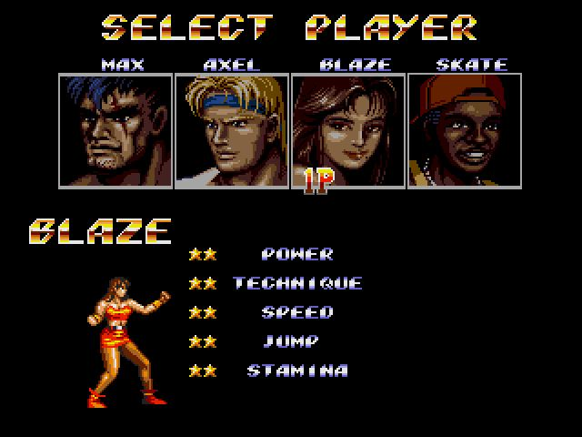
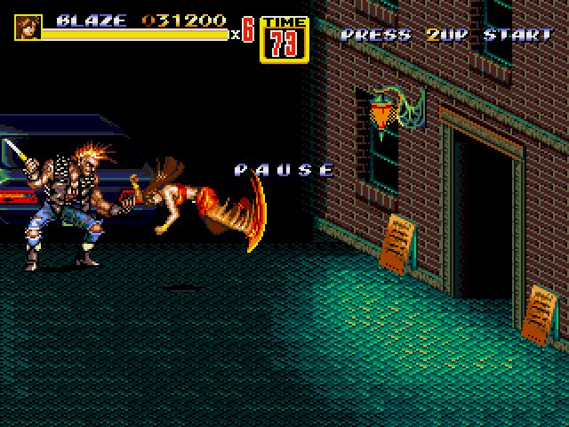
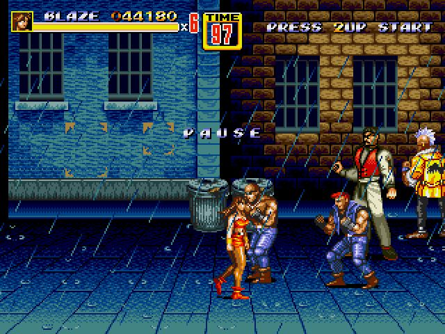

二代故事紧接一代。一代的BOSSMrX被干掉之后卷土重来，城市里的犯罪行为又遍地开花。而且一代的黄背心被抓住了。于是一代剩下的男女主人公和黄背心的大哥和儿子一道，踏上讨伐BOSS拯救同伴的征程。
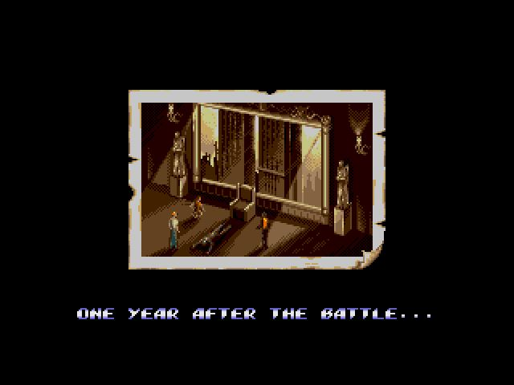
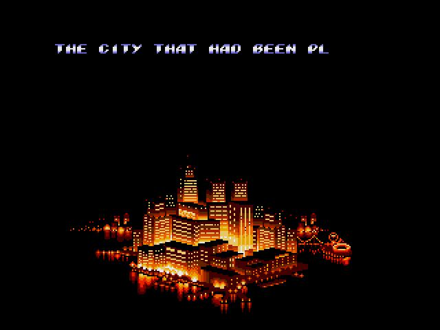
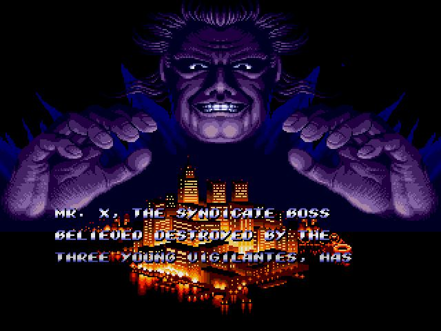
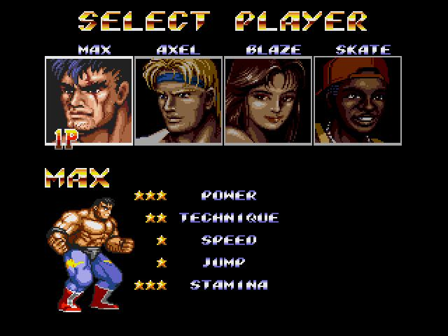

其实二代女主非常不好用。因为新追加的大威力的冲撞技，唯有女主的是无法跟普通技形成连续技的。但谁叫咱就喜欢黑长直大长腿呢。
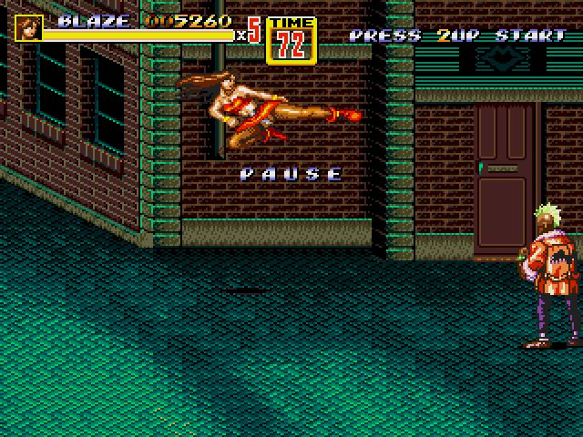

二代的优点是打击感比一代要好很多，跟卡老大的街机动作清版比也没差多少了。
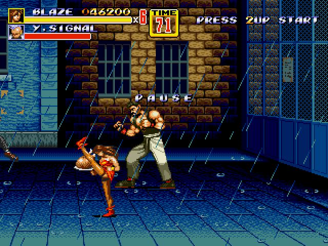
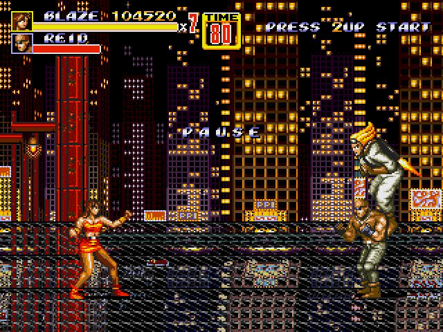
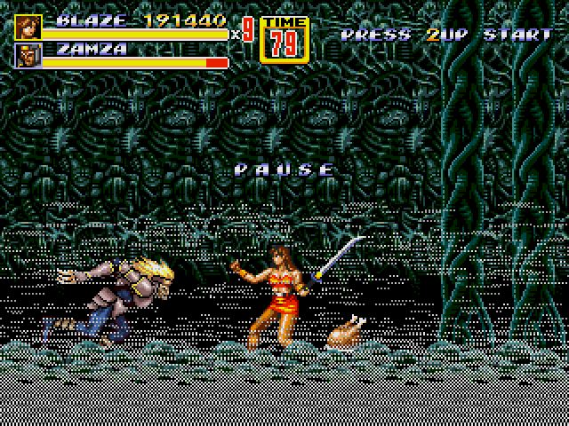
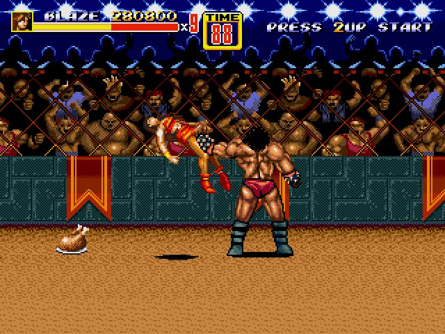
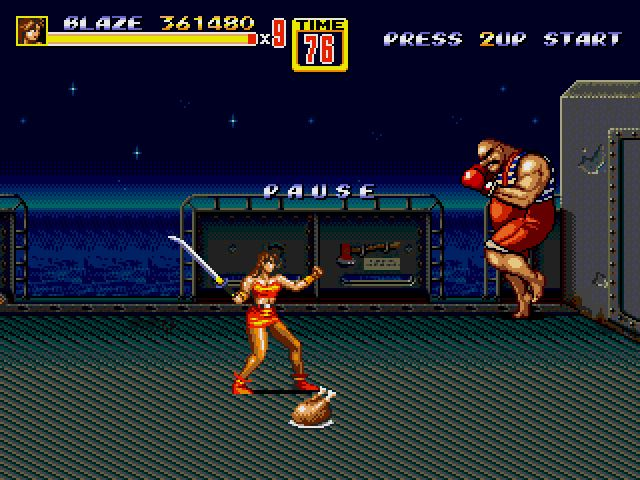
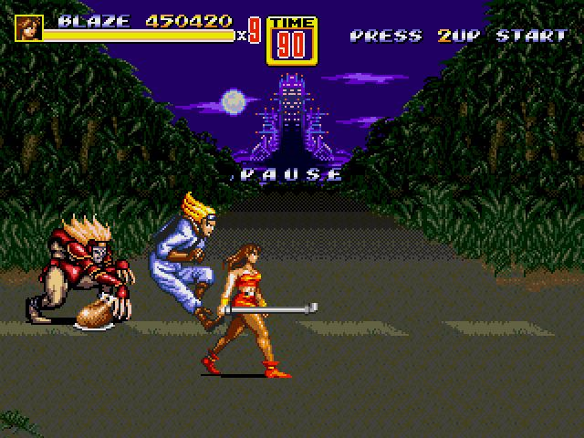
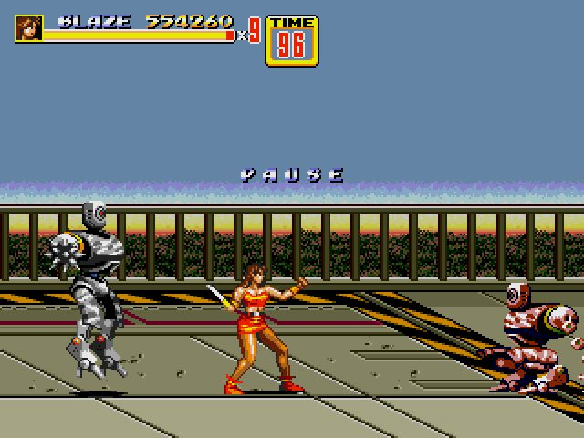
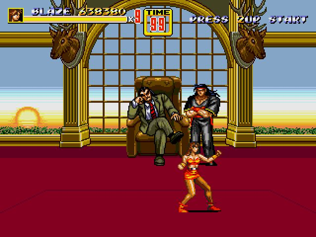
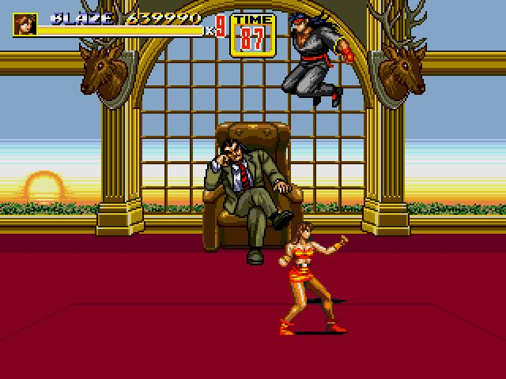

最终boss
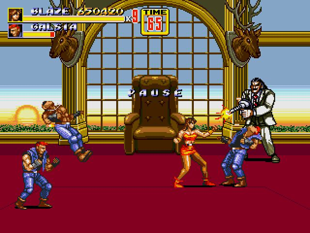
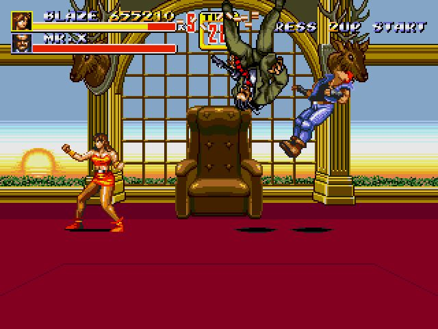

通关
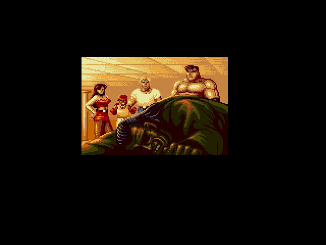
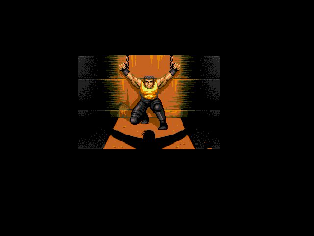
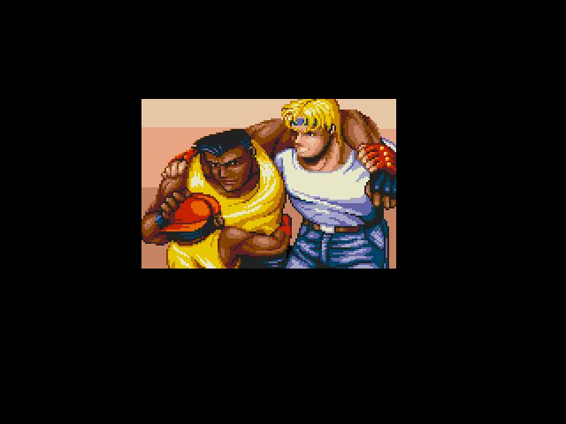
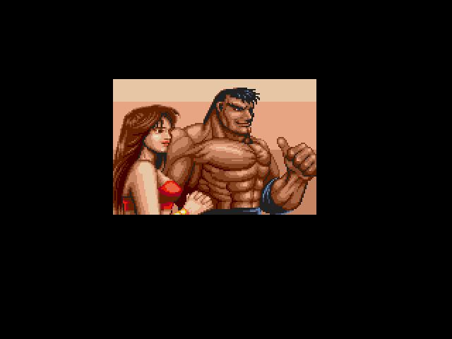
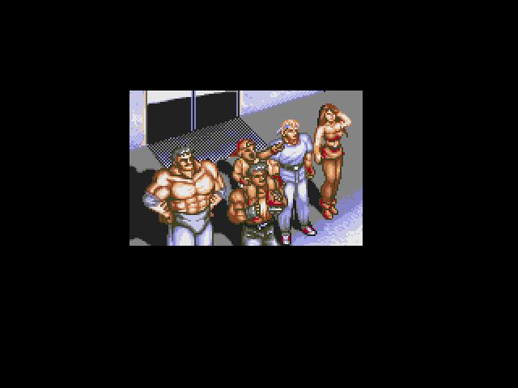
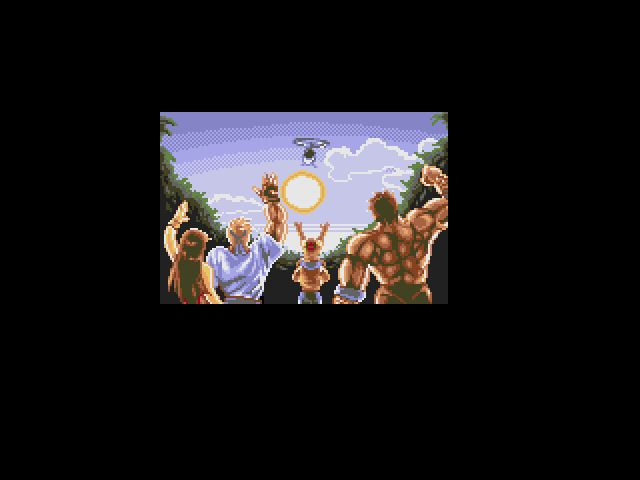